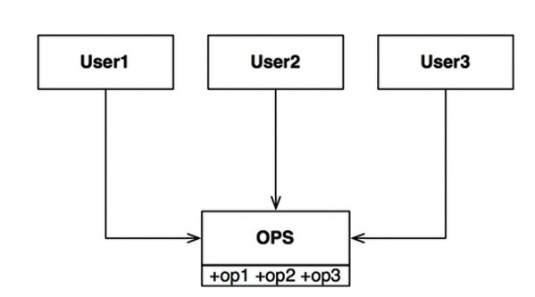
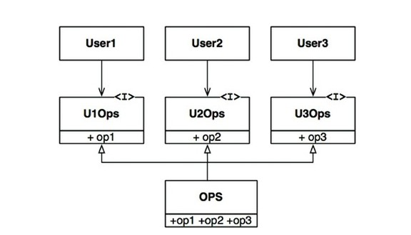
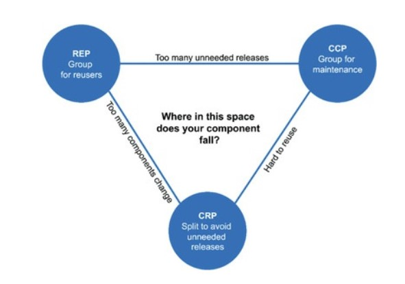
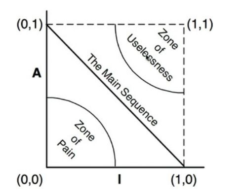

=====================
Clean Architecture
=====================

:Date:   2022-07-02 14:39:00

:download:`Clean Architecture <../files/Clean Architecture_ A Craftsman’s Guide to Software Structure and Design.PDF>`

概述与编程范式
=========================

1. 结构化编程：限制程序控制权的直接转移。goto -> 顺序/分支/循环结构。 功能性拆解。
2. 面向对象编程：限制程序控制权的间接转移。函数指针 -> 多态。控制源代码的依赖关系，不受系统控制流的限制。
3. 函数式编程：限制程序中的赋值操作，变量不可变。分离可变组件和不可变组件。

设计原则
===========
1. `SOLID: The First 5 Principles of Object Oriented Design | DigitalOcean  <https://www.digitalocean.com/community/conceptual_articles/s-o-l-i-d-the-first-five-principles-of-object-oriented-design#interface-segregation-principle>`__

SOLID原则紧贴在代码层级以上，帮助定义模块和组件中使用的软件结构种类。

软件构建"中层"结构的目标： 可改动、易理解、可复用。

SRP
--------------
A module should be responsible to one, and only one, actor.

讨论的是函数和类之间的关系，将服务不同actor的代码切分。

以两种不同的形式出现：

- 组件层面：CCP共同闭包原则
- 软件架构层面：奠定架构边界的变更轴心。

OCP
----------
开闭原则：A software artifact should be open for extension but closed for modification.

是进行架构设计的 **主导原则**。

将组件间的依赖关系按照层次结构进行组织，让系统易于扩展，同时限制每次被修改的影响范围。

LSP
----------
可替换性。

::

    S o1
    T o2
    P 可操作T
    
    若o2(T)替换o1(S)时,P行为保持不变，则S为T的子类型

1. 指导如何使用继承关系
2. 更广泛的、指导接口与其实现方式的设计原则。

ISP
------
接口隔离。 与组件聚合中的共同 复用原则。

任何软件设计如果依赖了它并不需要的东西，就会带来意料之外的麻烦。

User1虽然不需要调用op2、op3，但是在源代码层次上形成了依赖关系。若op2修改，则User1也需要重新编译和部署（针对静态语言）。

   solid_isp_1

   solid_isp_2

DIP
-------
依赖反转

源代码层次的依赖关系中引用抽象类型而非具体实现。这样源代码依赖方向永远是控制流方向的反转。

依赖守则： 跨越边界的、朝向抽象层的单向依赖关系。

1. 多使用抽象接口，避免使用多变的具体实现类；
2. 不要在具体实现类上创建衍生类。继承关系是所有源代码依赖关系中最强的、最难修改的。
3. 不要覆盖包含具体实现的函数。因为这些函数继承了依赖关系（？）
4. 避免在代码中写入与具体实现相关的、容易变动的事物名字。

组件构建原则
===============
组件是软件的部署单元。动态链接文件即属于组件。

组件聚合
-----------

   Cohesion_principle_tension_diagram

一个项目在组件结构设计上的重心是根据该项目的开发时间和成熟度不断变动的。

从右侧开始逐渐向左侧移动，即项目早期开发速度比复用性更重要。随着项目成熟，其它项目会对齐产生依赖。

CCP： 减少依赖，提升维护性
REP： 便于复用

REP复用/发布等同原则
~~~~~~~~~~~~~~~~~~~~~~~~
软件复用的最小粒度应等于其发布的最小粒度(组件)。

组件中的类与模块必须是紧密相关的。

CCP和CRP是对REP的补充。

CCP共同闭包原则
~~~~~~~~~~~~~~~~~~~~~~~~~~
会同时修改、为同一目的而修改的类放到同一个组件中。 

1. CCP是SRP在组件层面的再度阐述。
2. CCP讨论的就是OCP中所指的闭包。100%闭包是不可能的，故应将需要被同一变更的点聚合到一起。

对于大部分程序来说，可维护性远高于可复用性。

CRP共同复用原则
~~~~~~~~~~~~~~~~~~~~

将经常共同复用的类和模块放在同一个组件中，不是紧密相连的类不应该放在同一个组件中。

组件引用会产生依赖关系，CRP即不能依赖带有不需要用到的类的组件。

CRP实际是isp的一个普适版本，都是 **不要依赖不需要用到的东西**。

组件耦合
------------
各种可用于依赖关系管理的指标，可用于量化分析某个系统设计。

无依赖环原则ADP
~~~~~~~~~~~~~~~~~
Acyclic Dependencies Principle

组件依赖中不应该出现环。

打破循环依赖

1. 应用DIP原则
2. 创建新组件，将环两端的两个组件中互相依赖的类放入其中，使这两个组件都依赖新组件。

组件结构图

1. 组件结构图不可能自上而下设计出来，它必须随着软件系统的变化而变化和扩张。
2. 组件依赖结构图不是用来描述应用程序功能的，更像是应用程序在 **构建性和维护性** 方面的一张地图。
3. 组件结构图的一种重要目标是直到如何隔离频繁的变更。

稳定依赖原则SDP
~~~~~~~~~~~~~~~~
Stable Dependencies Principle

依赖关系必须指向更稳定的方向。

稳定性指标： 

.. math::

  I = (F_out)/(F_out + F_in)

  F_out : 出向依赖
  F_in  : 入向依赖
  I     : 稳定性，0-完全稳定

稳定抽象原则SAP
~~~~~~~~~~~~~~~~~
Stable Abstraction Principle

组件的抽象程度应与其稳定性保持一致。稳定的组件应该是抽象的。

**SAP+SDP=组件层次的DIP**。即 依赖关系指向更稳定的方向+稳定的组件应该抽象=依赖抽象。

稳定性I/抽象化A 序列

   abstract_independence

- 痛苦区： 具体+稳定，难以修改、扩展
- 无用区： 抽象+不被其它组件依赖，如一个无任何实现的抽象类

软件架构
===========

