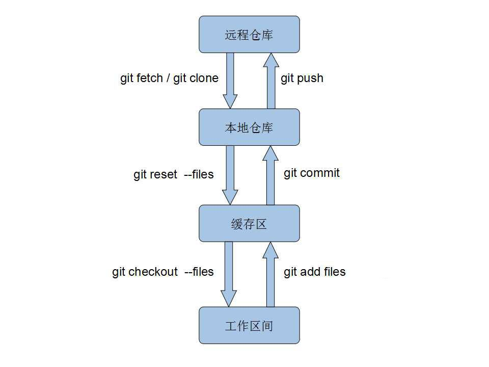
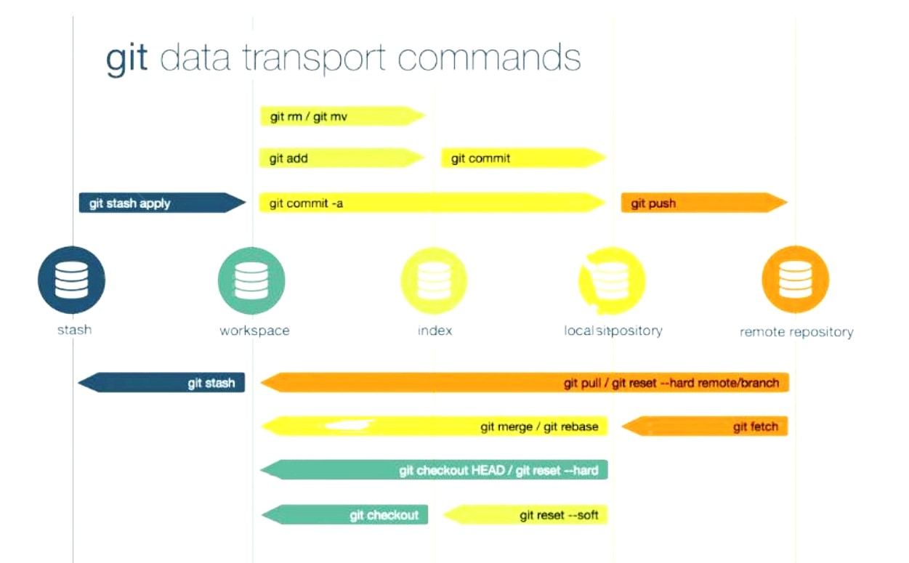
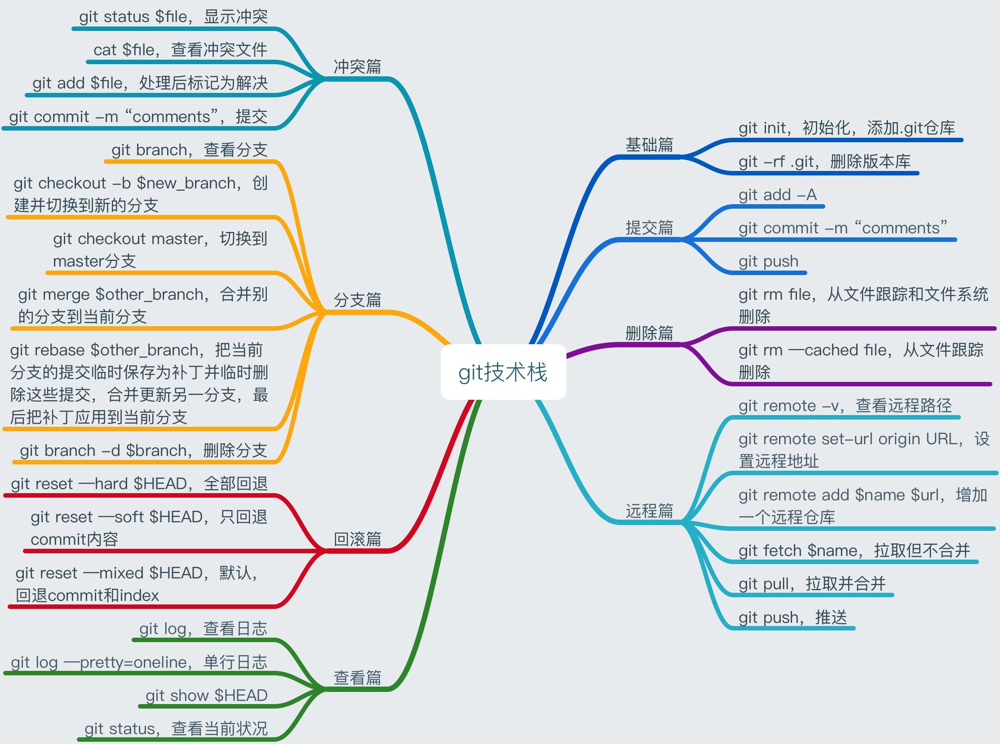

===
Git
===

:Date:   2020-04-24 16:52:25

参考手册
========

1. `Pro Git <https://git-scm.com/book/>`__
2. `Reference <https://git-scm.com/docs>`__
3. `Git-Cheat-Sheet <https://github.com/flyhigher139/Git-Cheat-Sheet>`__
4. `Git教程 <https://www.liaoxuefeng.com/wiki/896043488029600>`__
5. `Git 少用 Pull 多用 Fetch 和
   Merge <https://www.oschina.net/translate/git-fetch-and-merge?cmp>`__

基本概念
========

三个区域
--------

.. figure:: ../images/reset_workflow.png
   :alt: workflow

   workflow

**此处概念不涉及remote。**

================= =================================================
Tree              Role
================= =================================================
HEAD              Last commit snapshot, next parent。代表repo的状态
Index             Proposed next commit snapshot
Working Directory Sandbox
stash             stash 区
================= =================================================

-  Ref:指向当前分支最新commit，一般自动更新。`Reference 概念 <https://git-scm.com/book/en/v2/Git-Internals-Git-References>`__
-  HEAD：一般指向Ref，即一般指向最近一次 commit 里的所有 snapshot。git
   checkout commit 后则指向指定commit，不指向Ref，即Detached HEAD。

四种文件状态
------------

1. Untracked: 未跟踪, 此文件在文件夹中, 但并没有加入到 git 库。
   
   * 不参与版本控制. 通过git add和git commit 状态变为Staged.
  
2. Unmodify: 文件已经入库, 未修改,  即版本库中的文件快照内容与文件夹中完全一致. 
   
   * 如果它被修改, 而变为Modified. 
   * 如果使用git rm移出版本库, 则成为Untracked文件。

3. Modified: 文件已修改. 
   
   * 通过git add可进入暂存staged状态, 
   * 使用git  checkout 则丢弃修改, 返回到unmodify状态

4. Staged: 暂存状态. 
   
   * 执行git commit则将修改同步到库中, 这时库中的文件和本地文件又变为一致, 文件为Unmodify状态. 
   * 执行git reset  HEAD filename取消暂存, 文件状态为Modified

基本使用
========

基本命令图解
------------

   git_basic

   git_basic2

git技术栈。阅读方向：右上 -> 右下 -> 左下 -> 左上

   git_stack

基本流程
--------

::

   git fetch 
   git add 文件 
   git commit -m "信息" 
   //取得索引中的内容并将它保存为一个永久的快照， 然后创建一个指向该快照的提交对象，最后更新 master 来指向本次提交。
   git push
   git commit --amend -m 'Fixes bug #43'

新仓库
------

此时远程仓库为空

::

   git init
   git add/commit somefile

   若本地已有文件则只需以下操作：
   git remote add origin //仓库地址//https和ssh两种地址
   git branch -M main
   git push -u origin main //第一次推送master分支的所有内容

自建Git Server
~~~~~~~~~~~~~~

`搭建Git服务器 <https://www.liaoxuefeng.com/wiki/896043488029600/899998870925664>`__

1. 远程服务器 git init –bare；
2. 设置git用户登录及文件权限；
3. 添加ssh key（否则每次操作都需要密码）；
4. 按照上述步骤对新仓库进行初始化；
5. 正常执行push/pull操作即可。

分支操作
--------

::

   git branch
   git branch new commitid//创建
   git checkout -b new branch/commitid//创建
   git checkout master //切换
   git branch -d (branchname)//删除

一般使用master、dev、bug、feature等分支。

1. git fetch 只会将本地库所关联的远程库的 commit id 更新至最新
2. git pull 会将本地库更新至远程库的最新状态 ``git tag v0.9``
   //标签，版本号

信息查看与log
-------------

::

   git status      //查看项目的当前状态。
   git diff        //来查看执行 git status 的结果的详细信息。
   git rm
   git log (--pretty=oneline)  //查看记录
   git reflog        //本地对branch的每一次操作
   git blame file    //查看文件历史记录

pull request
------------

即 请求别人pull自己的改动。

::

      fork -> change -> pull request -> review&merge

重置与回滚
==========

1. https://git-scm.com/book/en/v2/Git-Basics-Undoing-Things
2. https://git-scm.com/book/en/v2/Git-Tools-Reset-Demystified

======================= ==== ===== ======= ========
Table                   HEAD Index Workdir WD Safe?
======================= ==== ===== ======= ========
Commit Level                               
reset –soft [commit]    REF  NO    NO      YES
reset [commit]          REF  YES   NO      YES
reset –hard [commit]    REF  YES   YES     **NO**
checkout [commit]       HEAD YES   YES     YES
File Level                                 
reset [commit] paths    NO   YES   NO      YES
checkout [commit] paths NO   YES   YES     **NO**
======================= ==== ===== ======= ========

restore 也是WD不安全的。

The “HEAD” column reads “REF” if that command moves the reference
(branch) that HEAD points to, and “HEAD” if it moves HEAD itself.
https://git-scm.com/docs/git-checkout

基本命令
--------

1. git reset commit_id （path）
   回退版本，是会修改版本历史的，丢弃掉一些版本历史。

   1. ``–-soft``: uncommit chages, changes are left staged(index)。
   2. ``–-mixed``: default，uncommit + unstaged changes, changes are
      left in work tree.
   3. ``–-hard HEAD``: uncommit + unstaged + delete changes, nothing
      left。

2. git revert
   仅将某个commit号提交分支的内容撤销，且将此次撤销作为一个新的提交。

3. git checkout – file

   -  被修改文件不在暂存区，此时使用命令，则该文件和当前版本仓库中原先的文件一致。
   -  若被checkout的文件在暂存区，但工作区修改了，执行该命令，被checkout的文件变成和暂存区一样的状态和内容。

4. git rebase 修改commit历史

5. git restore

   1. Restoring files in the **working tree** from either the index or
      another commit;
   2. overlapping with reset
   3. restore the content in the index with –staged, or restore both the
      working tree and the index with –staged –worktree
   4. git clean //Cleans the working tree

缓存区代码覆盖工作区代码
------------------------

::

     git checkout -- file

本地仓库代码覆盖缓存区代码
--------------------------

::

     git reset HEAD file
     或
     git rm --cached file

     git stash push -m name 把所有未提交的修改（包括暂存的和非暂存的）都保存起来，用于后续恢复当前工作目录。
     git stash list
     git stash apply

commit 覆盖 working tree
------------------------

::

   // 将本地仓库某一文件代码 覆盖本地工作区： 
   git checkout head testReset.txt

   // 将本地仓库所有文件代码 覆盖本地工作区：(谨慎操作)：
   git checkout head .

已提交到本地
------------

::

     回滚提交
     git reset --HARD commit_id/HEAD^n

远程仓库代码覆盖本地仓库代码（未push的commit）
----------------------------------------------

::

   // 本地工作区间代码回退到远程版本 
   git reset –-hard origin/master 

远程仓库代码回滚（线上代码回滚）
--------------------------------

::

   // 替换掉上次提交的代码文件（上次的commit记录会保留）
   git revert HEAD
   git commit -m "回滚上次commit"
   git push origin master

1. git revert 的方式

   1. git revert commit_id // 将要撤销的提交 revert
      出一次新的提交，这样上次的改动就被抵消了，但本地分支也比远程分支多一个
      revert 提交
   2. git push origin master // 推送到远程

   这种方式是最方便的，但缺点是多了 2 次无用的 commit，使整个分支的
   commit 不再整洁。

2. git reset 方式

   ::

        git log (查看并记录下要回滚到的commitId)
        git reset --hard commitId (回退版本)
        git push -f origin branch-name

   需要做好备份

   ::

      1）git branch xxx_backup                    // 创建备份分支

      2）git push origin xxx_backup:xxx_backup  // 将备份分支推送到 origin

      3）git checkout  xxx                        // 切回要撤销修改的分支

      4）git reset --hard commit_id                // 撤销本地 commit

      5）git push origin :xxx                      // 删除远程 xxx 分支

      6）git push origin xxx:xxx                     // 将本地撤销修改后的 xxx 分支推送到 origin

      7）git branch -d xxx_backup                   // 删除本地备份分支

      8）git push origin :xxx_backup               // 删除远程备份分支

   上述步骤 5
   执行时可能会出现错误：\ ``remote: error: By default, deleting the current banch is denied,because the next...``\ ，删除当前分支是不允许的，所以要先切换当为其它分支。

3. 远端重置方式：
   远端仓库为普通仓库（\ ``git init``\ 建立），可在远程服务器回滚分支，然后回滚本地分支。远程仓库为裸仓库）时无法回滚。

   裸仓库：\ ``git init --bare``\ 建立，一般用于远端备份或公共版本库。无工作区，无法执行常见的Git命令。当远端当前分支与push的分支相同时无法push成功。

reset VS revert
---------------

1. git revert是用一次新的commit来回滚之前的commit，git
   reset是直接删除指定的commit。

2. git reset 是把HEAD向后移动了一下，而git
   revert是HEAD继续前进，只是新的commit的内容和要revert的内容正好相反，能够抵消要被revert的内容。

3. 在回滚这一操作上看，效果差不多；revert保存了更多的记录信息；

4. 在后续merge以前的老版本时有区别。git
   revert是用一次逆向的commit“中和”之前的提交commit
   A，A这部分改变不会再次出现，git reset是直接把commit
   A在branch上删除，因而和老的branch再次merge时，这些被回滚的commit
   A还会被引入。

其它
====

log
---

::

      git log file // 查看文件历史，-p查看详细diff
      git blame file //
      git show commitid file //
      git log
          -n 最近n次提交
       --since/after 指定时间之后
       --until/before  指定时间之前
       --author   指定作者
       --commiter  指定提交者
       --grep  指定提交说明
       -S  匹配添加/删除的内容

      git log --graph --decorate --oneline --simplify-by-deocration --all
          --decorate 显示commit的引用
       --oneline commit单行显示
       --simplify-by-decoration 只显示被引用的commit
       --all  指定要显示的branch

config
------

::

      增
      git config --global --add user.name myname

      删
      git config --unset user.name

      改
      git config --global core.autocrlf flase

      查
      git config --local -l
      git config --global -l
      git config --system -l

仓库太大
--------

`git clone <https://git-scm.com/docs/git-clone>`__

**下载单branch（仓库仍然很大）**

::

   git clone --branch branch_name 

**只下载最新一次commit**

::

   git clone --no-single-branch --depth 1 url

不指定\ ``--no-single-branch``\ 时默认为\ ``--single-branch``\ ，此时仓库无法直接切换其它分支。解决方法如下：

切换新分支

::

   git remote set-branches origin 'remote_branch_name'
   git fetch --depth 1 origin remote_branch_name
   git checkout remote_branch_name

git文件树
-----------

::

   .
   └── .git
       │  
       │  
       ├── branches
       │  
       │  
       ├── COMMIT_EDITMSG    # 保存最新的commit message，Git系统不会用到这个文件，只是给用户一个参考。
       │  
       │  
       ├── config    # 仓库的配置文件。
       │  
       │  
       ├── description    # 仓库的描述信息，主要给gitweb等git托管系统使用。
       │  
       │  
       ├── HEAD    # 包含了一个分支的引用，通过这个文件Git可以得到下一次commit的parent，可以理解为指针。
       │  
       │  
       ├── hooks    # 存放一些shell脚本，可以设置特定的git命令后触发相应的脚本。
       │   │   
       │   ├── applypatch-msg.sample
       │   ├── commit-msg.sample
       │   ├── post-update.sample
       │   ├── pre-applypatch.sample
       │   ├── pre-commit.sample
       │   ├── prepare-commit-msg.sample
       │   ├── pre-push.sample
       │   ├── pre-rebase.sample
       │   └── update.sample
       │  
       │
       ├── index    # 二进制暂存区（stage）。
       │  
       │  
       ├── info    # 仓库的其他信息。
       │   │  
       │   └── exclude
       │  
       │ 
       ├── logs    # 保存所有更新的引用记录。
       │   │ 
       │   ├── HEAD    # 最后一次的提交信息。
       │   └── refs
       │       ├── heads
       │       │   └── master
       │       └── remotes
       │           └── origin
       │               ├── HEAD
       │               └── master
       │  
       │ 
       ├── objects    # 所有对象的存储，对象的SHA1哈希值的前两位是文件夹名称，后38位作为对象文件名。
       │   │  
       │   ├── [0-9A-F][0-9A-F]
       │   │   └── dbc3be082ca20a9d032c25623871f503e5797c
       │   ├── info    # 记录对象存储的附加信息
       │   └── pack    # 以压缩形式（.pack）存储许多对象的文件，附带索引文件（.idx）以允许它们被随机访问。
       │       ├── pack-a62b75ba184ef8686604b5f2f366f958022a2fb5.idx
       │       └── pack-a62b75ba184ef8686604b5f2f366f958022a2fb5.pack
       │  
       │  
       └── refs    # 具体的引用，Reference Specification。
           │
           ├── heads    # 记录commit分支的树根
           │   └── master    # 标识了本地项目中的master分支指向的当前commit的哈希值。
           ├── remotes    # 记录从远程仓库copy来的commit分支的树根
           │   └── origin
           │       ├── HEAD
           │       └── master    # 标识了远端项目中的master分支指向的当前commit的哈希值。
           └── tags    # 记录任何对象名称（不一定是提交对象或指向提交对象的标签对象）。

忽略文件
~~~~~~~~~~~~~~
gitignore
^^^^^^^^^^^^^^^^
`gitignore模板地址 <https://github.com/github/gitignore>`__

项目开始时（第一次push前）就创建.gitignore文件。

github插件
----------

gayhub:生成readme目录。已停止开发。 Octotree:代码目录树。
refined-github:代码编辑、Git相关的功能优化，下载目录。 gitzip for
github:下载目录和文件。
