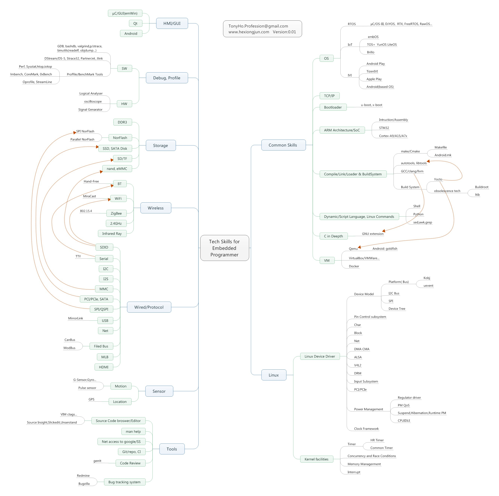
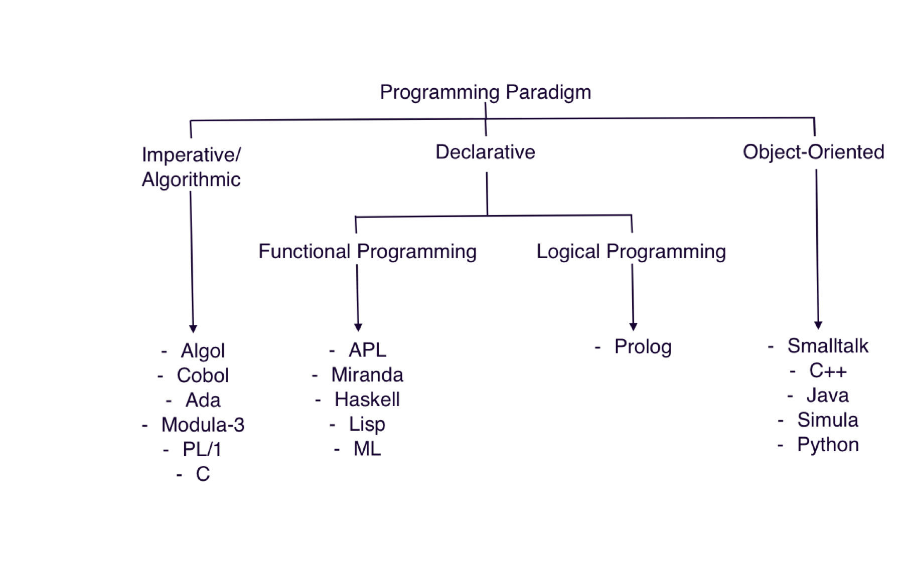
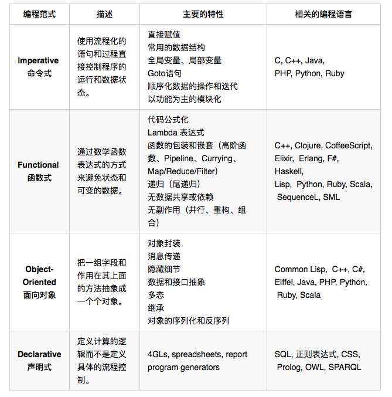
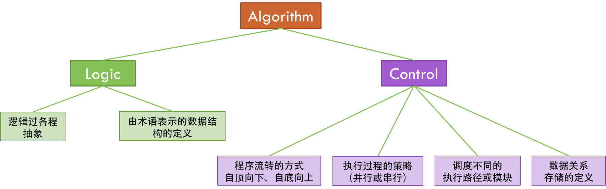
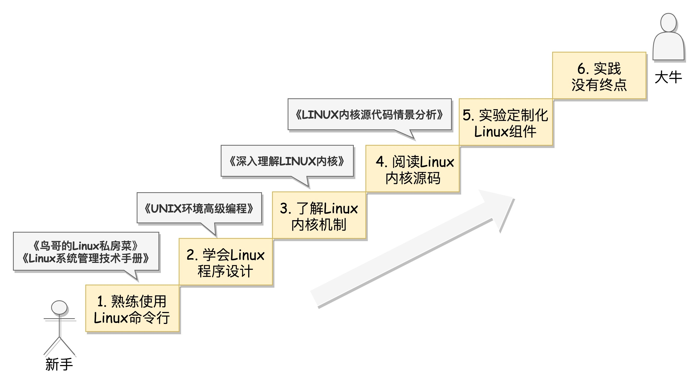

========
Learn
========

:Date:   2020-08-21 21:18:08

综合内容
==========

资讯网站
------------

1. `技术雷达 <https://www.thoughtworks.com/radar>`__

2. `infoq国际版 <https://www.infoq.com/>`__ Or
`infoq国内版 <https://www.infoq.cn/>`__

3. `分享 GitHub 上有趣、入门级的开源项目 <https://hellogithub.com/>`__

4. `科技爱好者周刊 <http://www.ruanyifeng.com/blog/archives.html>`__
5. https://developer.aliyun.com/ebook/

博客专栏
----------------
 
1. `Linux工具快速教程 <https://github.com/me115/linuxtools_rst>`__ 
2. `网络基本功 <https://www.bookstack.cn/read/network-basic/0.md>`__ ;
   `原帖(排版较差) <https://www.dell.com/community/%E7%BB%BC%E5%90%88%E8%AE%A8%E8%AE%BA%E5%8C%BA/%E7%BD%91%E7%BB%9C%E5%9F%BA%E6%9C%AC%E5%8A%9F%E7%B3%BB%E5%88%97-%E7%BB%86%E8%AF%B4%E7%BD%91%E7%BB%9C%E9%82%A3%E4%BA%9B%E4%BA%8B%E5%84%BF-3%E6%9C%8826%E6%97%A5%E6%9B%B4%E6%96%B0/m-p/7045185>`_;
   :download:`网络基本功 <../files/NetworkBasics.pdf>`
3. `linux-inside <https://0xax.gitbooks.io/linux-insides/content/>`__ or 
   `linux-inside-zh <https://github.com/MintCN/linux-insides-zh>`__
4. https://blog.csdn.net/dog250 ,网络、TCP
5. http://www.wowotech.net/
6. `What every programmer should know about memory <https://lwn.net/Articles/250967/>`__ ; 
   `pdf <https://people.freebsd.org/~lstewart/articles/cpumemory.pdf>`__

7. ☆ https://www.cnblogs.com/LoyenWang/ Linux内核各个模块
8. `酷壳 – CoolShell.cn  <https://coolshell.cn/>`__

云原生
--------
`解读云原生的2021：抢占技术C位，迎来落地大爆发_云计算_褚杏娟_InfoQ精选文章  <https://www.infoq.cn/article/Z24fthyOAJLi0Bp4T3sZ>`__

云原生领域涵盖的技术类别越来越多，但最关键的三项是容器、Serverless、Service Mesh

嵌入式
------

   嵌入式学习

1. `嵌入式学习的几种线路 <http://www.embeddedlinux.org.cn/emb-linux/entry-level/201701/02-6070.html>`__

资源集合
-------------------

学习路径参考：《程序员练级攻略》——左耳听风。知识面全，从入门到深入。

`极客时间专栏 <https://zter.ml/>`__

1. https://github.com/fuhmmin/it-ebooks-cn
2. https://github.com/guanpengchn/awesome-books
3. https://kinegratii.github.io/library/

网盘合集：

1. `手机版书籍合计 <https://itpanda.cc/>`__
2. 天翼网盘：https://cloud.189.cn/t/jmA7rmRVFr22 (访问码：ksx8)
3. onedrive: https://1drv.ms/u/s!Ao7o_dk8V3yEoGxyAZQsxZaNG0l3?e=iddq04
4. https://shimo.im/sheets/Hh6Ct8XJgtpyP389/MODOC
5. onedrive极客时间专栏

CoolShell
===========

技术与技术领导力
------------------
1. 动手能力
2. 提升效率
3. 输出观点。写好文档和文章。
4. 不断提高对自己的要求标准
5. 赢得他人的信任
6. 保持热情和冲劲

SRE能力自评
~~~~~~~~~~~~
Google评分卡的来自Google的SRE。为了保证稳定可靠的服务，Google组建了一支专业的团队来负责运行后端服务——Site Reliability Engineer。

《Google SRE: How Google runs production systems》

0. you are unfamiliar with the subject area.

1. you can read/understand the most fundamental aspects of the subject area.

2. ability to implement small changes,understand basic principles and able to figure out additional details with minimal help.

3. basic proficiency in a subject area without relying on help.

4. you are comfortable with the subject area and all routine work on it.

   For software areas - ability to develop medium programs using all basic language features w/o book, awareness of more esoteric features (with book).
   
   For systems areas - understanding of many fundamentals of networking and systems administration, ability to run a small network of systems including recovery, debugging and nontrivial troubleshooting that relies on the knowledge of internals.

5. an even lower degree of reliance on reference materials. Deeper skills in a field or specific technology in the subject area.

6. ability to develop large programs and systems from scratch. Understanding of low level details and internals. Ability to design/deploy most large, distributed systems from scratch.

7. you understand and make use of most lesser known language features, technologies, and associated internals. Ability to automate significant amounts of systems administration.

8. deep understanding of corner cases, esoteric features, protocols and systems including "theory of operation". Demonstrated ability to design, deploy and own very critical or large infrastructure, build accompanying automation.

9. could have written the book about the subject area but didn't; works with standards committees on defining new standards and methodologies.

10. wrote the book on the subject area (there actually has to be a book). Recognized industry expert in the field, might have invented it.

Subject Areas:
^^^^^^^^^^^^^^^^
::
      
   TCP/IP Networking (OSI stack, DNS etc)
   Unix/Linux internals
   Unix/Linux Systems administration
   Algorithms and Data Structures
   C
   C++
   Python
   Java
   Perl
   Go
   Shell Scripting (sh, Bash, ksh, csh)
   SQL and/or Database Admin
   Scripting language of your choice (not already mentioned)
   People Management
   Project Management

基础知识分类
~~~~~~~~~~~~~
1. 程序语言：语言的原理，类库的实现，编程技术（并发、异步等），编程范式，设计模式……
2. 系统原理：计算机系统，操作系统，网络协议，数据库原理……
3. 中间件：消息队列，缓存系统，网关代理，调度系统 ……
4. 理论知识：算法和数据结构，数据库范式，网络七层模型，分布式系统……

总是在提供解决问题的思路和方案的人

做正确的事，比用正确的方式做事更重要，因为这样才始终会向目的地靠拢。

写文章的几个阶段
~~~~~~~~~~~~~~~~~~~~
1. 学习记录
2. 利益驱动
3. 记录自己的观点
4. 与他人交互

时间管理
~~~~~~~~~~~~
1. 主动管理时间，不被打扰
2. 说 不 的三种方式：给出新方案、部分满足、有条件地说是
3. 想清楚再做，每周/月反思

错误处理与异步
--------------
1. 错误返回码与异常捕捉的使用
2. 异步编程比较

分布式系统关键技术
~~~~~~~~~~~~~~~~~~~~~
.. figure:: ../images/distributed_system_stack.png

   distributed_system_stack

1. 全栈监控：数据收集以及数据的关联
2. 服务治理：服务依赖问题、服务状态维持与拟合、服务的弹性伸缩与故障迁移、工作流和编排
3. 流量调度和状态数据调度

CAP 定理: 一致性、可用性、分区容忍

《数据密集型应用设计》：Designing Data Intensive Applications

编程范式
------------

编程语言本质上帮助程序员屏蔽底层机器代码的实现，而让我们可以更为关注于业务逻辑代码。

阅读资料：七周七语言、斯坦福大学的编程范式公开课

   Programming_paradigm_a

   Programming_paradigm_b

泛型编程
~~~~~~~~~~
屏蔽掉数据和操作数据的细节，让算法更为通用，让编程者更多地关注算法的结构，而不是在算法中处理不同的数据类型。

1. 静态类型检查：强类型、弱类型
2. 动态类型检查：运行时typeof、is_arry

类型：

1. 类型是对内存的一种抽象。不同的类型，会有不同的内存布局和内存分配的策略。
2. 不同的类型，有不同的操作。所以，对于特定的类型，也有特定的一组操作。

要做到泛型需要做下面的事情。

1. 标准化掉类型的内存分配、释放和访问。
2. 标准化掉类型的操作。比如：比较操作，I/O 操作，复制操作……
3. 标准化掉数据容器的操作。比如：查找算法、过滤算法、聚合算法……
4. 标准化掉类型上特有的操作。需要有标准化的接口来回调不同类型的具体操作……

对应的C++的泛型实现：

1. 类的构造析构
2. 运算符重载
3. 模板生成特定数据类型的代码
4. 虚函数和运行时识别技术

`运行时类型识别 - 腾讯云开发者社区-腾讯云  <https://cloud.tencent.com/developer/article/1718803>`__

函数式编程
~~~~~~~~~~~~~~~
把一些功能或逻辑代码通过函数拼装方式组织起来。

1. map、reduce、filter，pipeline,柯里化，头等函数，尾递归优化。如 使用 Map & Reduce，不要使用循环
2. 无状态、不可变、惰性求值
3. 只关心定义输入数据和输出数据相关的关系
4. 关注的是做什么而不是怎么做，因而被称为声明式编程

decorator 
~~~~~~~~~~~~~~
用一个函数来构造另一个函数。

可实现普通函数管道化

面向对象编程
~~~~~~~~~~~~~
1. 桥接模式：类的拼装
2. 策略模式：分离出策略
3. 代理模式：RAII，
4. 接口编程与依赖倒置

原型编程
~~~~~~~~~
1. 没有class化，直接使用对象。
2. 使用委托指针来了链接原型。
3. 通过复制已有的对象或者通过扩展空对象创建对象

委托模式
~~~~~~~~~~~~~
类似面向对象和原型编程的综合

逻辑编程
~~~~~~~~~~~~
逻辑编程，把业务逻辑或是说算法抽象成只关心规则、事实和问题的推导这样的标准方式，
不需要关心程序控制，也不需要关心具体的实现算法。

编程的本质
~~~~~~~~~~~~~

``Program = Logic + Control + Data Structure``

control和logic耦合导致程序复杂混乱。

   logic_control

练级攻略
-----------
Linux系统、存储、网络

1. `HTTP | MDN  <https://developer.mozilla.org/zh-CN/docs/Web/HTTP>`__   
2. `How To Ask Questions The Smart Way  <http://www.catb.org/~esr/faqs/smart-questions.html>`__
3. `The C10K problem  <http://www.kegel.com/c10k.html>`__ 、  `The Secret to 10 Million Concurrent Connections -The Kernel is the Problem, Not the Solution - High Scalability -  <http://highscalability.com/blog/2013/5/13/the-secret-to-10-million-concurrent-connections-the-kernel-i.html>`__
4. `Hardening Your HTTP Security Headers - KeyCDN  <https://www.keycdn.com/blog/http-security-headers>`__
5. `Effective Go - The Go Programming Language  <https://go.dev/doc/effective_go>`__ 、 `Go 语言简介（下）— 特性 | 酷 壳 - CoolShell  <https://coolshell.cn/articles/8489.html>`__
6. `Let's code a TCP/IP stack, 1: Ethernet & ARP  <http://www.saminiir.com/lets-code-tcp-ip-stack-1-ethernet-arp/>`__
7. `What every programmer should know about memory, Part 1 [LWN.net]  <https://lwn.net/Articles/250967/>`__
8. `TCP 的那些事儿（上） | 酷 壳 - CoolShell  <https://coolshell.cn/articles/11564.html>`__

高效沟通
-----------
好的沟通方式：

1. 尊重对方是赢得对方尊重的前提，一定要有观点的交互与碰撞，而不是只有附和；
2. 倾听，掌握更多信息，关注对方的利益点；
3. 情绪控制，慎用打岔与反驳，求同存异

沟通技巧：

1. 引起对方的兴趣，即对方的关注点
2. 直达主题，强化观点。换位思考，反复提炼浓缩要表达的信息
3. 用数据和事实说话。尽量少说 “可能、也许、我觉得就这样”

沟通技术：

1. 避免X/Y问题
2. 在高纬度拉拢/共同点，低纬度说服/反驳。
3. 共享、共利、共情

- 善于提问：引导的方式提问、问题反馈机制
- 赢得老板的信任——带来成绩
- 管理老板的期望-有条件地说是

计算机科学
==========

导论
---------

`自学计算机科学 <https://github.com/keithnull/TeachYourselfCS-CN/blob/master/TeachYourselfCS-CN.md>`__\ ：
列出了9门科目并分析了一些学习方法，其中 `CSAPP和DDIA` 回报率最高。

:download:`csapp 英文版 <../books/Computer-Systems-A-Programmers-Perspective-3rd.pdf>` 

中文版pdf：https://github.com/bumzy/book  

中文在线：https://github.com/bumzy/book

`CSAPP重点解读 <https://fengmuzi2003.gitbook.io/csapp3e/>`__

+---------+-------------------+--------------------------------+-------+
| 科目    | 为何要学？        | 最佳书籍                       | 最佳  |
|         |                   |                                | 视频  |
+=========+===================+================================+=======+
| 编程    | 不要做一个“永远没 | `《计算机程序                  | Brian |
|         | 彻底搞懂”诸如递归 | 的构造和解释》 <https://book.d | Har   |
|         | 等概念的程序员。  | ouban.com/subject/1148282/>`__ | vey’s |
|         |                   |                                | Ber   |
|         |                   |                                | keley |
|         |                   |                                | CS    |
|         |                   |                                | 61A   |
+---------+-------------------+--------------------------------+-------+
| 计      | 如果你对于计算机  | `《深入理解                    | Ber   |
| 算机系  | 如何工作没有具体  | 计算机系统》 <https://book.do  | keley |
| 统结构  | 的概念，那么你所  | uban.com/subject/26912767/>`__ | CS    |
|         | 做出的所有高级抽  |                                | 61C   |
|         | 象都是空中楼阁。  |                                |       |
+---------+-------------------+--------------------------------+-------+
| 算      | 如果你            | `《                            | S     |
| 法与数  | 不懂得如何使用栈  | 算法设计手册》 <https://book.d | teven |
| 据结构  | 、队列、树、图等  | ouban.com/subject/4048566/>`__ | Ski   |
|         | 常见数据结构，遇  |                                | ena’s |
|         | 到有难度的问题时  |                                | lec   |
|         | ，你将束手无策。  |                                | tures |
+---------+-------------------+--------------------------------+-------+
| 数      | 计算机科学基本上  | `《计算机科                    | Tom   |
| 学知识  | 是应用数学的一个  | 学中的数学》 <https://book.do  | Leigh |
|         | “跑偏的”分支，因  | uban.com/subject/33396340/>`__ | ton’s |
|         | 此学习数学将会给  |                                | MIT   |
|         | 你带来竞争优势。  |                                | 6     |
|         |                   |                                | .042J |
+---------+-------------------+--------------------------------+-------+
| 操      | 你所              | `《操                          | Ber   |
| 作系统  | 写的代码，基本上  | 作系统导论》 <https://book.do  | keley |
|         | 都由操作系统来运  | uban.com/subject/33463930/>`__ | CS    |
|         | 行，因此你应当了  |                                | 162   |
|         | 解其运作的原理。  |                                |       |
+---------+-------------------+--------------------------------+-------+
| 计算    | 互                | `《计算机网络：自              | Sta   |
| 机网络  | 联网已然势不可挡  | 顶向下方法》 <https://book.do  | nford |
|         | ：理解工作原理才  | uban.com/subject/30280001/>`__ | CS    |
|         | 能解锁全部潜力。  |                                | 144   |
+---------+-------------------+--------------------------------+-------+
| 数据库  | 对于              | `《Readings in Database        | Joe   |
|         | 多数重要程序，数  | Systems》 <ht                  | Hel   |
|         | 据是其核心，然而  | tps://book.douban.com/subject/ | lerst |
|         | 很少人理解数据库  | 2256069/>`__\ *（暂无中译本）* | ein’s |
|         | 系统的工作原理。  |                                | Ber   |
|         |                   |                                | keley |
|         |                   |                                | CS    |
|         |                   |                                | 186   |
+---------+-------------------+--------------------------------+-------+
| 编程    | 若                | `《Crafting                    | Alex  |
| 语言与  | 你懂得编程语言和  | Interpreters》 <https:/        | Ai    |
| 编译器  | 编译器如何工作，  | /craftinginterpreters.com/>`__ | ken’s |
|         | 你就能写出更好的  |                                | c     |
|         | 代码，更轻松地学  |                                | ourse |
|         | 习新的编程语言。  |                                | on    |
|         |                   |                                | Lag   |
|         |                   |                                | unita |
+---------+-------------------+--------------------------------+-------+
| 分布    | 如今，\ *多数*    | `《数据密集型应                | MIT   |
| 式系统  | 系                | 用系统设计》 <https://book.do  | 6.824 |
|         | 统都是分布式的。  | uban.com/subject/30329536/>`__ |       |
+---------+-------------------+--------------------------------+-------+

计算机组成
~~~~~~~~~~~~~~
这两本为姊妹篇，同作者。

1. 计算机组成与设计：硬件/软件接口。有MIPS、ARM、RISC-V三个版本，MIPS已被放弃。RISC-V全开源，最简洁。ARM商业应用广。
   实质内容大同小异，只是汇编代码换了种语言。
2. 计算机体系结构：量化研究方法

网络
-----------

1. TCP/IP详解
2. **深入Linux网络技术内幕**
3. Wireshark网络分析就这么简单
4. Wireshark网络分析的艺术

算法
----------------

1. Mastering Algorithms with C
2. 数据结构与算法——极客时间 :TODO
3. `算法小抄 <https://labuladong.gitbook.io/algo/>`__
4. 并行计算 `book.pdf - Google 云端硬盘  <https://drive.google.com/file/d/0B4z2gzEmkDDCb0NBSlFWYnBDNEk/view?resourcekey=0-U96fPYDchiVoIvnEp49w1w>`__
5. ☆算法4

软件工程
---------------------

1. 代码整洁之道
2. 代码大全2
3. 重构_改善既有代码的设计2,\ `link1 <https://github.com/gdut-yy/Refactoring2-zh>`__ 。学一门面向对象语言，然后再看
4. 敏捷软件开发 原则模式与实践
5. 设计模式
6. Effective c++
7. 计算机软件的构造与解释
8. 架构整洁之道

编程实践
===============
Linux内核
--------------

`Linux Kernel <https://www.kernel.org/>`__

什么样的人可能需要学习Linux内核开发:

1. 从事相关的Linux Kernel开发工作；
2. 有无尽的好奇心，闲的蛋疼，就想刨根问底；
3. 想为开源社区做贡献。

`推荐学习顺序是 LKD->ULK->LDD->ULNI->ULVMM <https://www.cnblogs.com/pugang/p/9728983.html>`__

1. LKD3: Linux内核设计与开发第三版。提纲挈领
2. ULK3: 深入理解LINUX内核。全面深入
3. LDD3: Linux驱动开发第三版。设备驱动开发、字符设备、块设备、ioctl
4. ULNI：深入理解LINUX网络技术内幕。 深入网络
5. ULVMM：深入理解Linux虚拟内存管理
6. LSP：Linux 系统编程

-  深入理解Linux内核架构：同ULK3。
-  LINUX KERNEL技术手册：内核构建、定制。
-  Linux内核完全注释:Linux 0.11,2w行代码。
-  linux内核源代码情景分析。
-  30天自制操作系统:动手实践
-  专栏-趣谈Linux操作系统。基础理论

Linux编程
------------
1. Unix环境高级编程 :download:`UNIX环境高级编程 第三版 <../books/UNIX环境高级编程 第三版.pdf>`  :download:`apue <../books/APUE-3rd.pdf>`  
2. Linux/UNIX系统编程手册
   :download:`TLPI <../books/The Linux Programming Interface.pdf>` 
   
   :download:`Linux-UNIX系统编程手册（上、下册）.pdf <../books/Linux-UNIX系统编程手册（上、下册）.pdf>` 

   :download:`Linux-UNIX系统编程手册_上册 <../books/Linux-UNIX系统编程手册_上册.pdf>` 
   :download:`Linux-UNIX系统编程手册_下册 <../books/Linux-UNIX系统编程手册_下册.pdf>`

3. :download:`Linux环境编程：从应用到内核 (Linux-Unix技术丛书) <../books/Linux环境编程：从应用到内核 (Linux-Unix技术丛书).pdf>` 
4. Unix网络编程

性能分析和eBPF
---------------

1. BPF Performance Tools，
2. Systems Performance ——《性能之巅：洞悉系统、企业与云计算》
3. :download:`Linux Performance Tools (Velocity 2015) <../files/Velocity2015_LinuxPerfTools.pdf>`
   `video <https://www.youtube.com/watch?v=FJW8nGV4jxY&list=PLhhdIMVi0o5RNrf8E2dUijvGpqKLB9TCR>`__

`作者主页 <http://www.brendangregg.com/linuxperf.html>`__

4. https://netflixtechblog.com/linux-performance-analysis-in-60-000-milliseconds-accc10403c55

5. https://lrita.github.io/wiki/books/

.. figure:: ../images/linux_observability_tools.png

   linux_observability_tools

arm
--------

1. **开发者指南(Armv8-A)**: Cortex-A Series Programmer’s Guide for Armv8-A，强烈推荐，每个章节都值得细读，适合入门者。

2. Armv8-A Instruction Set Architecture.pdf 学习CPU架构、内存及系统架构的不二之选。
3. TRM 文档、软件优化指南，可以从 https://developer.arm.com/ip-products/processors/cortex-a 页面点击 “Read more” 入口，包括：
   Technical Reference Manual和 Software Optimization Guide

4. 其它参考：
   Arm C/C++ Compiler reference guide 和
   Arm Compiler armlink User Guide(v6.12) 和
   Arm Compiler armasm User Guide(v6.12)

lessons&labs
------------------

* MIT 6.828 :Operating Systems + xv6
* CS164 : Programming Languages and Compilers.
* CS142 : Web Applications
* CS140e : OS+Rust+Raspi 3b

编程语言
========

1. 持续保持一年学习一门语言；不同风格的语言学习：python -> go -> erlang。
2. 语言只是用于实现需求的可选工具；
3. 关注语言的峰会

C语言
-----------

`Why Aren’t There C Conferences <https://nullprogram.com/blog/2018/11/21/>`__

1. C Programming Language (2nd Edition,1988)。\ `Solution1 <https://clc-wiki.net/wiki/K&R2_solutions>`__\ ，\ `Solution2 <https://github.com/ccpalettes/the-c-programming-language-second-edition-solutions>`__\ ，\ `Solution3 <https://github.com/gleesik/the-c-programming-language-2nd-edition-solutions>`__
2. C Primer Plus 5th(2005，比6th薄)
3. Pointers on C———人民邮电出版社《c和指针》，Kenneth A.Reek著，徐波译。
4. C Traps and Pitfalls
5. Expert C Programming
6. `C Programming  FAQs <http://c-faq.com/>`__———《你必须知道的495个C语言问题》
7. The Standard C Library
8. `学习C语言的教材 <http://www.ruanyifeng.com/blog/2011/09/c_programming_language_textbooks.html>`__

::

   进阶主要在一些技法和陷阱方面。C Traps and Pitfalls、Pointers on C、Expert C Programming。
   还有一本国内没有上市：C Programming FAQs，不过在网上可以找到内容：http://c-faq.com/。
   关键还是要多读多写代码。可以看看The Standard C Library，学习C标准库是怎么实现的。
   还有本非常好的书是Linux Programming by Example: The Fundamentals，基于真实的GNU或UNIX代码讲解。

   技术：C Traps and Pitfalls、Pointers on C、Expert C Programming、C Interfaces and Implementations:Techniques for Creating Reusable Software，这五本书，够够的了！

   辅助进阶：21st Century C（中文名：C程序设计新思维）、Advanced C and C++ Compiling、C Programming FAQs：Frequently Asked Questions。
   算法：Mastering Algorithms with C。

   机制：The Art of UNIX Programming、Advanced Programming in the UNIX Environment,Third Edition、UNIX Network Programming,Volume 2:Interprocess Communications,2nd Edition、Unix Network Programming,Volume 1:The Sockets Networking API,3rd Edition，这四本书，够够的了！

   对于基础入门，说点，K&R 的书所描述的内容（标准）太陈旧了。不建议学习。很早看过 C Primer Plus 5th，虽然描述的标准是C99，但写的很赞，推荐初学者。第六版太厚了，会吓跑初学者的。
   另外，有些基础了，建议读读lisp的书，比如Common LISP: A Gentle Introduction to Symbolic Computation，很可惜这书没有中文版。

常用链接
~~~~~~~~~~~~~

1. `gnu software <https://www.gnu.org/software/>`__\ ：包括linux、emacs、gcc、gdb、make、libc等。

2. `gnu glibc <http://ftp.gnu.org/gnu/glibc>`__:Linux中，包括C标准库的实现，也包括所有系统函数.

3. `bsd libc <https://svnweb.freebsd.org/base/head/lib/libc>`__:便于阅读。

4. https://en.cppreference.com/w/c/header

5. http://gitbook.net/c_standard_library/

6. `BusyBox <http://www.busybox.net/>`__\ ：一个集成300+Unix工具/命令的软件包，运行于POSIX环境（包括Linux、Android、freebsd）。嵌入式系统常用。

思维
~~~~~~~~~~~~~~~

1. Computer Systems: A Programmer’s perspective
2. 《C语言的科学和艺术》（《The Art and Science of C》）
3. 《C程序设计的抽象思维》(《Programming Abstractions in C》)

Java
----

1. Java编程思想
2. Effective Java

数据库
------

1. DDIA
2. 高性能Mysql
3. Mysql实战45讲:TODO
4. https://sqlzoo.net/

code
------------
1. `CodeTop企业题库  <https://codetop.cc/home>`__
2. `排名前 10 的高频面试题，看看哪道你还不会？  <https://mp.weixin.qq.com/s/Ei7zGmmX5LsSYOTxbUExFw>`__

leetcode

1. kth-largest-element-in-an-array：时间复杂度n，快排变体。利用快排每一次排序可以确定一个数字在数组中的位置的特性，如果某一次快排后确定数字的位置是正好是 k-1 ，那么就直接返回结束。
2. longest-substring-without-repeating-characters：时间复杂度n。，使用字符map[256]维护窗口中的成员，map检查冲突，若冲突则移动左侧直至不冲突，否则移动右侧。
3. lru-cache：？
4. 翻转链表
5. 判断环形链表
6. 二叉树中后序遍历(非递归)、层序遍历
7. 两个栈实现队列：U形，一个作为队首，用于删除；一个站作为队尾用于插入。
