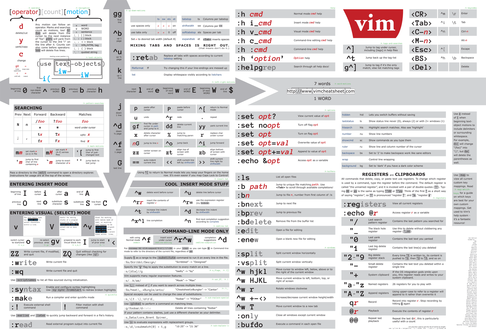

=========
Linux Cmd
=========

:Date:   2019-12-16 13:28:13

参考资料
========

1. `Linux工具快速教程 <https://linuxtools-rst.readthedocs.io/zh_CN/latest/index.html>`__

2. Linux Command搜索引擎： https://github.com/jaywcjlove/linux-command
   https://wangchujiang.com/linux-command/ https://tldr.ostera.io/

VIM
===

https://github.com/wsdjeg/vim-galore-zh_cn
：介绍vim关键概念、用法与技巧和cheet sheet等。
https://vim.rtorr.com/lang/zh_cn

   vim_cheetsheet

运行
----

两种运⾏模式：“compatible” 和“nocompatible”。

-  compatible: Vim使⽤ vi 的默认设置.

-  nocompatible： 需要新建⼀个⽤户的 vimrc 或者使⽤ vim -N 命令启动
   Vim。

启用默认vimrc:

::

   :e ~/.vimrc 
   :r $VIMRUNTIME/vimrc_example.vim

命令学习
--------

学习vimtutor的记录。（2021-02-27/00:16）

+----------------------------------+----------------------------------+
| 命令                             | 动作                             |
+==================================+==================================+
| 2w                               | 移动                             |
+----------------------------------+----------------------------------+
| 0                                | 行首                             |
+----------------------------------+----------------------------------+
| r                                | 替换字母                         |
+----------------------------------+----------------------------------+
| R                                | 替换模式（行）                   |
+----------------------------------+----------------------------------+
| o                                | 插入行                           |
+----------------------------------+----------------------------------+
| U                                | 撤销整行                         |
+----------------------------------+----------------------------------+
| u                                | 撤销上次，可撤销U命令            |
+----------------------------------+----------------------------------+
| yw                               | 复制word                         |
+----------------------------------+----------------------------------+
| ctrl+r                           | 撤销u命令                        |
+----------------------------------+----------------------------------+
| ctrl+g                           | 显示文件和位置信息               |
+----------------------------------+----------------------------------+
| 123G                             |                                  |
+----------------------------------+----------------------------------+
| ctrl+o                           | 上一个位置                       |
+----------------------------------+----------------------------------+
| ctrl+i                           | 下一个位置                       |
+----------------------------------+----------------------------------+
| %                                | 跳转到匹配的括号                 |
+----------------------------------+----------------------------------+
| :!ls                             | 执行外部命令                     |
+----------------------------------+----------------------------------+
| :w filename                      | 保存当前v选择或当前文件          |
+----------------------------------+----------------------------------+
| :r !ls                           | 将ls的结果放到当前位置。         |
+----------------------------------+----------------------------------+
| :%s/old/new/gc                   | %-全文件；g-全替换；c-每步确认。 |
+----------------------------------+----------------------------------+
| /pattern:raw-latex:`\c  |`       | :nohlsearch                      |
| 当前次忽略case。 搜索时执行      |                                  |
+----------------------------------+----------------------------------+
| :set ic :set noic                | ignore case                      |
+----------------------------------+----------------------------------+
| :set hls is :set nohls is        | hlsearch                         |
+----------------------------------+----------------------------------+
| :set is/incsearch                | 部分搜索                         |
+----------------------------------+----------------------------------+
| :help cmd                        | cmd帮助                          |
+----------------------------------+----------------------------------+
| :help user-manual                |                                  |
+----------------------------------+----------------------------------+
| vimrc                            | 即启动脚本。                     |
+----------------------------------+----------------------------------+
| CTRL-W                           | 切换窗口                         |
+----------------------------------+----------------------------------+
| 命令模式自动补全                 | CTRL-D显示可选，TAB补全          |
+----------------------------------+----------------------------------+

推荐书籍：\ ``Vim - Vi Improved - by Steve Oualline``

进程
====

top
---

top进入后，按 o 然后输入筛选条件，如 COMMAND=sshd
，即搜索包含字符sshd的进程。

u： 过滤用户。 1： 显示smp。

pgrep
-----

grep+pid

pidof
-----

::

       pidof dogcom|xargs kill -s 9

``kill -s 9``:强制结束

pkill
-----

::

       pkill -9 dogcom

killall
-------

与pkill相似。需给出完整进程名。 killall -9 dogcom

screen
------

需要安装。

::

   screen -S _name
   screen -R _name

fg和bg
------

``CTRL+Z``\ ：暂停进程/挂载到后台。 ``jobs``\ ：查看后台运行的程序。
``bg [job_spec ...]``\ ：后台进程继续执行。与在指令后面添加符号&的效果是相同的。
``fg [job_spec ...]``\ ：将后台进程调回前台。

定时与任务
----------

watch
~~~~~

默认2s，最小精度0.1s。

::

   watch -n 1 -d uptime

   可使用""包含后面的命令，这样可以使用多级管道命令，但命令中的"需要转义。

   watch -d "/bin/cat /proc/softirqs | /usr/bin/awk 'NR == 1{printf \"%-15s %-15s %-15s\n\",\" \",\$1,\$2}; NR > 1{printf \"%-15s %-15s %-15s\n\",\$1,\$2,\$3}'"

sleep bash
~~~~~~~~~~

while循环：

::

   while true; do echo -n "This is a test of while loop";date ; sleep 5; done

for循环：

::

   for i in {1..10}; do echo -n "This is a test in loop $i "; date ; sleep 5; done

crontab
~~~~~~~

定时器任务，最小为每分钟执行一次。

可通过在命令中插入\ ``sleep  n``\ 来实现秒级控制(在一分钟的第n秒执行)。如

::

   * * * * sleep 10 php /script
   * * * * sleep 20 php /script

文件
====

压缩与解压
----------

::

   tar -xf // 自动检测类型

   tar -zxvf *.tar.gz
   tar -zcvf *.tar.gz /file

   tar -xjf *.tar.bz2

   zip/unzip

删除
----

rm -rf 文件夹

chattr
------

查看文件属性

::

   lsattr -al

rm无法删除的文件，具有\ ``immutable``\ 属性。
``chattr -i /home/wwwroot/你的网站目录/.user.ini``

chattr
改变一个Linux文件系统上的文件属性。通用格式是：\ ``+-=[aAcCdDeijsStTu]``

'+’选项，将给文件添加属性；'-’选项，移除文件中的属性；'=’选项，使得文件只有这些属性。

stat
----

stat命令主要用于显示文件或文件系统的详细信息：

::

   -f　　不显示文件本身的信息，显示文件所在文件系统的信息
   -L　　显示符号链接
   -t　　简洁模式，只显示摘要信息

touch
-----

使用touch命令可以手动更新Access和Modify。 touch -d 2000-01-01 file：
将file的Access和Modify时间改为2000-01-01 touch -a
file：将file的Access时间改为当前系统时间 touch -m
file：将filet的Modify时间改为当前系统时间

du
--

查看子目录/子文件所占空间 Summarize disk usage of the set of FILEs,
recursively for directories.

::

   du -h --max-depth=1 /home/

chown/chgrp
-----------

修改文件所属用户和用户组：

::

   chown [-R] 账号名称 文件或目录
   chgrp [-R] 用户组名称 dirname/filename

示例

::

   chown -R www:www my_wp_blog

mv
--

//将a.txt重命名为a1.txt ``mv a{,1}.txt``

cp
--

::

   cp -a 复制文件所有属性、所有者、组

   cp -pr directory

文件系统操作
------------

1. ``mount/unmount 文件系统 挂载目录`` 开机自动挂载：将挂载信息写入 ``/etc/fstab``\ 。如 /dev/sdb2/backup ext4 defaults 0 0
2. ``fdisk``\ ：硬盘管理(需要root权限) mkfs：格式化。用法：``mkfs.文件类型名称 如mkfs.ext4 硬盘分区名称``
3. ``df -ah``:查看挂载点信息与磁盘使用量。
4. ``du -sh``:查看指定文件的磁盘占用。 ``free -h`` ``cat /proc/cpuinfo``
5. ``uname -a``

lsof 一切皆文件
---------------

lsof（list open files）是一个查看当前系统文件的工具。

https://linuxtools-rst.readthedocs.io/zh_CN/latest/tool/lsof.html

::

   lsof|more

命令参数
--------

::

   -a 列出打开文件存在的进程
   -c<进程名> 列出指定进程所打开的文件
   -g 列出GID号进程详情
   -d<文件号> 列出占用该文件号的进程
   +d<目录> 列出目录下被打开的文件
   +D<目录> 递归列出目录下被打开的文件
   -n<目录> 列出使用NFS的文件
   -i<条件> 列出符合条件的进程。（4、6、协议、:端口、 @ip ）
   -p<进程号> 列出指定进程号所打开的文件
   -u 列出UID号进程详情
   -h 显示帮助信息
   -v 显示版本信息

参数可组合使用

使用
----

查找某个文件相关的进程

::

   lsof /bin/bash

某个用户打开的文件信息

::

   lsof -u username

某个程序进程所打开的文件信息

::

   lsof -c nginx

列出谁在使用某个端口

::

   lsof -i :80

通过某个进程号显示该进程打开的文件

::

   lsof -p 123

ln
--

软连接（符号链接）

::

   ln -s 文件名 链接名

磁盘性能
--------

fio / Crystal Disk Mark

::

   fio --name=fio-test --filename=test.data --size=1G --bs=4k --rw=randwrite --ioengine=libaio --direct=1 --iodepth=1 --time_based --runtime=600 --group_reporting

查找
====

ripgrep
-------

文本查找工具。
`ripgrep <https://github.com/BurntSushi/ripgrep>`__\ ，目前最快的工具，支持全平台。类似工具\ `Ag <https://github.com/ggreer/the_silver_searcher>`__

`Release下载 <https://github.com/BurntSushi/ripgrep/releases>`__ 或

::

   scoop install ripgrep
   choco install ripgrep

ack
---

比grep好用的文本搜索工具

::

   sudo apt-get install ack-grep

   -c(统计)/ 
   -i(忽略大小)/ 
   -h(不显示名称)/
   -l(只显文件名)/ 
   -n(加行号)/ 
   -v(显示不匹配)

查找文件，以省去你要不断的结合find和grep的麻烦，虽然在linux的思想是一个工具做好一件事。

::

   ack-grep -f hello.py     # 查找全匹配文件
   ack-grep -g hello.py$    # 查找正则匹配文件
   ack-grep -g hello  --sort-files     # 查找然后排序

which命令
---------

| 当前用户的 $PATH 环境变量中列出的目录。 查看\ **可执行文件**\ 的位置：
| ``which + [选项] + 指令名``

::

   # which vi
   /usr/bin/vi

whereis命令
-----------

whereis命令用来定位指令的二进制程序、源代码文件和man手册页等相关文件的路径。

``whereis +[选项]+ 指令名``

-  whereis命令用来查找二进制程序、源代码文件和帮助文件在文件系统中的位置。

-  b:只查找二进制文件；

-  m:只查找帮助文件；

-  s:只查找源文件；

::

   # whereis vi 
   vi: /usr/bin/vi /usr/share/man/man1/vi.1.gz

locate
------

locate 命令比 find 命令运行得更快，因为它使用 updatedb 数据库，而 find命令在真实系统中搜索。
 
locate命令未在大多数发行版中预安装，因此，请使用你的包管理器进行安装。
``sudo apt install mlocate`` 数据库通过 cron任务定期更新，但我们可以通过运行以下命令手动更新它： ``sudo updatedb``

locate命令维护了一份文件和目录的数据库，所以检索速度会快一些，数据库通常一天更新一次，可以手动更新数据库

::

   sudo updatedb 
   locate -S   # 查看当前数据库数据

locate 使用的方式和 find 大致差不多。

find
----

1. `find <http://einverne.github.io/post/2018/02/find-command.html#%E9%80%9A%E8%BF%87%E6%97%B6%E9%97%B4%E6%9D%A5%E6%9F%A5%E6%89%BE%E6%96%87%E4%BB%B6>`__

最基本的使用:
``find [path] [expression]`` 在 path 目录下查找 expression 的文件,默认当前目录。

通过文件名查找
~~~~~~~~~~~~~~

::

   find -name "query"   # 搜索文件名，大小写敏感
   find -iname "query"  # 大小写不敏感
   find -not -name "query"  # 查找不包含关键字的文件
   find \! -name "query"    # 不包含

按照类型查找文件
~~~~~~~~~~~~~~~~

``find -type [fdlcb] "query"`` type 后能够使用的类型有

::

   f 常规文件
   d 目录
   l 连接
   c 字符设备文件 character devices
   b 块设备文件 block devices

比如要查找系统中所有以 .conf 结尾的文件

``find / -type f -name "*.conf"``

通过文件大小查找
~~~~~~~~~~~~~~~~

``find /path/to/folder -size 50M`` 查找 50M 的文件，size后能够使用的单位有：

::

   b 512byte blocks
   c byte 字节
   w two byte
   k kB 千字节
   M MB
   G GB

size 后面的参数可以使用 + 或者 - 或者不加来标识，超过，少于，或者正好。

::

   find / -size +700M   # 表示查找大于 700M 的文件
   find / -size -50c    # 表示查找小于 50 byte 的文件
   find . -size 50M     # 表示在当前目录查找正好 50M 的文件

通过时间来查找文件
~~~~~~~~~~~~~~~~~~

Linux 会存储下面的时间：

-  Access time 上一次文件读或者写的时间

-  Modifica time 上一次文件被修改的时间

-  Change time 上一次文件 inode meta 信息被修改的时间

::

   在按照时间查找时，可以使用 -atime， -mtime 或者 -ctime ，和之前 size 参数一样可以使用 + 或者 - 来标识超多多长时间或者少于多长时间。

           find / -mtime 1          # 寻找修改时间超过一天的文件
           find / -atime -1         # 寻找在一天时间内被访问的文件
           find / -ctime +3         # 寻找 meta 信息被修改的时间超过 3 天的文件

   寻找修改时间超过 1 小时的 mp3 文件

           find /path/to/folder -maxdepath 1 -mmin +60 -type f -name "*.mp3"
   其中的-mmin n 参数表示的就是文件内容在前 n 分钟没有修改。

           find /path/to/folder -maxdepath 1 -mmin +60 -type f -name "*.mp3" -exec rm -f {} \;
   通过上面的语句就能够一次性删除超过 60 分钟未修改的 mp3 了。

通过 Owner 和权限搜索
~~~~~~~~~~~~~~~~~~~~~

使用 -user 和 -group 参数来通过拥有者搜寻

::

       find / -user einverne
       find / -group shadow

同样按着权限查找文件

::

       find / -perm 644
       find / -perm -644 # 查找权限至少是 644 的文件

限制查找的深度
~~~~~~~~~~~~~~

使用 -maxdepth / -mindepth来限制查找的深度

::

   find -maxdepth 2 -name "query"
   find -mindepth 2 -maxdepth 3 -name "query"

对搜索结果批处理
~~~~~~~~~~~~~~~~

在搜索出结果之后，可以使用如下的方式对搜索的结果执行一个命令

::

   find [param] -exec command {} \;

1. 批量修改权限

``find . -type f -perm 644 -exec chmod 664 {} ; find . -type d -perm 755 -exec chmod 700 {} ;`` # 批量修改文件夹权限

2. 批量删除时间超过 1 天的文件
   综合上面按时间查找文件和对搜索结果批处理，可以获知

``find /path/to/folder/\* -mtime +1 -exec rm {} ;`` 
find 后面接一个完整的 path; -mtime +1 表示的查找时间超过 1 天的内容; -exec 后面表示对搜索的结果进行处理

3. 删除目录下空文件夹 
   find path/to/folder -type d -empty -print 
   find path/to/folder -type d -empty -delete

文本
====

cat
---

::

       ‍cat /dev/null > /var/log/wtmp
       ‍cat /dev/null > /var/log/btmp
       ‍cat /dev/null > /var/log/lastlog

或是直接删除，再重新建个同名，改权限与原来的一样

tail和head
----------

1. 查看最后1000行的数据 cat filename \| tail -n 1000

2. 查看1000到3000行的数据

``cat filename | head -n 3000 | tail -n +1000``

1. tail -n 1000 最后1000行的数据

2. tail -n +1000 第1000行开始以后的内容

3. head -n 1000 前1000的内容

4. head -n -1000 倒数1000行以前

监控log：

tail -f -n 10 /var/log/fail2ban.log

xargs
-----

https://www.ruanyifeng.com/blog/2019/08/xargs-tutorial.html

::

   -d :指定分隔符，默认换行符和空格
   -n: 指定多少项作为参数（分隔得到的项）
   -p: 只打印  
   -t: 打印并执行
   -L: 指定多少行作为一个命令行参数
   -I指定每一项命令行参数的替代字符串。将命令行参数传给多个命令。
       cat foo.txt | xargs -I file sh -c 'echo file; mkdir file'

   --max-procs参数指定同时用多少个进程并行执行命令

执行后面跟着的命令（默认为echo），将stdin的空格和换行去除并作为该命令的参数（跟在后面）。

可用于合并多行。每5行合并：

``cat file|xargs -n5``

替代方案如下

awk \| bash
~~~~~~~~~~~

awk构造命令然后bash执行。

文本处理
--------
col
----
col — filter reverse line feeds from input

过滤反向换行符，如 ``^H`` .
grep
----

``cat、tail、head、grep、sed``\ 查看文件任意几行的数据

::

   grep -C 5 foo file 显示file文件里匹配foo字串那行以及上下5行
   grep -B 5 foo file 显示foo及前5行
   grep -A 5 foo file 显示foo及后5行
   grep -m <num> --max-count=<num> # 找到num行结果后停止查找

取前面10行匹配的结果 ``grep ...... | head -10``

awk、sed、grep更适合的方向
~~~~~~~~~~~~~~~~~~~~~~~~~~

-  grep 更适合单纯的查找或匹配文本

-  sed 更适合编辑匹配到的文本

-  awk 更适合格式化文本，对文本进行较复杂格式处理

awk
---

文本分析工具。支持正则。

1. `Understanding AWK <https://earthly.dev/blog/awk-examples/>`__

2. `30 Examples For Awk Command In Text
   Processing <https://likegeeks.com/awk-command/>`__

语法
~~~~

``awk [选项参数] 'script' var=value file(s)`` 或
``awk [选项参数] -f scriptfile var=value file(s)``

::

   awk '{[pattern] action}' {filenames}   # 行匹配语句 awk '' 只能用单引号

   awk -F  #-F相当于内置变量FS, 指定分割字符

   awk -v  # 设置变量

   awk -f {awk脚本} {文件名}

awk脚本
~~~~~~~

::

   awk 'BEGIN{ commands } pattern{ commands } END{ commands }'

-  BEGIN语句块 在awk开始从输入流中读取行 之前
   被执行，这是一个可选的语句块，比如变量初始化、打印输出表格的表头等语句通常可以写在BEGIN语句块中。

-  END语句块 在awk从输入流中读取完所有的行 之后
   即被执行，比如打印所有行的分析结果这类信息汇总都是在END语句块中完成，它也是一个可选语句块。

-  pattern语句块
   中的通用命令是最重要的部分，它也是可选的。如果没有提供pattern语句块，则默认执行{
   print }，即打印每一个读取到的行，awk读取的每一行都会执行该语句块。

-  ``{ }``\ 类似一个循环体，会对文件中的每一行进行迭代。

打印输出：

1. print命令里面，如果原样输出字符，要放在双引号里面。

2. print命令自动换行。

3. printf可格式化输出(不自动换行)，语法类似c。

4. next命令：跳过后面的脚本，进入下一行处理。

::

   watch -d "/bin/cat /proc/softirqs | /usr/bin/awk 'NR == 1{printf \"%-15s %-15s %-15s\n\",\" \",\$1,\$2}; NR > 1{printf \"%-15s %-15s %-15s\n\",\$1,\$2,\$3}'"

常用示例
~~~~~~~~

``-F ':'``:指定分隔符
``NR``\ ：当前行号，\ ``$NR``\ ：总行数。FNR类似，但多文件时会重新计数。
``NF``\ ：当前行的总列数，\ ``$NF``\ ：代表最后一列。
``print $1``\ ：打印分隔后的第一列

::

   cat /etc/passwd|awk -F ':' '/home/ {print $1}'

   awk -F ':' '/usr/ {print $1}' demo.txt

   awk -F ':' 'NR >3 {print $1}' demo.txt

   awk -F ':' '$1 == "root" || $1 == "bin" {print $1}' demo.txt

   awk -F ':' '{if ($1 > "m") print $1; else print "---"}' demo.txt

   合并多行：
   awk'{if(NR%5!=0) )RS="\t";else ORS="\n"} END {printf("\n")} 1'  

   # 1即为真,执行默认操作print,默认参数$0，即打印每行

   函数
   awk -F ':' '{ print toupper($1) }' demo.txt

内置变量和自定义变量
~~~~~~~~~~~~~~~~~~~~

分为内置变量和自定义变量;输入分隔符FS和输出分隔符OFS都属于内置变量。

1. FS(Field Separator)：输入字段分隔符， 默认为空白字符

2. OFS(Out of Field Separator)：输出字段分隔符， 默认为空白字符

3. RS(Record Separator)：输入记录分隔符(输入换行符)， 指定输入时的换行符

4. ORS(Output Record
   Separate)：输出记录分隔符（输出换行符），输出时用指定符号代替换行符

5. NF(Number for Field)：当前行的字段的个数(即当前行被分割成了几列)

6. NR(Number of Record)：行号，当前处理的文本行的行号。

7. FNR：各文件分别计数的行号

8. ARGC：命令行参数的个数

9. ARGV：数组，保存的是命令行所给定的各参数

sed
---

流式文本编辑器,支持正则,将当前行存储在输出到屏幕。

sed 利用脚本来处理文本文件。

sed语法
~~~~~~~

1. `sed详解 <https://wangchujiang.com/linux-command/c/sed.html>`__

2. `sed简明教程 <https://coolshell.cn/articles/9104.html>`__

3. https://www.gnu.org/software/sed/manual/sed.html

::

   sed [-hnV][-e<script>][-f<script文件>][文本文件]

1. Pattern Space：每次流处理后，该空间的内容即为该次的结果

2. Hold Space：用于保存流，和Pattern
   Space内容可相互移动，以实现复杂处理。

   -  g: hold space内容拷贝到pattern space,原pattern space被清空。
   -  G：hold space追加到pattern space
   -  h：h -> p
   -  H：h追加到p
   -  x：交换h空间和p空间内容

文本行逆序： ``sed '1!G;h;$!d' test.txt``

编辑
~~~~

1. 追加:a(行下)、i(行上)

``sed '/^test/i\this is a test line' file``:追加到以test开头的行上面。

2. 替换:s命令

3. ``sed 's/old/new' file``

4. ``sed -n 's/old/new/p' file``:只打印发生替换的行

5. ``sed -i 's/old/new/g' file``\ 直接编辑源文件。

   -  ``/g``:全部替换,
   -  ``/Ng``:从第N行开始替换

3. 删除:d命令

``sed '2d' file``:第二行 ``sed '2,$d' file``:范围
``sed '/^$/d' file``:空白行

4. 多点编辑:e

``-e``\ 选项允许在同一行里执行多条命令,执行顺序影响结果。

``sed -e '1,5d' -e 's/test/check/' file``

5. 从文件读入:r

``sed '/test/r file' example``:读入file的内容，显示在所有匹配行下面。

6. 写入文件:w

``sed -n '/test/w file' example``:匹配行都被写入

匹配与选择
~~~~~~~~~~

1. 定界符: 字符 ``/`` 可在sed中作为定界符使用，也可以使用任意的定界符：

::

   sed 's:test:TEXT:g'
   sed 's|test|TEXT|g'

定界符出现在样式内部时，需要进行转义：

::

   sed 's/\/bin/\/usr\/local\/bin/g'

2. 已匹配字符串标记& ``echo this is a test line | sed 's/\w\+/[&]/g'``

3. 子串匹配标记:``\1`` ``\N``\ 按照匹配到的顺序。

::

   echo aaa BBB | sed 's/\([a-z]\+\) \([A-Z]\+\)/\2 \1/'
   BBB aaa

4. 行范围:,(逗号)

``sed '/test/,/west/s/$/aaa bbb/' file``:选定范围test和west之间的行,每行的末尾用字符串替换。

``sed -n '1000,3000p' filename``

5. 下一行:n

::

   1. 移动到匹配行的下一行。
   `sed '/test/{n;s/aa/bb/;}' file`:

   2. 打印匹配字符串的下一行
   grep -A 1 SCC URFILE
   sed -n '/SCC/[n;ip/' URFILE
   awk '/SCC/{getline;print/' URFILE

   3. 奇数偶数行
   sed -n 'p;n' test.txt#奇数行
   sed -n 'n;p' test.txt#偶数行

GNU sed provides an extension address syntax of **first~step**

::

   sed -n '1~2p' test.txt#奇数行
   sed -n '2~2p' test.txt#偶数行

其它
~~~~

1. 退出:q

``sed '10q' file``:打印第10行后退出。

2. 保持、获取和互换:h、g、x

   1. ``sed -e '/test/h'-e '$G' file``:将匹配到的行复制并追加到该文件的末尾

   2. ``h``:将模式空间内容复制并存入到保持缓存区。

   3. ``G``:取出保持缓存区的内容,追加到模式空间。

   4. ``x``:互换模式空间和保持缓冲区的内容。

   5. ``sed -e '/test/h' -e '/check/x' file``

3. 脚本scriptfile:

``sed [options] -f scriptfile file(s)``

命令末尾不能有任何空白或文本;多个命令9

sed处理log
~~~~~~~~~~

sed可以直接处理二进制日志，以wtmp举例，比如：
sed -i '/your_ip/d' /var/log/wtmp，如果要改成别的IP的话，
sed -i 's/your_ip/fake_ip/g' /var/log/wtmp

更改记录：

::

   sed -i -e '/pptpd/d’ /var/log/messages

   sed -i -e '/123\.123\.123\.123/d’ /var/log/messages

   sed  -i '/当前时间/’d  /var/log/messages

   sed -i 's/192.168.1.1/8.8.8.8/’ /var/log/lastlo

自定义变量的方法 方法一：-v varname=value ，变量名区分字符大小写。
方法二：在program中直接定义。

sort和uniq
----------

sort \| uniq 进行去重。

sort -k col

二进制
=======
od格式化二进制
---------------
`od -t x4 -w16 test.gcda``

网络
====

ss与netstat
-----------

ss比netstat更高效

::

   ss -ntl

::

   ss -s

ip
--

ifconfig(net-tools)不在维护。 ip：配置网络。

::

   ip a
   ip -4 a
   ip a show wlan0

``nmcli``\ ：RHEL的命令。

curl
----

利用URL规则在命令行下工作的文件传输工具
是一个利用URL规则在命令行下工作的文件传输工具。它支持文件的上传和下载，所以是综合传输工具。支持包括HTTP、HTTPS、ftp等众多协议，还支持POST、cookies、认证、从指定偏移处下载部分文件、用户代理字符串、限速、文件大小、进度条等特征。做网页处理流程和数据检索自动化。

**文件下载**
curl是将下载文件输出到stdout，将进度信息输出到stderr，不显示进度信息使用\ ``--silent``\ 选项。

::

   curl UEL --silent

选项-o将下载数据写入到指定名称的文件中，并使用–progress显示进度条：

::

   curl http://example.com/test.iso -o filename.iso --progress

**get请求**

::

   curl "http://www.wangchujiang.com"    # 如果这里的URL指向的是一个文件或者一幅图都可以直接下载到本地
   curl -i "http://www.wangchujiang.com" # 显示全部信息
   curl -l "http://www.wangchujiang.com" # 只显示头部信息
   curl -v "http://www.wangchujiang.com" # 显示get请求全过程解析

**post请求**

::

   curl -d "param1=value1&param2=value2" "http://www.wangchujiang.com/login"

   curl -d'login=emma＆password=123' -X POST https://wangchujiang.com/login

   # 或者
   $ curl -d 'login=emma' -d 'password=123' -X POST  https://wangchujiang.com/login
   --data-urlencode 参数等同于 -d，发送 POST 请求的数据体，区别在于会自动将发送的数据进行 URL 编码。

   curl --data-urlencode 'comment=hello world' https://wangchujiang.com/login

   # 上面代码中，发送的数据hello world之间有一个空格，需要进行 URL 编码。

**向服务器发送 Cookie** 多个cookie使用分号分隔：

::

   curl http://wangchujiang.com --cookie "user=root;pass=123456"

GET 和 POST
-----------

https://developer.mozilla.org/zh-CN/docs/Web/HTTP/Methods/POST
在客户机和服务器之间进行请求-响应时，两种最常被用到的方法是：GET 和
POST。

-  GET - 从指定的资源请求数据。

-  POST - 向指定的资源提交要被处理的数据

其它工具
========

时间
----

https://www.cnblogs.com/muahao/p/6098675.html

1. 显示指定时间的时间戳

date -d “2010-07-20 10:25:30” +%s

2. 将时间戳转换为标准时间格式 date -d “@1279592730” +“%F %H:%M:%S” echo
   “1279592730” \|awk '{print strftime (“%F %T”,$0)}’

调整cpu频率
-----------

-  windows：xtu、throttle。

-  linux：cpufreq工具、/sys/devices/system/cpu/cpufreq/、s-tui工具

https://www.cnblogs.com/augusite/p/13813559.html

安装：sudo apt-get install cpufreq

显示当前CPU核心信息：cpufreq-info

设置CPU工作模式：sudo cpufreq-set -g performance

自定义CPU频率： sudo cpufreq-set -d 1800m -u 2700m //
适用模式：powersave|ondemand|conservative|performance

cpuz数据： http://valid.x86.fr/tsa6vi

xtu、throttle
~~~~~~~~~~~~~

throttle配置后，xtu大部分功能不饿能使用（灰色按钮）。

小米游戏本八代增强版i7 8750h tdp锁死45w，软件无法解锁。

cpu core/cpu cache 降压 125mV。GPU降压 125mV。

1. aida64烤机核显uhd630 tdp 10W。

2. cpu+核显双烤：pkg 45W，ia 30W，gt 10W

均衡模式：

**65W pd电源**\ ：yoga cc65 符合vi认证（转换效率>= 86%），窄幅电压（220V
± 10%），110V-200V时输出功率仅45W。—— cpu+独显双烤： cpu 45W + gtx 1060
15W。

**原配180W电源**\ ：cpu+独显双烤： cpu 45W + gtx 1060 75W。

关闭图形界面
------------

::

   Ubuntu 18/20

   sudo systemctl set-default multi-user.target
   sudo reboot

   重新开启图形界面如下：
   sudo systemctl set-default graphical.target
   sudo reboot

进入tty
~~~~~~~

ubuntu20关闭图形界面后，重启默认不会进入tty登录界面。 需按
``Ctrl + Alt + F1`` 进入。

关闭自动更新
------------

sudo vim /etc/apt/apt.conf.d/10periodic

netplan配置wifi
---------------

/etc/netplan/下面有个YAML配置文件

::

   ip a # 查看网卡

   network:
     ethernets:
       eth0:
         dhcp4: true
         optional: true
     version: 2
     wifis:
         无线网开名:
             dhcp4: true
             access-points:
                 "你的wifi的ssid":
                     password: "你的密码"

   netplan try
   netplan apply

视频采集卡
----------

1. 可采集bios画面。

2. 可使用dp-hdmi线接入，采集卡输入端为hdmi。

3. 图形界面和tty界面延时差别不大。

`PotPlayer采集卡采集视频的的方法 <http://www.potplayercn.com/course/2925.html>`__

1. 打开PotPlayer -> 左上角“PotPlayer”图标 -> 下拉栏窗口 -> 打开 ->
   设备设置” 也可直接使用快捷键Alt+D来打开“设备设置”。

2. 点击“摄像头”，视频录制设备“设备”选择电子采集卡，音频录制设备“设备”选择电子采集卡，然后点击“打开设备”。

3. 视频格式选择\ **默认格式或MJPG**\ ，此时1080p 30
   的延时约100ms。若选择其它格式，延时可能大于1s。

延时测量
--------

通过 局域网ssh登录 和本机登录(采集卡查看），同时执行显示当前时间的命令，截图对比时间差。

``watch -n 0.01 "adjtimex -p| awk '/raw time:/ {print $6}'"``
:adjtimex可显示ns级时间。

终端软件
--------

1. MobaXterm。仅windows。集各功能与一体（包括ftp功能），宏，有单文件版，免费，专业版可破解。

2. terminus，全平台+同步。

3. Xshell系列，可申请\ `个人免费版 <https://www.netsarang.com/zh/free-for-home-school/>`__\ Xshell/Xftp（ftp功能需要另外安装Xftp），界面好看。

4. securecrt + securefx
   ，全平台。功能强大，交互脚本。破解版https://sysin.org/blog/securecrt-9-1/

5. WindTerm，全平台，宏。 https://github.com/kingToolbox/WindTerm

no login shell
--------------

-  no login shell: 加载.bashrc。Mobaxterm
-  login shell: 加载.profile。SecureCRT
