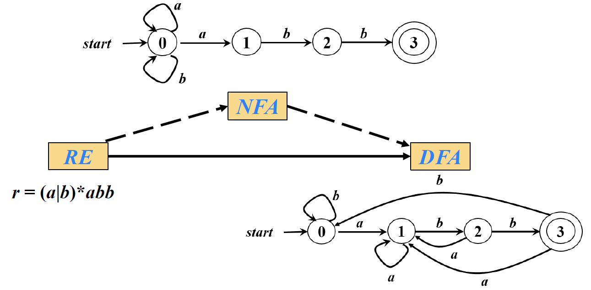
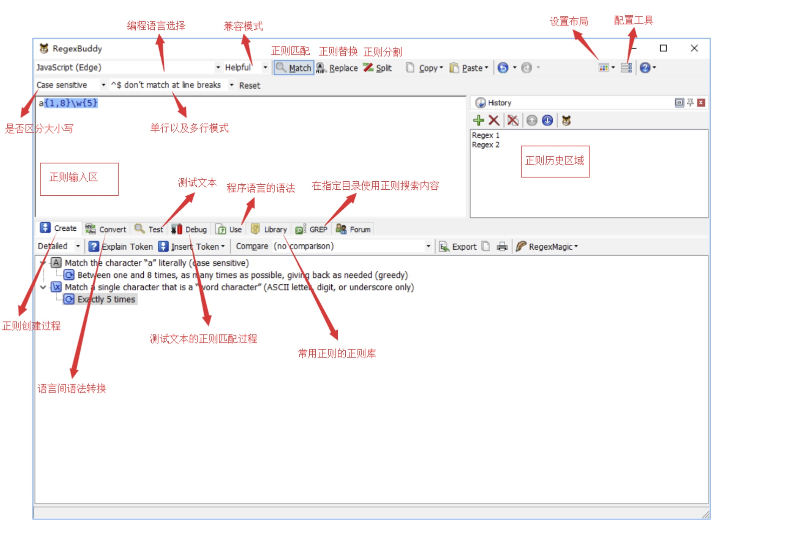

=====
Regex
=====

:Date:   2020-09-28 23:10:37

References
==========

1. `learn-regex-Github <https://github.com/ziishaned/learn-regex/blob/master/translations/README-cn.md>`__\ ，入门必读。

2. `你是如何学会正则表达式的？ <https://www.zhihu.com/question/48219401/answer/1476436385>`__\ ：入门后需要深入学习的内容。

3. 正则可视化工具：\ `Regexper <https://regexper.com/>`__\ 和\ `Regulex <https://jex.im/regulex/#!flags=&re=>`__

4. 正则在线调试：\ `regex101 <https://regex101.com/>`__

5. RegexBuddy：强大的正则表达式学习、分析及调试工具。付费。

基本语法
========

.. figure:: ../images/regex.png
   :alt: Regex

   Regex

基本匹配
--------

大小写敏感 默认只返回第一个匹配，\ ``/g``\ 返回所有匹配
``.*``\ ：任意字符串

元字符
------

一些元字符写在方括号中的时候有一些特殊的意思。

========= ===========================================================
元字符    描述
========= ===========================================================
``.``     句号匹配任意单个字符除了换行符。
``[ ]``   字符集合。匹配方括号内的任意字符。
``[^ ]``  否定的字符种类。匹配除了方括号里的任意字符
``*``     匹配>=0个重复的在*号之前的字符。
``+``     匹配>=1个重复的+号前的字符。
``?``     标记?之前的字符为可选,0或1次
``{n,m}`` 匹配num个大括号之前的字符或字符集 (n <= num <= m).
``(xyz)`` 字符集，匹配与 xyz 完全相等的字符串.
``|``     或运算符，匹配符号前或后的字符.
``\``     转义字符,用于匹配一些保留的字符 [ ] ( ) { } . \* + ? ^ $ \\
``^``     从开始行开始匹配.
``$``     从末端开始匹配.
========= ===========================================================

普通字符集
----------

``[Tt]``\ ： ``[.]``\ ：匹配句号。 ``[^c]``\ ：否定字符集。
``[a-z]``\ ：

量词
----

+-----------+---------------------------------------------------------+
| 字符      | 描述                                                    |
+===========+=========================================================+
| ``*``     | 匹配>=0个重复的在*号之前的字符。                        |
+-----------+---------------------------------------------------------+
| ``+``     | 匹配>=1个重复的+号前的字符。                            |
+-----------+---------------------------------------------------------+
| ``?``     | 标记?之前的字符为可选,0或1次                            |
+-----------+---------------------------------------------------------+
| ``{n,m}`` | 匹配num个大括号之前的字符或字符集 (n <= num <=          |
|           | m)，\ ``{m,}、{m}``                                     |
+-----------+---------------------------------------------------------+

边界
----

-  ``^``\ ：表示字符串的开头。
-  ``$``\ ：字符串的结尾。
-  ``\b``\ ：单词边界
-  ``\B``\ ：非单词边界

简写字符集
----------

正则表达式提供一些常用的字符集简写。如下:

==== =======================================================
简写 描述
==== =======================================================
.    除换行符外的所有字符
\\w  匹配所有字母数字，等同于 ``[a-zA-Z0-9_]``
\\W  匹配所有非字母数字，即符号，等同于： ``[^\w]``
\\d  匹配数字： ``[0-9]``
\\D  匹配非数字： ``[^\d]``
\\s  匹配所有空格字符，等同于： ``[\t\n\f\r\p{Z}]``
\\S  匹配所有非空格字符： ``[^\s]``
\\f  匹配一个换页符
\\n  匹配一个换行符
\\r  匹配一个回车符
\\t  匹配一个制表符
\\v  匹配一个垂直制表符
\\p  匹配 CR/LF（等同于\ ``\r\n``\ ），用来匹配 DOS 行终止符
==== =======================================================

模式修正符
----------

模式修正符在\ ``/``\ 后。

==== =================================================
标志 描述
==== =================================================
i    忽略大小写。
g    全局搜索。
m    多行修饰符：锚点元字符 ^ $ 工作范围在每行的起始。
==== =================================================

捕获与贪婪
==========

非捕获
------

先行断言和后发断言都属于\ ``非捕获簇``\ （不捕获文本
，也不针对组合计进行计数）。
先行断言用于判断所匹配的格式是否在另一个确定的格式之前，匹配结果不包含该确定格式（仅作为约束）。

==== =====================================
符号 描述
==== =====================================
?=   正先行断言-存在。要匹配的字符放前面。
?!   负先行断言-排除
?<=  正后发断言-存在。要匹配的字符放后面。
?<!  负后发断言-排除
==== =====================================

``(?:)``\ ：纯粹的非捕获。

()捕获分组
----------

``()``\ 捕获的作用：

-  主流功能，提升括号中内容的运算优先级
-  反向引用：\ ``\n``\ 。\ **Notepad++支持在替换文本中使用，VSCode不支持。**

反向引用
--------

后向引用,用于重复搜索\ ``前面某个分组``\ 匹配的文本。

``\n``:从左至右，按\ ``()``\ 出现顺序标号。

::

   var regex = /^((\d)(\d(\d)))\1\2\3\4$/;
   var string = "1231231233";
   console.log( regex.test(string) ); // true
   console.log( RegExp.$1 ); // 123
   console.log( RegExp.$2 ); // 1
   console.log( RegExp.$3 ); // 23
   console.log( RegExp.$4 ); // 3

贪婪模式
--------

正则表达式默认采用贪婪匹配模式，在该模式下意味着会匹配尽可能长的子串。

``？`` ：惰性匹配模式。

回溯
----

正则回溯的过程就是一个\ **试错**\ 的过程，回溯会增加匹配的步骤，势必会影响文本匹配的性能，

惰性量词与贪婪量词均可能出现回溯。

DFA和NFA
========

正则引擎
--------

主要可以分为两大类：

1. DFA(Deterministic finite automaton 确定型有穷自动机)
2. NFA（NFA Non-deterministic finite automaton 　非确定型有穷自动机）
3. ``NFA`` 速度较 DFA 更慢，但是比 DFA 功能强大，比如支持反向引用等。像
   javaScript、java、php、python、c#等语言的正则引擎都是 NFA 型，NFA
   正则引擎的实现过程中使用了回溯。

比较：

1. DFA捏着文本串去比较正则式，看到一个子正则式，就把可能的匹配串全标注出来，然后再看正则式的下一个部分，根据新的匹配结果更新标注。
2. NFA是捏着正则式去比文本，吃掉一个字符，就把它跟正则式比较，匹配就记下来，然后接着往下干。一旦不匹配，就把刚吃的这个字符吐出来，一个个的吐，直到回到上一次匹配的地方。
3. 只有NFA才支持lazy和backreference等特性；
4. NFA是\ **最左子正则式**\ 优先匹配成功，因此偶尔会错过最佳匹配结果；DFA则\ **最长的左子正则式**\ 优先匹配成功。

DFA
---

Finite Automata，FA 是对一类处理系统建立的数学模型。
这类系统具有一系列\ **离散的输入输出信息和有穷数目的内部状态**\ （状态：概括了对过去输入信息处理的状况）；系统只需要根据当前所处的状态和当前面临的输入信息就可以决定系统的后继行为。

Deterministic finite automata, DFA

`Regex 正则表达式与
DFA <http://houbb.github.io/2020/01/07/regex-and-dfa#>`__\ 这一系列文章对FA算法原理研究比较深。

   FiniteAutomation

NFA
---

-  NFA:有ε边或者某个节点对同一输入对应多个状态。ε边可以在没有输入的情况下跳到下一个节点。
-  NFA的引擎建图时间复杂度是O(n)，但匹配一个长度为m的字符串时因为涉及到大量的递归和回溯，最坏时间复杂度是O(mn)。
-  DFA引擎的建图时间复杂度O(n^2)，但匹配时没有回溯，所以匹配复杂度只有O(m)。

`DFA与NFA的区别 <https://www.cnblogs.com/AndyEvans/p/10240790.html>`__

DFA和NFA存在\ **等价性**\ 。

性能优化
========

1. 避免量词嵌套
2. 使用非捕获组：\ ``() => (?:)``\ ，不需要用到括号反向引用的功能时，我们应该尽量使用非捕获组；
3. 分支优化：缩小分支内的内容（可缩短回溯路径）
4. 使用锚点\ ``^和$^``.

RegexBuddy分析与调试
--------------------

正则表达式学习、分析及调试工具。支持 C++、Java、JavaScript、Python
等十几种主流编程语言。通过 RegexBuddy，能看到正则一步步执行匹配的过程。

:download:`RegexBuddy.4.10.rar <../files/RegexBuddy.4.10.rar>`

   RegexBuddy

-  debug：选中测试文本，点击 debug 就可以进入 RegexBuddy 的 debug 模式
-  library:
   正则库内置了很多常用正则，日常编码过程中需要的很多正则表达式都能在该正则库中找到。

Python中的使用
==============

参考\ `PythonCookBook <https://python3-cookbook.readthedocs.io/zh_CN/latest/>`__
或 Python核心编程。

路径：

::

     //单引号和双引号没有区别
     import os
     以下两种等价：
     'C:\\mydir'
     r'C:\mydir'

     'C:/mydir'
     最通用的方法
     os.path.join( "C:", "meshes", "as" )

文件打开：

::

     path =r'C:\Users\Administrator\Desktop\text.txt'

     # Read the entire file as a single string
     with open(path, 'rt') as f:
         data = f.read()

     # Iterate over the lines of the file
     with open('somefile.txt', 'rt') as f:
         for line in f:
             # process line

正则匹配：

::

       import re
       text = 'Today is 11/27/2012. PyCon starts 3/13/2013.'
       datepat = re.compile(r'(\d+)/(\d+)/(\d+)')
       m = datepat.findall(text) //匹配所有输出为数组
       s = match.findall(text) //匹配第一个
