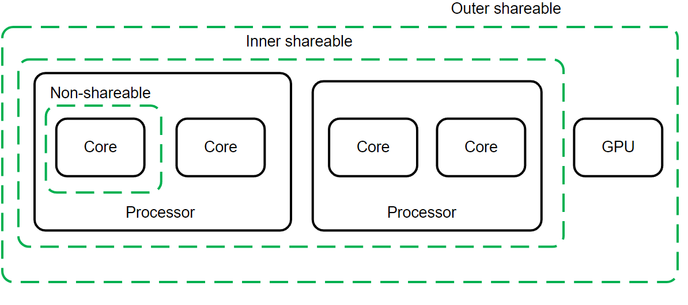
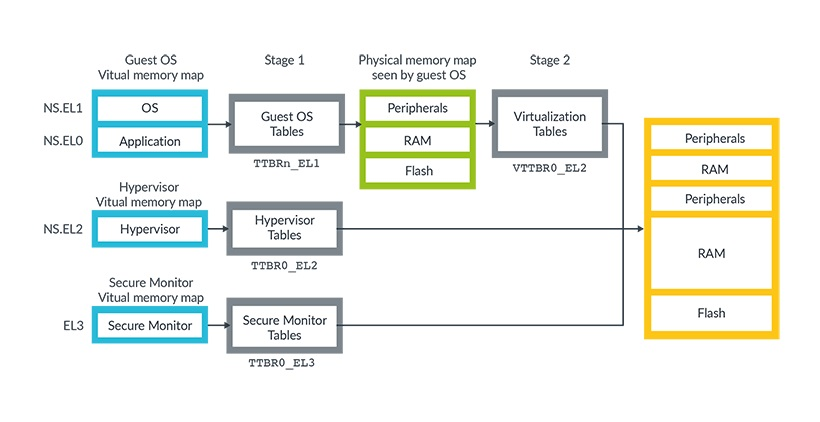
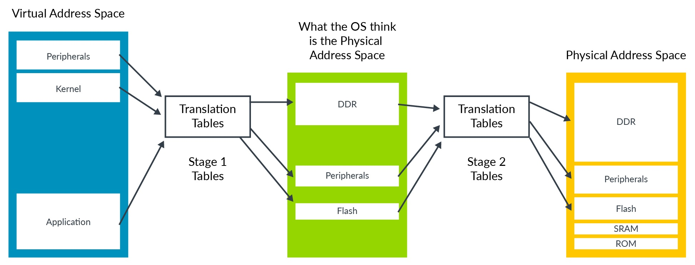
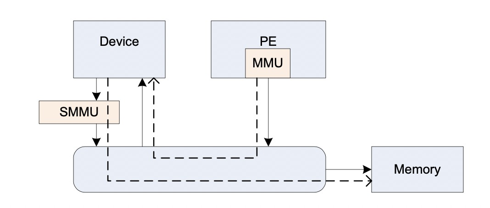
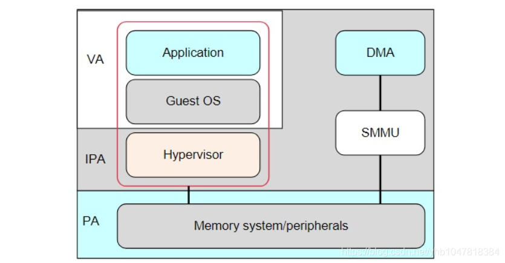

============
Armv8-a PG
============

:Date:   2022-03-23 00:57:00

Fundamentals of Armv8
==========================

参考手册
------------

1. arm-pg `Cortex-A Series Programmer's Guide for ARMv8-A <https://developer.arm.com/documentation/den0024/a>`__

   :download:`ARMv8-A-Programmer-Guide <../files/arm/ARMv8-A-Programmer-Guide.pdf>`

异常级别EL
-----------
1. `ARM Cortex-A Series Programmer's Guide for ARMv8-A  <https://developer.arm.com/documentation/den0024/a/Fundamentals-of-ARMv8>`__

Exception Level

.. figure:: ../images/aarch64_exception_levels_2.png

    aarch64_exception_levels_2

1. 提高EL即提高软件的执行特权；
2. 异常exception需要在更高的EL下处理，故EL0下不能处理异常；
3. ERET 从异常返回，但不能返回到更高的EL；
4. 只有EL3返回时才能实现安全态和非安全态切换。

各级别EL的含义：

1. EL0： 就是用户空间，在Noraml world中比如运行的应用程序，在Secure world就是TA，Trust Application
2. EL1：运行操作系统，Noramal World比如Linux操作系统，或者WInce操作系统。在Secure World则就是Trusted OS，比如高通的QSEE, 开源的OP-TEE，豌豆荚的TEE等
3. EL2：ARM为了支持虚拟化，设计的Hypervisor层，只有在Noraml world使用。
4. EL3：Secure Moniter的作用是用于Noraml world和Secure world切换使用。当noraml world想要访问Secure world需要发送SMC指令进入Secure Moniter层，然后进入到Secure world

执行状态execution stat
-----------------------

1. aarch64状态： A64指令集，64位general-purpose registers，trusted OS在EL1;
2. aarch32状态： A32指令集，32位，trusted OS在EL3。

.. figure:: ../images/mov_betw_aarch64_aarch32.png

    mov_betw_aarch64_aarch32

ARM内存管理与cache
========================

cache shareable domain
---------------------------
1. `(Cacheable and shareable memory attributes) ARM Cortex-A Series Programmer's Guide for ARMv8-A <https://developer.arm.com/documentation/den0024/a/Memory-Ordering/Memory-attributes/Cacheable-and-shareable-memory-attributes>`__
2. `有关Non-cacheable,,Cacheable, non-shareable,inner-shareable,outer-shareable的理解  <https://blog.csdn.net/weixin_42135087/article/details/121117593>`__
3. `(Cache coherency) ARM Cortex-A Series Programmer's Guide for ARMv8-A  <https://developer.arm.com/documentation/den0024/a/Multi-core-processors/Cache-coherency?lang=en>`__

``Memory caching`` can be separately controlled through inner and outer attributes, for multiple levels of cache. 

   
   Cache_Sharable_Domain

共享域（shareability domains.），包含以下几种：

1. Inner shareable，意味着它适用于整个内部可共享域。这表示该domain内的处理器之间可以相互share数据。一个系统可以有多个inner shareable domains，并且当某个操作影响到其中一个inner shareable domain时，它并不会影响到其它的inner shareable domain。
2. Outer shareable，意味着它适用于内部可共享和外部可共享域。一个outer shareable domain可以由一个或多个inner shareable domain组成，并且当一个操作影响到outer shareable domain时，也会影响到其下所有的inner shareable domain。
3. Non-shareable，表示相关区域只能给指定的处理器访问。
4. Full System，包含全部处理器。

Arm address space
-------------------
1. `(Address-spaces) Learn the architecture: AArch64 memory management  <https://developer.arm.com/documentation/101811/0102/Address-spaces?lang=en>`__
2. `(Stage 2 translation) Learn the architecture: AArch64 Virtualization  <https://developer.arm.com/documentation/102142/0100/Stage-2-translation#:~:text=The%20address%20space%20that%20the,Physical%20Address%20(IPA)%20space.>`__

   
   Address_spaces_in_Armv8-A

   
   va-to-ipa-to-pa-address-translation.png

1. Stage 1 translation: OS，通过traslation table将虚拟地址空间转换为IPA(Intermediate Physical Address Space)。
2. Stage 2 translation: hyperviosr控制对应vm级别可使用的内存。ensure that a VM can only see the resources that are allocated to it

vmid和ASID
~~~~~~~~~~~~~~~
VMID与VM关联，ASID与Appliation关联。

TLB entries can also be tagged with an Address Space Identifier (ASID). 
An application is assigned an ASID by the OS, and all the TLB entries in that application are tagged with that ASID.

Each VM is assigned a virtual machine identifier (VMID). 
The VMID is used to tag translation lookaside buffer (TLB) entries, to identify which VM each entry belongs to. 

ARM内存屏障
-----------
1. arm-asm 3.37
2. https://developer.arm.com/documentation/dui0489/c/CIHGHHIE
3. https://developer.arm.com/documentation/den0024/a/Memory-Ordering

由于一些编译器优化或者CPU设计的流水线乱序执行，导致最终内存的访问顺序可能和代码中的逻辑顺序不符，所以需要增加内存屏障指令来保证顺序性。

ARM平台上存在三种内存屏障指令：

1. DMB{cond} {option}：数据内存屏障。只作用于 `显式内存访问指令`，保证dmb前的显式内存访问指令先执行完。
   
   all explicit memory accesses that appear in program order before the DMB instruction are observed before any explicit memory accesses that appear in program order after the DMB instruction. 
   
   只影响内存访问指令的顺序，保证在此指令前的内存访问完成后才执行后面的内存访问指令。

2. DSB{cond} {option}：数据同步屏障。一种特殊的dmb，作用于所有指令，保证dsb之前的指令执行完之后才执行dsb之后的指令。
   
   No instruction in program order after this instruction executes until this instruction completes.

   dsb指令完成的条件包括：All Cache, Branch predictor and TLB maintenance operations before this instruction complete.

   ``比DMB更加严格``，保证在此指令前的 `内存访问/cache操作/TLB维护/分支预测指令` 都完成，然后才会执行后面的所有指令。

3. ISB{cond} {option}：指令同步屏障。清空cpu流水线。
   
   flushes the pipeline in the processor, so that all instructions following the ISB are fetched from cache or memory, after the instruction has been completed
   
   ensures that the effects of context altering operations executed before the ISB instruction are visible to the instructions fetched after the ISB.

   最为严格的一种，冲洗流水线和预取buffer，然后才会从cache或者内存中预取ISB后面的指令。保证上下文切换指令对isb后可见。

   
option的选择：

1. SY：完整的指令操作
2. ST：只等待store操作完成，就继续执行
3. ISH：该操作只针对inner shareable domain生效
4. ISHST：ISH+ST
5. NSH:该操作只针对outer to unification生效
6. NSHST：NSH+ST
7. OSH：该操作只针对outer shareable domain生效
8. OSHST：OSH+ST

   
context altering operations
~~~~~~~~~~~~~~~~~~~~~~~~~~~~~~
ensures that the effects of context altering operations, 
such as changing the ASID,
or completed TLB maintenance operations, 
or branch predictor maintenance operations, 
as well as all changes to the CP15 registers,
executed before the ISB instruction are visible to the instructions fetched after the ISB.

Linux内核实现
~~~~~~~~~~~~~~

arch/arm/include/asm/barrier.h
::

   #if __LINUX_ARM_ARCH__ >= 7
   #define isb(option) __asm__ __volatile__ ("isb " #option : : : "memory")
   #define dsb(option) __asm__ __volatile__ ("dsb " #option : : : "memory")
   #define dmb(option) __asm__ __volatile__ ("dmb " #option : : : "memory"

   #ifdef CONFIG_ARCH_HAS_BARRIERS
   #include <mach/barriers.h>
   #elif defined(CONFIG_ARM_DMA_MEM_BUFFERABLE) || defined(CONFIG_SMP)
   #define mb()		do { dsb(); outer_sync(); } while (0)
   #define rmb()		dsb()
   #define wmb()		do { dsb(st); outer_sync(); } while (0)
   #define dma_rmb()	dmb(osh)
   #define dma_wmb()	dmb(oshst)

由上面的宏定义可知，对于指令限制的严格程度：

::

   mb()>rmb()>wmb()>smb_mb()=smb_rmb()>smb_wmb()

smp相关的内存屏障都加入了ish选项，也就是限制指令只针对inner shareable domain。

单向内存屏障
~~~~~~~~~~~~~
1. `Arm64内存屏障_Roland_Sun的博客-CSDN博客_arm 内存屏障  <https://blog.csdn.net/Roland_Sun/article/details/107468055>`__

ARMv8.1还提供了带Load-Acquire或Store-Release单向内存屏障语义的指令。

1. Load-Acquire：这条指令之后的所有 ``加载和存储操作一定不会被重排序到这条指令之前``；
2. Store-Release：这条指令之前的所有加载和存储才做一定不会被重排序到这条指令 ``之后``；
3. 数据内存屏障DMB = Load-Acquire + Store-Release

指令形式：

1. Store-Release：基本指令后面加上L；
2. Load-Acquire：基本指令后面加上A；

SMMU
--------
1. `ARM SMMU的原理与IOMMU   <https://blog.51cto.com/u_15155099/2767161>`__
2. `ARM SMMU学习笔记_Hober_yao的博客-CSDN博客_smmu  <https://blog.csdn.net/yhb1047818384/article/details/103329324>`__
3. :download:`smmu v3 <../files/arm/ARM_IHI_0070_D_b_System_Memory_Management_Unit_Architecture_Specification.pdf>`

SMMU可以为ARM架构下实现虚拟化扩展提供支持。它可以和MMU一样，提供stage1转换（VA->IPA）, 或者stage2转换（IPA->PA）,或者stage1 + stage2转换（VA->IPA->PA）的灵活配置。

   System Memory Management Unit

1. DMA需要连续的地址.
2. 虚拟化： 在虚拟化场景， 所有的VM都运行在中间层hypervisor上，每一个VM独立运行自己的OS（guest OS）,Hypervisor完成硬件资源的共享, 隔离和切换。
    但guest VM使用的物理地址是GPA, 看到的内存并非实际的物理地址HPA，因此Guest OS无法正常的将连续的物理地址分给DMA硬件。

因此，为了支持I/O透传机制中的DMA设备传输，而引入了IOMMU技术（ARM称作SMMU）。

   虚拟化+DMA -> SMMU
