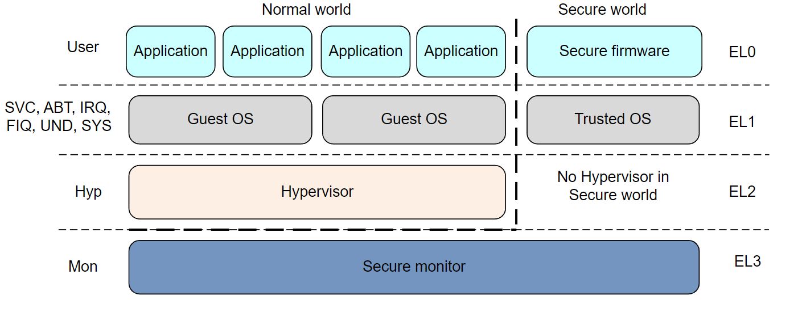
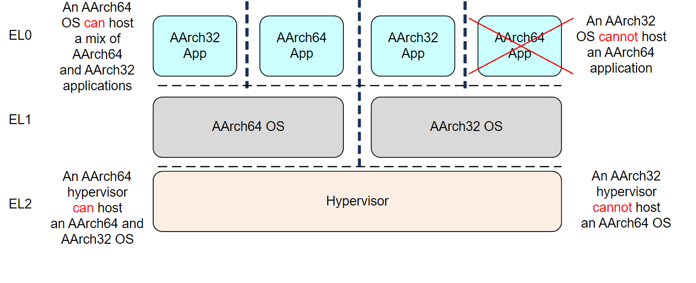

============
Armv8-a PG
============

:Date:   2022-03-23 00:57:00

Fundamentals of Armv8
==========================

参考手册
------------

1. arm-pg `Cortex-A Series Programmer's Guide for ARMv8-A <https://developer.arm.com/documentation/den0024/a>`__

   :download:`ARMv8-A-Programmer-Guide <../files/arm/ARMv8-A-Programmer-Guide.pdf>`

异常级别EL
-----------
Exception Level

    aarch64_exception_levels_2

1. 提高EL即提高软件的执行特权；
2. 异常exception需要在更高的EL下处理，故EL0下不能处理异常；
3. ERET 从异常返回，但不能返回到更高的EL；
4. 只有EL3返回时才能实现安全态和非安全态切换。

执行状态execution stat
-----------------------

1. aarch64状态： A64指令集，64位general-purpose registers，trusted OS在EL1;
2. aarch32状态： A32指令集，32位，trusted OS在EL3。

    mov_betw_aarch64_aarch32

