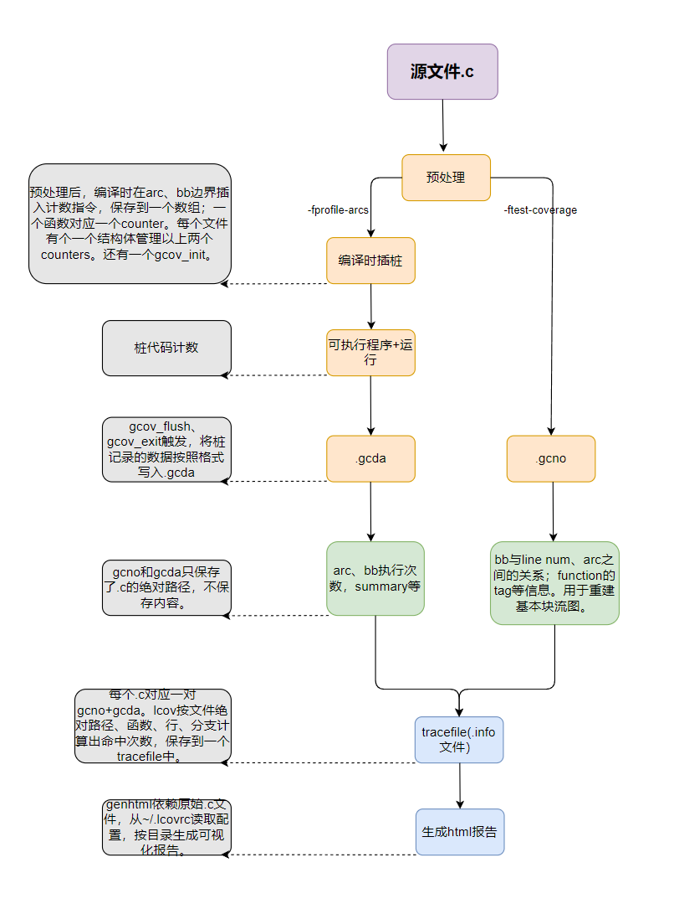

====================
C
====================

:Date:   2021-09-09 00:37:13

1. `用C语言实现面向对象编程OOP <https://mp.weixin.qq.com/s/Vj31M2q0H5eeJwMhvDyt6A>`__
2. `C语言实现面向对象的原理 <https://mp.weixin.qq.com/s/b9IXQ8Hbh-8ejmU010sWiA>`__

参考链接
==========
1. 在线gdb：https://www.onlinegdb.com/myfiles
2. 在线汇编：https://godbolt.org/

语法知识
=========
The C Programming Language 2ed.pdf

extern
---------
1. static： The static declaration, applied to an external variable or function, limits the scope of
that object to the rest of the source file being compiled.
2. extern： Functions themselves are always external, because C does not allow functions to be defined inside other functions

inline关键字
----------------
☆☆ 参考： https://gcc.gnu.org/onlinedocs/gcc/Inline.html 6.45 An Inline Function is As Fast As a Macro

1. 减少 function-call overhead
2. 编译时优化常数入参,减少代码体积。
3. 不适合inline: 变参函数、调用alloca栈分配函数、使用goto/setjump等跳转指令

::

  # gcc -std=gnu99 -Og inline.c -o inline

   /tmp/ccr0JbZ0.o: In function `main':
   inline.c:(.text+0xa): undefined reference to `fa'
   collect2: error: ld returned 1 exit status

   # cat inline.c

   #include <stdio.h>
   inline int fa(int a); // 显式声明。隐私声明则认为没有inline。
   inline int fa(int a)
   {
       printf("%d\n", a);
       printf("%d\n", a+1);
       return a;
   }

   int main()
   {
       int var = 1;
       fa(var);
       return 0;
    }

          
查看inline.o，发现 main通过call调用fa，.symtab中有fa(UND)，而.text中无单独的fa。

只有在main调用external函数fa + inline声明使得.text无fa时才会符号解析失败。

影响是否真实inline的因素: ``_always_inline/inline -> -On -> -std=gnu** -> static -> asm行数 -> 声明(c99)/定义(c90)形式(inline、extern等)``

::

    1. __attribute__(__always_inline)☆ : fa真实inline插入到main。inline✔

    2. inline☆  -> 无-On优化: 普通函数,inline完全不起作用。
    3.                       -> static: 限制了fa不会在.symtab中。符号表call✔
    4.                       -> external、非static: fa在.symtab。位置偏移call✔
                 -> 有-On优化:如下
    5. inline+On: 
    6.           -> c89/c90 ☆   -> static :  fa真实inline插入。inline✔
    7.                                        -> static定义+非static声明: 不冲突,当作了两个不同函数。
    8.                           -> 非static  -> 显式extern定义 : .text不保存fa。inline✔
    9.                                        -> 非显式extern: .text一直保存fa。 call✔ 
    10.          -> c99/c11/c17☆ -> static : fa真实inline插入。inline✔
    11.                                        -> static定义+非static声明: 类型冲突。
    12.                           -> 非static  -> 非static定义+static声明: 效果通inline✔
    13.                                        -> fa汇编行数少(约七八行): inline✔
    14.                                        -> fa汇编行数多: main中调用fa 
    15.                                                   -> inline声明fa : .text不保存fa , ld符号解析失败。 ★★
    16.                                                   -> 非inline声明/隐式声明: 默认为external, .text保存fa, ld成功。call✔
    17.                                                   -> 若声明使用static

    未特别指出参数的均为定义处/或定义声明相同。 
    
    这里static/inline使用时的类型取决于声明。

其它相关编译选项
~~~~~~~~~~~~~~~~~
https://gcc.gnu.org/onlinedocs/gcc/Optimize-Options.html

1. -fkeep-inline-functions: inline+ On + static 时保留fa 代码段
2. -finline-functions : 足够小的函数则inline。 O2打开。
3. -finline-functions-called-once: 被调用一次的static函数。 O1打开。

位域、联合体与大小端
---------------------
1. `简单讲解C/C++中大小端及其对位域的影响 - FranzKafka Blog  <https://coderfan.net/big-endian-and-little-endian-in-c-or-c-plus.html>`__

如果是 ``大端模式，其位域排列顺序对应在内存中由高bit指向低bit``，而小端模式则相反。

::

    #include <stdio.h>

   typedef struct{
       int a;       int b;       int c;
   }S_a;

   typedef struct{
       int a:4;       int b:5;       int c:6;       int d:7;
       // int e:6;
   }S_b;

   int main ()
   {
       S_a s_a;       s_a.a = 1;       s_a.b = 2;       s_a.c = 3;
       S_b s_b;       s_b.a = 1;       s_b.b = 2;       s_b.c = 3;       s_b.d = 5;
       // s_b.e = 6; 

       int a[3];       a[0]=1;       a[1]=2;       a[2]=3;

       printf("struct: %p %p %p\n", &s_a.a, &s_a.b, &s_a.c);
       printf("array:  %p %p %p\n", &a[0], &a[1], &a[2]);
       int* a2 = &s_b;
       printf("bitfield:0x%x \n", a2[0]);

       return 0;
   }

::
    
      x86小端结果:
      struct: 0x7ffea082ac00 0x7ffea082ac04 0x7ffea082ac08
      array:  0x7ffea082ac0c 0x7ffea082ac10 0x7ffea082ac14
      bitfield:0x28621 

      arrch64_be大端端结果:
      struct和array的成员均是地址逐渐增长，与x86一直
      bitfiesd:0x110617ff

大小端读取的bitfield对比：(aarch64_be剩余未使用bit为1，x86为0)

::

                    |a:4=1|b:5=2 |c:6=3  |d:7=5     |剩余10bits为1
    大端0x110617ff： 0001  0001  0000  0110  0001  0111  1111  1111

                    |剩余10bits为0 |d:7=5     |c:6=3 |b:5=2  |a:4=1|       
    小端0x00028621： 0000  0000  0000  0010  1000  0110  0010  0001

可得： ``大端时bitfiled先往大地址存数据``，小端先往小地址存数据。 位域本身的bits无大小端。

位域的存储顺序取决于实现
~~~~~~~~~~~~~~~~~~~~~~~~~~~~~~~~~
1. `Bit field extract with struct and endianness in C - Stack Overflow  <https://stackoverflow.com/questions/54223407/bit-field-extract-with-struct-and-endianness-in-c>`__
2. `EXP11-C. Do not make assumptions regarding the layout of structures with bit-fields - SEI CERT C Coding Standard - Confluence  <https://wiki.sei.cmu.edu/confluence/display/c/EXP11-C.+Do+not+make+assumptions+regarding+the+layout+of+structures+with+bit-fields>`__
3. 6.7.2 Type specifiers, paragraph 11 of the C Standard:

以上两处参考文献均指出：

1. 存储顺序：The order of allocation of bit-fields within a unit (high-order to low-order or low-order to high-order) is ``implementation-defined``. 
2. 对齐：The alignment of the addressable storage unit is unspecified.

推测(××)：

1. 大小端按照bit全部反序(而不是按照Bytes),这样可兼容 Byte和bitfield (屏蔽了内部bit顺序)。
2. 其它数据类型(int/char等)Byte读取，计算机对我们屏蔽了Byte内部bit顺序的差异，所以平常可按Byte理解。
3. bitfield内部bit也全部反序，读写入时计算机仍然屏蔽了bitfield内部bit的顺序差异
4. 如何验证? `C语言面试题——位域及大小端模式的理解 - 云+社区 - 腾讯云  <https://cloud.tencent.com/developer/article/1692952>`__

位域结构体顺序
~~~~~~~~~~~~~~~~
位域在大端和小端系统上的定义顺序需要相反，这样无论在大小端系统，按bitfield保存值后，按整体读出来的值是一样的。。(见iphdr)

`Linux v5.17-rc8 - include/uapi/linux/ip.h  <https://sbexr.rabexc.org/latest/sources/c7/124a3bc7fedb4c.html#000560010006a001>`__

::

   struct iphdr {
   #if defined(__LITTLE_ENDIAN_BITFIELD)
   	__u8	ihl:4,
   		version:4;
   #elif defined (__BIG_ENDIAN_BITFIELD)
   	__u8	version:4,
     		ihl:4;
   #else
   #error	"Please fix <asm/byteorder.h>"
   #endif
   	__u8	tos;
   	__be16	tot_len;
   	__be16	id;
   	__be16	frag_off;
   	__u8	ttl;
   	__u8	protocol;
   	__sum16	check;
   	__be32	saddr;
   	__be32	daddr;
   	/*The options start here. */
   };

优秀项目学习
=================

cjson
--------
待总结。

coreutils
-----------
1. `Decoded: GNU coreutils – MaiZure's Projects  <http://www.maizure.org/projects/decoded-gnu-coreutils/index.html>`__

This resource is for novice programmers exploring the design of command-line utilities.

ahttpd
--------
https://sqlite.org/althttpd/doc/trunk/althttpd.md

gcov
=======
1. `GCC Coverage代码分析 <https://blog.csdn.net/livelylittlefish/category_826830.html>`__
2. `gcov代码覆盖率测试-原理和实践总结 <https://blog.csdn.net/yanxiangyfg/article/details/80989680>`__
3. https://github.com/yanxiangyfg/gcov 与上个文章中汇编不一样，因为是32位系统？

gcov原理
----------
1. ☆☆  gcov原理 https://github.com/QuanjunZhang/gcov
2. `Linux平台代码覆盖率测试工具GCOV相关文件分析_学习，思考，记录，分享。-CSDN博客  <https://blog.csdn.net/livelylittlefish/article/details/6321909>`__
3. `Lcov生成的Info文件格式分析_BruceXY的博客-CSDN博客  <https://blog.csdn.net/BruceXY/article/details/17139777>`__

    gcov原理

汇编伪指令
~~~~~~~~~~~~~~~~
gcc生成的汇编文件中，供编译器使用。不出现在在最终可执行程序。

1. https://sourceware.org/binutils/docs/as/Pseudo-Ops.html 
2. 或https://ftp.gnu.org/old-gnu/Manuals/gas-2.9.1/html_chapter/as_7.html

覆盖率统计原理
~~~~~~~~~~~~~~~~~~~
用 基本块BB 和 跳转ARC 计数，结合程序流图来实现代码覆盖率统计

1. 基本块BB：BB为执行次数相同的一段代码，一般为 多个顺序语句+跳转语句组成，有条件的跳转则会产生分支。

2. ARC：从一个BB到另一个BB的跳转。

3. 程序流图：BB为节点，ARC即弧/有向边。只需要知道部分BB和ARC的执行次数，即可推断出所有语句和分支的执行次数。

.. figure:: ../images/gcov_arc_bb.png

    gcov程序流图

.. figure:: ../images/gcov_stub.png

    gcov汇编插桩

gcov使用
----------
开启gcov
~~~~~~~~~~~
在源码编译参数中加入-fprofile-arcs -ftest-coverage

* -ftest-coverage：在编译的时候产生.gcno文件，它包含了重建基本块图和相应的块的源码的行号的信息。
* -fprofile-arcs：在运行编译过的程序的时候，会产生.gcda文件，它包含了弧跳变的次数等信息。

生成gcda
~~~~~~~~~~~
程序exit时调用 exit handlers ( __gcov_exit() -> __gcov_flush() ) ，将覆盖率数据写到gcda。

生成报告
~~~~~~~~~~
1. 文件 ``~/.lcovrc`` 可配置genhtml颜色阈值。
2. lcov对应使用的是gcov，gcov版本需和编译时gcc版本一致。

$ lcov -c -d . -o helloworld_gcov.info
$ genhtml -o 111 helloworld_gcov.info

tracefile info文件
-------------------
::

   *.info文件包含一个或多个源文件所对应的覆盖率信息，一个源文件对应一条“记录”，“记录”中的详细格式如下：

   TN: <Test name> 表示测试用例名称，即通过geninfo中的--test-name选项来命名的测试用例名称，默认为空；

   SF: <File name> 表示带全路径的源代码文件名；

   FN: <函数启始行号>, <函数名>; <函数有效行总数>; <函数有效行总数中被执行个数>

   FNDA: <函数被执行的次数>, <函数名>; <函数有效行总数>; <函数有效行总数中被执行个数>

   FNF: <函数总数>

   FNH: <函数总数中被执行到的个数>

   BRDA: <分支所在行号>, <对应的代码块编号>, <分支编号>, <执行的次数>

   BRF: <分支总数>

   BRH: <分支总数中被执行到的个数>

   DA: <代码行号>, <当前行被执行到的次数>

   LF: < counts> 代码有效行总数

   LH: <counts> 代码有效行总数中被执行到的个数

   end_of_record 一条“记录”结束符

gcno和gcda文件格式
----------------------

增量统计Coverage
--------------------
1. 可使用工具：diff-cover、addlcov、gcovr；
2. 自己实现：以git diff 中的 **文件路径和行号** 在tracefile中查找对应文件和行覆盖的数据。

mock测试
===============

mock外部依赖接口，测试代码逻辑功能。

mock工具的作用是指定函数的行为（模拟函数的行为）。可以对入参进行校验，对出参进行设定，还可以指定函数的返回值。

Any symbols external to the module being tested should be mocked - replaced with functions that return values determined by the test。

the unit testing is still valid since its goal is to test the logic of a code modules at a functional level

cmockery
----------
  
1. https://github.com/google/cmockery   :download:`cmockery-0.1.2.zip <../files/code/cmockery-0.1.2.zip>`
2. `cmockery/user_guide.md at master · google/cmockery  <https://github.com/google/cmockery/blob/master/docs/user_guide.md#MockFunctions>`__

特性：异常处理、断言、支持多种失败条件、动态内存分配管理、mock函数、入参检查。

小巧，不依赖其它库，侵入性小。

C语言实现的cmockery框架，自然受到 **链接符号解析** 的限制，即同一个elf文件不能存在两个相同符号名的函数。

因此要求 **源码有较好的层次结构** ，被mock的接口最好在单独的文件中(不编译)；否则需考虑在正式源代码中使用UNIT_TESTING宏。

cmockery示例
~~~~~~~~~~~~~~~~
``will_return将桩值入队(对应func)，在mock_func中调用mock() ，会按顺序在队列中找到一个桩值并返回。可实现mock出参、返回值。``

::

    // Mock query database function.
   unsigned int mock_query_database(
           DatabaseConnection* const connection, const char * const query_string,
           void *** const results) {
       *results = (void**)mock();
       return (unsigned int)mock();
   }

   void test_get_customer_id_by_name(void **state) {
       DatabaseConnection connection = {
           "somedatabase.somewhere.com", 12345678, mock_query_database
       };
       // Return a single customer ID when mock_query_database() is called.
       int customer_ids = 543;
       will_return(mock_query_database, &customer_ids);
       will_return(mock_query_database, 1);
       assert_int_equal(get_customer_id_by_name(&connection, "john doe"), 543);
   }

mockcpp
---------
1. `mockcpp/ChineseVersionManual.md at master · sinojelly/mockcpp  <https://github.com/sinojelly/mockcpp/blob/master/docs/ChineseVersionManual.md>`__
2. `mockcpp/SimpleUserInstruction_zh.md at master · sinojelly/mockcpp  <https://github.com/sinojelly/mockcpp/blob/master/docs/SimpleUserInstruction_zh.md>`__

侵入式Mock
--------------
修改代码区的二进制机器码，直接实现跳转、return功能。

使用方便，功能较为单一，与架构相关。

1. 备份并直接修改原func，将func头部位置指令改为 return var;
2. 备份并直接修改原func，将func头部位置指令改为 jump mock_func。

arm64实现mock
~~~~~~~~~~~~~~~
arm64为定长8Bytes指令，一条指令无法覆盖所有返回值/函数偏移值(数值至少需64位)。

return指令：

jump指令：

x86-64实现mock
~~~~~~~~~~~~~~
变长指令，一条指令即可。

return指令：

jump指令：
