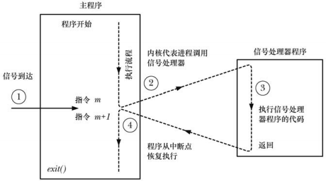

====================
Concurrency 
====================

:Date:   2021-07-31 13:37:13

并发编程
===========
1. 并发:系统支持两个或多个动作同时存在,不一定要同时执行。可以是多线程或单线程。
2. 并行:系统支持两个或多个动作同时执行。

多进程
-------

多路IO复用
----------

多线程
---------

多线程编程
============
进程与线程的去呗
----------------------
线程是一种对等关系：
 
pthread_create分析
-------------------
1. https://code.woboq.org/userspace/glibc/nptl/pthread_create.c.html#625
2. https://www.cnblogs.com/lidabo/p/5514100.html
3. `pthread_create源码分析 <https://blog.csdn.net/conansonic/article/details/77487925>`_
4. `GLIBC中NPTL线程实现代码阅读 <https://blog.csdn.net/hnwyllmm/article/details/45749063>`_

nptl
~~~~~~~~~
 NPTL (Native POSIX Threads Library) is the GNU C library POSIX
       threads implementation

joinable&detached
~~~~~~~~~~~~~~~~~~~
1. joinable: 线程默认状态，可被其它线程回收和杀死(pthread_join)，并且在被其它线程回收前其资源不会释放。
2. detached: pthread_attr_setdetachstate设置，不可被其它线程回收和杀死，在线程结束时系统会自动回收资源。

如何避免detached线程在pthread_create返回tid前结束，其tid和资源被释放后并被其它线程复用，
从而使pthread_create得到错误地返回值？ 
使用pthread_cond_timewait+pthread_cond_signal。

源码分析
~~~~~~~~~~~~

pthread_t
~~~~~~~~~~~~~~~~~~~
1. https://stackoverflow.com/questions/33285562/why-and-in-what-sense-is-pthread-t-an-opaque-type

::

   /* Thread identifiers. The structure of the attribute type is not
      exposed on purpose.  */
   typedef unsigned long int pthread_t;

   in pthreadtypes.h

无锁编程
========

1. `无锁队列的实现 <https://coolshell.cn/articles/8239.html>`__\ ：？？
2. `An Introduction to Lock-Free Programming <https://preshing.com/20120612/an-introduction-to-lock-free-programming/>`__:有图！
3. `ARM体系架构下的同步操作 <https://www.cnblogs.com/shangdawei/p/3915735.html>`__

处理器可能会对输入代码进行乱序执行（Out-Of-OrderExecution）优化，
处理器会在计算之后将乱序执行的结果重组，保证该结果与顺序执行的\ **结果一致**\ ，
但并不保证程序中各个语句计算的先后顺序与输入代码中的顺序一致。

因此，如果存在一个计算任务依赖另一个计算任务的\ **中间结果**\ ，那么其顺序性并不能靠代码的先后顺序来保证。

原子操作的使用
--------------

gcc built-in
~~~~~~~~~~~~

`Built-in functions for atomic memory
access <https://gcc.gnu.org/onlinedocs/gcc-4.1.2/gcc/Atomic-Builtins.html>`__

gcc从4.1.2提供了\_\ *sync*\ \*系列的built-in函数，用于提供加减和逻辑运算的原子操作。

C11支持原子变量\ `Atomic
types <https://en.cppreference.com/w/c/language/atomic>`__\ 和\ `Atomic
operations library <https://en.cppreference.com/w/c/atomic>`__

linux kernel
~~~~~~~~~~~~

`原子性操作atomic_t <https://blog.csdn.net/a775992553/article/details/8797474>`__

https://www.cnblogs.com/jyfyonghu/p/11256608.html

内核中汇编实现原子操作。架构路径下的：\ `arch/x86/include/asm/atomic.h <https://sbexr.rabexc.org/latest/sources/b6/c49b0975774d96.html>`__
。

同时提供原子变量（实际上就是int），用作原子操作的参数。

X86 CAS实现
------------

X86对应一个原子命令cmpxchgl，arm则使用内存屏障dmb+原子加载ldxr+原子存贮stlxr
实现。

::

   #include <stdatomic.h>

   int main()
   {

       int a = 10 ;
       int b = __sync_val_compare_and_swap (&a, 10, 9);
   //    int c = __sync_val_compare_and_swap (&a, 9, 8);

       return 0;
   }

汇编

::

   pushq   %rbp
   movq    %rsp, %rbp
   movl    $10, -8(%rbp)
   movl    $10, %eax
   movl    $9, %edx
   lock cmpxchgl   %edx, -8(%rbp)
   movl    %eax, -4(%rbp)
   movl    $0, %eax
   popq    %rbp

arm64原子操作
-------------------
1. `ARMv8 架构与指令集.学习笔记 <https://www.cnblogs.com/lvdongjie/p/6644821.html>`__
2. `ARMv8.1平台下新添加原子操作指令_  <https://blog.csdn.net/Roland_Sun/article/details/107552574>`__
3. `ARM64+Linux5.0 自旋锁  <https://blog.csdn.net/zhoutaopower/article/details/117966631>`__
4. `ARM平台下独占访问指令LDREX和STREX的原理与使用详解  <https://blog.csdn.net/Roland_Sun/article/details/47670099>`__

armv8.1指令集添加了不少新功能，包括lse(large system extension)——包括许多原生原子操作指令。

在这之前必须使用LL/SC操作来实现原子操作。

LL/SC
~~~~~~~~
Load-Link（LL）和Store-Conditional（SC）。

LL/SC操作本质上是 ``很多CPU核去抢某个内存变量的独占访问``，在核数量日渐增长的情况下会造成性能问题。

LL操作返回一个内存地址上当前存储的值，后面的SC操作，会向这个内存地址写入一个新值，
但是只有在这个内存地址上存储的值， ``从上个LL操作开始直到现在都没有发生改变的情况下``，
写入操作才能成功，否则都会失败。

对于ARM平台来说，也在硬件层面上提供了对LL/SC的支持，LL操作用的是LDREX指令，SC操作用的是STREX指令。

LDXR
~~~~~~~
LDXR (load exclusive register 和STXR （store exclusive register）及其变种指令。

stlxr失败后会重试。

::

           .arch armv8-a

   main:
   .LFB0:

           sub     sp, sp, #16
           mov     w0, 10
           str     w0, [sp, 8]
           add     x1, sp, 8
           mov     w2, 9
   .L3:
           ldxr    w0, [x1]
           cmp     w0, 10
           bne     .L4
           stlxr   w3, w2, [x1]
           cbnz    w3, .L3
   .L4:
           dmb     ish
           str     w0, [sp, 12]
           mov     w0, 0
           add     sp, sp, 16
           .cfi_def_cfa_offset 0
           ret
           .cfi_endproc
   .LFE0:
           .size   main, .-main
           .ident  "GCC: (Debian 8.3.0-6) 8.3.0"
           .section        .note.GNU-stack,"",@progbits

LSE指令
~~~~~~~~~~
LD/ST:ADD/SET/CLR/EOR/SMAX/UMAX、SWP、CAS 

ST打头的指令和LD打头的指令，基本功能上没区别。

只不过LD打头的指令会把在执行该原子指令之前内存中的值存入第二个参数指定的寄存器中，ST打头的指令则少一个参数，没有此功能。

默认有32位和64位两种形式。可加后缀H（Halfword）、B（Byte）。

::

   LDADD <Ws>, <Wt>, [<Xn|SP>]
   LDADD <Xs>, <Xt>, [<Xn|SP>]
    
   STADD <Ws>, [<Xn|SP>]
   STADD <Xs>, [<Xn|SP>]

staddh与spinlock的实现
~~~~~~~~~~~~~~~~~~~~~~~~
1. `Arm A64 Instruction Set Architecture  <https://developer.arm.com/documentation/ddi0596/2021-12/Base-Instructions/STADD--STADDL--Atomic-add-on-word-or-doubleword-in-memory--without-return--an-alias-of-LDADD--LDADDA--LDADDAL--LDADDL-?lang=en>`__

Atomic add on halfword in memory, without return, atomically loads a 16-bit halfword from memory, adds the value held in a register to it, and stores the result back to memory.

::

   static inline void arch_spin_lock(arch_spinlock_t *lock)
   {
   	unsigned int tmp;
   	arch_spinlock_t lockval, newval;
    
   	asm volatile(
   	/* Atomically increment the next ticket. */
   	ARM64_LSE_ATOMIC_INSN(
   	/* LL/SC */
   "	prfm	pstl1strm, %3\n"
   "1:	ldaxr	%w0, %3\n"
   "	add	%w1, %w0, %w5\n"
   "	stxr	%w2, %w1, %3\n"
   "	cbnz	%w2, 1b\n",
   	/* LSE atomics */
   "	mov	%w2, %w5\n"
   "	ldadda	%w2, %w0, %3\n"
   	__nops(3)
   	)
   	/* Did we get the lock? */
   "	eor	%w1, %w0, %w0, ror #16\n"
   "	cbz	%w1, 3f\n"
   	/*
   	 * No: spin on the owner. Send a local event to avoid missing an
   	 * unlock before the exclusive load.
   	 */
   "	sevl\n"
   "2:	wfe\n"
   "	ldaxrh	%w2, %4\n"
   "	eor	%w1, %w2, %w0, lsr #16\n"
   "	cbnz	%w1, 2b\n"
   	/* We got the lock. Critical section starts here. */
   "3:"
   	: "=&r" (lockval), "=&r" (newval), "=&r" (tmp), "+Q" (*lock)
   	: "Q" (lock->owner), "I" (1 << TICKET_SHIFT)
   	: "memory");
   }
    
   static inline void arch_spin_unlock(arch_spinlock_t *lock)
   {
   	unsigned long tmp;
    
   	asm volatile(ARM64_LSE_ATOMIC_INSN(
   	/* LL/SC */
   	"	ldrh	%w1, %0\n"
   	"	add	%w1, %w1, #1\n"
   	"	stlrh	%w1, %0",
   	/* LSE atomics */
   	"	mov	%w1, #1\n"
   	"	staddlh	%w1, %0\n"
   	__nops(1))
   	: "=Q" (lock->owner), "=&r" (tmp)
   	:
   	: "memory");
   }

ABA问题
---------

1. 进程P1在共享变量中读到值为A
2. P1被抢占了，进程P2执行
3. P2把共享变量里的值从A改成了B，再改回到A，此时被P1抢占。
4. P1回来看到共享变量里的值没有被改变，于是继续执行。

使用double-CAS解决。

ARM内存屏障
-----------

由于一些编译器优化或者CPU设计的流水线乱序执行，导致最终内存的访问顺序可能和代码中的逻辑顺序不符，所以需要增加内存屏障指令来保证顺序性。

ARM平台上存在三种内存屏障指令：

1. DMB{cond} {option}：数据内存屏障
   
   这种指令只影响到了内存访问指令的顺序，保证在此指令前的内存访问完成后才执行后面的内存访问指令。

2. DSB{cond} {option}：数据同步屏障
   
   ``比DMB更加严格``，保证在此指令前的内存访问指令/cache/TLB/分支预测指令都完成，然后才会执行后面的所有指令。

3. ISB{cond} {option}：指令同步屏障
   
   最为严格的一种，冲洗流水线和预取buffer，然后才会从cache或者内存中预取ISB后面的指令。

option的选择：

1. SY：完整的指令操作
2. ST：只等待store操作完成，就继续执行
3. ISH：该操作只针对inner shareable domain生效
4. ISHST：ISH+ST
5. NSH:该操作只针对outer to unification生效
6. NSHST：NSH+ST
7. OSH：该操作只针对outer shareable domain生效
8. OSHST：OSH+ST

内核实现

::

   #define dsb(option) __asm__ __volatile__ ("dsb " #option : : : "memory")
   #define dmb(option) __asm__ __volatile__ ("dmb " #option : : : "memory")

   #define mb()        do { dsb(); outer_sync(); } while (0)
   #define rmb()       dsb()
   #define wmb()       do { dsb(st); outer_sync(); } while (0)
   #define smp_mb()    dmb(ish)
   #define smp_rmb()   smp_mb()
   #define smp_wmb()   dmb(ishst)

由上面的宏定义可知，对于指令限制的严格程度：

::

   mb()>rmb()>wmb()>smb_mb()=smb_rmb()>smb_wmb()

smp相关的内存屏障都加入了ish选项，也就是限制指令只针对inner shareable
domain。

单向内存屏障
~~~~~~~~~~~~~
1. `Arm64内存屏障_Roland_Sun的博客-CSDN博客_arm 内存屏障  <https://blog.csdn.net/Roland_Sun/article/details/107468055>`__

ARMv8.1还提供了带Load-Acquire或Store-Release单向内存屏障语义的指令。

1. Load-Acquire：这条指令之后的所有 ``加载和存储操作一定不会被重排序到这条指令之前``；
2. Store-Release：这条指令之前的所有加载和存储才做一定不会被重排序到这条指令 ``之后``；
3. 数据内存屏障DMB = Load-Acquire + Store-Release

指令形式：

1. Store-Release：基本指令后面加上L；
2. Load-Acquire：基本指令后面加上A；

锁
==========

自旋锁、互斥量、信号量的实现原理。

`自旋锁 <http://www.wowotech.net/kernel_synchronization/460.html>`__ ;
`Linux 单/多处理器下的内核同步与实现---自旋锁 <https://zhuanlan.zhihu.com/p/115748853>`__

可重入、异步信号安全、多线程安全
================================
为了解决两个问题：多线程并发和信号中断。

可重入函数
-------------
被多线程调用时，不会引用任何共享数据。

1. 135个，apue figure 10.4；
2. 后缀_r的函数或对应的替代函数，SUSv3；
3. 自己实现。

异步信号安全函数
~~~~~~~~~~~~~~~~
函数可重入或无法被信号处理函数中断。

实际上与apue的可重入列表一致，tlpi 21.1.2。

仅当非信号安全函数被信号处理函数中断，并且在信号处理函数中调用该非信号安全函数时才是不安全的。

1. 确保信号处理函数代码可重入，且只调用信号安全函数；
2. 主程序调用不安全函数或操作信号处理函数可能更新的共享变量时，阻塞信号传递。

   信号处理器

线程安全函数
------------------
被多个并发线程反复调用时，一直产生正确的结果。

大部分linux函数都是线程安全的，只有少部分不安全(见apue figure 12.9、tlpi 31.1、csapp figure 12-41.)

线程不安全函数：

1. 不保护共享变量；
2. 保持跨越多个调用的状态的函数。只能重新实现，如rand；
3. 返回指向静态变量的指针的函数。大部分属于此类，可用加锁-复制来实现线程安全版本；
4. 调用线程不安全函数的函数（可能导致不安全）。
   若调用2中的函数，则必定不安全，若调用1、3则可使用互斥锁保护以实现线程安全。

线程安全函数包括：

1. 可重入函数；
2. 对临界区进行保护(解决的是并发问题)；