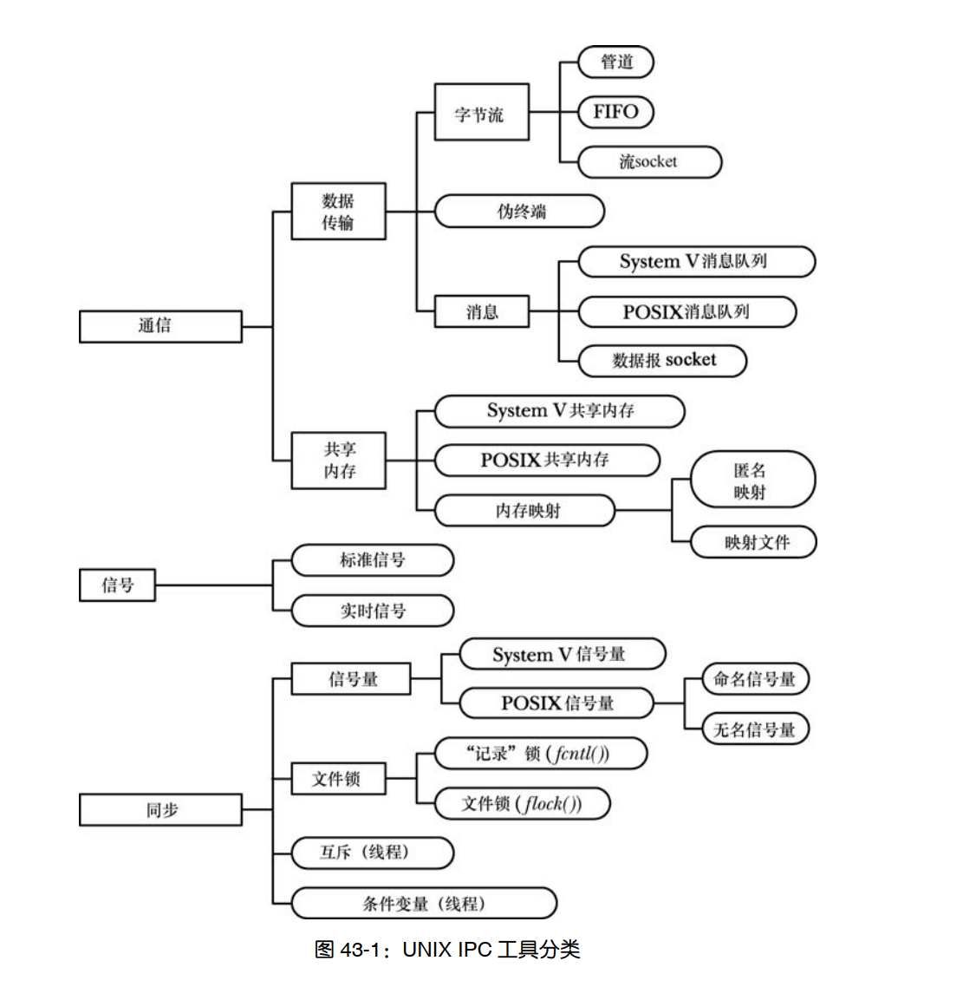

=====================
Embeded OS Concept
=====================

:Date:   2022-03-01 22:25:43

概念辨析
=========
核间中断IPI
------------

硬件线程也称之为逻辑核，将软件线程的任务分发在多个硬件线程上，通过负载均衡，可以分配在各个硬件线程之间。

``设备 ——> IRQ线 ——> IPC控制器 <——> CPUs``

多核cpu中，cpu核可通过ipc直接向目标cpu核发送中断信号，以使其执行特定操作——向ipc的IPI寄存器写入硬件线程ID、
中断向量、中断类型等，ipc则会通知目标cpu核挂起执行序列并跳转到isr。可使用共享内存进行核间通信。

NUMA
-------
非统一内存访问架构，Non-uniform memory access，简称NUMA。是一种为多处理器的电脑设计的内存架构。

在numa下，cpu访问本地内存比访问非本地内存/共享内存更快。（被共享的内存物理上是分布式的，所有这些内存的集合就是全局地址空间）

调度域
---------
1. `从CPU层次结构到调度域的建立  <https://arc.838281.xyz/archive/1646066823.474205/singlefile.html>`__

调度范围： ``Threads   ->   Cores    ->  Clusters`` 

共享：     ``所有Cache    LLC(一般为L3)    无``

在numa中则还需要考虑内存访问速度，为了减少对内存总线的访问竞争，可以将CPU分属于不同的Node节点，通常情况下，CPU只访问Node内的memory。

isolcpu将cpu隔离到SMP调度域之外,并同时使用cpu亲和性，以保证进程的实时性。

在arm等大小核架构中，还需要考虑性能和功耗平衡。

cpud_idle
-----------
idle线程。节能+等待可调度线程。

https://elixir.bootlin.com/linux/v3.1.6/source/arch/x86/kernel/process_64.c#L109

::

    * The idle thread. There's no useful work to be
    * done, so just try to conserve power and have a
    * low exit latency (ie sit in a loop waiting for
    * somebody to say that they'd like to reschedule)

僵尸线程、僵尸进程
----------------------

僵尸线程：以jionable创建而未被pthread_join的线程。

Each zombie thread consumes some system resources, 
and when enough zombie threads have accumulated, 
it will no longer be possible to create new threads (or processes).
   

::

    On my desktop (probably with various debug options enabled) the
   task_struct alone is 3272 bytes. (Obtained from
   /sys/kernel/slab/task_struct/object_size.)

   The mm_struct (512 bytes on my desktop) is a per-process structure, so
   needs to be counted separately. In a multithreaded process there is
   only one mm_struct regardless of the number of threads.

   However, there are additional overheads. There is also a per-task
   kernel stack (usually 4K) and the userspace stack
   (application-adjustable, but usually defaults to 2 or 4MB).

守护进程
~~~~~~~~~~~
1. `linux系统编程之进程（八）：守护进程详解及创建，daemon()使用 - mickole - 博客园  <https://www.cnblogs.com/mickole/p/3188321.html>`__

daemon()创建守护进程。

守护进程的父进程在fork出子进程后先行exit了，守护进程成为init进程收养的孤儿进程。

非交互式，通常周期性执行或等待事件发生；无控制终端，故其stdout/stderr都需要进行特殊处理。

ioctl
---------
1. `ioctl(2) - Linux manual page  <https://man7.org/linux/man-pages/man2/ioctl.2.html>`__
2. `Linux设备驱动之Ioctl控制 - LoveFM - 博客园  <https://www.cnblogs.com/geneil/archive/2011/12/04/2275372.html>`__

控制设备输入输出的系统调用，传入一个设备相关的请求码，使得用户空间可以与设备驱动通信，为用户提供内核调用权限。

ioctl的实现为switch {case}结构，每一个case对应一个请求，对应驱动程序的特定操作。

int ioctl(int fd, unsigned long request, ...);

The ioctl() system call manipulates the underlying device parameters of special files.

tmpfs
--------
1. `tmpfs(5) - Linux manual page  <https://man7.org/linux/man-pages/man5/tmpfs.5.html>`__

以tmpfs类型mount时自动创建。

在虚拟内存中创建的文件系统，速度快。按需使用、可使用swap、remount不丢失数据。

POSIX与System V IPC
-----------------------
1. TLPI C43、C51

三种类别：通信、同步、信号。

    IPC

1. System V:  msgget、semget、shmget;
2. POSIX IPC: mq_open、sem_open、shm——open。用于替代System V的三种 IPC 机制——消息队列、信号量以及共享内存。

       * 接口更简单，与Unix文件模型更一致、带引用计数(简化了删除操作)。
       * 兼容性稍差。

伪终端
-----------

☆arm mmu
------------------
1. arm mmu  `ARM Cortex-A Series Programmer's Guide for ARMv8-A  <https://developer.arm.com/documentation/den0024/a/The-Memory-Management-Unit>`__

enable the system to run multiple tasks, as independent programs running in their own private virtual memory space.

The Translation Lookaside Buffer (TLB) is a cache of recently accessed page translations in the MMU. 

工具使用
==========
内存debug
----------

1. `KASAN实现原理  <http://www.wowotech.net/memory_management/424.html>`__
2. `SLUB DEBUG原理  <http://www.wowotech.net/memory_management/427.html>`__
3. `Linux内存管理 (22)内存检测技术(slub_debug/kmemleak/kasan) - ArnoldLu - 博客园  <https://www.cnblogs.com/arnoldlu/p/8568090.html>`__
4. `【原创】（十一）Linux内存管理slub分配器 - LoyenWang - 博客园  <https://www.cnblogs.com/LoyenWang/p/11922887.html>`__

内存问题一般包括 内存越界（out-of-bounds）和访问已经释放的内存（use-after-free）；范围包括全局变量、栈、堆分配的内存。

内存检测工具
~~~~~~~~~~~~~~~
1. KASAN(KernelAddressSANitizer)，东内内存检测，功能全面。
2. SLUB DEBUG仅仅针对从slub分配器分配的内存。
3. kmemleak侧重于内存泄露问题发现。
4. `glibc提供的malloc()的调试工具 - ArnoldLu - 博客园  <https://www.cnblogs.com/arnoldlu/p/10827884.html>`__ ：但是这几种技术检查的全面性都不够

KASAN
~~~~~~~~~
使用额外1/8的影子内存(shadow memory)来标记可用内存的属性。

编译时在memmory access(store/load)前插入__asan_load##size()或者__asan_store##size()函数调用（size是访问内存字节的数量），
以判断对应内存是否有效。

测试用例及分析：
kasan提供了一个测试程序test_kacan.c，将其编译成模块，加载到内核。可以模拟很多内存错误场景。
