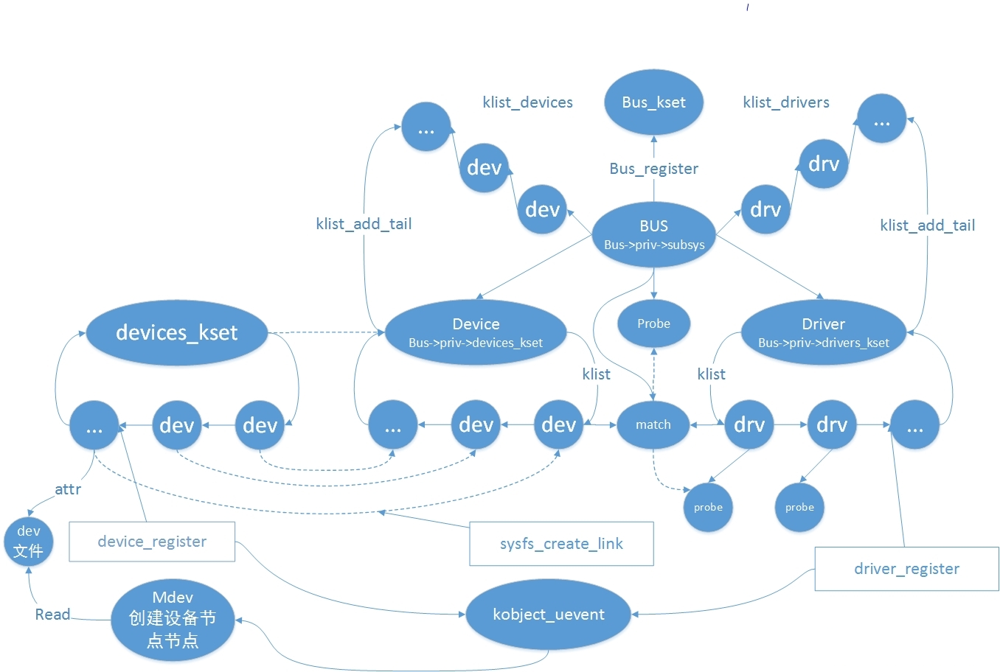
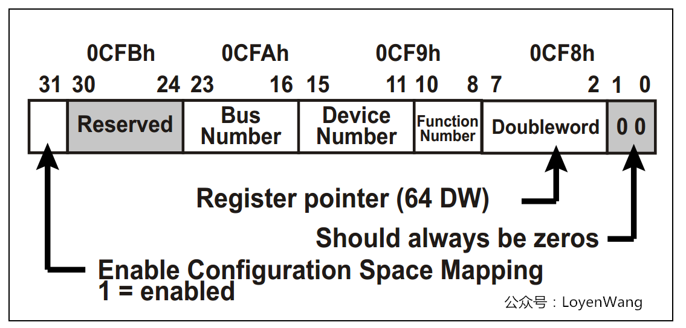
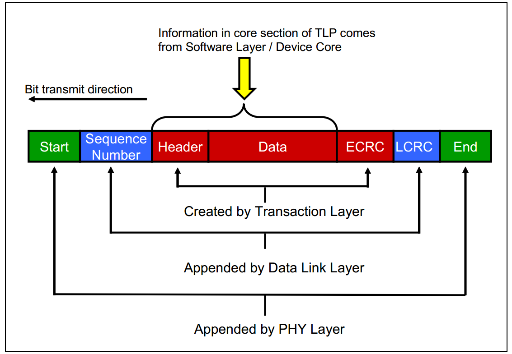
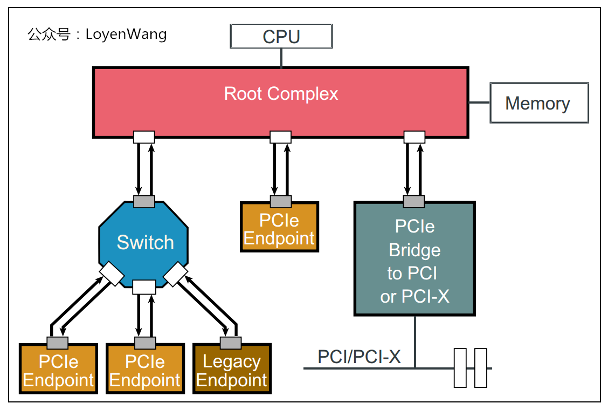
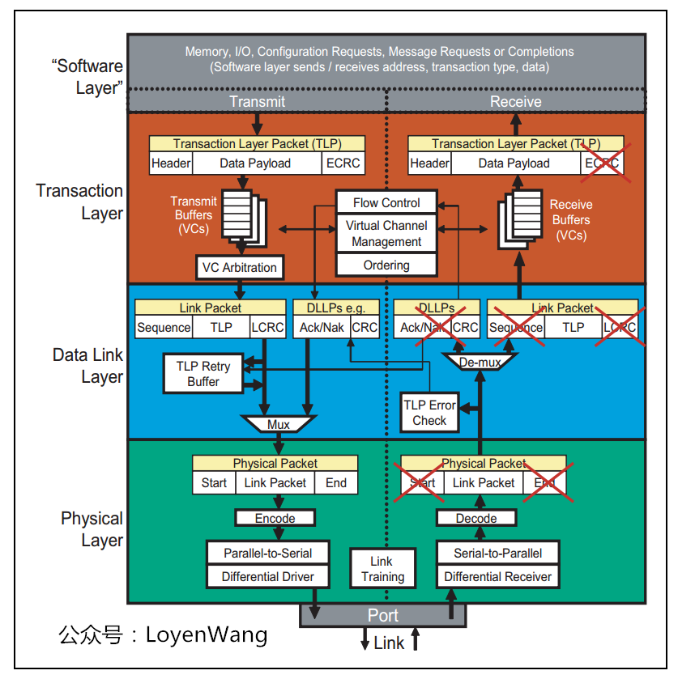
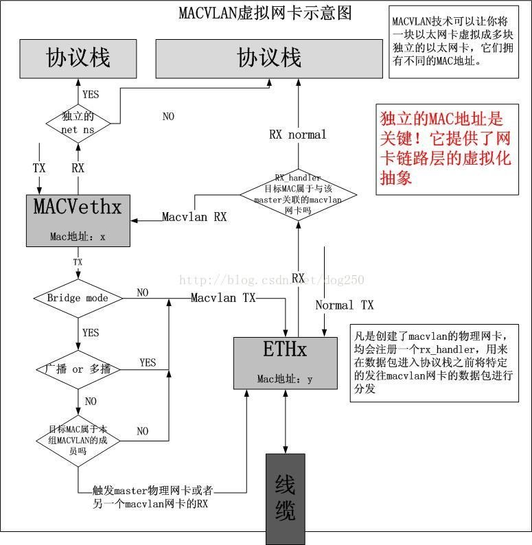

=====================
Linux Drive Develop
=====================

:Date:   2022-06-18 23:02:43

总线设备驱动模型
===================

1. ☆ `Linux 设备总线驱动模型_Linux学习之路的博客-CSDN博客_linux总线设备驱动  <https://blog.csdn.net/lizuobin2/article/details/51570196>`__
2. ☆ `Linux 内核：设备驱动模型（2）driver-bus-device与probe - schips - 博客园  <https://www.cnblogs.com/schips/p/linux_device_model_2.html>`__
3. `Linux Device和Driver注册过程，以及Probe的时机_thl789的博客-CSDN博客  <https://blog.csdn.net/thl789/article/details/6723350>`__
4. `Linux设备模型(5)_device和device driver  <http://www.wowotech.net/linux_kenrel/device_and_driver.html>`__
5. `Linux设备和驱动的匹配过程_qwaszx523的博客-CSDN博客_linux设备和驱动的匹配  <https://blog.csdn.net/qwaszx523/article/details/65635071>`__

设备树
---------
dts是一种描述设备的语法，kernel在启动的时候会把dts的描述转换为实际的 ``device``。

dtb 是 dts 与 dtsi 编译的二进制文件。

driver & device注册过程
-------------------------

1. bus(bus_register)维护注册进来的devcie 与 driver (各一个链表)，每注册(device_register/driver_register)一个device/driver 都会调用 **Bus->match** 函数(定义了Device和Driver绑定时的规则)，将device 与 driver 进行配对，并将它们加入链表.
2. 如果配对成功，调用Bus->probe或者driver->probe函数， 调用 kobject_uevent 函数设置环境变量，mdev进行创建 **设备节点** 等操作。
3. 总线相应的结构体为struct bus_type，相应的设备为platform_device(链表)，相应的驱动为platform_drvier(链表)。

kset是相关的kobject的集合，在sysfs中处于同一目录。kobject与一个ktype关联(定义了默认的特性/属性)。

   bus_device_drive

总线
--------

Linux 称platform总线为虚拟总线，所有直接通过内存寻址的设备都映射到这条总线上。让设备属性和驱动行为更好的分离。

match的规则
~~~~~~~~~~~~
BUS上实现的.match()函数，定义了Device和Driver绑定时的规则。

基本上有四种方式

1. 调用of_driver_match_device()函数；(为了支持dts)
2. ACPI系统专用方法；
3. driver的id_table；
4. 设备的名称或别名和驱动的名称进行匹配的。

Platform实现的就是先比较id_table，然后比较name的规则。

::

   static int platform_match(struct device *dev, struct device_driver *drv)
   {
      struct platform_device *pdev = to_platform_device(dev);
      struct platform_driver *pdrv = to_platform_driver(drv);

      /* When driver_override is set, only bind to the matching driver */
      if (pdev->driver_override)
         return !strcmp(pdev->driver_override, drv->name);

      /* Attempt an OF style match first */
      if (of_driver_match_device(dev, drv))  
         return 1;

      /* Then try ACPI style match */
      if (acpi_driver_match_device(dev, drv))
         return 1;

      /* Then try to match against the id table */
      if (pdrv->id_table)
         return platform_match_id(pdrv->id_table, pdev) != NULL;

      /* fall-back to driver name match */
      return (strcmp(pdev->name, drv->name) == 0);
   }

platform_bus虚拟总线
~~~~~~~~~~~~~~~~~~~~~~
1. `platform_bus、device及driver 注册及介绍_禾仔仔的博客-CSDN博客  <https://blog.csdn.net/weixin_43083491/article/details/119457618>`__
2. `Linux驱动之platform_bus、platform_device、platform_driver_eZiMu的博客-CSDN博客  <https://blog.csdn.net/eZiMu/article/details/85198617>`__

linux开机时，根据dts节点创建sturct platform_device实例,并且把dts节点reg（dts描述：控制器，寄存器地址，memery地址）,interrupts属性翻译成struct resource类型结构体存放.

内核解析dtb文件创建platform设备时，大部分platform设备是没有名字的，大部分是通过 ``compatible`` 这个属性匹配成功的（这个compatible也对应dts里的compatible字符串）。

of_driver_match_device
~~~~~~~~~~~~~~~~~~~~~~~~~
1. `内核添加dts后，device和device_driver的match匹配的变动：通过compatible属性进行匹配_jenney_的博客-CSDN博客  <https://blog.csdn.net/ruanjianruanjianruan/article/details/61622053>`__
2. `Linux驱动之platform_bus、platform_device、platform_driver_eZiMu的博客-CSDN博客  <https://blog.csdn.net/eZiMu/article/details/85198617>`__

为了支持dtb新添加的match函数。

调用到__of_match_node（）函数，把 device_driver的of_match_table（ **of_device_id** 结构体的数组）和device里的of_node（ **device_node** 结构体）进行匹配。
（比较两者的name、type、和compatible字符串，三者要同时相同。name、type通常为null。比较compatible是直接compare整个字符串，不管字符串里的逗号)

pci_driver示例
~~~~~~~~~~~~~~~~
有.id_table和.name

::

   static struct pci_device_id ids[] = {
      { PCI_DEVICE(0x8086, 0x1570), },
      { 0, }
   };

   static struct pci_driver pci_driver = {
      .name = "pci_e1000e",
      .id_table = ids,
      .probe = probe,
      .remove = remove,
   };

driver
--------

device_attach与driver_attach
~~~~~~~~~~~~~~~~~~~~~~~~~~~~~~

大部分内容一样；

一个驱动可以支持多个设备；一个设备只能绑定一个驱动。

区别： ``device_attach`` 调用driver_match_device匹配设备和驱动，成功就结束循环退出（而不是执行完循环）

整体流程
~~~~~~~~~~~~~

::
      
   driver_register(drv) [core.c]     
      
      driver_find(drv->name, drv->bus)  // 1. 判断是否已被注册

      bus_add_driver(drv) [bus.c]      // 2. 添加驱动到bus 
         if (drv->bus->p->drivers_autoprobe)

            driver_attach(dev)[dd.c]   /2.1 匹配dev
               bus_for_each_dev(dev->bus, NULL, drv,__driver_attach)
                  __driver_attach(dev, drv) [dd.c]
                     driver_match_device(drv, dev) [base.h]   // 匹配 现有的 drv 与 现在的 dev
                        drv-bus->match ? drv->bus->match(dev, drv) : 1
                           if false, return;
                        
                     driver_probe_device(drv, dev) [dd.c]    // attempt to bind device & driver together
                        really_probe(dev, drv) [dd.c]
                           dev-driver = drv;                //在 dev 中记录 driver
                           driver_sysfs_add(dev)            //通知bus，更新sysfs
                           if (dev-bus->probe)              //真正的 probe 方法。如果BUS上实现了probe就用BUS的probe；否则才会用driver的probe。
                              dev->bus->probe(dev);
                           else if (drv->probe)
                              drv-aprobe(dev);
                           probe_failed:
                              dev->-driver = NULL;
                           driver_bound(dev);                 //将 device 放入 driver 链表中

          
            klist_add_tail(&priv->knode_bus, &bus->p->klist_drivers);   // 2.2 将 driver 加入 Bus 的 drivers 链表中

      kobject_uevent(&drv->p->kobj, KOBJ_ADD)      //3. 通过uevent通知用户空间

device
---------
整体流程
~~~~~~~~~~~~~

::
   
   device_register(dev)[core.c]
      device_initialize()            // 1. 初始化设备结构

      device_add(dev) [core.c]      // 2. add device to device hierarchy.
         bus_add_device(dev)        // 2.1 add device to bus
         bus_probe_device(dev) [bus.c]   // 2.2 probe drivers for a new device
            if (dev->bus && dev->bus-op->drivers_autoprobe)
            device_attach(dev) [dd.c]
               if (dev->driver)          // 2.2 设备已有驱动
                  device_bind_driver(dev)
               else       // 从这里开始，与driver_attach一样
               
                  bus_for_each_dev(dev->bus, NULL, drv,__driver_attach)
                  __driver_attach(dev, drv) [dd.c]
                     driver_match_device(drv, dev) [base.h]
                        drv->bus->match ? drv->bus-amatch(dev, drv) : 1
                        if false, return;
                     driver_probe_device(drv, dev) [dd.c]
                        really_probe(dev, drv) [dd.c]
                        dev-driver = drv;
                        if (dev-bus->probe)
                           dev->bus->probe(dev);
                        else if (drv->probe)
                           drv->probe(dev);
                        probe_failed:
                           dev->-driver = NULL;

PCIE
======
1. ☆ `【原创】Linux PCI驱动框架分析（一） - LoyenWang - 博客园  <https://www.cnblogs.com/LoyenWang/p/14165852.html>`__
2. `【原创】Linux PCI驱动框架分析（二） - LoyenWang - 博客园  <https://www.cnblogs.com/LoyenWang/p/14209318.html>`__

pci总线地址空间
----------------
1. x86 CPU可以直接访问memory空间和I/O空间，而配置空间则不能直接访问；
2. 配置空间中有个寄存器：Base Address Register，也就是BAR空间，当PCI设备的配置空间被初始化后，该设备在PCI总线上就会拥有一个独立的PCI总线地址空间，这个空间就是BAR空间，BAR空间可以存放IO地址空间，也可以存放存储器地址空间。

假设某个设备要对另一个设备进行读取数据的操作，首先这个设备（称之为Requester）需要向另一个设备发送一个Request，
然后另一个设备（称之为Completer）通过Completion Packet返回数据或者错误信息。

   PCIE_tlp

Header中包含了地址信息，各种tlp类型header、寻址方式不同。

PCIE架构和分层
------------------

pcie架构
~~~~~~~~~~~~~~

   PCIE_structure

Root Complex：CPU和PCIe总线之间的接口可能会包含几个模块（处理器接口、DRAM接口等），甚至可能还会包含芯片，这个集合就称为Root Complex，
   它作为PCIe架构的根， **代表CPU与系统其它部分进行交互**。将CPU的request转换成PCIe的4种不同的请求（Configuration、Memory、I/O、Message）；

pcie分层
~~~~~~~~~~~~~~~
1. 与PCI总线不同（PCI设备共享总线），PCIe总线使用端到端的连接方式，互为接收端和发送端，全双工，基于数据包的传输；
2. 物理底层采用差分信号（PCI链路采用并行总线，而PCIe链路采用串行总线），一条Lane中有两组差分信号，共四根信号线，而PCIe Link可以由多条Lane组成(1/2/4/8/12/16/32)；

   PCIE_layer

1. Transaction层: 负责TLP包（Transaction Layer Packet）的封装与解封装，此外还负责QoS，流控、排序等功能；
2. Data Link层:负责DLLP包（Data Link Layer Packet）的封装与解封装，此外还负责链接错误检测和校正，使用Ack/Nak协议来确保传输可靠；
3. Physical层:负责Ordered-Set包的封装与解封装，物理层处理TLPs、DLLPs、Ordered-Set三种类型的包传输；

TLP事务层
~~~~~~~~~~~~
1. `PCIe扫盲——一个Memory Read操作的例子  <http://blog.chinaaet.com/justlxy/p/5100053263>`__

网络设备驱动
============
net_device
-----------

net_device_ops
~~~~~~~~~~~~~~~~~~~
include\linux\netdevice.h

::
    
    struct net_device_ops {
        int			(*ndo_init)(struct net_device *dev);
        int			(*ndo_open)(struct net_device *dev);
        int			(*ndo_stop)(struct net_device *dev);
        netdev_tx_t		(*ndo_start_xmit)(struct sk_buff *skb,
                            struct net_device *dev);

        u16			(*ndo_select_queue)(struct net_device *dev,
                                struct sk_buff *skb,
                                struct net_device *sb_dev);

        int			(*ndo_set_mac_address)(struct net_device *dev,
                                void *addr);

        int			(*ndo_do_ioctl)(struct net_device *dev,
                                struct ifreq *ifr, int cmd);

        int			(*ndo_change_mtu)(struct net_device *dev,
                            int new_mtu);

        void			(*ndo_tx_timeout) (struct net_device *dev,
                            unsigned int txqueue);

        void			(*ndo_get_stats64)(struct net_device *dev, 

in_device
-----------
1. `in_device和in_ifaddr数据结构_hhhhhyyyyy8的博客-CSDN博客  <https://blog.csdn.net/hhhhhyyyyy8/article/details/103227224>`__

::

   struct in_device {
      struct net_device	*dev;/*指向所属的网络设备*/
      atomic_t		refcnt;/*引用计数*/
      int			dead;/*为1时标识所在的IP配置块将要被释放，不允许再访问其成员*/
      
      /*指向 in_ifaddr架构链表，in_ifaddr中存储了网络设备的IP地址，
      因为一个网络设备可以配置多个IP地址，因此使用链表来存储。*/
      struct in_ifaddr	*ifa_list;
   
      struct ip_mc_list __rcu	*mc_list;	/* IP multicast filter chain    */
      struct ip_mc_list __rcu	* __rcu *mc_hash;
   
      /*与组播相关配置*/
      int			mc_count;	/* Number of installed mcasts	*/
      spinlock_t		mc_tomb_lock;
      struct ip_mc_list	*mc_tomb;
      unsigned long		mr_v1_seen;
      unsigned long		mr_v2_seen;
      unsigned long		mr_maxdelay;
      unsigned char		mr_qrv;
      unsigned char		mr_gq_running;
      unsigned char		mr_ifc_count;
      struct timer_list	mr_gq_timer;	/* general query timer */
      struct timer_list	mr_ifc_timer;	/* interface change timer */
   
      /*指向neigh_parms结构实例，存储一些与ARP相关的参数*/
      struct neigh_parms	*arp_parms;
      
      struct ipv4_devconf	cnf;
      
      /*RCU机制使用，实现互斥*/
      struct rcu_head		rcu_head;
   };

in_ifaddr数据结构
~~~~~~~~~~~~~~~~~~~~~~~

::

   struct in_ifaddr {
      struct hlist_node	hash;
      struct in_ifaddr	*ifa_next;//in_ifaddr链表
      struct in_device	*ifa_dev;//指向所属的in_device结构
      struct rcu_head		rcu_head;
      __be32			ifa_local;//本地IP地址
      __be32			ifa_address;//本地IP地址或对端IP地址
      __be32			ifa_mask;//子网掩码
      __be32			ifa_broadcast;//广播地址
      unsigned char		ifa_scope;//寻址范围
      unsigned char		ifa_prefixlen;//子网掩码长度
      __u32			ifa_flags;//IP地址属性
      char			ifa_label[IFNAMSIZ];//网络设备名
   
      /* In seconds, relative to tstamp. Expiry is at tstamp + HZ * lft. */
      __u32			ifa_valid_lft;
      __u32			ifa_preferred_lft;
      unsigned long		ifa_cstamp; /* created timestamp */
      unsigned long		ifa_tstamp; /* updated timestamp */
   };

ifa_local和ifa_address的区别：

1. ifa_local始终表示本地IP地址

2. 如果设备配置了支持广播，ifa_address和if_local一样；如果点对点链路，ifa_address表示对端的IP地址。

ioctl
--------
ioctl调用链
~~~~~~~~~~~~~~~~
1. `Linux网络设备的系统调用_WGS_LV的博客-CSDN博客  <https://blog.csdn.net/lenk2010/article/details/39669411>`__
2. `UNP编程：37---struct ifreq、 struct ifconf结构体_董哥的黑板报的博客-CSDN博客  <https://blog.csdn.net/qq_41453285/article/details/100567095>`__

::

    ioctl(syscall) 
                    -> do_vfs_ioctl ->vfs_ioctl -> .unlocked_ioctl = sock_ioctl 
                    -> dev_ioctl -> dev_ifsioc- > .ndo_do_ioctl = my_dev_ioctl

ifreq：保存接口信息。socket ioctl使用。ifconf的成员

fcntl
~~~~~~~

ifconfig
~~~~~~~~~~~
ifconfig使用ioctl，ip.routes使用netlink。

   up     This  flag causes the interface to be activated.  It is implicitly specified if an address is
         assigned to the interface.

内核通知链
------------
1. `Linux 内核| 内核通知链机制 - 一丁点儿  <https://www.dingmos.com/index.php/archives/18/#cl-4>`__

net_device和in_device均有各自的通知链结构体，直接使用已封装的api即可。

::
      
   blocking_notifier_chain_register

   notifier_call_chain

   struct notifier_block {
      notifier_fn_t notifier_call;       // 回调函数
      struct notifier_block __rcu *next; // 下一个回调块
      int priority;                      // 优先级
   };

stmmac driver
------------------
drivers/net/ethernet/stmicro/stmmac/stmmac_main.c

内核态文件操作
--------------
1. `那些可进入睡眠状态的Linux内核函数 - 沉风网事  <https://myself659.github.io/post/linux/2015-06-01-linux-may-sleep-function/>`__
2. `linux内核态文件操作filp_open/filp_close/vfs_read/vfs_write  <https://blog.csdn.net/w968516q/article/details/77964853>`__

filp_open/filp_close/kernel_read/kernel_write(vfs_read/vfs_write 4.14以后已废弃)

**内核态有snprintf，无fprintf/fwrite.**

::

   write(用户态) -> ksys_write->vfs_write->new_sync_write->call_write_iter ... 底层架构相关的功能，可能会使用semphore导致调用scheduled

1. filp_open需要判断返回值；
2. vfs_write之前需要set_fs为内核态。

::

   fp = filp_open("/home/kernel_file", O_RDWR | O_CREAT, 0644);  
   if (IS_ERR(fp)) {  
      printk("create file error\n");  
      return -1;  
   } 

   fs = get_fs();  
   set_fs(KERNEL_DS);

   pos = fp->f_pos; 
   vfs_write(fp, buf1, sizeof(buf1), &pos);  
   fp->f_pos = pos;

   set_fs(fs);

IO缓冲
~~~~~~~~~~~~~
1. `带缓冲I/O和不带缓冲I/O的区别与联系 - ITtecman - 博客园  <https://www.cnblogs.com/nufangrensheng/p/3501245.html>`__

read或write的数据都要被内核缓冲.

不带缓冲的I/O指的是在用户的进程中对这两个函数不会自动缓冲， **每次read或write就要进行一次系统调用**。

虚拟网卡
============
1. `Linux 虚拟网卡技术：Macvlan – 云原生实验室 - Kubernetes|Docker|Istio|Envoy|Hugo|Golang|云原生  <https://icloudnative.io/posts/netwnetwork-virtualization-macvlan/>`__

Macvlan
--------

   macvlan

