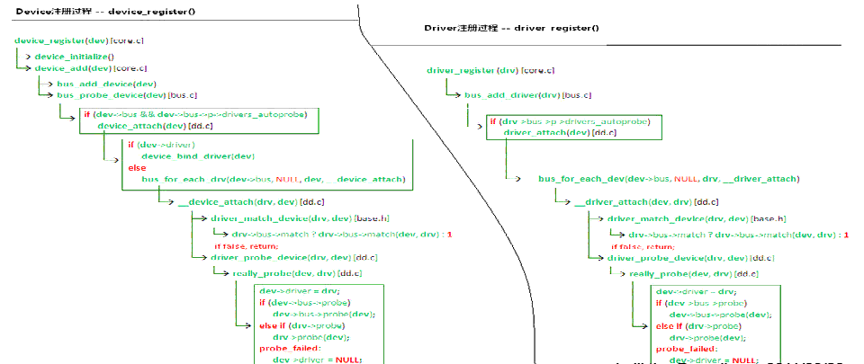

=====================
Linux Drive Develop
=====================

:Date:   2022-06-18 23:02:43

总线设备驱动模型
===================

1. ☆ `Linux 设备总线驱动模型_Linux学习之路的博客-CSDN博客_linux总线设备驱动  <https://blog.csdn.net/lizuobin2/article/details/51570196>`__
2. ☆ `Linux 内核：设备驱动模型（2）driver-bus-device与probe - schips - 博客园  <https://www.cnblogs.com/schips/p/linux_device_model_2.html>`__
3. `Linux Device和Driver注册过程，以及Probe的时机_thl789的博客-CSDN博客  <https://blog.csdn.net/thl789/article/details/6723350>`__
4. `八、device_add_宁可一思进莫在一思停的博客-CSDN博客  <https://blog.csdn.net/qq_20678703/article/details/52841706>`__
5. `Linux设备和驱动的匹配过程_qwaszx523的博客-CSDN博客_linux设备和驱动的匹配  <https://blog.csdn.net/qwaszx523/article/details/65635071>`__

总线
--------

Linux 称为platform总线，为虚拟总线，所有直接通过内存寻址的设备都映射到这条总线上。让设备属性和驱动行为更好的分离。

设备与驱动的匹配
-----------------

1. bus(bus_register)维护注册进来的devcie 与 driver (各一个链表)，每注册(device_register/driver_register)一个device/driver 都会调用 **Bus->match** 函数(定义了Device和Driver绑定时的规则)，
将device 与 driver 进行配对，并将它们加入链表.

2. 如果配对成功，调用Bus->probe或者driver->probe函数， 调用 kobject_uevent 函数设置环境变量，mdev进行创建 **设备节点** 等操作。

3. 总线相应的结构体为struct bus_type，相应的设备为platform_device(链表)，相应的驱动为platform_drvier(链表)。

.. figure:: ../images/bus_device_drive.png

   bus_device_drive

   register_call

