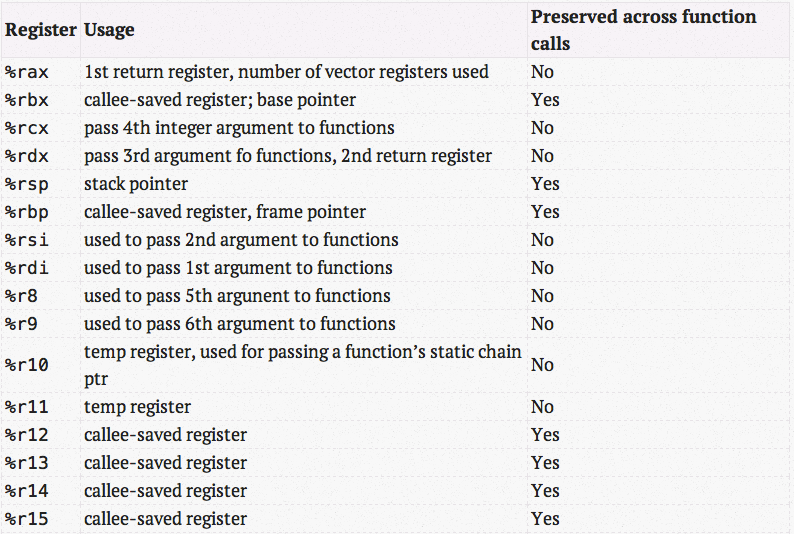
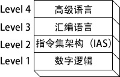
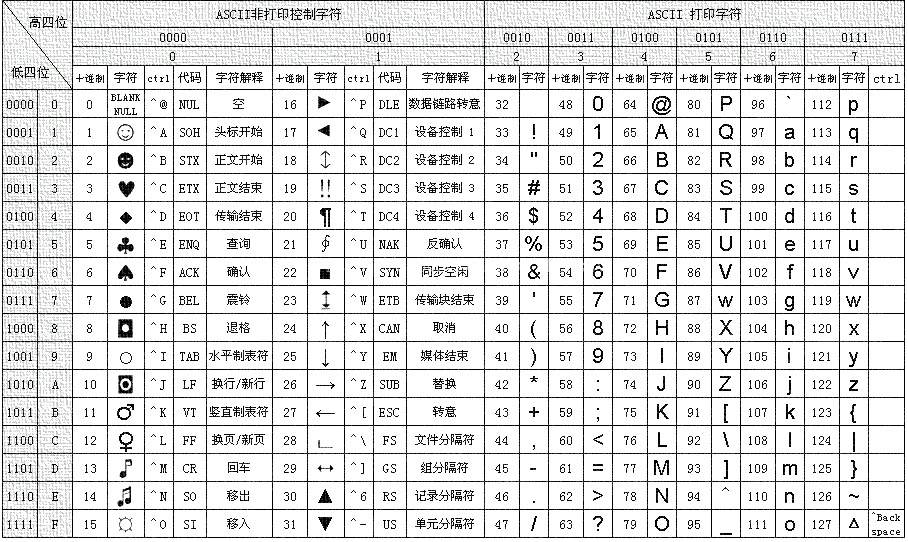
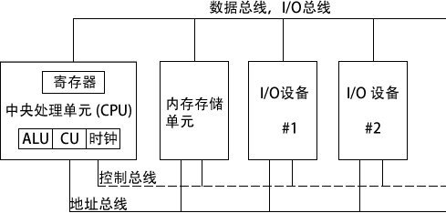
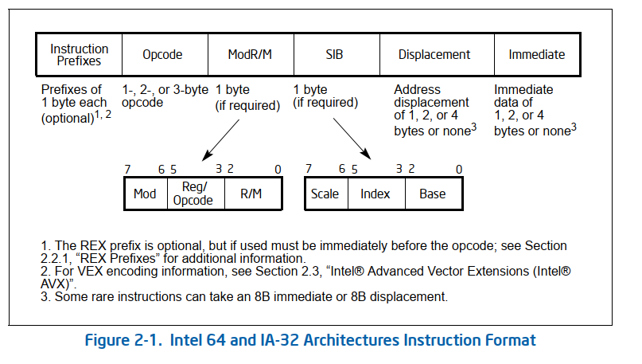

=============
x86 Assembly
=============

:Date:   2020-07-12 18:28:27

参考链接
========

1. https://web.stanford.edu/class/archive/cs/cs107/cs107.1194/guide/x86-64.html
2. `x86 Assembly  Guide <https://www.cs.virginia.edu/~evans/cs216/guides/x86.html>`__
3. http://flint.cs.yale.edu/cs421/papers/x86-asm/asm.html

4. `汇编语言入门 <https://www.ruanyifeng.com/blog/2018/01/assembly-language-primer.html>`__
5. `GNU Assembler Examples <https://cs.lmu.edu/~ray/notes/gasexamples/>`__
6. `Intel格式和AT&T格式汇编区别 <https://www.cnblogs.com/hdk1993/p/4820353.html>`__

.. figure:: ../images/x86-registers.png
   :scale: 70%

   Registers

机器码和汇编转换
-----------------
1. `shell-storm | Online Assembler and Disassembler  <http://shell-storm.org/online/Online-Assembler-and-Disassembler/>`__
2. `ARM架构的机器码和汇编指令互相转换 - From_Zero - 博客园  <https://www.cnblogs.com/from-zero/p/13750852.html>`__
3. `简单学习看机器码的方法   <https://www.cnblogs.com/guocai/archive/2012/10/18/2730048.html>`__

调用规则
========

calling convention
------------------
1. 函数调用的栈帧 `Journey to the Stack, Part I | Many But Finite  <https://manybutfinite.com/post/journey-to-the-stack/>`__

函数调用时，寄存器使用惯例：

1. For integers and pointers, rdi, rsi, rdx, rcx, r8,
   r9.(6个，多余的参数逆序放入stack，返回地址在参数之上，调用结束后清空)
2. For floating-point (float, double), xmm0, xmm1, xmm2, xmm3, xmm4,
   xmm5, xmm6, xmm7
3. STACK POINTER %RSP在call之前必须对齐16-BYTE BOUNDARY
4. called fuction保留寄存器：rbp, rbx, r12, r13, r14,
   r15。其余寄存器在调用中均可以改变,故其它寄存器——caller-saved
   registers (rAX, rCX, rDX) 的值需要保存到栈。
5. Integers返回到rax or rdx:rax,浮点值返回到xmm0 or xmm1:xmm0.

.. figure:: ../images/stack-convention.png
   :alt: 栈帧

   栈帧

SIMD并行
--------

单指令多命令

-  addpd — do 2 double-precision additions
-  addps — do just one double-precision addition, using the low 64-bits
   of the register
-  addsd — do 4 single-precision additions
-  addss — do just one single-precision addition, using the low 32-bits
   of the register

at&t和intel风格
=================
intel风格常在DOS和windows上使用(masm/nasm)，AT&T在Unix类操作系统使用(gcc)。

汇编风格：gcc（at&t）下，mov/add等指令。arm 从右往左，x86从左往右。 

x86简介
==========

-  编译器：将高级语言翻译成操作码（opcode，二进制形式不可读）。
-  汇编语言：二进制指令的文本形式，与指令是一一对应的关系。还原成二进制即可被CPU执行。

每一种CPU的机器指令都不同，因此对应的汇编语言也不一样。以下以X86汇编语言为例。
## 寄存器

``CPU寄存器->　缓存（多级）->　RAM　->　HardDisk``

寄存器
------
1. `64位汇编参数传递 - kk Blog —— 通用基础  <https://abcdxyzk.github.io/blog/2012/11/23/assembly-args/>`__

   x86_64_regs

1) 常用寄存器有16个，分为x86通用寄存器以及r8-r15寄存器。
2) 通用寄存器中，函数执行前后必须保持原始的寄存器有3个：是rbx、rbp、rsp。rx寄存器中，最后4个必须保持原值：r12、r13、r14、r15。
    保持原值的意义是为了让当前函数有可信任的寄存器，减小在函数调用过程中的保存&恢复操作。除了rbp、rsp用于特定用途外，其余5个寄存器可随意使用。
3) 通用寄存器中，不必假设保存值可随意使用的寄存器有5个：是rax、rcx、rdx、rdi、rsi。其中rax用于第一个返回寄存器(当 然也可以用于其它用途)，rdx用于第二个返回寄存器(在调用函数时也用于第三个参数寄存器)。rcx用于第四个参数。rdi用于第一个参数。rsi用于 第二个函数参数。
4) r8、r9分配用于第5、第6个参数。

早期x86
~~~~~~~~~~
CPU只有8个寄存器，每个都有不同的用途，现在已经有100多个了，且都是通用寄存器，不特别指定用途。

通用寄存器可用于传送和暂存数据，也可参与算术逻辑运算，并保存运算结果。

::

   EAX：(针对操作数和结果数据的)累加器 ，返回函数结果
   EBX：(DS段中的数据指针)基址寄存器
   ECX：(字符串和循环操作数)计数器，可用于循环
   EDX：(I/O指针)数据寄存器
   EBP：(SS段中栈内数据指针)扩展基址指针寄存器
   ESI：(字符串操作源指针)源变址寄存器
   EDI：(字符串操作目标指针)目的变址寄存器
   ESP：(SS段中栈指针)栈指针寄存器

CPU指挥寄存器和内存交换数据。

-  Heap：对于\ **动态地内存占用**\ 请求，系统会从预先分配的那段内存中划分出一部分，这个内存区域被称为堆，由起始位置开始，从低位向高位增长。Heap的重要特点是\ **不会自动消失**\ ，必须手动释放或由垃圾回收机制来回收。

-  Stack内存：通常是函数运行而临时划分的内存区域。调用栈有多少层就有多少帧。

指令
----

一条指令有四个组成部分：

1. 标号（可选）：指令与数据的位置标记。
2. 指令助记符（必需）：指令名。
3. 操作数（通常是必需的）：指令输入输出的数值。可以是寄存器、内存操作是、整数表达式、和输入输出端口。第一个为目的操作数，后面为源操作数。
4. 注释（可选）：单行注释——分号\ ``;``\ ， 多行注释——COMMENT
   伪指令和一个用户定义的符号开始，自定义符合结束

NOP空操作指令：不做任何操作，在程序空间占有一个字节，常被编译器和汇编器用于将代码对齐到有效地地址边界。

1. LEA 指令:返回间接操作数的地址。

2. ENTER
   为被调用过程自动创建堆栈帧。两个操作数：第一个是常数，定义为局部变量保存的堆栈空间字节数；第二个定义了过程的词法嵌套级。

::

   ENTER numbytes, nestinglevel
   等效指令
   push ebp
   mov ebp,esp
   sub esp,numbytes

3. LEAVE 指令：结束一个过程的堆栈帧，它反转了之前的 ENTER 指令操作。

4. INVOKE伪指令：将参数入栈并调用过程。替代CALL，可传递参数。

5. ADDR运算符：传递指针参数,参数必须是汇编常数。

6. PROC伪指令：过程定义。

运算符
------

1.  TYPE：返回变量大小；
2.  MOV：将源操作数复制到目的操作数。两个操作数必须是同样的大小；两个操作数不能同时为内存操作数；指令指针寄存器（IP、EIP
    或 RIP）不能作为目标操作数。
3.  加减法：INC、DEC、ADD、SUB、NEG。
4.  OFFSET：返回数据标号的偏移量。这个偏移量按字节计算，表示的是该数据标号距离数据段起始地址的距离。
5.  ALIGN：伪指令，将一个变量对齐到字节边界、字边界、双字边界或段落边界。语法：\ ``ALIGN bound``\ 。可取值1、2、4、8、16。
6.  LENGTHOF：计算数组中元素的个数。
7.  间接寻址：方括号\ ``[]``\ 。
8.  JMP：无条件跳转到代码标号处。
9.  LOOP：按照 ECX（32位）/RCX（64位）计数器循环，将程序块重复特定次数。
10. TEST:运算同AND，不修改目标操作数，根据运算结果设置符号标志位、零标志位、奇偶标志位。

实例
----

::

   int add_a_and_b(int a, int b) {
      return a + b;
   }

   int main() {
      return add_a_and_b(2, 3);
   }

gcc 将这个程序转成汇编语言并过简化以后：

::

   _add_a_and_b:
      push   %ebx              //寄存器值保存到栈
      mov    %eax, [%esp+8]    //将入参b放到eax
      mov    %ebx, [%esp+12]   //将入参b放到ebx
      add    %eax, %ebx        //eax=a+b
      pop    %ebx              //恢复ebx
      ret                      //运行权交还给上层函数，函数帧被回收。

   _main:                      //程序从`_main`标签开始，在Stack上为main新建一个帧，并将指向的地址写入ESP。
      push   3
      push   2
      call   _add_a_and_b      //调用函数，新建栈帧
      add    %esp, 8
      ret   

形式：\ ``CPU指令 运算子``

push：将运算子放入stack。会先取出ESP里的地址，减去n个字节，再将新地址写入ESP。

汇编与x86(To Be Del)
========================

C 和 C++
语言能够在高级结构和底层细节之间进行平衡。直接访问硬件是可能的，但是完全不可移植。
大多数 C 和 C++
编译器都允许在其代码中嵌入汇编语句，以提供对硬件细节的访问。

语言层次
--------

1. 计算机\ **数字逻辑硬件**\ 表示为 Level 1 机器。

2. 指令集架构（Level 2）（ISA, Instruction Set
   Architecture）这是用户可以编程的第一个层次。计算机芯片制造商在处理器内部设计一个指令集来实现基本操作，如传送、加法或乘法。也被称为\ **机器语言**\ 。每一个机器语言指令或者直接在机器硬件上执行，或者由嵌入到微处理器芯片的程序来执行，该程序被称为微程序。

3. **汇编语言**\ （Level 3）使用短助记符，如 ADD、SUB 和 MOV，易于转换到
   ISA 层。汇编语言程序在执行之前要全部翻译（汇编）为机器语言。

4. **高级语言**\ （Level 4）Level 4 是高级编程语言，如 C、C++ 和
   Java。这些语言程序所包含的语句功能强大，并翻译为多条汇编语言指令。比如，查看
   C++
   编译器生成的列表文件输出，就可以看到这样的翻译。汇编语言代码由编译器自动汇编为机器语言。

   ASCII表

x86架构
-------

基本微机设计
~~~~~~~~~~~~

   基本微机设计

1. 时钟clock：对CPU内部操作与系统其它组件进行同步。
2. 控制单元Control Unit，CU ：协调参与机器指令执行的步骤序列。
3. 算术逻辑单元Arithmetic Logic Unit，ALU
   ：执行算术运算（如加法和减法）和逻辑运算（AND、OR和NOT）。
4. 中央处理单元CPU通过主板上CPU插座的引脚与计算机的其它部分相连，大部分引脚连接的是数据总线、控制总线和地址总线。
5. 内存存储单元Memory Storage Unit
   ：用于在程序运行时保存指令与数据。它接收来自CPU的数据请求，将数据从随机存储器传输到CPU，并从CPU传输到内存。
6. 总线bus ：数据类、I/O类、控制类和地址类。

指令执行周期
~~~~~~~~~~~~

执行一条机器指令至少需要一个时钟周期；由于CPU、系统总线和内存电路之间存在差异，访问内存的指令常常需要空时钟周期(等待状态)。

.. figure:: ../images/CpuInstructionExcution.jpg
   :alt: CPU指令执行周期

   CPU指令执行周期

取指、译码和执行。

1. CPU从被称为指令队列的内存区域取得指令，之后立即增加指令指针的值；
2. 对指令的二进制位模式进行译码。这种位模式可能会表示该指令有操作数。
3. 如果有操作数则从内存和寄存器中取得。有时这步还包括了地址计算。
4. 使用步骤3的操作数，执行指令。更新部分状态位标志位，如零标志（Zero）、进位标志（Carry）和溢出标志（Overflow）。
5. 如果输出操作数也是该指令的一部分，则CPU还需要存放其指令结果。

读取内存
~~~~~~~~

从内存读取一个值需要以下步骤：

1. 将想要读取的值的地址放到地址总线；
2. 设置处理器RD（读取）引脚（改变RD的值）；
3. 等待一个时钟周期给存储器芯片进行响应；
4. 将数据从数据总线复制到目标操作数。

上述每一个步骤通常只需要一个时钟周期。

访问寄存器通常只需要一个时钟周期。

cache存储器
~~~~~~~~~~~

-  cache存储器是由静态RAM（static
   RAM）构成的，不需要为了保持其内容而不断刷新。
-  一级cache（主cache）位于CPU上；
-  二级cache通过高速数据总线与CPU相连。

CMOS RAM ：Complementary Metal Oxide
Semiconductor（互补金属氧化物半导体） 保存计算机基本设置信息。

条件语句
--------------

条件跳转
~~~~~~~~~~~~

1. 用 CMP、AND 或 SUB 操作来修改 CPU 状态标志位；
2. 用条件跳转指令来测试标志位，并产生一个到新地址的分支。

::

   Jcond destination

cond 是指确定一个或多个标志位状态的标志位条件。

====== ========== ============= ====== ========== =============
助记符 说明       标志位/寄存器 助记符 说明       标志位/寄存器
====== ========== ============= ====== ========== =============
JZ     为零跳转   ZF=1          JNO    无溢出跳转 OF=0
JNZ    非零跳转   ZF=0          JS     有符号跳转 SF=1
JC     进位跳转   CF=1          JNS    无符号跳转 SF=0
JNC    无进位跳转 CF=0          JP     偶校验跳转 PF=1
JO     溢出跳转   OF=1          JNP    奇校验跳转 PF=0
====== ========== ============= ====== ========== =============

`指令汇总 <http://c.biancheng.net/view/3567.html>`__

LOOPNZ
~~~~~~~~~~~~

LOOPNZ（非零跳转）指令与 LOOPZ 相对应。当 ``ECX`` 中无符号数值大于零（减
1 操作之后）且零标志位等于零时，继续循环。指令语法如下：

::

   LOOPNZ destination

   执行如下任务：

   ECX = ECX - 1
   if ECX > 0 and ZF = 0, jump to destination

IF语句
~~~~~~~~~~~~

一般转化为\ ``CMP+JUMP``\ 语句。

逻辑表达式
~~~~~~~~~~

AND/OR，一般转化为两层的CMP+JUMP语句。

::

   if (a1 > b1) AND (b1 > c1)
       X = 1
   end if

对应汇编：

::

   cmp    a1,b1                  ; 第一个表达式…
   jbe next                      ; 如果假，则退出
   cmp    b1,c1                  ; 第二个表达式…
   jbe next                      ; 如果假，则退出
   mov    X, 1                   ; 全为真
   next:

WHILE语句
~~~~~~~~~~~~

::

   while( val1 < val2 )
   {
       val1++；
       val2 --；
   }

::

           mov eax, val1                  ; 把变量复制到 EAX
   beginwhile:
           cmp eax, val2                  ; 如果非 val1 < val2
           jnl     endwhile               ; 退出循环
           inc    eax                     ; val1++;
           dec    val2                    ; val2--;
           jmp    beginwhile              ; 重复循环
   endwhile:
           mov    val1, eax                ;保存 val1 的新值

FSM
~~~~~~~~~~~~

有限状态机（finite state machine）简称
FSM，表示有限个状态及在这些状态之间的转移和动作等行为的数学模型。
是一种逻辑单元内部的一种高效编程方法，根据不同状态或者消息类型进行相应的处理逻辑，使得程序逻辑清晰易懂。

**应用场景：** 处理程序语言或者自然语言的 tokenizer, 自底向上解析语法的
parser，

各种通信协议发送方和接受方传递数据对消息处理，游戏 AI 等都有应用场景。

**实现方式：** if语句、switch语句、函数指针。

使用函数指针实现 FSM
的思路：建立相应的状态表和动作查询表，根据状态表、事件、动作表定位相应的动作处理函数（实现状态机的注册、状态转移、事件处理的动作），执行完成后再进行状态的切换。

表驱动选择:用查表来代替多路选择结构。表中包含查询值和标号或过程的偏移量，然后必须用循环来检索这个表。当有大量比较操作时，这个方法最有效。

条件控制流伪指令
~~~~~~~~~~~~~~~~~~~~~~~~

简化编写条件语句，仅用于32位。

让汇编器在后台生成
``CMP 和 条件跳转指令``\ ，这些指令显示在输出列表文件中。

+----------------------------------------+-----------------------------+
| 伪指令                                 | 说明                        |
+========================================+=============================+
| .BREAK                                 | 生成代码终止 .WHILE 或      |
|                                        | .REPEAT 块                  |
+----------------------------------------+-----------------------------+
| .CONTINUE                              | 生成代码跳转到 .WHILE 或    |
|                                        | .REPEAT 块的顶端            |
+----------------------------------------+-----------------------------+
| .IF condition                          | 如果 condition              |
|                                        | 为真，则生成代码执行语句块  |
+----------------------------------------+-----------------------------+
| .ELSE                                  | 当 .IF                      |
|                                        | 条件                        |
|                                        | 不满足时，开始执行的语句块  |
+----------------------------------------+-----------------------------+
| .ELSEIF condition                      | 生成代码测试                |
|                                        | condition，并执             |
|                                        | 行其后的语句，直到碰到一个  |
|                                        | .ENDIF 或另一个 .ELSEIF     |
|                                        | 伪指令                      |
+----------------------------------------+-----------------------------+
| .ENDIF                                 | 终止 .IF、.ELSE 或 .ELSEIF  |
|                                        | 伪指令后面的语句块          |
+----------------------------------------+-----------------------------+
| .REPEAT                                | 生成代码重                  |
|                                        | 复执行语句块，直到条件为真  |
+----------------------------------------+-----------------------------+
| .UNTIL condition                       | 生成代码重复执行 .REPEAT 和 |
|                                        | .UNTIL                      |
|                                        | 伪指令之间的语句块，直到    |
|                                        | condition 为真              |
+----------------------------------------+-----------------------------+
| .UNTILCXZ                              | 生成代码重复执行 .REPEAT 和 |
|                                        | .UNTILCXZ                   |
|                                        | 伪指令之间的语句块，直到 CX |
|                                        | 为零                        |
+----------------------------------------+-----------------------------+
| .WHILE condition                       | 当 condition                |
|                                        | 为真时，生成代码执行 .WHILE |
|                                        | 和 .ENDW 伪指令之间的语句块 |
+----------------------------------------+-----------------------------+
| .ENDW                                  | 终止 .WHILE                 |
|                                        | 伪指令后面的语句块          |
+----------------------------------------+-----------------------------+

算术
-----

移位指令
~~~~~~~~~~~~

======= ======== ======= ================
column0 column1  column2 column3
======= ======== ======= ================
SHL     左移     ROR     循环右移
SHR     右移     RCL     带进位的循环左移
SAL     算术左移 RCR     带进位的循环右移
SAR     算术右移 SHLD    双精度左移
ROL     循环左移 SHRD    双精度右移
======= ======== ======= ================

-  逻辑移位：空位用0填充。

-  算术移位：负数的空位用符号位填充。

-  位元循环：以循环的方式来移位，从数的一端移出的位立即复制到该数的另一端，还有一种类型则是把进位标志位当作移动位的中间点。

-  LSB(Least Significant Bit):最低有效位。

-  MSB(Most Significant Bit):最高有效位。

乘除
~~~~~~~~~~~~

MUL和IMUL
~~~~~~~~~~~~~~~~~~~~~

1. MUL：无符号乘法，单操作数，使用寄存器和内存操作数。
2. IMUL：有符号乘法，有三种格式的 IMUL
   指令：单操作数、双操作数和三操作数。

-  单操作数：将乘积存放在 AX、DX:AX 或 EDX:EAX
   中。如果乘积的高半部分不是其低半部分的符号扩展，则进位标志位和溢出标志位置
   1。利用这个特点可以决定是否忽略乘积的高半部分。
-  双操作数：把乘积存放在第一个操作数中，这个操作数必须是寄存器。按照目的操作数的大小来截取乘积。如果被丢弃的是有效位，则溢出标志位和进位标志位置
   1。因此，执行后需检查这些标志位中的一个。
-  三操作数：将乘积保存在第一个操作数中。若乘积有效位被丢弃，则溢出标志位和进位标志位置
   1。执行后需检查标志位。

DIV和IDIV
~~~~~~~~~~~~~~~~~~~~~

1. DIV：无符号除法。单寄存器或内存操作数是除数。

======= ========= === ====
被除数  除数      商  余数
======= ========= === ====
AX      reg/mem8  AL  AH
DX:AX   reg/mem16 AX  DX
EDX:EAX reg/mem32 EAX EDX
======= ========= === ====

2. IDIV 进行除法前需要对被除数进行符号扩展。

符号扩展：将一个数的最高位复制到包含该数的变量或寄存器的所有高位中。

-  CBW（字节转字）指令将 AL 的符号位扩展到 AH
-  CWD（字转双字）指令将 AX 的符号位扩展到 DX
-  CDQ（双字转四字）指令将 EAX 的符号位扩展到 EDX

除法溢出 (divide overflow)：除法操作数生成的商不适合目的操作数。

进位和借位
~~~~~~~~~~~~

-  ADC（带进位加法）:将源操作数和进位标志位的值都与目的操作数相加。
-  SBB（带借位减法）:从目的操作数中减去源操作数和进位标志位的值。

十进制运算
~~~~~~~~~~~~

ASCII运算执行速度要比二进制运算慢得多。优点1）不必转换串格式；2）使用假设的十进制小数点避免浮点运算的舍入误差。

ASCII 十进制数和非压缩十进制数：ASCII 加减法运行操作数为 ASCII
格式或非压缩十进制格式，但是乘除法只能使用非压缩十进制数。

BCD（Binary-coded
decimal）数是指2进制编码的10进制数，压缩的BCD占据一个字节的低4位，压缩的BCD占8位，只有0-9是有效值。

通过将 AH 和 AL 与 30h 进 OR 运算，能转换为 ASCII 码。

::

   AAA（ASCII adjust after addition）指令，是BCD指令集中的一个指令，用于在两个未打包的BCD值相加后，调整al和ah寄存器的内容。AAA指令做两件事情：
   - 如果al的低4位是在0到9之间，保留低4位，清除高4位，如果al的低4位在10到15之间，则通过加6，来使得低4位在0到9之间，然后再对高4位清零。
   - 如果al的低4位是在0到9之间，ah值不变，CF和AF标志清零，否则，ah=ah+1，并设置CF和AF标志。

   AAS：减法后的ASCII调整。只有减法结果为负时，调整才是必需的。

   AAM：MUL 执行非压缩十进制乘法，AAM指令转换由其产生的二进制乘积。乘法只能使用非压缩十进制数。
   AAD：将 AX 中的非压缩十进制被除数转换为二进制，为执行 DIV 指令做准备。

   DAA（加法后的十进制调整）指令将和数转换为压缩十进制格式。
   DAS（减法后的十进制调整）指令将减法运算结果转换为压缩十进制格式。

二进制长除法
~~~~~~~~~~~~

十进制小数转化为二进制实数。

十进制分数转换为二进制的一个简单方法就是：先将分子与分母转换为二进制，再执行长除。无法除尽即此十进制数无法用二进制准确表示。

加减运算的标志位
~~~~~~~~~~~~~~~~~~~~~~~~

`汇编语言 标志位介绍 <https://developer.aliyun.com/article/449788>`__

标志寄存器, 又称程序状态寄存器 (它的内容是 Program Status Word,PSW).
这是一个存放条件码标志, 控制标志和系统标志的寄存器.

状态标志位
~~~~~~~~~~

1. CF—Carry Flag进位标志，\ **无符号数**\ 加法时的最高位（D7 或
   D15）产生进位或减法时最高位出现借位，则 CF=1，否则 CF=0；
2. AF—Auxiliary Carry Flag辅助进位标志，供 BCD 码使用。当 D3
   位出现进位或借位时 AF=1，否则 AF=0；
3. OF—Overflow
   Flag溢出标志，\ **带符号数**\ 进行算术运算时，其结果超出了 8 位或 16
   位的表示范围，产生溢出，则 OF=1，否则 OF=0；
4. ZF—Zero Flag零标志，运算结果各位都为零，则 ZF=1，否则 ZF=0；
5. SF—Sign Flag符号标志，运算结果为负数时，即运算结果的最高位为 1，则
   SF=1，否则 SF=0；
6. PF—Parity Flag奇偶标志，反映操作结果中 “1”
   的个数的情况，若有偶数个“1”，则 PF=1，否则 PF=0。

控制标志位
~~~~~~~~~~

1. DF—Direction Flag方向标志，用来控制数据串操作指令的步进方向；当设置
   DF=1 时，将以递减顺序对数据串中的数据进行处理。当设置 DF=0 时，递增。
2. IF—Interrupt-enable Flag中断允许标志，当设置 IF=1，开中断，CPU
   可响应可屏蔽中断请求；当设置 IF=0 时，关中断，CPU
   不响应可屏蔽中断请求。
3. TF—Trap Flag陷阱标志，为程序调试而设的。当设置 TF=1，CPU
   处于单步执行指令的方式；当设置 TF=0 时，CPU 正常执行程序。

FPU寄存器栈（register stack）
~~~~~~~~~~~~~~~~~~~~~~~~~~~~~~~~~~~~

表达式堆栈：在计算后缀表达式的过程中，用堆栈来保存中间结果。

6个专用寄存器：

1. 操作码寄存器：保存最后执行的非控制指令的操作码。
2. 控制寄存器：执行运算时，控制精度以及 FPU
   使用的舍入方法。还可以用这个寄存器来屏蔽（隐藏）单个浮点异常。
3. 状态寄存器：包含栈顶指针、条件码和异常警告。
4. 标识寄存器：指明 FPU
   数据寄存器栈内每个寄存器的内容。其中，每个寄存器都用两位来表示该寄存器包含的是一个有效数、零、特殊数值
   (NaN、无穷、非规格化，或不支持的格式 )，还是为空。
5. 最后指令指针寄存器：保存指向最后执行的非控制指令的指针。
6. 最后数据（操作数）指针寄存器：保存指向数据操作数的指针，如果存在，那么该数被最后执行的指令所使用。

C语言内联汇编
=============

1. https://www.codenong.com/cs105192200/
2. https://mp.weixin.qq.com/s/2k8nYX4-z662oXqUx4BbqA
3. https://gcc.gnu.org/onlinedocs/gcc/Extended-Asm.html#Clobbers-and-Scratch-Registers
4. `Guide to Inline Assembly <http://www.delorie.com/djgpp/doc/brennan/brennan_att_inline_djgpp.html>`__

概述
----

1. 可直接在asm中使用全局变量名。

2. 操作局部变量则需要使用扩展asm

指令格式
--------

::

   asm [volatile] ("汇编指令" : "输出操作数列表" : "输入操作数列表" : "改动的寄存器")

   asm volatile("": : :"memory")的含义：

   1. volatile 禁止指令重排；
   2. memory 内联汇编修改了memory的内容，提示编译器

   汇编指令：与基本asm格式相同；

   输出操作数列表：汇编代码如何把处理结果传递到 C 代码中；

   输入操作数列表：C 代码如何把数据传递给内联汇编代码;

   改动的寄存器：告诉编译器，在内联汇编代码中，我们使用了哪些寄存器；output/input中的寄存器+标志为"r"/"g"的寄存器不需要声明。

   可以省略。将ecx加入破坏描述部分，gcc会在使用ecx寄存器前先push入栈，等使用完ecx后再pop回去。这就保证了ecx寄存器在使用过程中没有被修改。

约束字符
~~~~~~~~

1. “r”
   通知汇编器可以使用通用寄存器中的任意一个来加载操作数。最常用的一个约束。
2. “g” 允许使用任何通用寄存器、内存或立即整数操作数。
3. “i”通知汇编器这个操作数是个立即数（一个具有常量值）

示例
----

::

   #include <stdio.h>
   int main()
   {
       int data1 = 1;
       int data2 = 2;
       int data3;

       asm("movl %%ebx, %%eax\n\t"
           "addl %%ecx, %%eax"
           : "=a"(data3)    //将eax值输出到data3
           : "b"(data1),"c"(data2)  //将data1值输入到ebx
           : "%edx");  //

       printf("data3 = %d \n", data3);
       return 0;
   }

::

   寄存器占位符： //按照出现顺序编号
       asm("addl %1, %2\n\t"
           "movl %2, %0"
           : "=r"(data3)
           : "r"(data1),"r"(data2));

   寄存器别名：
       asm("addl %[v1], %[v2]\n\t"
           "movl %[v2], %[v3]"
           : [v3]"=r"(data3)
           : [v1]"r"(data1),[v2]"r"(data2));

   变量地址：  //m表示直接从变量取值
       asm("movl %1, %%eax\n\t"
           "addl %2, %%eax\n\t"
           "movl %%eax, %0"
           : "=m"(data3)
           : "m"(data1),"m"(data2));

1. 在asm语句中对寄存器的引用必须用“%%”作为寄存器名称的前缀。原因是“%”在asm
   内嵌汇编语句中的作用与“”在C语言中的作用相同，因此“%%”转换后代表“%”。

IA
=====
1. Intel® 64 and IA-32 Architectures Software Developer’s Manual 
   
   :download:`SDM Volume2_Instruction <../files/SDM_Vol2_Instruction.pdf>` 

   :download:`Sdm Volume3a system program guide part1 <../files/SDM_Vol3a_SPG_p1.pdf>` 

2. :download:`SDM all in one <../files/SDM_Combined.pdf>` ; `intel sdm <https://software.intel.com/content/www/cn/zh/develop/articles/intel-sdm.html>`__
3. `IA64 opcode速查 <http://ref.x86asm.net/coder64.html>`__

指令编码
----------
反汇编机器码：https://onlinedisassembler.com/odaweb/ 
https://defuse.ca/online-x86-assembler.htm#disassembly2

opcode
~~~~~~~~~~~
1. 格式： V2 2.1
2. 汇编指令形式： V2 3.1.1.1 ，比如opcode尾部是否包含3bits reg 等。

ModR/M & SIB
~~~~~~~~~~~~~~~~~~~
V2 2.1.3

寻址模式标识字节。

1. mod(模式)域:连同r/m(寄存器/内存)域共同构成了32个可能的值:8个寄存器和24个寻址模式。
2. reg/opcode(寄存器/操作数)域:指定了8个寄存器或者额外的3个字节的opcode。究竟这三个字节用来做什么由主opcode指定。
3. r/m(寄存器/内存)域:可以指定一个寄存器作为操作数,或者可以和mod域联合用来指定寻址模式。有时候,它和mod域一起用来为某些指令指定额外的信息

SIB字节。对ModR/M寻址的补充。32位指令的基地址+偏移量,以及 比例*偏移量 的形式的寻址方式需要SIB字节。

1. scale(比例)域指定了放大的比例。
2. index(偏移)域指定了用来存放偏移量 的寄存器。
3. base (基地址)域用来标识存放基地址的寄存器。

printf 汇编
------------

::

   mov    0x200aab(%rip),%edx    参数2    # 601040 <__TMC_END__>
   mov    -0x3a(%rip),%rax       参数1    # 400562 <main>
   mov    %rax,%rsi              参数起始地址（从该地址连续取参数）
   mov    $0x400657,%edi         格式化字符串地址
   mov    $0x0,%eax              number of vector registers used
   callq  400460 <printf@plt>

