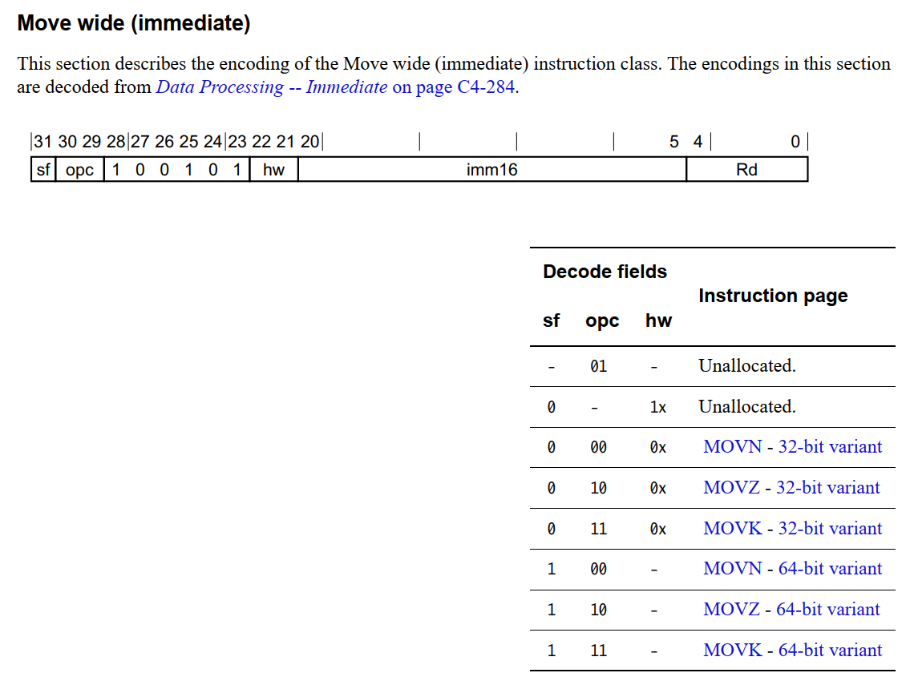

============
Arm
============

:Date:   2021-09-29 19:28:27

arm简介
===============

参考手册
------------

1. arm-pg `Cortex-A Series Programmer's Guide for ARMv8-A <https://developer.arm.com/documentation/den0024/a>`__

   :download:`ARMv8-A-Programmer-Guide <../files/arm/ARMv8-A-Programmer-Guide.pdf>`

2. ☆ arm-arm手册 `Arm Architecture Reference Manual  <https://developer.arm.com/architectures/cpu-architecture/a-profile/docs>`__
   
   :download:`DDI0487G_b_armv8_arm <../files/arm/DDI0487G_b_armv8_arm.pdf>` ; 机器码位于C4.1。

3. arm-N1: trm  `Neoverse-reference-design <https://developer.arm.com/tools-and-software/development-boards/neoverse-reference-design>`__

   :download:`Technical Reference Manual <../files/arm/arm_neoverse_n1_trm.pdf>`

   :download:`Software_Optimization_Guide <../files/arm/Arm_Neoverse_N1_Software_Optimization_Guide.pdf>`
   

4. arm-asm `RM Compiler armasm Reference Guide <https://developer.arm.com/documentation/dui0802/a/A64-General-Instructions/ORR--immediate->`__ 。
   比arm-arm的指令内容详细，如5.105 ORR (immediate) 。
   经常搜出这个，内容不完整—— `Arm Compiler armasm User Guide <https://developer.arm.com/documentation/dui0801/k/A64-General-Instructions/ORR--immediate->`__

5. armlink User Guide

6. opcode 速查 `AArch64 Instructions, Opcodes and Binary Encoding <https://github.com/CAS-Atlantic/AArch64-Encoding>`__
   
   :download:`AArch64_ops <../files/arm/AArch64_ops.pdf>`

7. arm-isa（简洁） :download:`Armv8-A Instruction Set Architecture <../files/arm/Armv8-A Instruction Set Architecture.pdf>`

arm版本
----------
Armv9 延续了 AArch64 作为基准指令集的使用，然而在功能上增加了一些非常重要的扩展：安全、AI 以及改进矢量和 DSP 能力。

AArch64是 **Armv8-A** 架构（https://en.wikipedia.org/wiki/ARM_architecture#ARMv8-A)中引入的64位状态。
完全使用全新的 A64 指令。

Linux内核社区称体系结构为arm64。即arm64=aarch64。

ARMv8-A 将 64 位架构支持引入 ARM 架构中，其中包括：

* 64 位通用寄存器、SP（堆栈指针）和 PC（程序计数器）
* 64 位数据处理和扩展的虚拟寻址

执行状态和指令集：

1. AArch64 状态只支持一套指令集,叫做A64。A64为定长32位的指令集，即每个指令的大小为32bit.
   armasm User Guide：https://developer.arm.com/documentation/dui0801/k/A64-Data-Transfer-Instructions/LDR--register-   

2. AArch32 状态支持两套指令集:  A32——32位定长指令集； T32 ——可变长指令集，其中支持两种不同长度的指令一种长度16位一种长度32位，其中16位的指令也称为thumb code。
   armasm User Guide：https://developer.arm.com/documentation/dui0473/m/arm-and-thumb-instructions/ldr--register-offset-

指令
========
1. DDI0487G_b_armv8_arm.pdf  这两章重点
   
   * C6.2 Alphabetical list of A64 base instructions
   * C4.1 A64 instruction set encoding

PC
----
not general purpose register

ARM指令的三级流水线执行(取指->译码->执行)

1. aarch64模式下，pc指向正在执行的指令。使用 ``MOV PC,R0`` 读取。 `ARM Compiler armasm User Guide Version 6.00  <https://developer.arm.com/documentation/dui0801/a/Overview-of-AArch64-state/Program-Counter-in-AArch64-state>`__
2. During execution, the PC does not contain the address of the currently executing instruction.
   The address of the currently executing instruction is typically ``PC-8 for A32, or PC-4 for T32.``  
   使用 ``ADR Xd, .`` 
   `ARM Compiler armasm User Guide Version 6.00  <https://developer.arm.com/documentation/dui0801/a/Overview-of-AArch32-state/Program-Counter-in-AArch32-state?lang=en>`__

aarch64指令
-------------
32位，64位指令集指的是操作数据宽度，即内存操作的数据宽度，不是指指令只有32位，64位。

Aarch64使用A64指令集，指令长度是32位！

    
    aarch

指令索引：

    
    C4.1 A64 instruction set encoding

aarch32位指令格式
~~~~~~~~~~~~~~~~~~~~~

指令为定长（x86不定长）。

::

    <opcode>{<cond>}{S} <Rd>,<Rn>{,<shifter_operand>}

    其中，<>内的项是必须的，{}内的项是可选的，如<opcode>是指令助记符，是必须的，
    而{<cond>}为指令执行条件，是可选的，如果不写则使用默认条件AL(无条件执行)。

   （1）Opcode   指令助记符，如LDR，STR 等
   （2）Cond       执行条件，如EQ，NE 等
   （3）S           是否影响CPSR 寄存器的值，书写时影响CPSR，否则不影响
   （4）Rd          目标寄存器
   （5）Rn          第一个操作数的寄存器
   （6）shifter_operand      第二个操作数

Branch
------------------------
b unconditional Branch
~~~~~~~~~~~~~~~~~~~~~~~~
bits(64) offset = SignExtend(imm26:'00', 64)

The offset `shifts by two bits to the left and converts to 64 bit` (i.e. the high bits fill with 1 if imm26 < 0, and with 0, otherwise).

br
~~~~~~~~~~~~~~~~~~~~~~~~~~~~

arm立即数
==============

ldr/str立即数
----------------
1. `如何判断有效立即数 <https://blog.csdn.net/sinat_41104353/article/details/83097466>`__

::

   31 28 | 27 26 | 25 | 24 23 22 21 20 | 19   16 | 15    12 | 11        0      |
   cond  | 0  0  | I  | 1  1  0  1  S  | SBZ     | Rd       | shifter operand  |

   (see"ARM Architecture Reference Manual, 4.1.29"MOV")

shifter operand bit[0:11] 即立即数。[0:7]为数值部分，[8:11]为移位量。

``立即数 = immed_8 循环右移 (2 * Rotate_imm)``

MOV (wide immediate)
---------------------------
arm各种版本的机器码不相同，某些版本（如嵌入式）指令会有特殊的优化！！

a64 mov使用 imm16 ，"hw" field as <shift>/16。

   arm_mov_opcode

64-bits variant代表使用64-bit寄存器，如x0；32-bit则为w0。

大部分data processing instructions同时支持32和64bit操作。编译器基于data types选择variant。

mov变体
~~~~~~~~~
分为32和64位两类，每一类有三种变体：普通mov、取反movn、取和movk。

三种变体：

1. movn: Move wide with NOT, moves the inverse of an optionally-shifted 16-bit immediate value to a register. mov+移位+非
2. movz: Move wide with zero, moves an `optionally-shifted 16-bit immediate value to a register.` mov+移位
3. movk: Move wide with keep moves an `optionally-shifted 16-bit immediate value into a register, keeping other bits unchanged.` mov+移位+与 。C6.2.191 。

::

   MOVK <Wd>, #<imm>{, LSL #<shift>}

   MOVN <Wd>, #<imm>{, LSL #<shift>}

   <Wd> Is the 32-bit name of the general-purpose destination register, encoded in the "Rd" field.
   <Xd> Is the 64-bit name of the general-purpose destination register, encoded in the "Rd" field.
   <imm> Is the 16-bit unsigned immediate, in the range 0 to 65535, encoded in the "imm16" field.

   <shift> For the 32-bit variant: is the amount by which to shift the immediate left, either 0 (the default) or
   16, encoded in the "hw" field as <shift>/16.

mov实例
~~~~~~~~

::

   arm64 gcc 8.2

   f1: int
   0x12800000
   mov	w0, #0xffffffff            	// #-1

   f2: int
   0x12a1fe00 : ~(0xff0 << (hw * 16)) = 0xf00fffff ,变体movn 。这里是32bit变体，hw代表左移位数。
   mov	w0, #0xf00fffff            	// #-267386881

   f3:
   0x52bffe00 : 0xfff0<<(hw * 16) = 0xfff00000 , 变体movz 带移位的mov
   mov	w0, #0xfff00000            	// #-1048576

   f4: long (64bits),sf = 1
   0xd2bffe00
   mov	x0, #0xfff00000       

GCC、Clang 等实现中，64位代码的long类型为64位，而MSVC中则维持32位

MOV (bitmask immediate)
--------------------------------

1. armasm 5.87 `RM Compiler armasm Reference Guide <https://developer.arm.com/documentation/dui0802/a/A64-General-Instructions/ORR--immediate->`__
2. `encoding-of-immediate-values-on-aarch64 <https://dinfuehr.github.io/blog/encoding-of-immediate-values-on-aarch64/>`__ 
3. https://stackoverflow.com/questions/30904718/range-of-immediate-values-in-armv8-a64-assembly
4. 64bits逻辑立即数合法判断 `gdb——a valid logical immediate, i.e. bitmask <https://github.com/bminor/binutils-gdb/blob/c40d7e49cf0a6842a5cf072772a48d1f6e6eeb11/opcodes/aarch64-opc.c#L1195>`__
   遍历并保存+二分搜索。

   ORR_immediate

1. element的格式用正则表达为: `0+1+`

2. imms:第一个0开始后的bits有n位，值为k，2^n为element的长度，e=k+1为element中1的数量。

3. immr:值表示循环左移的位数，值不超过e。

实例： https://godbolt.org/z/T3Wo4K98Y

ORR (immediate)

::

   Bitwise inclusive OR (immediate).

   This instruction is used by the alias MOV (bitmask immediate).

   ORR  Wd|WSP, Wn, #imm    ; 32-bit general registers

遍历所有bitmask immediate
~~~~~~~~~~~~~~~~~~~~~~~~~~~~

::

   #include <stdio.h>
   #include <stdint.h>

   // Dumps all legal bitmask immediates for ARM64
   // Total number of unique 64-bit patterns: 
   //   1*2 + 3*4 + 7*8 + 15*16 + 31*32 + 63*64 = 5334

   const char *uint64_to_binary(uint64_t x) {
   static char b[65];
   unsigned i;
   for (i = 0; i < 64; i++, x <<= 1)
      b[i] = (0x8000000000000000ULL & x)? '1' : '0';
   b[64] = '\0';
   return b;
   }

   int main() {
   uint64_t result;
   unsigned size, length, rotation, e;
   for (size = 2; size <= 64; size *= 2)
      for (length = 1; length < size; ++length) {
         result = 0xffffffffffffffffULL >> (64 - length);
         for (e = size; e < 64; e *= 2)
         result |= result << e;
         for (rotation = 0; rotation < size; ++rotation) {
         printf("0x%016llx %s (size=%u, length=%u, rotation=%u)\n",
               (unsigned long long)result, uint64_to_binary(result),
               size, length, rotation);
         result = (result >> 63) | (result << 1);
         }
      }
   return 0;
   }

确定mov立即数的编码
-------------------
cmockery对函数返回值打桩，以确定将立即数保存到w0需要几条mov指令。

识别出只需要一条指令的情况，剩余的则使用mov+movk两条指令实现。

1. wide immediate的mov、movn容易确定。
2. 难点在与bitmask immediatede 的 mov指令。参考gdb的判断方法

ADD/SUB immediate
-------------------
1. arm-arm C4.1.2
2. arm-asm 5.9

``12bits imm + 12bits shift``

All instructions of the add/sub immediate instruction class allow a 12-bit unsigned immediate 
that can optionally be shifted by 12 bits (1 bit for the shift). 

另外还有使用address tag的变体addg。

arm汇编
=============

aarch64状态
------------

1. ☆ `ARM64 Assembly Language Notes <https://cit.dixie.edu/cs/2810/arm64-assembly.html>`__     :download:`arm-assembly <../files/arm/syshella_arm-assembly.pdf>`
2. `A Guide to ARM64 <https://modexp.wordpress.com/2018/10/30/arm64-assembly/#registers>`__
3. https://developer.arm.com/documentation/dui0801/a/Overview-of-AArch64-state/Registers-in-AArch64-state

In AArch64 state, the following registers are available:

1. 31 64-bit general-purpose registers X0-X30, the bottom halves of which are accessible as W0-W30.
2. 4 stack pointer registers SP_EL0, SP_EL1, SP_EL2, SP_EL3.
3. 3 exception link registers ELR_EL1, ELR_EL2, ELR_EL3.
4. 3 saved program status registers SPSR_EL1, SPSR_EL2, SPSR_EL3.
5. 1 program counter.

arm64指令格式
--------------
``指令方向： 从右向左``

::

   MNEMON­IC{­S}{­con­dition} {Rd}, Operand1, Operand2
   

   MNEMONIC   Descri­ption
   {S}
   An optional suffix. If S is specified, the condition flags are updated on the result of the operation
   
   {condi­tion}
   Condition that is needed to be met in order for the instru­ction to be executed
   
   {Rd}
   Register destin­ation for storing the result of the instru­ction
   
   Operand1
   First operand. Either a register or an inmediate value
   
   Operand2
   Second (flexible) operand. Either an inmediate value (number) or a register with an optional shift
   
   {} - Optional

arm64常用寄存器
-----------------
1. x0–x7: function arguments, scratch (x0 is also function return value)
2. x8–x18: scratch (x8 is syscall number, x16–x18 sometimes reserved)
3. x19–x28: callee-saved registers (save to stack at beginning of function, restore from stack before returning)
4. **x29: frame pointer**
5. **x30: link register** (save to stack for non-leaf functions)
6. sp: stack pointer
7. pc: The Program Counter (PC) is not a general-purpose register in A64, and it cannot be used with data processing instructions.
8. There is no register named W31 or X31. Depending on the instruction, 
   register 31 is either the stack pointer or the zero register. When used as the stack pointer, you refer to it as SP. 
   W   hen used as the zero register, you refer to it as WZR in a 32-bit context or XZR in a 64-bit context.

arm32汇编和寄存器
~~~~~~~~~~~~~~~~~~
1. `arm asm cheat-sheets <https://cheatography.com/syshella/cheat-sheets/arm-assembly/>`__
2. https://azeria-labs.com/writing-arm-assembly-part-1/

.. figure:: ../images/arm_asm.png
      :alt: asm cheetsheet

**常用寄存器：**

accessible in any privilege mode: r0-15.

+----------+----------------------------+-------------------------+
| ARM      | Description                | x86                     |
+==========+============================+=========================+
| R0       | General Purpose            | EAX                     |
+----------+----------------------------+-------------------------+
| R1-R5    | General Purpose            | EBX, ECX, EDX, ESI, EDI |
+----------+----------------------------+-------------------------+
| R6-R10   | General Purpose            | –                       |
+----------+----------------------------+-------------------------+
| R11 (FP) | Frame Pointer              | EBP                     |
+----------+----------------------------+-------------------------+
| R12      | Intra Procedural Call      | –                       |
+----------+----------------------------+-------------------------+
| R13 (SP) | Stack Pointer              | ESP                     |
+----------+----------------------------+-------------------------+
| R14 (LR) | Link Register              | –                       |
+----------+----------------------------+-------------------------+
| R15 (PC) | <- Program Counter /       | EIP                     |
|          | Instruction Pointer ->     |                         |
+----------+----------------------------+-------------------------+
| CPSR     | Current Program State      | EFLAGS                  |
|          | Register/Flags             |                         |
+----------+----------------------------+-------------------------+

CPSR: 对应x86的EFLAGS

寻址模式和偏移模式
--------------------
三种 **寻址模式**：偏移寻址（Offset addressing），前变址寻址（Pre-indexed addressing），后变址寻址（Post-indexed addressing）。

::
      
   偏移寻址

   [Rn, offset]
   最终访问内存的地址 = Rn+offset
   这种操作后Rn的值不会改变

   前变址寻址

   [Rn, offset]!
   最终访问内存的地址 = Rn+offset
   这种操作后Rn的值 = Rn+offset

   后变址寻址

   [Rn], offset
   最终访问内存的地址 = Rn
   这种操作后Rn的值 = Rn+offset

LDR(从左到右，右为目标) 和 STR（从右到左，arm大部分指令的方向） 有三种 **偏移形式**：

::
            
      立即数作为偏移量：ldr r3, [r1, #4]
      寄存器作为偏移量：ldr r3, [r1, r2]
      带有位移操作的寄存器作为偏移量：ldr r3, [r1, r2, LSL#2]

      如果带有!，就是前变址寻址
      ldr r3, [r1, #4]!

      如果基地值寄存器（R1）带中括号，就是后变址寻址
      ldr r3, [r1], #4

      其他的都是带偏移量的寄存器间接寻址
      ldr r3, [r1, #4]

LDM和STM指令，"M"在这里代表Multiple。

1. STM是把多个寄存器的值传送到内存相邻的位置。
2. LDM多个寄存器在ARM汇编语言中用"{}"圈起来，表示待传送的寄存器列表。

arm dsb
-------------
arm-asm 3.37

https://developer.arm.com/documentation/dui0489/c/CIHGHHIE

1. DMB:Data Memory Barrier,只作用于显式内存访问指令，保证dmb前的指令先执行完。
   all explicit memory accesses that appear in program order before the DMB instruction are observed before any explicit memory accesses that appear in program order after the DMB instruction. 

2. DSB:Data Synchronization Barrier，一种特殊的dmb，作用于所有指令，保证dsb之前的指令执行完之后才执行dsb之后的指令。
   No instruction in program order after this instruction executes until this instruction completes.
   dsb指令完成的条件包括：All Cache, Branch predictor and TLB maintenance operations before this instruction complete.
3. ISB:Instruction Synchronization Barrier,清空cpu流水线。
   flushes the pipeline in the processor, so that all instructions following the ISB are fetched from cache or memory, after the instruction has been completed
   

x86与arm函数调用规约
=======================
1. `[原创]常见函数调用约定(x86、x64、arm、arm64) <https://bbs.pediy.com/thread-224583.htm>`__，主要是windows
2. `GCC的调用约定 <https://blog.csdn.net/weixin_44395686/article/details/105036297>`__
3. `system V ABI <https://blog.csdn.net/weixin_44395686/article/details/105022059>`__

X86 函数调用规约
--------------------
1. X86 有三种常用调用约定，cdecl(C规范)/stdcall(WinAPI默认)/fastcall 函数调用约定。

   1. cdecl 函数调用约定

   参数从右往左一次入栈，调用者实现栈平衡，返回值存放在 EAX 中。允许了变长入参如printf
   GCC的默认调用约定为cdecl

   2. stdcall 函数调用约定

   参数从右往左一次入栈，被调用者实现栈平衡，返回值存放在 EAX 中。

   3. fastcall 函数调用约定

   参数1、参数2分别保存在 ECX、EDX ，剩下的参数从右往左一次入栈，被调用者实现栈平衡，返回值存放在 EAX 中。

2. X86-64

x64的调用约定只有一种，遵守system v ABI的规范。但是Linux和windows却有一些差别。
 
   1. 在windows X64中，前4个参数通过rcx，rdx，r8，r9来传递；
   2. 在Linux上，则是前6个参数通过rdi，rsi，rdx，rcx，r8，r9传递。
   3. 其余的参数按照从右向左的顺序压栈。

ARM和ARM64函数调用规约
---------------------------
使用的是ATPCS(ARM-Thumb Procedure Call Standard/ARM-Thumb过程调用标准)的函数调用约定。

1. ARM：参数1~参数4 分别保存到 R0~R3 寄存器中 ，剩下的参数从右往左一次入栈，被调用者实现栈平衡，返回值存放在 R0 中。
2. ARM64：参数1~参数8 分别保存到 X0~X7 寄存器中 ，剩下的参数从右往左一次入栈，被调用者实现栈平衡，返回值存放在 X0 中。

aarch64堆栈回溯
==================
