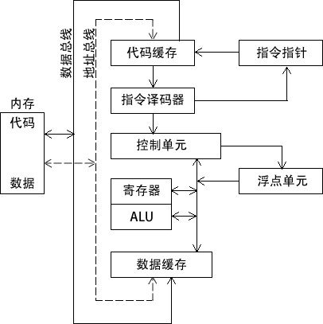

=================
Assembly Language
=================

:Date:   2020-07-12 18:28:27

.. raw:: html

   <!-- more -->

参考链接
========

别看垃圾国内各大编程学习网站的垃圾教程。。。

`汇编语言入门 <https://www.ruanyifeng.com/blog/2018/01/assembly-language-primer.html>`__
https://cs.lmu.edu/~ray/notes/gasexamples/
https://web.stanford.edu/class/archive/cs/cs107/cs107.1194/guide/x86-64.html
http://flint.cs.yale.edu/cs421/papers/x86-asm/asm.html

.. figure:: ../images/x86-registers.png
   :alt: Registers

   Registers

调用规则
========

calling convention
------------------

1. For integers and pointers, rdi, rsi, rdx, rcx, r8, r9.
2. For floating-point (float, double), xmm0, xmm1, xmm2, xmm3, xmm4,
   xmm5, xmm6, xmm7
3. 多余的参数放入stack，调用结束后清空。
4. STACK POINTER %RSP在call之前必须对齐16-BYTE BOUNDARY
5. called fuction保留寄存器：rbp, rbx, r12, r13, r14,
   r15。其余寄存器在调用中均可以改变,故其它寄存器——caller-saved
   registers (rAX, rCX, rDX) 的值需要保存到栈。
6. Integers返回到rax or rdx:rax,浮点值返回到xmm0 or xmm1:xmm0.
7. 参数逆序存入stack（最后一个参数在高地址），返回地址在参数之上。

**局部变量和栈帧** |栈|

SIMD并行
--------

单指令多命令

-  addpd — do 2 double-precision additions
-  addps — do just one double-precision addition, using the low 64-bits
   of the register
-  addsd — do 4 single-precision additions
-  addss — do just one single-precision addition, using the low 32-bits
   of the register

简介
====

编译器：将高级语言翻译成操作码（opcode，二进制形式不可读）。
汇编语言：二进制指令的文本形式，与指令是一一对应的关系。还原成二进制即可被CPU执行。
每一种CPU的机器指令都不同，因此对应的汇编语言也不一样。以下以X86汇编语言为例。
## 寄存器 ``CPU寄存器->　缓存（多级）->　RAM　->　HardDisk`` 早期x86
CPU只有8个寄存器，每个都有不同的用途，现在已经有100多个了，且都是通用寄存器，不特别指定用途。
通用寄存器可用于传送和暂存数据，也可参与算术逻辑运算，并保存运算结果。

::

   EAX：(针对操作数和结果数据的)累加器 ，返回函数结果
   EBX：(DS段中的数据指针)基址寄存器
   ECX：(字符串和循环操作数)计数器，可用于循环
   EDX：(I/O指针)数据寄存器
   EBP：(SS段中栈内数据指针)扩展基址指针寄存器
   ESI：(字符串操作源指针)源变址寄存器
   EDI：(字符串操作目标指针)目的变址寄存器
   ESP：(SS段中栈指针)栈指针寄存器

CPU指挥寄存器和内存交换数据。
对于\ **动态地内存占用**\ 请求，系统会从预先分配的那段内存中划分出一部分，这个内存区域被称为堆，由起始位置开始，从低位向高位增长。Heap的重要特点是\ **不会自动消失**\ ，必须手动释放或由垃圾回收机制来回收。

Stack内存：通常是函数运行而临时划分的内存区域。调用栈有多少层就有多少帧。

常用运算符
----------

1.  TYPE：返回变量大小；
2.  MOV：将源操作数复制到目的操作数。两个操作数必须是同样的大小；两个操作数不能同时为内存操作数；指令指针寄存器（IP、EIP
    或 RIP）不能作为目标操作数。
3.  MOVZX：对无符号数进行全零扩展。MOVSX：对有符号整数进行符号扩展，复制源操作数最高位。
4.  LAHF：加载状态标志位到 AH，指令将 EFLAGS 寄存器的低字节复制到
    AH。被复制的标志位包括：符号标志位、零标志位、辅助进位标志位、奇偶标志位和进位标志位。
5.  SAHF（保存 AH 内容到状态标志位）指令将 AH 内容复制到 EFLAGS（或
    RFLAGS）寄存器低字节。
6.  加减法：INC、DEC、ADD、SUB、NEG。
7.  OFFSET：返回数据标号的偏移量。这个偏移量按字节计算，表示的是该数据标号距离数据段起始地址的距离。
8.  ALIGN：伪指令，将一个变量对齐到字节边界、字边界、双字边界或段落边界。语法：\ ``ALIGN bound``\ 。可取值1、2、4、8、16。
9.  PTR：重写操作数的大小类型。
10. LENGTHOF：计算数组中元素的个数。
11. 间接寻址：方括号\ ``[]``\ 。
12. JMP：无条件跳转到代码标号处。
13. LOOP：按照 ECX（32位）/RCX（64位）计数器循环，将程序块重复特定次数。

TEST
----

运算同AND，不修改目标操作数，根据运算结果设置符号标志位、零标志位、奇偶标志位。

实例
----

一个简单的程序example.c。

::

   int add_a_and_b(int a, int b) {
      return a + b;
   }

   int main() {
      return add_a_and_b(2, 3);
   }

gcc 将这个程序转成汇编语言。

::

   $ gcc -S example.c

会生成一个文本文件example.s，里面就是汇编语言，包含了几十行指令。一个高级语言的简单操作，底层可能由几个、几十个
CPU 指令构成。

example.s经过简化以后：

::

   _add_a_and_b:
      push   %ebx
      mov    %eax, [%esp+8] 
      mov    %ebx, [%esp+12]
      add    %eax, %ebx 
      pop    %ebx 
      ret  

   _main:
      push   3
      push   2
      call   _add_a_and_b 
      add    %esp, 8
      ret

形式：\ ``CPU指令 运算子``

::

   push   %ebx

这一行里面，push是 CPU 指令，%ebx是该指令要用到的运算子。一个 CPU
指令可以有零个到多个运算子。 ## \_main
程序从\ ``_main``\ 标签开始，在Stack上为main新建一个帧，并将指向的地址写入ESP。

push
----

将运算子放入stack。会先取出ESP里的地址，减去n个字节，再将新地址写入ESP。

call
----

调用函数，新建一个帧。

::

   call   _add_a_and_b

调用add_a_and_b函数。

下面就开始执行_add_a_and_b的代码。

::

   push   %ebx

将 EBX 寄存器里面的值，写入_add_a_and_b这个帧。

mov
---

将一个值写入某个寄存器。

::

   mov    %eax, [%esp+8] 

先将ESP中的地址加上8字节，取出此Stack地址中的数据，写入EBX寄存器。

add
---

将两个运算子相加，并写入第一个运算子。

pop
---

取出Stack最近写入的值（最低地址的值），并将这个值写入运算子指定的位置。同时还会回收n个字节。

ret
---

终止当前函数的执行，将运行权交还给上层函数，函数帧被回收。

基本概念
========

汇编语言和高级语言
------------------

各种应用类型的适应性：

+---------------------+--------------------------+---------------------+
| 应用类型            | 高级语言                 | 汇编语言            |
+=====================+==========================+=====================+
| 商业或科学          | 规范结构使               | 最小规范结构，      |
| 应用程序，为单一的  | 其易于组织和维护大量代码 | 因此必须由具有不同  |
| 中型或大型平台编写  |                          | 程度经验的程序员来  |
|                     |                          | 维护结构。这导致对  |
|                     |                          | 已有代码的维护困难  |
+---------------------+--------------------------+---------------------+
| 硬件设备驱动程序    | 语言不一                 | 对硬件的访问直接且  |
|                     | 定提供对硬件的直接访问。 | 简单。当程序较短且  |
|                     | 即使提供                 | 文档良好时易于维护  |
|                     | 了，可能也需要难以控制的 |                     |
|                     | 编码技术，这导致维护困难 |                     |
+---------------------+--------------------------+---------------------+
| 为多个平台（不同    | 通常可移植               | 需要为每个平台      |
| 的操作系统）编写的  | 。在每个目标操作系统上， | 单独重新编写代码，  |
| 商业或科学应用程序  | 源程序                   | 每个汇编器都使用不  |
|                     | 只做少量修改就能重新编译 | 同的语法。维护困难  |
+---------------------+--------------------------+---------------------+
| 需                  | 可                       | 理想，因为可执行    |
| 要直接访问硬件的嵌  | 能生成很大的可执行文件， | 代码小，运行速度快  |
| 入式系统和电脑游戏  | 以至于超出设备的内存容量 |                     |
+---------------------+--------------------------+---------------------+

C 和 C++
语言具有一个独特的特性，能够在高级结构和底层细节之间进行平衡。直接访问硬件是可能的，但是完全不可移植。大多数
C 和 C++ 编译器都允许在其代码中嵌入汇编语句，以提供对硬件细节的访问。

语言层次
--------

|虚拟机层次结构| 计算机数字逻辑硬件表示为 Level 1 机器。
指令集架构（Level 2）（ISA, Instruction Set
Architecture）这是用户可以编程的第一个层次。计算机芯片制造商在处理器内部设计一个指令集来实现基本操作，如传送、加法或乘法。也被称为机器语言。每一个机器语言指令或者直接在机器硬件上执行，或者由嵌入到微处理器芯片的程序来执行，该程序被称为微程序。

汇编语言（Level 3）在 ISA
层，编程语言提供了一个翻译层，来实践大规模软件开发。汇编语言出现在 Level
3，使用短助记符，如 ADD、SUB 和 MOV，易于转换到 ISA
层。汇编语言程序在执行之前要全部翻译（汇编）为机器语言。

高级语言（Level 4）Level 4 是高级编程语言，如 C、C++ 和
Java。这些语言程序所包含的语句功能强大，并翻译为多条汇编语言指令。比如，查看
C++
编译器生成的列表文件输出，就可以看到这样的翻译。汇编语言代码由编译器自动汇编为机器语言。

   ASCII表

X86架构
=======

CPU处理器架构
-------------

基本微机设计
~~~~~~~~~~~~

.. figure:: ../images/BasicComputerStruct.jpg
   :alt: 基本微机设计

   基本微机设计

时钟clock：对CPU内部操作与系统其它组件进行同步。 控制单元Control
Unit，CU ：协调参与机器指令执行的步骤序列。 算术逻辑单元Arithmetic Logic
Unit，ALU ：执行算术运算（如加法和减法）和逻辑运算（AND、OR和NOT）。
CPU通过主板上CPU插座的引脚与计算机的其它部分相连，大部分引脚连接的是数据总线、控制总线和地址总线。
内存存储单元Memory Storage Unit
：用于在程序运行时保存指令与数据。它接收来自CPU的数据请求，将数据从随机存储器传输到CPU，并从CPU传输到内存。

总线bus ：数据类、I/O类、控制类和地址类。

执行一条机器指令至少需要一个时钟周期；由于CPU、系统总线和内存电路之间存在差异，访问内存的指令常常需要空时钟周期(等待状态)。

指令执行周期
~~~~~~~~~~~~

|CPU指令执行周期| 取指、译码和执行。

1. CPU从被称为指令队列的内存区域取得指令，之后立即增加指令指针的值；
2. 对指令的二进制位模式进行译码。这种位模式可能会表示该指令有操作数。
3. 如果有操作数则从内存和寄存器中取得。有时这步还包括了地址计算。
4. 使用步骤3的操作数，执行指令。更新部分状态位标志位，如零标志（Zero）、进位标志（Carry）和溢出标志（Overflow）。
5. 如果输出操作数也是该指令的一部分，则CPU还需要存放其指令结果。

读取内存
~~~~~~~~

从内存读取一个值需要以下步骤： 1. 将想要读取的值的地址放到地址总线； 2.
设置处理器RD（读取）引脚（改变RD的值）； 3.
等待一个时钟周期给存储器芯片进行响应； 4.
将数据从数据总线复制到目标操作数。
上述每一个步骤通常只需要一个时钟周期。
访问寄存器通常只需要一个时钟周期。 cache存储器：
一级cache（主cache）位于CPU上；二级cache通过高速数据总线与CPU相连。
cache存储器是由静态RAM（static
RAM）构成的，不需要为了保持其内容而不断刷新。

加载并执行程序
~~~~~~~~~~~~~~

程序加载器（program loader）：将程序加载到内存。

1. 操作系统（OS）在当前目录和预定路径下搜索文件名；
2. 访问程序文件的基本信息；
3. OS确定内存中下一个可用位置，将程序加载到内存。为该程序分配内存块，并将程序岛雪和位置信息加入表中（描述符表Descroptor
   table）。OS可能调整程序内指针的值，使得它们包括程序数据地址；
4. OS开始执行程序的第一条机器指令（程序入口），程序开始执行后就成为了一个进程。OS为其分配进程ID，用于在执行期间对其进行追踪；
5. 进程自动运行。OS进行追踪，并响应系统资源的请求，包括内存、磁盘文件和输入输出设备；
6. 进程结束后，从内存中移除。

CMOS RAM ：Complementary Metal Oxide
Semiconductor（互补金属氧化物半导体） 保存计算机基本设置信息。

指令
----

一条指令有四个组成部分： 1. 标号（可选）：指令与数据的位置标记。 2.
指令助记符（必需）：指令名。 3.
操作数（通常是必需的）：指令输入输出的数值。可以是寄存器、内存操作是、整数表达式、和输入输出端口。第一个为目的操作数，后面为源操作数。
4. 注释（可选）：单行注释——分号\ ``;``\ ， 多行注释——COMMENT
伪指令和一个用户定义的符号开始，自定义符合结束

::

      COMMENT !  
      code
      !

5. NOP空操作指令：不做任何操作，在程序空间占有一个字节，常被编译器和汇编器用于将代码对齐到有效地地址边界。

加减运算的标志位
----------------

`汇编语言 标志位介绍 <https://developer.aliyun.com/article/449788>`__

标志寄存器, 又称程序状态寄存器 (它的内容是 Program Status Word,PSW).
这是一个存放条件码标志, 控制标志和系统标志的寄存器.

6 个状态标志位
~~~~~~~~~~~~~~

1. CF—Carry Flag进位标志，\ **无符号数**\ 加法时的最高位（D7 或
   D15）产生进位或减法时最高位出现借位，则 CF=1，否则 CF=0；
2. AF—Auxiliary Carry Flag辅助进位标志，供 BCD 码使用。当 D3
   位出现进位或借位时 AF=1，否则 AF=0；
3. OF—Overflow
   Flag溢出标志，\ **带符号数**\ 进行算术运算时，其结果超出了 8 位或 16
   位的表示范围，产生溢出，则 OF=1，否则 OF=0；
4. ZF—Zero Flag零标志，运算结果各位都为零，则 ZF=1，否则 ZF=0；
5. SF—Sign Flag符号标志，运算结果为负数时，即运算结果的最高位为 1，则
   SF=1，否则 SF=0；
6. PF—Parity Flag奇偶标志，反映操作结果中 “1”
   的个数的情况，若有偶数个“1”，则 PF=1，否则 PF=0。

3 个控制标志位
~~~~~~~~~~~~~~

1. DF—Direction Flag方向标志，用来控制数据串操作指令的步进方向；当设置
   DF=1 时，将以递减顺序对数据串中的数据进行处理。当设置 DF=0 时，递增。
2. IF—Interrupt-enable Flag中断允许标志，当设置 IF=1，开中断，CPU
   可响应可屏蔽中断请求；当设置 IF=0 时，关中断，CPU
   不响应可屏蔽中断请求。
3. TF—Trap Flag陷阱标志，为程序调试而设的。当设置 TF=1，CPU
   处于单步执行指令的方式；当设置 TF=0 时，CPU 正常执行程序。

32位标志寄存器增加的标志位
~~~~~~~~~~~~~~~~~~~~~~~~~~

1. I/O特权标志IOPL(I/O Privilege
   Level):该字段指定了要求执行I/O指令的特权级。如果当前的特权级别在数值上小于等于IOPL的值，那么，该I/O指令可执行，否则将发生一个保护异常。

2. 嵌套任务标志NT(Nested
   Task):嵌套任务标志NT用来控制中断返回指令IRET的执行。具体规定如下：

(1) 当NT=0，用堆栈中保存的值恢复EFLAGS、CS和EIP，执行常规的中断返回操作；
(2) 当NT=1，通过任务转换实现中断返回。

3. 重启动标志RF(Restart Flag)
   重启动标志RF用来控制是否接受调试故障。规定：RF=0时，表示“接受”调试故障，否则拒绝之。在成功执行完一条指令后，处理机把RF置为0，当接受到一个非调试故障时，处理机就把它置为1。

4. 虚拟8086方式标志VM(Virtual 8086
   Mode):如果该标志的值为1，则表示处理机处于虚拟的8086方式下的工作状态，否则，处理机处于一般保护方式下的工作状态。

条件判断
========

条件跳转
--------

1. 用 CMP、AND 或 SUB 操作来修改 CPU 状态标志位；
2. 用条件跳转指令来测试标志位，并产生一个到新地址的分支。

::

   Jcond destination

cond 是指确定一个或多个标志位状态的标志位条件。

====== ========== ============= ====== ========== =============
助记符 说明       标志位/寄存器 助记符 说明       标志位/寄存器
====== ========== ============= ====== ========== =============
JZ     为零跳转   ZF=1          JNO    无溢出跳转 OF=0
JNZ    非零跳转   ZF=0          JS     有符号跳转 SF=1
JC     进位跳转   CF=1          JNS    无符号跳转 SF=0
JNC    无进位跳转 CF=0          JP     偶校验跳转 PF=1
JO     溢出跳转   OF=1          JNP    奇校验跳转 PF=0
====== ========== ============= ====== ========== =============

`指令汇总 <http://c.biancheng.net/view/3567.html>`__

LOOPNZ
------

LOOPNZ（非零跳转）指令与 LOOPZ 相对应。当 ECX 中无符号数值大于零（减 1
操作之后）且零标志位等于零时，继续循环。指令语法如下：

::

   LOOPNZ destination

执行如下任务：

::

   ECX = ECX - 1
   if ECX > 0 and ZF = 0, jump to destination

实现IF语句
----------

一般转化为\ ``CMP+JUMP``\ 语句。
白盒测试需要源代码，并对输入变量进行不同的赋值。对每个输入组合，要手动跟踪源代码，验证其执行路径和子程序产生的输出。

逻辑表达式
~~~~~~~~~~

AND/OR，一般转化为两层的CMP+JUMP语句。

::

   if (a1 > b1) AND (b1 > c1)
       X = 1
   end if

对应的汇编语言：

::

   cmp    a1,b1                  ; 第一个表达式…
   jbe next                      ; 如果假，则退出
   cmp    b1,c1                  ; 第二个表达式…
   jbe next                      ; 如果假，则退出
   mov    X, 1                   ; 全为真
   next:

WHILE语句
---------

::

   while( val1 < val2 )
   {
       val1++；
       val2 --；
   }

::

           mov eax, val1                  ; 把变量复制到 EAX
   beginwhile:
           cmp eax, val2                  ; 如果非 val1 < val2
           jnl     endwhile               ; 退出循环
           inc    eax                     ; val1++;
           dec    val2                    ; val2--;
           jmp    beginwhile              ; 重复循环
   endwhile:
           mov    val1, eax                ;保存 val1 的新值

表驱动选择
----------

用查表来代替多路选择结构。表中包含查询值和标号或过程的偏移量，然后必须用循环来检索这个表。当有大量比较操作时，这个方法最有效。

FSM
---

有限状态机（finite state machine）简称
FSM，表示有限个状态及在这些状态之间的转移和动作等行为的数学模型。
是一种逻辑单元内部的一种高效编程方法，根据不同状态或者消息类型进行相应的处理逻辑，使得程序逻辑清晰易懂。

**应用场景：** 处理程序语言或者自然语言的 tokenizer, 自底向上解析语法的
parser， 各种通信协议发送方和接受方传递数据对消息处理，游戏 AI
等都有应用场景。

**实现方式：** if语句、switch语句、函数指针。 使用函数指针实现 FSM
的思路：建立相应的状态表和动作查询表，根据状态表、事件、动作表定位相应的动作处理函数（实现状态机的注册、状态转移、事件处理的动作），执行完成后再进行状态的切换。

条件控制流伪指令
----------------

简化编写条件语句，仅用于32位。 让汇编器在后台生成
``CMP 和条件跳转指令``\ ，这些指令显示在输出列表文件中。 伪指令 \| 说明
—-|— .BREAK \| 生成代码终止 .WHILE 或 .REPEAT 块 .CONTINUE \|
生成代码跳转到 .WHILE 或 .REPEAT 块的顶端 .IF condition \| 如果
condition 为真，则生成代码执行语句块 .ELSE \| 当 .IF
条件不满足时，开始执行的语句块 .ELSEIF condition \| 生成代码测试
condition，并执行其后的语句，直到碰到一个 .ENDIF 或另一个 .ELSEIF 伪指令
.ENDIF \| 终止 .IF、.ELSE 或 .ELSEIF 伪指令后面的语句块 .REPEAT \|
生成代码重复执行语句块，直到条件为真 .UNTIL condition \|
生成代码重复执行 .REPEAT 和 .UNTIL 伪指令之间的语句块，直到 condition
为真 .UNTILCXZ \| 生成代码重复执行 .REPEAT 和 .UNTILCXZ
伪指令之间的语句块，直到 CX 为零 .WHILE condition \| 当 condition
为真时，生成代码执行 .WHILE 和 .ENDW 伪指令之间的语句块 .ENDW \| 终止
.WHILE 伪指令后面的语句块

整数运算
========

移位指令
--------

======= ======== ======= ================
column0 column1  column2 column3
======= ======== ======= ================
SHL     左移     ROR     循环右移
SHR     右移     RCL     带进位的循环左移
SAL     算术左移 RCR     带进位的循环右移
SAR     算术右移 SHLD    双精度左移
ROL     循环左移 SHRD    双精度右移
======= ======== ======= ================

逻辑移位：空位用0填充。 算术移位：负数的空位用符号位填充。

SHL和SHR
~~~~~~~~

SHL左移：逻辑左移，低位填0，高位移入进位标志位。位元乘法。
SHR右移：逻辑右移，高位填0，低位移入进位标志位。

位元循环：以循环的方式来移位，从数的一端移出的位立即复制到该数的另一端，还有一种类型则是把进位标志位当作移动位的中间点。

RCL和RCR
~~~~~~~~

LSB(Least Significant Bit):最低有效位。 MSB(Most Significant
Bit):最高有效位。

RCL:带进位循环左移指令，把每一位都向左移，进位标志位复制到 LSB，而 MSB
复制到进位标志位。
RCR：带进位循环右移指令，把每一位都向右移，进位标志位复制到 MSB，而 LSB
复制到进位标志位。 RCL和RCR均可能造成有符号数溢出。
SHLD：双精度左移指令，将目的操作数向左移动指定位数。移动形成的空位由源操作数的高位填充。源操作数不变，但是符号标志位、零标志位、辅助进位标志位、奇偶标志位和进位标志位会受影响。
SHRD：双精度右移指令，将目的操作数向右移动指定位数。移动形成的空位由源操作数的低位填充。

乘除
----

MUL和IMUL
~~~~~~~~~

MUL：无符号乘法，单操作数，使用寄存器和内存操作数。
IMUL：有符号乘法，有三种格式的 IMUL 指令：单操作数、双操作数和三操作数。
- 单操作数：将乘积存放在 AX、DX:AX 或 EDX:EAX
中。如果乘积的高半部分不是其低半部分的符号扩展，则进位标志位和溢出标志位置
1。利用这个特点可以决定是否忽略乘积的高半部分。 -
双操作数：把乘积存放在第一个操作数中，这个操作数必须是寄存器。按照目的操作数的大小来截取乘积。如果被丢弃的是有效位，则溢出标志位和进位标志位置
1。因此，执行后需检查这些标志位中的一个。 -
三操作数：将乘积保存在第一个操作数中。若乘积有效位被丢弃，则溢出标志位和进位标志位置
1。执行后需检查标志位。

DIV和IDIV
~~~~~~~~~

1. DIV：无符号除法。单寄存器或内存操作数是除数。 被除数 \| 除数 \| 商 \|
   余数 —-|—-|—|— AX \| reg/mem8 \| AL \| AH DX:AX \| reg/mem16 \| AX \|
   DX EDX:EAX \| reg/mem32 \| EAX \| EDX

2. IDIV 进行除法前需要对被除数进行符号扩展。
   符号扩展：将一个数的最高位复制到包含该数的变量或寄存器的所有高位中。

-  CBW（字节转字）指令将 AL 的符号位扩展到 AH
-  CWD（字转双字）指令将 AX 的符号位扩展到 DX
-  CDQ（双字转四字）指令将 EAX 的符号位扩展到 EDX 除法溢出 (divide
   overflow)：除法操作数生成的商不适合目的操作数。

进位和借位
----------

ADC（带进位加法）:将源操作数和进位标志位的值都与目的操作数相加。
SBB（带借位减法）:从目的操作数中减去源操作数和进位标志位的值。

十进制运算
----------

ASCII运算执行速度要比二进制运算慢得多。优点1）不必转换串格式；2）使用假设的十进制小数点避免浮点运算的舍入误差。

ASCII 十进制数和非压缩十进制数：ASCII 加减法运行操作数为 ASCII
格式或非压缩十进制格式，但是乘除法只能使用非压缩十进制数。
BCD（Binary-coded
decimal）数是指2进制编码的10进制数，压缩的BCD占据一个字节的低4位，压缩的BCD占8位，只有0-9是有效值。

通过将 AH 和 AL 与 30h 进 OR 运算，能转换为 ASCII 码。

::

   AAA （执行加法后进行 ASCII 调整）
   AAS （执行减法后进行 ASCII 调整）
   AAD （执行除法前进行 ASCII 调整）
   AAM （执行乘法后进行 ASCII 调整）

AAA（ASCII adjust after
addition）指令，是BCD指令集中的一个指令，用于在两个未打包的BCD值相加后，调整al和ah寄存器的内容。AAA指令做两件事情：
-
如果al的低4位是在0到9之间，保留低4位，清除高4位，如果al的低4位在10到15之间，则通过加6，来使得低4位在0到9之间，然后再对高4位清零。
-
如果al的低4位是在0到9之间，ah值不变，CF和AF标志清零，否则，ah=ah+1，并设置CF和AF标志。

AAS：减法后的ASCII调整。只有减法结果为负时，调整才是必需的。

AAM：MUL
执行非压缩十进制乘法，AAM指令转换由其产生的二进制乘积。乘法只能使用非压缩十进制数。
AAD：将 AX 中的非压缩十进制被除数转换为二进制，为执行 DIV 指令做准备。

DAA（加法后的十进制调整）指令将和数转换为压缩十进制格式。
DAS（减法后的十进制调整）指令将减法运算结果转换为压缩十进制格式。

其它
====

**堆栈参数**\ 提供了一种不同于寄存器参数的灵活方法：只需要在调用子程序之前，将参数压入堆栈即可。

在函数结尾 (epilogue) 部分，恢复 EBP 寄存器，并用 RET 指令返回调用者。

LEA 指令:返回间接操作数的地址。

ENTER
指令为被调用过程自动创建堆栈帧。两个操作数：第一个是常数，定义为局部变量保存的堆栈空间字节数；第二个定义了过程的词法嵌套级。

::

   ENTER numbytes, nestinglevel
   等效指令
   push ebp
   mov ebp,esp
   sub esp,numbytes

LEAVE 指令：结束一个过程的堆栈帧，它反转了之前的 ENTER 指令操作。

INVOKE伪指令：将参数入栈并调用过程。替代CALL，可传递参数。
ADDR运算符：传递指针参数,参数必须是汇编常数。 PROC伪指令：过程定义。

重复前缀
--------

============ ==============================
前缀         含义
============ ==============================
REP          ECX > 0 时重复
REPZ、REPE   零标志位置 1 且 ECX > 0 时重复
REPNZ、REPNE 零标志位清零且 ECX > 0 时重复
============ ==============================

.. _指令-1:

指令
----

+---------------------+-----------------------------------------------+
| 指令                | 说明                                          |
+=====================+===============================================+
| MOVSB、MOVSW、MOVSD | 传送字符串数据：将 ESI 寻址的内存数据复制到   |
|                     | EDI 寻址的内存位置                            |
+---------------------+-----------------------------------------------+
| CMPSB、CMPSW、CMPSD | 比较字符串：比较分别由 ESI 和 EDI             |
|                     | 寻址的内存数据                                |
+---------------------+-----------------------------------------------+
| SCASB、SCASW、SCASD | 扫描字符串：比较累加器 (AL、AX 或 EAX) 与 EDI |
|                     | 寻址的内存数据                                |
+---------------------+-----------------------------------------------+
| STOSB、STOSW、STOSD | 保存字符串数据：将累加器内容保存到 EDI        |
|                     | 寻址的内存位置                                |
+---------------------+-----------------------------------------------+
| LODSB、LODSW、LODSD | 从字符串加载到累加器：将 ESI                  |
|                     | 寻址的内存数据加载到累加器                    |
+---------------------+-----------------------------------------------+

TYPE 运算符返回的是标识符存储类型（BYTE、WORD、DWORD
等）的字节数。LENGTHOF 运算符返回的是数组元素的个数。SIZEOF 运算符则为
LENGTHOF 与 TYPE 的乘积。

二进制长除法
------------

十进制小数转化为二进制实数。

十进制分数转换为二进制的一个简单方法就是：先将分子与分母转换为二进制，再执行长除。无法除尽即此十进制数无法用二进制准确表示。

FPU寄存器栈（register stack）
-----------------------------

有独立的一组寄存器。
表达式堆栈：在计算后缀表达式的过程中，用堆栈来保存中间结果。
6个专用寄存器： 1. 操作码寄存器：保存最后执行的非控制指令的操作码。 2.
控制寄存器：执行运算时，控制精度以及 FPU
使用的舍入方法。还可以用这个寄存器来屏蔽（隐藏）单个浮点异常。 3.
状态寄存器：包含栈顶指针、条件码和异常警告。 4. 标识寄存器：指明 FPU
数据寄存器栈内每个寄存器的内容。其中，每个寄存器都用两位来表示该寄存器包含的是一个有效数、零、特殊数值
(NaN、无穷、非规格化，或不支持的格式 )，还是为空。 5.
最后指令指针寄存器：保存指向最后执行的非控制指令的指针。 6.
最后数据（操作数）指针寄存器：保存指向数据操作数的指针，如果存在，那么该数被最后执行的指令所使用。

C语言内联汇编
=============

https://mp.weixin.qq.com/s/2k8nYX4-z662oXqUx4BbqA

可直接在asm中使用全局变量名。

操作局部变量则需要使用扩展asm： 指令格式

::

   asm [volatile] ("汇编指令" : "输出操作数列表" : "输入操作数列表" : "改动的寄存器")

   汇编指令：与基本asm格式相同；

   输出操作数列表：汇编代码如何把处理结果传递到 C 代码中；

   输入操作数列表：C 代码如何把数据传递给内联汇编代码;

   改动的寄存器：告诉编译器，在内联汇编代码中，我们使用了哪些寄存器；

   “改动的寄存器”可以省略，此时最后一个冒号可以不要，但是前面的冒号必须保留，即使输出/输入操作数列表为空。

示例：

::

   #include <stdio.h>
   int main()
   {
       int data1 = 1;
       int data2 = 2;
       int data3;

       asm("movl %%ebx, %%eax\n\t"
           "addl %%ecx, %%eax"
           : "=a"(data3)
           : "b"(data1),"c"(data2)
           : "%edx");

       printf("data3 = %d \n", data3);
       return 0;
   }

::

   寄存器占位符：
       asm("addl %1, %2\n\t"
           "movl %2, %0"
           : "=r"(data3)
           : "r"(data1),"r"(data2));

   寄存器别名：
       asm("addl %[v1], %[v2]\n\t"
           "movl %[v2], %[v3]"
           : [v3]"=r"(data3)
           : [v1]"r"(data1),[v2]"r"(data2));

   变量地址：
       asm("movl %1, %%eax\n\t"
           "addl %2, %%eax\n\t"
           "movl %%eax, %0"
           : "=m"(data3)
           : "m"(data1),"m"(data2));

.. |栈| image:: ../images/stack-convention.png
.. |虚拟机层次结构| image:: ../images/VmLayers.gif

