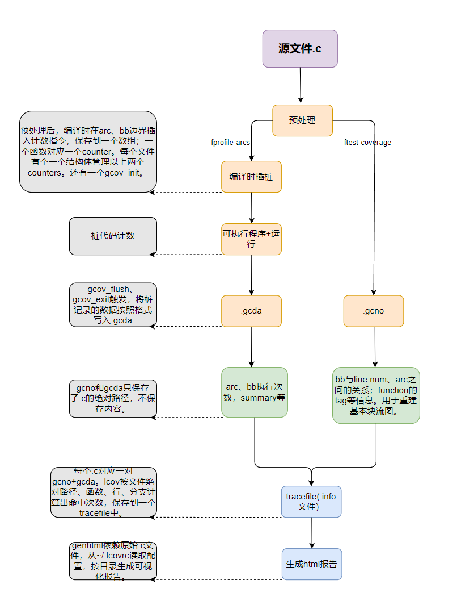
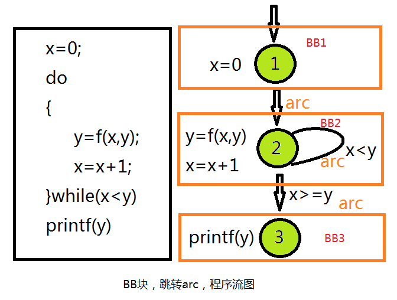
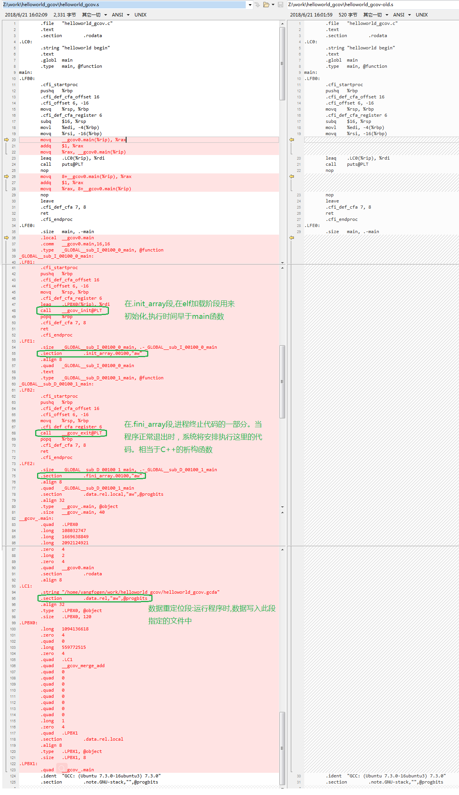

====================
C
====================

:Date:   2021-09-09 00:37:13

1. `用C语言实现面向对象编程OOP <https://mp.weixin.qq.com/s/Vj31M2q0H5eeJwMhvDyt6A>`__
2. `C语言实现面向对象的原理 <https://mp.weixin.qq.com/s/b9IXQ8Hbh-8ejmU010sWiA>`__

参考链接
==========
1. 在线gdb：https://www.onlinegdb.com/myfiles
2. 在线汇编：https://godbolt.org/

优秀项目学习
=================

cjson
--------
待总结。

cmockery
------------
https://github.com/google/cmockery

待学习。

mockcpp
--------

ahttpd
--------
https://sqlite.org/althttpd/doc/trunk/althttpd.md

gcov
=======
1. `GCC Coverage代码分析 <https://blog.csdn.net/livelylittlefish/category_826830.html>`__
2. `gcov代码覆盖率测试-原理和实践总结 <https://blog.csdn.net/yanxiangyfg/article/details/80989680>`__
3. https://github.com/yanxiangyfg/gcov 与上个文章中汇编不一样，因为是32位系统？

gcov原理
----------
1. ☆☆  gcov原理 https://github.com/QuanjunZhang/gcov
2. `Linux平台代码覆盖率测试工具GCOV相关文件分析_学习，思考，记录，分享。-CSDN博客  <https://blog.csdn.net/livelylittlefish/article/details/6321909>`__
3. `Lcov生成的Info文件格式分析_BruceXY的博客-CSDN博客  <https://blog.csdn.net/BruceXY/article/details/17139777>`__

    gcov原理

汇编伪指令
~~~~~~~~~~~~~~~~
gcc生成的汇编文件中，供编译器使用。不出现在在最终可执行程序。

1. https://sourceware.org/binutils/docs/as/Pseudo-Ops.html 
2. 或https://ftp.gnu.org/old-gnu/Manuals/gas-2.9.1/html_chapter/as_7.html

覆盖率统计原理
~~~~~~~~~~~~~~~~~~~
用 基本块BB 和 跳转ARC 计数，结合程序流图来实现代码覆盖率统计

1. 基本块BB：BB为执行次数相同的一段代码，一般为 多个顺序语句+跳转语句组成，有条件的跳转则会产生分支。

2. ARC：从一个BB到另一个BB的跳转。

3. 程序流图：BB为节点，ARC即弧/有向边。只需要知道部分BB和ARC的执行次数，即可推断出所有语句和分支的执行次数。

    gcov程序流图

    gcov汇编插桩

gcov使用
----------
开启gcov
~~~~~~~~~~~
在源码编译参数中加入-fprofile-arcs -ftest-coverage

* -ftest-coverage：在编译的时候产生.gcno文件，它包含了重建基本块图和相应的块的源码的行号的信息。
* -fprofile-arcs：在运行编译过的程序的时候，会产生.gcda文件，它包含了弧跳变的次数等信息。

生成gcda
~~~~~~~~~~~
程序exit时调用 exit handlers ( __gcov_exit() -> __gcov_flush() ) ，将覆盖率数据写到gcda。

生成报告
~~~~~~~~~~
1. 文件 ``~/.lcovrc`` 可配置genhtml颜色阈值。
2. lcov对应使用的是gcov，gcov版本需和编译时gcc版本一致。

$ lcov -c -d . -o helloworld_gcov.info
$ genhtml -o 111 helloworld_gcov.info

tracefile info文件
-------------------
::

   *.info文件包含一个或多个源文件所对应的覆盖率信息，一个源文件对应一条“记录”，“记录”中的详细格式如下：

   TN: <Test name> 表示测试用例名称，即通过geninfo中的--test-name选项来命名的测试用例名称，默认为空；

   SF: <File name> 表示带全路径的源代码文件名；

   FN: <函数启始行号>, <函数名>; <函数有效行总数>; <函数有效行总数中被执行个数>

   FNDA: <函数被执行的次数>, <函数名>; <函数有效行总数>; <函数有效行总数中被执行个数>

   FNF: <函数总数>

   FNH: <函数总数中被执行到的个数>

   BRDA: <分支所在行号>, <对应的代码块编号>, <分支编号>, <执行的次数>

   BRF: <分支总数>

   BRH: <分支总数中被执行到的个数>

   DA: <代码行号>, <当前行被执行到的次数>

   LF: < counts> 代码有效行总数

   LH: <counts> 代码有效行总数中被执行到的个数

   end_of_record 一条“记录”结束符

gcno和gcda文件格式
----------------------

增量统计Coverage
--------------------
1. 可使用工具：diff-cover、addlcov、gcovr；
2. 自己实现：以git diff 中的 **文件路径和行号** 在tracefile中查找对应文件和行覆盖的数据。

