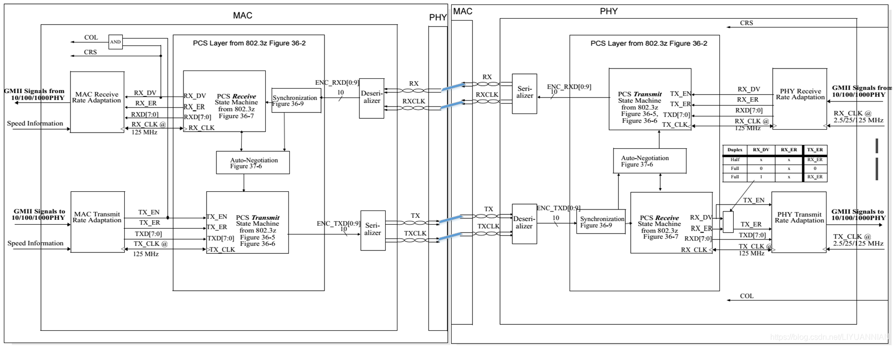

================
802.3
================

参考文档
===========
1. :download:`IEEE802.3-2018 <../files/8023/IEEE802.3-2018.rar>`
2. xlinx的手册

LLC子层的服务与服务在IEEE 802.2 LAN协议中有所定义，MAC层的主要功能作用则在IEEE 802.3中定义，并采用CSMA/CD访问控制方式.

标准介绍
=============
IEEE 802.3 is a working group and a collection of IEEE standards produced by the working group 
defining the physical layer and data link layer's media access control (MAC) of wired Ethernet

章节介绍
-----------

最新版为2018版，共有8个section，126个clause，120个annex，共5600页，总大小47.3M。

Section One includes the specifications for 10 Mb/s operation and the MAC, frame formats and service
interfaces used for all speeds of operation

1. MAC相关标准(可阅读)：1-8章
   10M以太网：8-20章

2. 100M以太网：21-33章

3. 1000M以太网：34-43章

4. 10G以太网：44-77章

5. 节能以太网：78-79章

6. 40G/100G以太网：80-95章

7. 单对双绞线(车载)：96-115章

8. 200G/400G以太网：116-124章
   2.5G/5G以太网：125-126章

以太网术语
---------------
以太网术语基于互连数据速率 (R)、调制类型 (mTYPE)、介质长度 (L) 和对PHY的PCS编码 (C) 模式的参考。
当多个通道聚合时，这还包括聚合通道数量 (n) 的额外信息。如果参考通道数量，则假设为单通道接口。
以太网术语中使用的 ``R mTYPE - L C n`` 参数定义如下：

1. 数据速率 (R)：

   - 1000 → 1000 Mbps或1 Gbps；兆位单位从数据速率参考中移除
   - 10G → 10 Gbps
   - 10/1G → Gbps下行，1 Gbps上行

2. 调制类型 (mTYPE)：BASE → 基带

3. 介质类型/波长/距离 (L)：

   - B → 双向光纤，上行(D) 或上行 (U) 限定符不对称
   - C → 双轴铜缆
   - D → 并行单模 (500 m)
   - E → 超长光波长λ (1510/1550 nm) / 距离 (40 km)
   - F → 光纤 (2 km)
   - K → 背板
   - L → 长光波长λ (~1310 nm) / 距离 (10 km)
   - P → 无源光纤，带有单个或多个下游 (D) 或上游 (U) 不对称限定符，而且带有4B/5B或8B/10B的外部来源编码 (X)
   - RH → 采用PAM16编码的红色LED塑料光纤和不同发射功率的光纤
   - S → 短光波长λ (850 nm) / 距离 (100 m)
   - T → 双绞线

4. PCS编码 (C)：

   - R → 扰码 (64B/66B)
   - X → 外部来源编码 (4B/5B, 8B/10B)

5. 通道数 (n)：

   - 空白，无通道数 → 默认为1-通道
   - 4 → 4-通道

在以太网中，要实现有效的1 Gbps吞吐量，实际线速率是1.25 Gbps，而在万兆以太网吞吐量中，线速率是10.3125 Gbps。 

MAC
=======
MAC的作用： 帧构造、buffer、crc、flow control、通过mii管理phy。

网络变压器
------------
PHY芯片通常会串联网络变压器出来到UTP，主要作用是信号电平耦合。

1. 可以增强信号，使其传输距离更远；
2. 使芯片端与外部隔离，增强抗干扰能力，增加对芯片的保护作用（如雷击）；
3. 当接到不同电平的网口时，不会对彼此设备造成影响

问题
========
1. `网口扫盲二:Mac与Phy组成原理的简单分析 <https://www.cnblogs.com/jason-lu/p/3196096.html>`_
2. `网口扫盲三:以太网芯片MAC和PHY的关系 <https://www.cnblogs.com/jason-lu/articles/3195473.html>`_

DMA与MAC
-------------
通常在MAC中会有一组寄存器专门用户记录数据地址, tbase与rbase, cpu按MAC要的格式把数据放好后, 启动MAC的数据发送就可以了.启动过程常会用到寄存器tstate.

CSMA/CD与数据发送
-------------------

发送数据时,网卡首先侦听介质上是否有载波(载波由电压指示),
如果有,则认为其他站点正在传送信息,继续侦听介质.
一旦通信介质在一定时间段内(称为帧间缝隙IFG=9.6微秒)是安静的,
即没有被其他站点占用,则开始进行帧数据发送,同时继续侦听通信介质,以检测冲突.
在发送数据期间,如果检测到冲突,则立即停止该次发送,并向介质发送一个“阻塞”信号,
告知其他站点已经发生冲突,从而丢弃那些可能一直在接收的受到损坏的帧数据,
并等待一段随机时间(CSMA/CD确定等待时间的算法是二进制指数退避算法).
在等待一段随机时间后,再进行新的发送.如果重传多次后(大于16次)仍发生冲突,就放弃发送.
接收时,网卡浏览介质上传输的每个帧,如果其长度小于64字节,则认为是冲突碎片.
如果接收到的帧不是冲突碎片且目的地址是本地地址,则对帧进行完整性校验,

如果帧长度大于1518字节(称为超长帧,可能由错误的LAN驱动程序或干扰造成)或未能通过CRC校验,则认为该帧发生了畸变.通过校验的帧被认为是有效的,网卡将它接收下来进行本地处理.

SGMII和GMII
-------------
https://www.jianshu.com/p/fb2a8e55c8e9

接口定义及区别

- RGMII均采用4位数据接口，工作时钟125MHz，并且在上升沿和下降沿同时传输数据，因此传输速率可达1000Mbps。
- SGMII即Serial GMII，串行GMII，收发各一对差分信号线，时钟频率625MHz，在时钟信号的上升沿和下降沿均采样

大多数MAC芯片的SGMII接口都可以配置成SerDes接口（在物理上完全兼容，只需配置寄存器即可），
直接外接光模块，而不需要PHY层芯片，此时时钟速率仍旧是625MHz。

不过此时跟SGMII接口不同，SGMII接口速率被提高到1.25Gbps是因为插入了控制信息，
而SerDes端口速率被提高是因为进行了8B/10B变换，本来8B/10B变换是PHY芯片的工作，
在SerDes接口中，因为外面不接PHY芯片，此时8B/10B变换在MAC芯片中完成了。

8B/10B变换的主要作用是扰码，让信号中不出现过长的连“0”和连“1”情况，影响时钟信息的提取。

PHY
=========

PHY是物理接口收发器,它实现物理层.IEEE-802.3标准定义了以太网PHY.包括MII/GMII(介质独立接口)子层,PCS(物理编码子层),PMA(物理介质附加)子层,PMD(物理介质相关)子层,MDI子层.

从硬件上来说，一般PHY芯片为模数混合电路，负责接收电、光这类模拟信号，经过解调和A/D转换后通过MII接口将信号交给MAC芯片进行处理。一般MAC芯片为纯数字电路。

物理层定义了数据传送与接收所需要的电与光信号、线路状态、时钟基准、数据编码和电路等，并向数据链路层设备提供标准接口。物理层的芯片称之为PHY。

PHY寄存器
-----------
https://blog.csdn.net/ZCShouCSDN/article/details/80090802

地址空间为5位，从0到31最多可以定义32个寄存器（随着芯片功能不断增加，很多PHY芯片采用分页技术来扩展地址空间以定义更多的寄存器），IEEE802.3定义了地址为0-15这16个寄存器的功能，地址16-31的寄存器留给芯片制造商自由定义.

具体见IEEE802.3标准的 22.2.4 Management functions 节,Table 22–6—MII management register set。

MDIO
--------
https://blog.csdn.net/rhythmwang/article/details/62039140

MDIO是Management Data Input/Output 的缩写，有两根线，分别为双向的MDIO和单向的MDC，用于以太网设备中上层对物理层的管理。

在第22中，一个单独的帧指定要读或写的地址和数据，同时完成了这些工作。45号中改变这种范式，第一个地址帧发送到指定的MMD和寄存器，然后发送第二帧来执行读或写。

SERDES的通用结构介绍
--------------------------

https://bbs.huaweicloud.com/blogs/detail/282347

常用phy芯片
--------------

rtl8211fs(i)(-vs)-cg :网上无公开datasheet

rtl8211e(g)-vb(vl)-cg: `千兆PHY详解及调试举例 <https://cloud.tencent.com/developer/article/1652191>`_

marvel 88e1111:https://blog.csdn.net/qq_39466755/article/details/109050806

Auto-Negotiation
====================
1. `以太网自动协商原理 <https://www.cnblogs.com/rykang/p/12132432.html>`__

Clause 22: Physical Layer link signaling for Auto-Negotiation on twisted pair
-----------------------------------------------------------------------------------
1000base-t: Clause 40.5.1

并行检测机制如果检测到NLP，则知道对方支持10M速率；如果检测到4B/5B编码的Idle符号，则知道对方支持100M速率

NLP
~~~~
周期16±8ms，且只有单个脉冲。

Normal Link Pulse (NLP): An out-of-band communications mechanism used in 10BASE-T to
indicate link status. (See IEEE Std 802.3, Figure 14–13.)

Normal Link Pulse (NLP) sequence: A Normal Link Pulse sequence, defined in IEEE Std 802.3,
14.2.1.1 as TP_IDL

TP_IDL is a start of idle, as defined in 14.3.1.2.1, followed by a repeating sequence of a 16 ms ±
8 ms period of silence (the time where the differential voltage remains at 0 mV ± 50 mV) and a link test
pulse (see 14.3.1.2.1).

FLP
~~~~~~
周期为16±8ms。33个位置之间的时间间隔是一个范围。
33个脉冲位置，其中17个奇数位置固定为时钟脉冲，16个偶数位置为可能的数据脉冲(有脉冲代表1，无代表0)，从而能表示16bit的协商base page。

   FLP脉冲时间

Clause 37: 1000base-x
-------------------------------
1. https://github.com/awokezhou/Communication/wiki/Auto-Negotiation
2. `以太网遵循的IEEE 802.3 标准  <https://zhuanlan.zhihu.com/p/139515133>`__ 
3. `SGMII自协商 <https://blog.csdn.net/weixin_39673080/article/details/87887269>`__
4. http://xilinx.eetrend.com/content/2020/100049032.html
5. https://www.cnblogs.com/justin-y-lin/p/12144713.html
6. `Clause_37_Auto-Negotiation <https://www.iol.unh.edu/sites/default/files/knowledgebase/ge/Clause_37_Auto-Negotiation.pdf>`__
   :download:`Clause_37_Auto-Negotiation.pdf <../files/Clause_37_Auto-Negotiation.pdf>`

PHY寄存器在IEEE802.3标准的 22.2.4 Management functions 节有介绍。1000base-t在clause40，使用了next page。

sgmii an
---------------

1. :download:`Serial-GMII Specification <../files/8023/SGMII.pdf>`

This is achieved by using the Auto-Negotiation
functionality defined in Clause 37 of the IEEE Specification 802.3z. 

Instead of the ability
advertisement, the PHY sends the control information via its tx_config_Reg[15:0] as specified
in Table 1 whenever the control information changes. 

Upon receiving control information, the
MAC acknowledges the update of the control information by asserting bit 14 of its
tx_config_reg{15:0] as specified in Table 1.

   sgmii接口：PHY和MAC

车载以太网
==============
1. `车载以太网协议的架构 <https://www.ednchina.com/technews/12381.html>`__
2. `从物理层到应用层，车载以太网协议簇泛读 <https://www.ednchina.com/technews/12860.html>`__

.. figure:: ../images/ethernet_bus.jpg

   车载以太网架构

CSMA/CD时延不可靠。

当下Automotive ethernet都是单对双绞线，主要物理协议为IEEE 100BASE-T1(802.3bw,Clause 96)、IEEE 1000BASE-T1(802.3bp,Clause 97,支持clause98的自协商)、
IEEE802.3ch对应的2.5G 5G10G（2020.6.4通过）、以及10M车载以太网还没有开始推进使用对应的物理层协议IEEE 802.3cg。

100BASE-T1在物理连接上使用了一对双绞线实现全双工的信息传输，而100BASE-TX则使用了两对双绞线实现全双工。

只采用单对差分电压传输的双绞线，但是100M/s以太网可以通过回音消除技术来实现全双工通信。

目前广泛使用的以太网帧格式主要有2种，分别为Ethernet II帧格式与IEEE802.3帧格式。其中车载以太网主要采用Ethernet II帧格式
