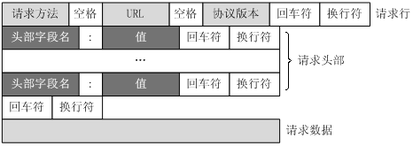
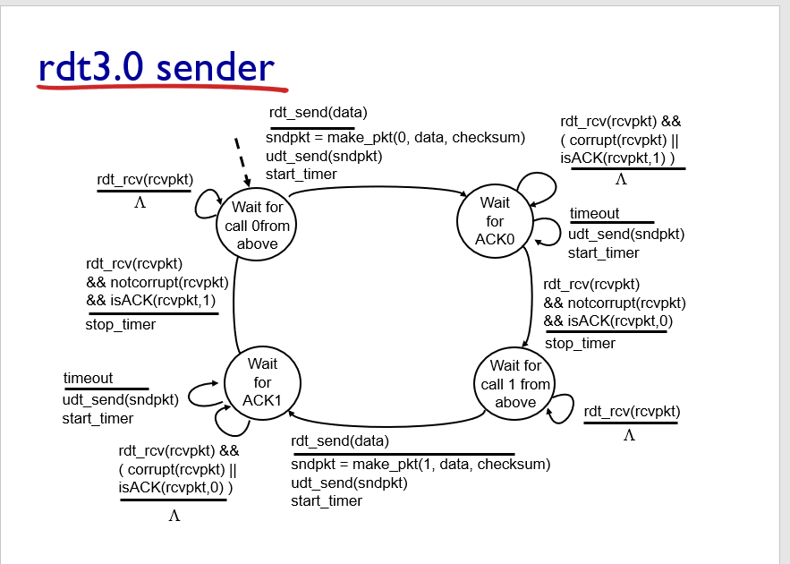

<font face="微软雅黑"></font>

<!-- more -->

- [计算机网络 自顶而下方法](#计算机网络-自顶而下方法)
- [第一章 计算机网络和因特网](#第一章-计算机网络和因特网)
  - [网络核心](#网络核心)
  - [协议层次及服务模型](#协议层次及服务模型)
  - [OSI模型](#osi模型)
- [第二章 应用层](#第二章-应用层)
  - [应用层协议](#应用层协议)
  - [超文本传输协议](#超文本传输协议)
  - [电子邮件](#电子邮件)
  - [DNS 因特网目录服务](#dns-因特网目录服务)
  - [P2P文件分发](#p2p文件分发)
  - [视频流和内容分发网](#视频流和内容分发网)
  - [套接字编程](#套接字编程)
- [第三章 运输层](#第三章-运输层)
  - [多路复用与多路分解](#多路复用与多路分解)
  - [无连接运输UDP](#无连接运输udp)
  - [面向连接的运输TCP](#面向连接的运输tcp)
    - [可靠数据传输原理](#可靠数据传输原理)
    - [TCP介绍](#tcp介绍)
  - [TCP拥塞控制](#tcp拥塞控制)
  - [为什么需要三次握手](#为什么需要三次握手)
  - [相关协议](#相关协议)
- [第四章 网络层-数据平面](#第四章-网络层-数据平面)
  - [网络层概述](#网络层概述)
  - [路由器工作原理](#路由器工作原理)
  - [IP网际协议](#ip网际协议)
    - [IPv4数据报格式](#ipv4数据报格式)
    - [IPv6](#ipv6)
  - [通用转发](#通用转发)
- [第五章 网络层-控制平面](#第五章-网络层-控制平面)
  - [路由选择算法](#路由选择算法)
    - [集中式路由选择算](#集中式路由选择算)
    - [分散式路有选择算法](#分散式路有选择算法)
  - [AS内部路由OSFP](#as内部路由osfp)
  - [AS间路由选择BGP](#as间路由选择bgp)
  - [SDN控制平面](#sdn控制平面)
    - [Openflow](#openflow)
  - [因特网控制报文协议ICMP](#因特网控制报文协议icmp)
  - [简单网络管理协议SNMP](#简单网络管理协议snmp)
- [第六章 链路层和局域网](#第六章-链路层和局域网)
  - [链路层概述](#链路层概述)
  - [差错检测和纠正技术](#差错检测和纠正技术)
  - [多路访问链路和协议](#多路访问链路和协议)
  - [交换局域网](#交换局域网)
    - [链路层寻址和ARP](#链路层寻址和arp)
    - [以太网 802.3](#以太网-8023)
    - [链路层交换机](#链路层交换机)
    - [虚拟局域VLAN](#虚拟局域vlan)
  - [链路虚拟化](#链路虚拟化)
  - [数据中心网络](#数据中心网络)
  - [页面请求的历程](#页面请求的历程)
- [无线网络和移动网络](#无线网络和移动网络)
  - [无线链路和网络特征](#无线链路和网络特征)
  - [WIFI：802.11无线LAN](#wifi80211无线lan)
  - [蜂窝因特网](#蜂窝因特网)
    - [移动网络路由选择](#移动网络路由选择)
  - [移动IP](#移动ip)
  - [无线和移动性对运输层和应用层的影响](#无线和移动性对运输层和应用层的影响)
- [计算机网络中的安全](#计算机网络中的安全)
- [套接字编程](#套接字编程-1)
  - [Web Server](#web-server)
  - [UDP Ping](#udp-ping)
  - [Proxy Server](#proxy-server)
  - [SMTP Client](#smtp-client)
- [Wireshark LAB](#wireshark-lab)

# 计算机网络 自顶而下方法

# 第一章 计算机网络和因特网
**协议**（protocol）：定义了在两个或者多个通信实体之间交换报文的格式和顺序，以及报文发送和/或接收一条报文或其它事件所采取的动作。

IETF：Internet Engineering Task Force，IETF的标准文档称为RFC（Request For Comment，请求评论）。

## 网络核心
通过网络链路和交换机移动数据有两种基本方法：分组交换和电路交换。

**分组交换**
分组交换机：路由器和链路层交换机。
存储转发、排队时延和分组丢失、转发表和路由选择协议、
特点：带宽共享；更简单、有效、实现成本更低。端到端延时不可预测。

因特网尽可能以实时方式交付分组，但不做保证。
**电路交换**
信息发送前，需要在发送方和接收方之间建立连接，路径上的交换机都将为该连接维护连接状态，同时预留恒定的带宽，以确保发送方能以恒定速率向接收方传输数据。

实现方式：频分复用（FDM）和时分复用（TDM）。
传统的电话网络即为电路交换网络。
## 协议层次及服务模型
分层：
- 优点：概念化和结构化。
- 缺点：功能冗余（如差错恢复）、层间依赖。


OSI开放系统互联模型。

  


TCP/IP 五层模型/因特网协议


比OSI缺少的两层留给开发者处理。

## OSI模型
各层所有的协议即为协议栈。

**应用层**
- 作用：为计算机用户提供接口，也为用户提供各种网络服务。
- 协议：HTTP、FTP、POP3、SMTP、DNS。
- 数据：报文

**表示层**
- 作用：使通信的应用程序能够解释交换数据的含义。提供各种用于应用层数据的编码和转换功能，确保一个系统的应用层发送的数据能被另外一个系统的应用层识别。

**会话层**
- 作用：建立、管理和终止表示层实体之间的通信会话。该层的通信由不同设备中的应用程序之间的服务请求和响应组成。

**传输层**
- 作用：在应用层端点之间传送报文。建立主机端到端的链接，为上层协议提供端到端的可靠和透明的数据传输服务，包括差错控制和流量控制等。
- 协议：TCP/UDP
- 数据：报文段

**网络层**
- 作用：将称为数据报的网络层分组从一台主机移动到另一台主机。通过IP寻址来建立两个节点之间的连接，为源端的运输层送来的分组选择合适的路由和交换节点，传输给目的端的运输层。
- 协议：IP网际协议
- 数据：数据报
- 路由器工作在网络层。

**数据链路层**
- 作用：将称为帧的链路层分组从一个网络元素移动到另一个网络元素。将比特组合成字节，再将字节组合成帧，使用链路层地址（以太网使用MAC地址）来访问介质，并进行差错检测。
- 协议：以太网、WIFI、电缆接入网的DOCSIS协议
- 数据：帧
- 交换机工作在链路层。

**物理层**
- 作用：将帧中的一个比特从一个节点移动到下一个节点。通过物理介质传输比特流。
- PDU（协议数据单元）：bit
- 设备：集线器HUB、中继器、调制解调器、网线、双绞线、同轴电缆
- 注意：没有寻址的概念


重要概念：封装、首部字段+有效载荷


病毒：一种需要某种形式的用户交互来感染用户设备的恶意软件。如包含恶意可执行代码的电子邮件附件。
蠕虫：无需任何明显用户交互就能进入设备的用户软件。


# 第二章 应用层
## 应用层协议
网络应用程序体系结构：
- 客户-服务器体系结构（C-S）：服务器具有固定的、周知的IP地址，服务于其它主机的请求。
- 对等体系结构（P2P）：非集中式，具有自扩展性。许多流量密集型应用基于P2P，如 BitTorrent。

**应用通信实际是进程通信：**
1. 客户和服务器进程；
2. 套接字是应用程序进程与运输层协议之间的应用程序编程接口（API）；
3. 进程寻址：IP地址，端口号。

**运输层协议为应用程序提供的服务：**
1. 可靠的数据传输
2. 吞吐量
3. 定时
4. 安全性

**因特网提供的运输服务：**
- TCP服务：包括面向连接服务和可靠数据传输服务。
- UDP服务：不提供不必要服务的轻量级运输协议，仅提供最小服务。无连接，不可靠数据传输。


**应用层协议**定义了：
- 交换报文的类型
- 各种报文的语法
- 字段的语义
- 确定一个进程何时以及如何发送报文，对报文进行响应的规则

## 超文本传输协议
>《HTTP权威指南》

RFC 2616

**HTTP**（超文本传输协议）：
- Web的应用层协议。
- 无状态协议，不保存关于客户的状态信息。
- **Web页面**：一般含有一个HTML基本文件以及多个引用对象。

1. 非持续连接：一个单独的TCP连接只发送一对请求报文/响应报文。在第三次握手时带上http请求报文，故总的响应时间为 2*RTT + 服务器上传html文件的时间；为每个请求建立和维护一个TCP连接（缓冲区和变量），资源消耗大。
2. 持续连接：所有请求相应经相同的TCP连接发送。

**HTTP报文的格式**
https://developer.mozilla.org/en-US/docs/Web/HTTP/Messages




请求报文:
- 请求行：方法、URL、HTTP版本
- 首部行
- 实体体

**请求方法**
>GET, HEAD, POST, PUT, DELETE, CONNECT, OPTIONS, TRACE， PATCH等[方法的含义](https://developer.mozilla.org/en-US/docs/Web/HTTP/Methods)。

***


响应报文:
- 状态行：版本、状态码、相应状态信息。
- 首部行
- 实体体

>**响应状态码**：

***
**Cookies**:识别用户，允许站点对用户进行跟踪。在无状态的HTTP之上建立一个用户会话层。
1. 响应报文中的cookie首部行，Set-cookie（单次）；
2. 用户端系统中的cookie文件；
3. 请求报文中的cookie首部行；
4. Web站点的后端数据库。

**Web缓存器**：也叫代理服务器。CDN
1. 减少对客户请求的时间；
2. 减少接入链路到因特网的通信量；
3. 降低因特网上的Web流量。

条件GET：获取指定时间后的修改。保证缓存为最新。304 Not Modified


## 电子邮件
异步通信媒介。


**SMTP**：使用TCP可靠数据传输服务。从发送方的邮件服务器向接收方的邮件服务器发送邮件。

- 采用7比特ACSII编码，在传输前需要将二进制数据编码为ASCII码。
- 一般不使用中间邮件服务器发送邮件，即邮件不在非用户邮件服务器存留。

**HTTP与SMTP比较：**
| 类别 | HTTP | SMTP |
|:---|:-------|:--------|
| 协议 | 拉协议 |推协议 |
| 数据格式 | 数据不受限制 | 7比特ASCII码格式 |
| 文档处理 | 把每个对象封装到它自己的HTTP的响应报文 | 所有对象放在一个报文内 |

**邮件访问协议：** 第三版邮局访问协议（POP3）、因特网邮件访问协议（IMAP）、HTTP

## DNS 因特网目录服务

DNS：Domain Name System，域名系统。
1. 一个由分层的DNS服务器实现的分布式数据库；
2. 一个使得主机能够查询分布式数据库的应用层协议，运行在UDP，端口53上。


**提供的服务：**
1. 提供主机名到IP地址的目录转换服务。
2. 主机别名
3. 邮件服务器别名
4. 负载分配


**DNS工作机理概述**
1. 分布式、层次数据库;递归查询和迭代查询
2. DNS缓存：改善时延性能、减少在因特网上传输的DNS报文数量。
3. DNS记录和报文：资源记录，查询和回答报文具有相同格式。


## P2P文件分发
- 自扩展性：对等方是比特的消费者也是重新分发者。TCP，bitTorrent

- 洪流：参与一个特定文件分发的所有对等方的集合。每个洪流具有一个追踪器，追踪参与在洪流中的对等方。追踪器随机选择洪流中的对等方子集列表发送给新加入的对等方。

- 最稀缺优先（发出请求）：首先请求在其邻居中副本数量最少的块，以使得均衡每个块在洪流中的数量。

- 对换算法（响应请求）：根据当前给自身提供数据的速率来给出优先权，高速率具有高优先权。

- 分布式散列表DHT，一种简单的数据库，数据记录分布在一个P2P系统的多个对等方上。

## 视频流和内容分发网
**DASH**：经HTTP的动态适应流，允许客户使用不同的以太网接入速率六十播放具有不同编码速率的视频。

速率决定算法：客户已缓存块多且接受带宽高，则选择高速率版本。

**CDN**内容分发网:
- 两种服务器安置原则：深入（靠近端用户）和邀请做客（靠近ISP），延时、吞吐量与成本的权衡。
- 利用DNS截获和重定向请求。
- 集群选择策略：动态地将客户定向到CDN中的某个服务器集群或者数据中心的机制。


## 套接字编程
生成网络应用。TCP/UDP。

# 第三章 运输层

**多路分解和多路复用**将网络层提供的主机间交付服务扩展到运输层的进程间交付服务。

运输层协议只工作在端系统中，中间路由器仅作用于数据报的网络层字段。

最低限度的运输层服务：进程到进程的数据交付和差错检查（UDP只提供了这两种服务）。

## 多路复用与多路分解

IP网际协议提供尽力而为的服务，即不可靠服务。

- **多路分解**：将运输层报文段的数据交付到正确的套接字的工作（向上层协议）。
- **多路复用**：在源主机从不同的套接字接收数据块，并为每个数据块封装上首部信息从而生产报文段，然后将报文段传递到网络层。


**套接字**
- UDP套接字：由一个二元组标识，包含一个目的IP和一个目的端口号。
- TCP套接字：由一个四元组标识，包含源IP地址、源端口号、目的IP地址、目的端口号。


## 无连接运输UDP
User Datagram Protocol

UDP的优点（相对于TCP）：
 1. 关于发送什么数据以及何时发送的应用层控制更为精细。TCP受拥塞控制机制的限制。

 2. 无需建立连接。TCP三次握手引入建立连接的时延。

 3. 无连接状态。TCP需在端系统中维护连接状态。

 4. 分组首部开销小。TCP-20字节，UDP-8字节。


使用UDP的应用可在自身中建立可靠性机制来实现可靠数据传输。如chrome中的QUIC协议。


**UDP报文段结构**
RFC 768

```
                  0      7 8     15 16    23 24    31
                 +--------+--------+--------+--------+
                 |     Source      |   Destination   |
                 |      Port       |      Port       |
                 +--------+--------+--------+--------+
                 |                 |                 |
                 |     Length      |    Checksum     |
                 +--------+--------+--------+--------+
                 |
                 |          data octets ...
                 +---------------- ...

                      User Datagram Header Format
```


**UDP检验和**
在端到端基础上提供差错检测功能（无差错恢复）。在更低层上实现差错检查可能是冗余或无价值的。

校验和：对报文段中的数据，按16比特字求和并进行反码运算，溢出时回卷。

## 面向连接的运输TCP

### 可靠数据传输原理

推导出实现可靠数据传输的一些条件和方法。如序号、累计确认、检验和、超时/重传。




ARQ自动重传请求协议。停等协议。

差错恢复：回退N步（GBN）和选择重传（SR）。

### TCP介绍

TCP 在不可靠的（IP)端到端网络层之上实现可靠的数据传输协议。

涉及 **连接管理、流量控制、往返时间估计、可靠数据传送等。**

**TCP报文段结构**
RFC 793

```
    0                   1                   2                   3   
    0 1 2 3 4 5 6 7 8 9 0 1 2 3 4 5 6 7 8 9 0 1 2 3 4 5 6 7 8 9 0 1 
   +-+-+-+-+-+-+-+-+-+-+-+-+-+-+-+-+-+-+-+-+-+-+-+-+-+-+-+-+-+-+-+-+
   |          Source Port          |       Destination Port        |
   +-+-+-+-+-+-+-+-+-+-+-+-+-+-+-+-+-+-+-+-+-+-+-+-+-+-+-+-+-+-+-+-+
   |                        Sequence Number                        |
   +-+-+-+-+-+-+-+-+-+-+-+-+-+-+-+-+-+-+-+-+-+-+-+-+-+-+-+-+-+-+-+-+
   |                    Acknowledgment Number                      |
   +-+-+-+-+-+-+-+-+-+-+-+-+-+-+-+-+-+-+-+-+-+-+-+-+-+-+-+-+-+-+-+-+
   |  Data |           |U|A|P|R|S|F|                               |
   | Offset| Reserved  |R|C|S|S|Y|I|            Window             |
   |       |           |G|K|H|T|N|N|                               |
   +-+-+-+-+-+-+-+-+-+-+-+-+-+-+-+-+-+-+-+-+-+-+-+-+-+-+-+-+-+-+-+-+
   |           Checksum            |         Urgent Pointer        |
   +-+-+-+-+-+-+-+-+-+-+-+-+-+-+-+-+-+-+-+-+-+-+-+-+-+-+-+-+-+-+-+-+
   |                    Options                    |    Padding    |
   +-+-+-+-+-+-+-+-+-+-+-+-+-+-+-+-+-+-+-+-+-+-+-+-+-+-+-+-+-+-+-+-+
   |                             data                              |
   +-+-+-+-+-+-+-+-+-+-+-+-+-+-+-+-+-+-+-+-+-+-+-+-+-+-+-+-+-+-+-+-+
```

1. 序号：报文的首字节的字节流编号，初始为随机生成，两端各有一个（）。
2. 确认号：期望收到的下一字节的序号。
3. 接收窗口：指示接收方愿意接收的字节数量，用于流量控制。
4. 6比特标识字段：ACK、RST、SYN、FIN、PSH、URG。


冗余ACK：接收方对已经接收到的最后一个按序字节数据进行重复确认，3次则认为已发生丢包，则执行快速重传。

**流量控制**
TCP连接两端分配了接收缓存。
发送方维护一个接收窗口cwnd，将未确认的数据量控制在rwnd内。（rwnd=0时需要发送一个单字节报文以从接收方获取最新的cwnd，避免阻塞）。

- 流量控制：避免发送方使接收方缓存溢出。
- 拥塞控制：因IP网络拥塞（路由器缓存溢出）而遏制发送发。


## TCP拥塞控制

**拥塞控制原理**
1. 端到端的拥塞控制
2. 网络辅助的拥塞控制ECN

TCP使用端到端的拥塞控制，因为IP层不向网络层提供显式的网络拥塞反馈。

**AIMD加性增、乘性减**：每个RTT内cwnd线性增加1MSS，然后出现3个冗余ACK事件时cwnd减半。
RTT(Round Trip Time)：一个连接的往返时间，即数据发送时刻到接收到确认的时刻的差值； 

MTU（Maximum Transmission Unit）：最大传输单元，MSS+头部40字节=1500字节。
MSS：Maximum Segment Size。1460字节。

**TCP拥塞算法：**
TCP拥塞控制仍在继续演化，如Reno、Vegas等算法。

慢启动和拥塞避免是强制部分。
1. 慢启动：每个RTT cwnd × 2 ，超时丢包时设置ssthresh=cwnd/2,cwnd=1，重新开始慢启动。当cwnd=ssthresh时，进入拥塞避免。冗余ack丢包时，进入快速恢复。
2. 拥塞避免：每个RTT cwnd+1 ,超时丢包时设置ssthresh=cwnd/2,cwnd=1。冗余ack丢包时，ssthresh=cwnd，进入快速恢复。
3. 快速恢复：对于引起TCP进入快速恢复状态的缺失报文段，每收到一个冗余ACK则cwnd+1 ，当丢失报文的ack到达时降低cwnd并进入拥塞避免。超时丢包时设置ssthresh=cwnd/2,cwnd=1，重新开始慢启动。

**公平性**
TCP趋于在竞争的多条TCP连接之间提供对一段瓶颈链路带宽的平等分享。

1. 拥有较小RTT的连接能够在链路空闲时更快抢到可用带宽，享有更高吞吐量。
2. 应用通常使用多个并行TCP连接。
3. UDP源可能压制TCP流量。

## 为什么需要三次握手
https://mp.weixin.qq.com/s/tH8RFmjrveOmgLvk9hmrkw

1. 阻止历史重复连接的初始化（主要原因）；
2. 同步双方的初始序列号；
3. 避免建立多个无效连接，造成资源浪费。

TCP通过观察分组丢失来推断拥塞。

## 相关协议
**ECN明确拥塞通告**：允许网络向TCP发送方和接收方发送拥塞信号。TCP可利用ECN。

- DCCP数据报拥塞控制协议：低开销、面向报文、类UDP的不可靠服务，可选ECN。
- DCTCP数据中心TCP：使用ECN以更好地支持短流和长流的混合流。
- SCTP流控制传输协议：允许几个不同应用层次的流复用到同一个连接。
- QUIC Quick UDP Internet Connection:在UDP之上，作为应用层协议实现重传、差错检查、快速连接建立、基于速率的拥塞控制算法，以提供可靠性。
- TFRC TCP友好速率控制：一种拥塞控制协议。

# 第四章 网络层-数据平面
## 网络层概述

**转发**：当一个分组到达路由器的某一条输入链路时，路由器必须将该分组移动到适当的输出链路。转发是在数据平面中中实现的唯一功能。转发表

**路由选择**：确定分组从源到目的地所采用的端到端路由的网络范围处理过程。在控制平面中实现。SDN方法

**网络服务模型**：定义了分组在发送与接收端之间的端到端运输特性。
1. 确保交付
2. 具有时延上限的确保交付；
3. 有序分组交付；
4. 确保最小带宽；
5. 安全性


网络层提供尽力而为服务。
**链路层交换机**：基于链路层帧中的首部字段进行转发。
**路由器**：基于网络层数据报中的首部字段进行转发。


## 路由器工作原理


路由器的输入端口、输出端口和交换结构几乎总是用硬件实现。

1. 输入端口：基于目的地的转发。线路端接功能与链路层处理；
2. 交换结构：经内存交换、经总线交换、经互联网络交换；
3. 输出端口：传输分组，执行必要的物理层和链路层功能；
4. 路由选择处理器：执行路由选择协议，维护路由选择表与关联链路状态信息，为路由器计算转发表。

最长前缀匹配规则：LPM，当有多个匹配时，选择最长的匹配项。

三态可寻址存储器TCAM：在常数时间查询，表项可达百万条。


**分组调度**
1. 先进先出（FIFO，FCFS）
2. 优先权排队
3. 循环和加权公平排队RR：参考https://man7.org/linux/man-pages/man7/sched.7.html

## IP网际协议
### IPv4数据报格式


```
    0                   1                   2                   3
    0 1 2 3 4 5 6 7 8 9 0 1 2 3 4 5 6 7 8 9 0 1 2 3 4 5 6 7 8 9 0 1
   +-+-+-+-+-+-+-+-+-+-+-+-+-+-+-+-+-+-+-+-+-+-+-+-+-+-+-+-+-+-+-+-+
   |Version|  IHL  |Type of Service|          Total Length         |
   +-+-+-+-+-+-+-+-+-+-+-+-+-+-+-+-+-+-+-+-+-+-+-+-+-+-+-+-+-+-+-+-+
   |         Identification        |Flags|      Fragment Offset    |
   +-+-+-+-+-+-+-+-+-+-+-+-+-+-+-+-+-+-+-+-+-+-+-+-+-+-+-+-+-+-+-+-+
   |  Time to Live |    Protocol   |         Header Checksum       |
   +-+-+-+-+-+-+-+-+-+-+-+-+-+-+-+-+-+-+-+-+-+-+-+-+-+-+-+-+-+-+-+-+
   |                       Source Address                          |
   +-+-+-+-+-+-+-+-+-+-+-+-+-+-+-+-+-+-+-+-+-+-+-+-+-+-+-+-+-+-+-+-+
   |                    Destination Address                        |
   +-+-+-+-+-+-+-+-+-+-+-+-+-+-+-+-+-+-+-+-+-+-+-+-+-+-+-+-+-+-+-+-+
   |                    Options                    |    Padding    |
   +-+-+-+-+-+-+-+-+-+-+-+-+-+-+-+-+-+-+-+-+-+-+-+-+-+-+-+-+-+-+-+-+
                
```
https://tools.ietf.org/html/rfc791

- 协议号将网络层与运输层关联起来。

- IP层只对首部计算校验和，传输层的TCP/UDP对整个报文的进行计算。


**IPv4数据报分片**

最大传送单元MTU：链路层能承载的最大数据量，以太网帧为1500bytes。不同链路层协议MTU不同。MTU也限制IP数据报的长度。

**IPv4 编址**
主机与物理链路之间的边界叫做**接口**。

每台主机和路由器接口均拥有自己的IP地址，即一个IP地址与一个接口相关联。


点分十进制。子网与子网掩码。无类别域间路由选择CIDR：a.b.c.d/x

**动态主机配置协议DHCP**：分配主机地址，获取子网掩码、默认网关（第一跳路由器地址）、本地DNS服务器。
1. DHCP服务器发现：广播，获取所在网络的DHCP服务器地址；
2. DHCP服务提供：广播，可能存在多个DHCP服务器；
3. DHCP请求：选择一个服务器，使用DHCP请求报文进行响应；
4. DHCP　ACK：响应请求报文，证实所要求的参数。


**网络地址转换NAT**：
- NAT转换表表项包含端口号和IP地址。
- 路由器重写数据报的目的IP和目的端口，然后转发。

中间盒：运行在网络层，功能包括NAT、负载均衡、防火墙等，不执行转发。

争议：路由器处于网络层，只应处理网络层的分组，不应修改IP地址和端口号。违反了主机应当直接对话的原则。

### IPv6


```
  +-+-+-+-+-+-+-+-+-+-+-+-+-+-+-+-+-+-+-+-+-+-+-+-+-+-+-+-+-+-+-+-+
   |Version| Traffic Class |           Flow Label                  |
   +-+-+-+-+-+-+-+-+-+-+-+-+-+-+-+-+-+-+-+-+-+-+-+-+-+-+-+-+-+-+-+-+
   |         Payload Length        |  Next Header  |   Hop Limit   |
   +-+-+-+-+-+-+-+-+-+-+-+-+-+-+-+-+-+-+-+-+-+-+-+-+-+-+-+-+-+-+-+-+
   |                                                               |
   +                                                               +
   |                                                               |
   +                         Source Address                        +
   |                                                               |
   +                                                               +
   |                                                               |
   +-+-+-+-+-+-+-+-+-+-+-+-+-+-+-+-+-+-+-+-+-+-+-+-+-+-+-+-+-+-+-+-+
   |                                                               |
   +                                                               +
   |                                                               |
   +                      Destination Address                      +
   |                                                               |
   +                                                               +
   |                                                               |
   +-+-+-+-+-+-+-+-+-+-+-+-+-+-+-+-+-+-+-+-+-+-+-+-+-+-+-+-+-+-+-+-+

   Version              4-bit Internet Protocol version number = 6.

   Traffic Class        8-bit traffic class field.  See section 7.

   Flow Label           20-bit flow label.  See section 6.

   Payload Length       16-bit unsigned integer.  Length of the IPv6
                        payload, i.e., the rest of the packet following
                        this IPv6 header, in octets.  (Note that any

```
https://tools.ietf.org/html/rfc2460

1. 扩大的地址容量：任播地址——一组地址中任选一个；
2. 简化高效的40字节首部：为了实现快速处理IP分组，去除了分片/组装、首部检验和、选项；
3. 流标签：标识需要特殊处理的流。

**隧道：**两个IPV6路由器通过中间的IPV4路由器集合来互联，将整个IPV6数据报放到IPV4数据报的有效载荷字段中。


## 通用转发
匹配+转发。

[OpenFlow](https://chentingz.github.io/2019/12/30/%E3%80%8COpenFlow%E3%80%8D%E5%8D%8F%E8%AE%AE%E5%85%A5%E9%97%A8/)。能够对链路层、网络层和运输层的字段进行匹配（违反了分层原则），然后执行转发、丢弃和修改等动作。

**Openflow流表**包含：首部字段值的集合、计数器集合、动作集合。


每台分组交换机包含一张匹配加动作表。该表示由远程控制器计算和分发的。

# 第五章 网络层-控制平面
转发表（基于目的地转发）
流表（通用转发）

## 路由选择算法
### 集中式路由选择算

具有全局状态信息的算法被称为链路状态（LS）算法。Dijkstra算法。

路由选择的振荡：随着周期变化，选择的路径也反复、循环变化。出现在基于拥塞或时延的链路测度算法中。

让每台路由器发送链路通告的时间随机化，使得路由器在不同时间执行算法，以避免振荡。

### 分散式路有选择算法
每个节点维护到网络中所有其它节点的开销估计的向量被称为距离向量（DV）算法。

- 链路开销减少的消息能够迅速转播；
- 链路开销增加的消息传播非常慢。

路由选择环路：或无穷计数，毒性逆转可部分解决问题。


比较 | LS | DV
---------|----------|---------
 报文复杂性 | 每次链路开销变化均需要向所有节点广播 | 链路开销变化时，只需要和邻居交换报文
 收敛速度 | `O(N*E)`个报文实现`O(N*N)`时间的算法| 慢，选择环路问题
 健壮性 | 较高，每个节点计算自己的转发表 | 低


## AS内部路由OSFP
AS:自治系统。由一组处于相同管理控制下的路由器组成。

OSPF：开放最短路优先。是一种链路状态协议，他使用洪泛链路状态信息和Dijkstra最低开销路径算法。

OSFP由IP层承载，因此自己需要实现报文传输、链路层广播等功能。

优点：
1. 安全：可鉴别路由器之间的交换，防止恶意入侵，如重放攻击。
2. 可同时使用多条相同开销路径。
3. 支持单播和多播路由选择。
4. 在单个AS中实现层次结构：层次化配置多个区域，每个区域都运行自己的路由选择算法。


## AS间路由选择BGP
**BGP边界网关协议**：因特网中所有AS运行的相同的AS间路由选择协议。
1. 从邻居AS（自治系统）获得前缀（——CIDR）的可达信息；
2. 确定到该前缀的“最好的”路由器。

**前缀及其属性称为路由。**
- AS-PATH属性包含了通告已经通过的AS列表。
- NEXT-HOP是AS-PATH起始的路由接口的IP地址。


**路由选择**
热土豆路由选择：用尽可能低的开销送出其AS。

**BGP路由表**
**IP任播**：AnyCast，多播地址标识一组相同服务的主机，客户并不关注提供服务的具体是那个一台主机，访问该服务的请求可被IP路由到其中任何一个主机上

## SDN控制平面
https://opennetworking.org/sdn-definition/

[SDN体系结构的特征：](https://www.cnblogs.com/born2run/p/9581417.html)

1. 基于流的转发：基于运输层、网络层和链路层首部中任意数量的首部字段值进行转发（OpenFlow1.0可基于11个不同的首部字段进行转发）。
2. 数据平面与控制平面分离：数据平面由网络交换机组成，执行匹配加动作的规则；控制平面由服务器以及决定和管理交换机流表的软件组成。
3. 网络控制功能：位于数据平面交换机外部，维护准确的网络状态信息，并且可以监视、控制和编程下面的网络设备。
4. 可编程的网络：使用SDN控制器提供的API来定义和控制网络设备中的数据平面。


SDN控制平面：包括SDN控制器和网络控制应用程序。


### Openflow
运行在SDN控制器和路由器之间，运行在TCP之上。


## 因特网控制报文协议ICMP
ICMP最典型的用途是差错报告。TraceRoute是由ICMP实现的

ICMP通常被认为是IP的一部分，但是从体系结构上来讲，它位于IP之上。因为ICMP报文是作为IP有效载荷承载的。

## 简单网络管理协议SNMP
>网络管理是指在最高层面上对大规模计算机网络和电信网络进行的维护和管理。为了实现控制、规划、分配、部署、协调及监视一个网络的资源所需的整套官能的具体实施，它包括执行如下功能，如：初始的网络规划、频率分配、为支持负载均衡预先确定流量路由规则、密钥分发授权、配置管理、故障管理、安全管理、性能管理、带宽管理及记账管理。

SNMP简单网络管理协议v2：应用层协议，用于在管理服务器和代表管理服务器执行的代理之间传递管理控制和信息报文。

请求响应模式：管理服务器向代理服务器发送请求，然后代理执行动作，并对该请求发送回答。

SNMP代理向管理服务器发送一种陷阱报文以通知一种异常情况。


# 第六章 链路层和局域网
## 链路层概述
**链路层提供的服务**
- 成帧。封装数据，添加首部。帧结构由具体的链路层协议固定。
- 链路介入：媒体访问控制（MAC）。协调多个节点的帧传输，解决多路访问问题。
- 可靠交付。通过确认和重传取得。许多有线链路层协议不提供。
- 差错检测和纠正。硬件实现CRC。

链路层是协议栈中软件与硬件交接的地方。

链路层的主体部分是在**网络适配器**中实现的，网络适配器又称为网络接口卡（NIC）。位于网络适配器核心的是链路层控制器，该控制器是一个实现许多链路层服务（成帧、链路接入、差错检测等）的专用芯片。

链路层的软件组件实现了高层链路层功能：组装链路层寻址信息、激活控制器硬件；在接收端响应控制器中断、处理差错、向上传递数据报。

## 差错检测和纠正技术
差错检测和纠正比特（EDC）。
**前向纠错FEC：**接收端检测和纠正差错的能力。减少发送方重传，避免消息的往返延时。
1. 奇偶校验：单比特奇偶校验可检测出现了奇数个差错；二维奇偶校验可纠正单比特差错。
2. 检验和方法：和取反码。运输层采用。
3. 循环冗余检测CRC：也称为多项式编码。采用模2算数（异或）计算。使用约定的因子进行因式分解。链路层采用。

## 多路访问链路和协议
- **点对点链路：**点对点协议PPP、高级数据链路控制HDLC。
- **广播链路**：多个发送和接收节点连接到相同的、单一的、共享的广播信道上。当任何一个节点传输一个帧，信道广播该帧，每个其他节点都收到一个副本。以太网和无线局域网是广播链路层技术的例子。

**MAC协议**：决定何时发送帧。事实上，目前基于交换机（存储转发分组）的以太局域网不会有碰撞，故没有必要使用MAC协议。

1. **信道划分协议**：时分多路复用（TDM）、频分多路复用（FDM）、码分多址（CDMA）；
2. **随机接入协议：**重发该帧之前等待一个随机时延。时隙ALOHA、纯ALOHA、载波侦听多路访问（CSMA）、带碰撞检测的载波侦听多路访问（CDMS/CD）；
3. **轮流协议：**轮询协议、令牌传递协议。


## 交换局域网
### 链路层寻址和ARP
MAC地址：又称LAN地址、物理地址。6字节。网络适配器具有的链路层地址。

适配器收到一个帧时，检查帧的目的MAC与自身MAC是否匹配。若匹配，则取出封装的数据报并沿协议栈向上传递（此时会产生中断）。若不匹配，则丢弃该帧。

>为什么同时需要Mac地址和网络层地址？
1. 保持各层独立性。适配器使用Mac地址不仅需要支持IP协议，也需要支持其它网络层协议（IPX、DECnet等）；不同层次有自己的寻址方案；
2. 适配器如果使用网络层地址，每次移动时都需要进行配置；
3. 适配器如果不使用任何地址，则每个受到帧都需要向上传递到网络层以判断目的地址，此时局域网上的每个帧都会使主机产生中断；
4. IP是和地域相关的，便于路由。


ARP：地址解析协议，网络层地址和链路层地址之间的转换。

- 为同一子网内的主机和路由器接口解析IP地址。（**子网内发送数据报**）
- 查询分组和相应分组都具有相同的格式。
- ARP表是自动建立的（即插即用）。
- ARP具有MAC头，消息体包含网络层地址和MAC地址，故有重复信息（？）。

**子网间如何发送数据报**：通过工作在网络层的路由器可获知目的IP在另一子网，故以路由器mac为目的发送请求分组，路由器则将该帧传递给网络层，然后通过转发表转发到本路由器对应的接口，该接口适配器封装数据报为二层帧，然后在新子网内传递。

### 以太网 802.3
以太网帧


以太网向网络层提供无连接、不可靠服务。


### 链路层交换机
消除碰撞、隔离异质链路、网络管理。

- 流量隔离：路由器、交换机
- 即插即用：集线器、交换机
- 优化路由：路由器

交换机：即插即用；将交换网络的活跃拓扑限制为一棵生成树以防止广播帧循环。不能控制广播风暴。
路由器：需要手动配置IP，分组处理时间长。网络寻址是分层次的（网络层地址带有地域信息），即使存在冗余路径也通常不会有环路。


小型网络使用交换机就够了；大型网络还需要路由器以提供流量隔离和广播风暴控制。


交换机投毒：向交换机发送大量具有不同的伪造源MAC地址的分组，使得伪造表项填满了交换表，而没有空间留给合法的主机。因此交换机会将收到的大部分帧广播，而广播帧则能够被嗅探到。

### 虚拟局域VLAN
- 在局域网内部限制广播流量；
- 减少交换机的使用；
- 便于管理用户，变更时不需要物理操作。


VLAN干线连接：互联两台VLAN交换机。由4字节的VLAN tag标识所属VLAN（802.1Q）标识所属VLAN。

VLAN tag：标签协议标识符TPID + 标签控制信息字段，在MAC头之后。

VLAN也可基于网络层协议，跨越IP路由器。

## 链路虚拟化
**多协议标签交换（MPLS）**:可通过选择性标识数据报并允许路由器基于固定长度的标签来转发数据，以增强基于目的地的IP数据报转发。多协议的含义是指MPLS不但可以支持多种网络层层面上的协议，还可以兼容第二层的多种数据链路层技术。

- 基于MPLS标签处理，不需要处理IP地址，增加交换速度（）；
- 新的流量管理能力，即沿多条路由转发分组的能力（IP路由选择协议只给出单一最小成本路径）。


MPLS首部：链路层和网络层首部之间。

MPLS还鞥能用于MPLS转发路径的快速恢复、虚拟专用网（VPN）。

## 数据中心网络
等级体系结构


全连接拓扑结构


1. 等级体系结构：主机到主机容量受限。
2. 全连接拓扑：第一层的每台交换机都与第二层的每台交换机互连。


- 机架顶部交换机：Top Of Rack交换机。

- 刀片：数据中心的主机。

- 负载均衡器：基于分组的目的端口号和目的IP向主机分发外部请求。同时提供类似NAT功能，将外部IP地址转换为内部适当主机的IP地址。

- 模块化数据中心：组件随着时间推移出现故障时，服务继续运行但性能下降。
## 页面请求的历程
[What happens when...](https://github.com/alex/what-happens-when)

# 无线网络和移动网络
无线链路将位于网络边缘的主机连接到更大的网络基础设施中，基站起到链路层中继的作用。

- 基础设施模式：基站向主机提供网络服务；文中关注单跳基础设施模式；
- 自组织网络：主机本身提供路由选择、地址分配、DNS等服务。
## 无线链路和网络特征
1. 路径损耗：信号强度随着距离增大而递减；
2. 其它源的干扰：在同一频段发送信号的电波源将互相干扰；
3. 多径传播：电磁波的一部分被反射，在发送方和接收方之间走了不同长度的路径，使得接收方收到的信号变得模糊。

无线链路中比特差错更多，因此不仅采用了CRC错误检测码，还采用了链路层ARQ协议重传。


信噪比：SNR，信号和噪声强度的相对测量。传输功率越高，则SNR越高。
比特差错率：BER，收到错误传输比特的概率。

物理层的特征：
1. 给定调制方案，SNR越高，则BER越低；
2. 给定SNR，高比特传输率的调制技术具有高BER；
3. 物理层动态选择调制技术以适配当前信道条件。


隐藏终端问题和衰减使得无线网络复杂性远高于有线网络。

**码分多址CDMA**：属于信道划分协议族。每个要发送的比特需要乘以一个信号的比特来进行编码，这个信号的变化速率比初始数据比特序列的变化速率快得多。能从聚合的信号中提取出一个特定发送方的信号。


## WIFI：802.11无线LAN
服务集标识符：Service Set Identifier,SSID。

11个部分重叠的信道号，2.4G~2.4835GHz，两个信道间隔至少4个信道才不会重叠，即1、6、11是唯一的三个不重叠信道集合。

信标帧：包括该AP的SSID和MAC地址，每个AP周期性发送。

- 被动扫描：主机扫描信道和监听信标帧；
- 主动扫描：主机广播探测帧，AP用探测响应帧应答。

**802.11 MAC协议**：
1. 链路层确认/重传ARQ方案：目的站点收到一个额通过CRC校验的帧后，等待短帧间间隔，然后发挥确认帧。
2. CSMA/CA：带碰撞避免的CDMA。由于衰减和隐藏终端问题无法检测所有碰撞，故802.11不检测碰撞，遭受碰撞的帧仍然会被完整发送。侦听到信道忙时等待。

隐藏终端问题：
主机向AP发送请求发送RTS帧，AP收到RTS帧后广播允许发送CTS帧作为响应，给发送方明确发送许可并指示其它站点在预约期内不要发送。

**IEEE 802.11帧**


**速率自适应：**根据信道特点选择物理层调制技术

**功率管理**
节点设置计时器，刚好在AP发送信标帧钱唤醒节点，该信标帧包含了帧被缓存在AP中的节点列表。没有帧需要接收/发送的节点可睡眠99%的时间，节约能源。


## 蜂窝因特网
LTE：全IP网络体系结构，语音和数据都承载在IP数据报中。

### 移动网络路由选择
间接路由选择：归属代理将通信者的原始数据包封装在一个目的地址为外部地址COA的数据包内并转发。

直接路由选择：通信者代理向归属代理询问以获得COA，从而将数据报直接发往COA。


## 移动IP
RFC 5944

移动IP标准：
1. 代理发现：移动节点的网络层获知新外部代理的身份地址。两种方式：代理广播代理发现报文和节点广播代理请求报文。
2. 向归属代理注册：归属代理将移动节点的永久IP地址和COA关联。
3. 数据报的间接路由选择：


## 无线和移动性对运输层和应用层的影响
有线和无线网络的网络层均为上层提供同样的尽力而为的服务，实际上性能相差明显。

**运输层：**
TCP拥塞控制隐含假设报文的丢失是由于拥塞而非出错或切换导致的，会无条件减小拥塞窗口。实际上无线网络会出现很多比特错误而触发拥塞窗口减小，从而减低性能。
如何解决这一问题：
1. 本地恢复：使用ARQ和FEC等；
2. TCP发送方知晓无线链路：区分拥塞性丢包和差错丢包。
3. 分离连接方法：将移动用户到端点的连接分为 移动用户到AP的无线链路 和 AP到端点的有线链路。


应用层：无线网络具有较低的带宽。

# 计算机网络中的安全
安全通信所需的特性：
- 机密性
- 报文完整性
- 断电鉴别
- 运行安全性

**对称密钥密码**
单码代替密码和多码代替密码。

唯密文攻击、已知明文攻击、选择明文攻击。

流密码和块密码。

块密码：PGP（电子邮件）、SSL（TCP）、IPsec（网络层）。

**公开密钥加密**

提供报文完整性的两种方法：报文鉴别码（MAC）和数字签名（依赖公钥基础设施）。两者均使用密码散列函数。


- 运行时安全：防火墙和入侵检测系统。
- 应用层：电子邮件PGP（使用数字签名）；
- 运输层：TCP的SSL（MAC）；
- 网络层：IPsec（MAC）；
- 链路层：有线等效保护WEP，主机和无线接入点之间提供鉴别和数据加密（链路层）。


>>此处需要系统学习安全类书籍


# 套接字编程
获取assignment需要为教师或付费，只找到Solutions。


>注意关闭安全软件！！！

## Web Server


## UDP Ping

## Proxy Server

## SMTP Client


# Wireshark LAB

>>物理层如何理解？