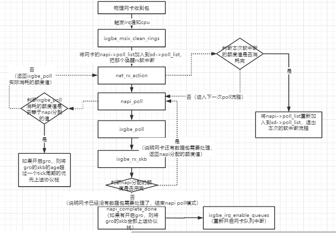

======================
Performance
======================

:Date:   2021-07-11 15:08:08

参考资料
================

文档&书籍
------------

1. BPF Performance Tools，
2. Systems Performance ——《性能之巅：洞悉系统、企业与云计算》
3. :download:`Linux Performance Tools (Velocity 2015) <../files/Velocity2015_LinuxPerfTools.pdf>`
   `video <https://www.youtube.com/watch?v=FJW8nGV4jxY&list=PLhhdIMVi0o5RNrf8E2dUijvGpqKLB9TCR>`__

链接
-----------

1. `brendangregg <http://www.brendangregg.com/linuxperf.html>`__

.. figure:: ../images/linux_observability_tools.png

   linux_observability_tools

2. https://netflixtechblog.com/linux-performance-analysis-in-60-000-milliseconds-accc10403c55

3. https://lrita.github.io/wiki/books/

4. `Linux 网络栈监控和调优：发送数据 <http://arthurchiao.art/blog/tuning-stack-tx-zh/>`__；
   `英文原版 <https://blog.packagecloud.io/eng/2017/02/06/monitoring-tuning-linux-networking-stack-sending-data/>`__；
   属于`系列文章 <https://www.privateinternetaccess.com/blog/linux-networking-stack-from-the-ground-up-part-1/>`__。

5. `Linux 网络栈监控和调优：接收数据 <http://arthurchiao.art/blog/tuning-stack-rx-zh/>`__；
   `英文原版 <https://blog.packagecloud.io/eng/2016/06/22/monitoring-tuning-linux-networking-stack-receiving-data/>`__；

6. `极客时间-linux性能优化实战 <https://zter.ml/>`__

60秒快速分析linux性能
=========================
`60秒快速分析linux性能<https://netflixtechblog.com/linux-performance-analysis-in-60-000-milliseconds-accc10403c55>`__

1. uptime
2. dmesg | tail
3. vmstat 1
4. mpstat -P ALL 1
5. pidstat 1
6. iostat -xz 1
7. free -m
8. sar -n DEV 1
9. sar -n TCP,ETCP 1
10. top

收包和poll
=============
收包过程
---------------
1. 加载网卡驱动，初始化
2. 数据包从外部网络进入网卡
3. 网卡（通过DMA）将包拷贝到内核内存中的ring buffer
4. 产生硬件中断，通知系统收到了一个包
5. 驱动调用 NAPI ，如果轮询（poll）还没有开始，就开始轮询
6. ksoftirqd软中断调用 NAPI 的poll函数从ring buffer收包（poll 函数是网卡驱动在初始化阶段注册的；每个cpu上都运行着一个ksoftirqd进程，在系统启动期间就注册了）
7. ring buffer里面对应的内存区域解除映射（unmapped）
8. 如果 packet steering 功能打开，或者网卡有多队列，网卡收到的数据包会被分发到多个cpu
9. 数据包从队列进入协议层
10. 协议层处理数据包
11. 数据包从协议层进入相应 socket 的接收队列

NAPI
----------

`Linux NAPI机制分析 <https://www.codenong.com/cs106952430/>`__

   NAPI机制

1. 在NAPI模式下，系统会为软中断线程及napi各分配一个额度值（软中断的额度为netdev_budget，默认值是300，所有napi共用；
2. 每个napi的额度是weight_p，默认值是64），在一次poll流程里，ixgbe_poll每接收一个报文就消耗一个额度，
3. 如果ixgbe_poll消耗的额度为napi的额度，说明此时网卡收到的报文比较多，因此需要继续下一次poll，
4. 每次napi_poll消耗的额度会累加，当超过软中断线程的额度时，退出本次软中断处理流程；
5. 当ixgbe_poll消耗的额度没有达到napi的额度时，说明网卡报文不多，因此重新开启队列中断，进入中断模式。**即收包很少时不会主动退出？！**

do_poll
------------
`字符设备驱动-poll <https://blog.csdn.net/czg13548930186/article/details/77825262>`__

poll中会进行高精度sleep（ms）。

函数原型： static int do_poll(struct poll_list *list, struct poll_wqueues *wait,  struct timespec64 *end_time)

源码：https://sbexr.rabexc.org/latest/sources/1c/441732eda22f11.html#00371001003c5001

jiffies
~~~~~~~~~~~~~~~
查看jiffies值：本测试机为1000

::

   sudo cat /proc/timer_list |grep jiffies: ;sleep 1;sudo cat /proc/timer_list |grep jiffies:

