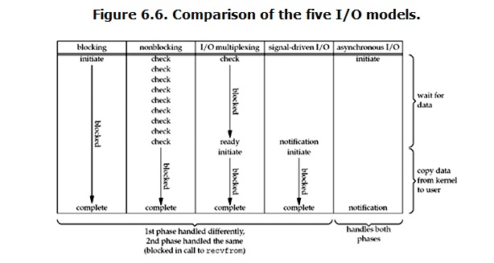

======================
Packet Send & Recieve
======================

:Date:   2021-07-31 15:17:13

参考文档TODO
=============

1. `Linux 网络栈监控和调优：发送数据 <http://arthurchiao.art/blog/tuning-stack-tx-zh/>`__；
   `英文原版 <https://blog.packagecloud.io/eng/2017/02/06/monitoring-tuning-linux-networking-stack-sending-data/>`__；
   属于 `系列文章 <https://www.privateinternetaccess.com/blog/linux-networking-stack-from-the-ground-up-part-1/>`__ 。

2. `Linux 网络栈监控和调优：接收数据 <http://arthurchiao.art/blog/tuning-stack-rx-zh/>`__；
   `英文原版 <https://blog.packagecloud.io/eng/2016/06/22/monitoring-tuning-linux-networking-stack-receiving-data/>`__；

3. `图解Linux网络包接收过程 <https://mp.weixin.qq.com/s/GoYDsfy9m0wRoXi_NCfCmg>`__

4. `极客时间-趣谈Linux操作系统 <https://zter.ml/>`__

5. 《深入linux内核架构》 ：大体框架了解了，需要细节学习。
6. `结合中断分析TCP/IP协议栈在LINUX内核中的运行时序 <https://www.cnblogs.com/ypholic/p/14337328.html>`__

问题记录
------------
1. TCP/IP中tcp可靠性？其它层为什么不可靠？
2. dpdk、netfilter、ebpf
3. BBR

socket
============

内核协议栈
=============

netif_rx
--------------

Linux网络IO模式
================
1. `Linux IO模式及 select、poll、epoll详解 <https://segmentfault.com/a/1190000003063859>`__

同步IO和异步IO，阻塞IO和非阻塞IO分别是什么，到底有什么区别？不同的人在不同的上下文下给出的答案是不同的。

   IO 模式比较

当一个read操作发生时，它会经历两个阶段：

1. 等待数据经网卡到达内核；non-blocking/blocking IO指的就是这一步。
2. 数据从内核态拷贝到用户态；在等待拷贝完成的过程中，Linux都会阻塞当前线程。

同步和异步描述的则是read的整个过程。

在处理 IO 的时候，阻塞和非阻塞都是同步 IO。只有使用了特殊的 API 才是异步 IO。

同步与异步
-------------
关注的是通信机制。用户角度，如

- 同步：发出一个调用后，在没得到结果之前主动等待，该调用不返回。一旦返回就得到了返回值。
- 异步：发出一个调用后，这个调用直接返回，无返回值。而后被调用者会通过状态、通知来通知调用者，或使用回调函数来处理这个调用。

POSIX的定义：

- A synchronous I/O operation causes the requesting process to be blocked until that I/O operation completes;
- An asynchronous I/O operation does not cause the requesting process to be blocked;

阻塞和非阻塞
-------------------
关注的是程序在等待调用结果（消息，返回值）时的状态。

- 阻塞调用是指调用结果返回之前，当前线程会被挂起。调用线程只有在得到结果之后才会返回。
- 非阻塞调用指在不能立刻得到结果之前立即返回，不阻塞进程；
  而在数据已经准备好了的时候，会将数据从内核拷贝到用户态，这个过程中线程阻塞。

poll与epoll
-----------

1. 在 select/poll中，进程只有在调用一定的方法后，内核才对所有监视的文件描述符进行遍历扫描。
2. epoll事先通过epoll_ctl()来注册一 个文件描述符，一旦基于某个文件描述符就绪时，
   内核会采用类似callback的回调机制，迅速激活这个文件描述符，当进程调用epoll_wait() 时便得到通知。
   (此处去掉了遍历文件描述符，而是通过监听回调的的机制。)
 