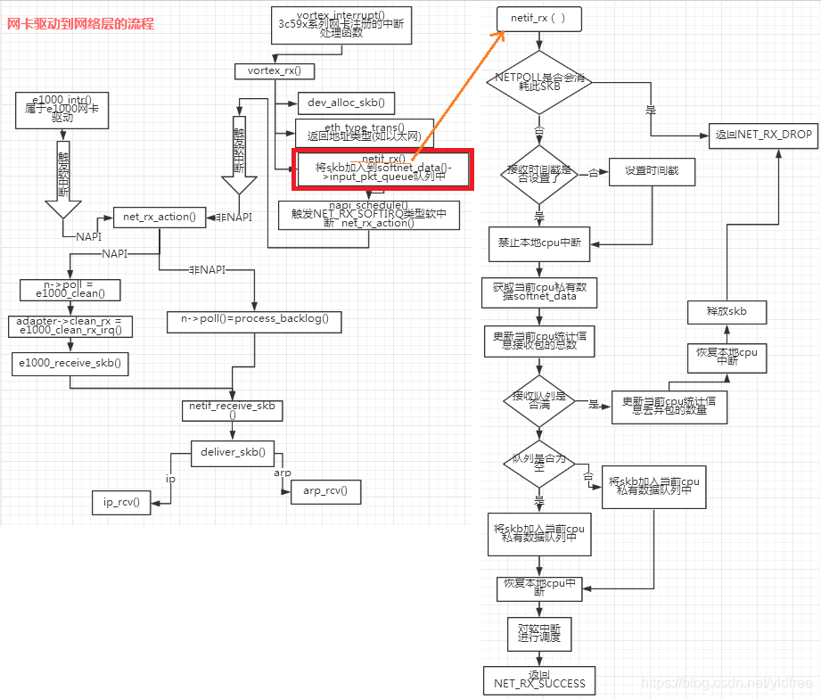

======================
Packet Send & Recieve
======================

:Date:   2021-07-31 15:17:13

参考文档TODO
=============

1.  :download:`ULNI <../books/Understanding_Linux_Network_Internals.pdf>` 
   
2. `Linux 网络栈监控和调优：发送数据 <http://arthurchiao.art/blog/tuning-stack-tx-zh/>`__；
   `英文原版 <https://blog.packagecloud.io/eng/2017/02/06/monitoring-tuning-linux-networking-stack-sending-data/>`__；
   属于 `系列文章 <https://www.privateinternetaccess.com/blog/linux-networking-stack-from-the-ground-up-part-1/>`__ 。

3. `Linux 网络栈监控和调优：接收数据 <http://arthurchiao.art/blog/tuning-stack-rx-zh/>`__；
   `英文原版 <https://blog.packagecloud.io/eng/2016/06/22/monitoring-tuning-linux-networking-stack-receiving-data/>`__；
   `英文版配图 <https://blog.packagecloud.io/eng/2016/10/11/monitoring-tuning-linux-networking-stack-receiving-data-illustrated/>`__

4. `极客时间-趣谈Linux操作系统 <https://zter.ml/>`__

5. 《深入linux内核架构》 ：大体框架了解，需要细节学习。

问题记录
------------
1. TCP/IP中tcp可靠性？其它层为什么不可靠？
2. dpdk、netfilter、ebpf
3. BBR

socket
============

网卡与中断上下文
================
> ULNI：chapter9/10

1. https://code.woboq.org/linux/linux/net/core/dev.c.html#net_rx_action
2. `linux 网络收包流程（NAPI） <https://flyingbyte.cc/post/napi-in-linux.cn>`__
3. `Linux协议栈--NAPI机制 <http://cxd2014.github.io/2017/10/15/linux-napi/>`__
4. `Linux内核源码分析--详谈NAPI原理机制 <https://zhuanlan.zhihu.com/p/403239331>`__
5. `内核网络中的GRO、RFS、RPS技术介绍和调优 <http://kerneltravel.net/blog/2020/network_ljr9/>`__

6. `图解Linux网络包接收过程 <https://zhuanlan.zhihu.com/p/256428917>`__
7. `结合中断分析TCP/IP协议栈在LINUX内核中的运行时序 <https://www.cnblogs.com/ypholic/p/14337328.html>`__

NAPI
-------
轮询+中断，比netif_rx性能好。

1. 减少中断。
2. 多设备公平。

NAPI的工作机制如下：

1. 第一个分组将导致网络适配器发出IRQ，为防止进一步的分组导致更多的IRQ，驱动程序会关闭该适配器的rx IRQ，并将该适配器放到一个轮询表上。
    关闭设备中断后，设备收到包后不再产生中断（或者内核不再响应中断），而只是将数据包放到DMA中。
2. 只要适配器上还有分组需要处理，内核就一直对轮询表上的设备进行轮询，处理剩下的分组。

3. 重新启动rx IRQ。

设备满足如下两个条件，才能实现NAPI方法：

1. 设备必须能够保留多个接收的分组，例如保存到DMA环形缓冲区中。
2. 设备必须能够禁止用于接收分组的IRQ，而且发送分组或其他可能通过IRQ进行的操作，都仍然必须是启用的。

::

   IRQ
    ->__napi_schedule
        ->进入软中断
            ->net_rx_action
                ->napi_poll
                    ->驱动注册的poll
                        ->napi_gro_receive。

napi_schedule源码
~~~~~~~~~~~~~~~~~~~~~
napi_schedule -> __napi_schedule -> ____napi_schedule -> __raise_softirq_irqoff

::

   
   /**
    *	napi_schedule - schedule NAPI poll
    *	@n: NAPI context
    *
    * Schedule NAPI poll routine to be called if it is not already
    * running.
    */
   static inline void napi_schedule(struct napi_struct *n)
   {
   	if (napi_schedule_prep(n))
   		__napi_schedule(n);
   }

   
   /* Called with irq disabled */
   static inline void ____napi_schedule(struct softnet_data *sd,
   				     struct napi_struct *napi)
   {
   	list_add_tail(&napi->poll_list, &sd->poll_list);
   	__raise_softirq_irqoff(NET_RX_SOFTIRQ);
   }

net_rx_action
~~~~~~~~~~~~~~~~~~~~
很重要的下半部收包函数，NAPI设备和非NAPI设备都可能会使用它来收包。该函数的主要工作就是操作收包队列和执行poll函数。

net_rx_action -> ntl_poll -> 注册的用户实现的poll/process_backlog 

linux 通过软中断机制调用网络协议栈代码，处理数据。 在 net_dev 模块初始化时，注册网络收发数据的软中断处理函数：

::

   static int __init net_dev_init(void)
   {
   	open_softirq(NET_TX_SOFTIRQ, net_tx_action);
   	open_softirq(NET_RX_SOFTIRQ, net_rx_action);
   }

netif_rx
--------------

1. https://www.cnblogs.com/hustcat/archive/2009/09/26/1574371.html

在传统的收包方式中，数据帧向网络协议栈中传递发生在中断上下文（在接收数据帧时）中调用netif_rx的函数中。
这个函数还有一个变体netif_rx_ni，被用于中断上下文之外。

netif_rx函数在收包过程中用到了napi_strcut结构，因为软中断处理使用了NAPI的框架（软中断流程类似）。也用到了net_rx_action。

netif_rx源码
~~~~~~~~~~~~~

https://code.woboq.org/linux/linux/net/core/dev.c.html#netif_rx

netif_rx -> netif_rx_internal -> enqueue_to_backlog -> __skb_queue_tail

::

    /**
    *	netif_rx	-	post buffer to the network code
    *	@skb: buffer to post
    *
    *	This function receives a packet from a device driver and queues it for
    *	the upper (protocol) levels to process.  It always succeeds. The buffer
    *	may be dropped during processing for congestion control or by the
    *	protocol layers.
    *
    *	return values:
    *	NET_RX_SUCCESS	(no congestion)
    *	NET_RX_DROP     (packet was dropped)
    *
    */

   int netif_rx(struct sk_buff *skb)
   {
   	int ret;
   	trace_netif_rx_entry(skb);
   	ret = netif_rx_internal(skb);
   	trace_netif_rx_exit(ret);
   	return ret;
   }
   EXPORT_SYMBOL(netif_rx);

    /*
    * enqueue_to_backlog is called to queue an skb to a per CPU backlog
    * queue (may be a remote CPU queue).
    */

在中断期间处理多帧
~~~~~~~~~~~~~~~~~~
一些驱动虽然没有使用NAPI收包机制，但在驱动中通过设置类似weight的权值，实现在一个中断到来时尝试处理多个数据包。

有些驱动在中断处理程序中添加了一个quota值限定每次中断可以处理数据包的个数，
在每次中断到来时关闭设备自身的收包中断，并尝试从DMA中获取不大于quota数量的数据包，
每次获取到数据包就交给netif_rx处理或直接交给netif_receive_skb()。

Linux网络IO模式
================
1. `Linux IO模式及 select、poll、epoll详解 <https://segmentfault.com/a/1190000003063859>`__

同步IO和异步IO，阻塞IO和非阻塞IO分别是什么，到底有什么区别？不同的人在不同的上下文下给出的答案是不同的。

.. figure:: ../images/IO_models.png

   IO 模式比较

当一个read操作发生时，它会经历两个阶段：

1. 等待数据经网卡到达内核；non-blocking/blocking IO指的就是这一步。
2. 数据从内核态拷贝到用户态；在等待拷贝完成的过程中，Linux都会阻塞当前线程。

同步和异步描述的则是read的整个过程。

在处理 IO 的时候，阻塞和非阻塞都是同步 IO。只有使用了特殊的 API 才是异步 IO。

同步与异步
-------------
关注的是通信机制。用户角度，如

- 同步：发出一个调用后，在没得到结果之前主动等待，该调用不返回。一旦返回就得到了返回值。
- 异步：发出一个调用后，这个调用直接返回，无返回值。而后被调用者会通过状态、通知来通知调用者，或使用回调函数来处理这个调用。

POSIX的定义：

- A synchronous I/O operation causes the requesting process to be blocked until that I/O operation completes;
- An asynchronous I/O operation does not cause the requesting process to be blocked;

阻塞和非阻塞
-------------------
关注的是程序在等待调用结果（消息，返回值）时的状态。

- 阻塞调用是指调用结果返回之前，当前线程会被挂起。调用线程只有在得到结果之后才会返回。
- 非阻塞调用指在不能立刻得到结果之前立即返回，不阻塞进程；
  而在数据已经准备好了的时候，会将数据从内核拷贝到用户态，这个过程中线程阻塞。

poll与epoll
-----------

1. 在 select/poll中，进程只有在调用一定的方法后，内核才对所有监视的文件描述符进行遍历扫描。
2. epoll事先通过epoll_ctl()来注册一 个文件描述符，一旦基于某个文件描述符就绪时，
   内核会采用类似callback的回调机制，迅速激活这个文件描述符，当进程调用epoll_wait() 时便得到通知。
   (此处去掉了遍历文件描述符，而是通过监听回调的的机制。)
 