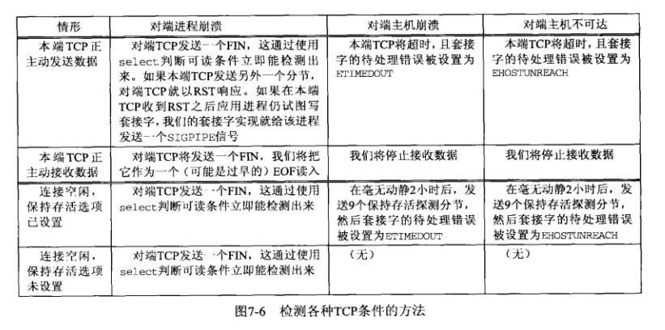
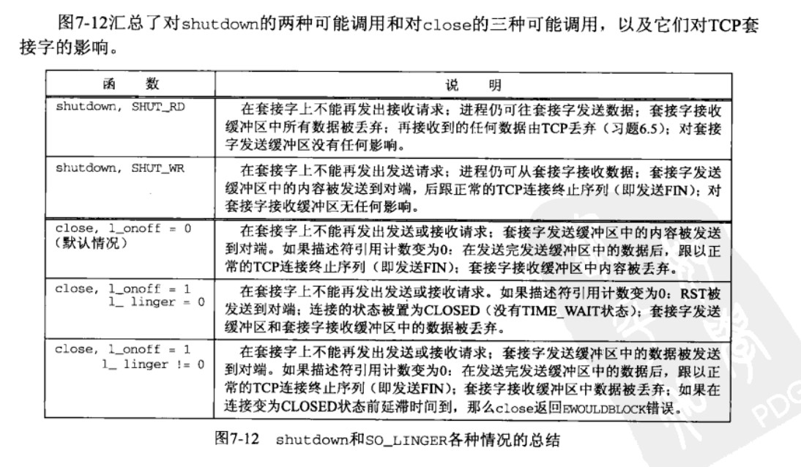
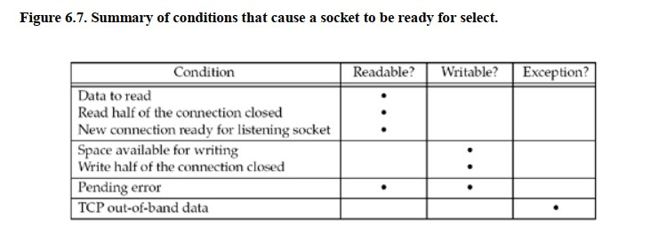
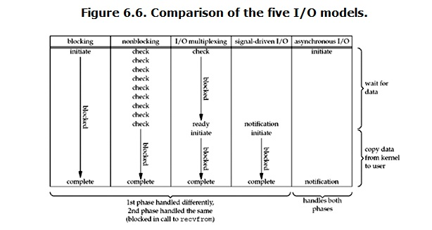
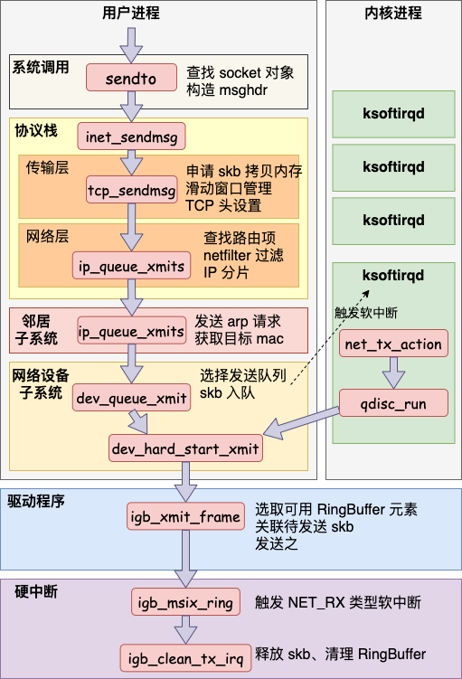
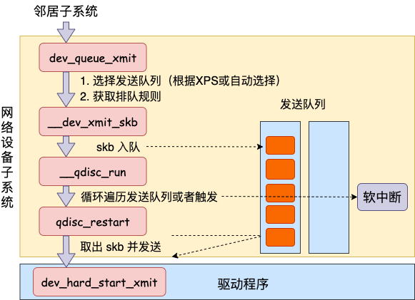

======================
Packet Send & Recieve
======================

:Date:   2021-07-31 15:17:13

参考文档TODO
=============

   
1.  `系列文章 <https://www.privateinternetaccess.com/blog/linux-networking-stack-from-the-ground-up-part-1/>`__ 。2022有更新

   `Linux 网络栈监控和调优：接收数据 <http://arthurchiao.art/blog/tuning-stack-rx-zh/>`__；
   `英文原版 <https://blog.packagecloud.io/eng/2016/06/22/monitoring-tuning-linux-networking-stack-receiving-data/>`__；
   `英文版配图 <https://blog.packagecloud.io/eng/2016/10/11/monitoring-tuning-linux-networking-stack-receiving-data-illustrated/>`__

   `Linux 网络栈监控和调优：发送数据 <http://arthurchiao.art/blog/tuning-stack-tx-zh/>`__；
   `英文原版 <https://blog.packagecloud.io/eng/2017/02/06/monitoring-tuning-linux-networking-stack-sending-data/>`__；

2. `极客时间-趣谈Linux操作系统 <https://zter.ml/>`__
3. 《深入linux内核架构》 ：大体框架

4.  :download:`ULNI <../books/Understanding_Linux_Network_Internals.pdf>` 
5. `图解Linux网络包接收过程 <https://zhuanlan.zhihu.com/p/256428917>`__ 
    :download:`理解了实现再谈网络性能 <../books/理解了实现再谈网络性能.pdf>` 
    
6. :download:`追踪Linux.TCP／IP代码运行：基于2.6内核 <../books/追踪Linux.TCP／IP代码运行：基于2.6内核.pdf>` 

问题记录
------------
1. TCP/IP中tcp可靠性？其它层为什么不可靠？
2. dpdk、netfilter、ebpf
3. BBR

socket
============

udp tcp sctp
------------------
- udp：用户数据报协议，无连接。
- tcp：传输控制协议，面向连接、可靠全双工、字节流，确认、超时、重传。
- sctp：流控制传输协议，面向连接(关联)、可靠全双工、消息服务、多宿。可接受对端的事件通知

socket系统函数
----------------

tcp socket过程
~~~~~~~~~~~~~~~~

   socket_tcp_procedure

::

   #include <sys/socket.h>

   int socket(int family, int type, int protocol)  // 返回非负的套接字描述符,主动套接字

   int connect(int sockfd, const struct sockaddr *servaddr, socklen_t addrlen)  // servaddr包含服务器ip和端口

   int bind(int sockfd, const struct sockaddr *myaddr, socklen_t addrlen)  //绑定本端端口、ip

   int listen(int sockfd, int backlog) // 转化为被动套接字，即监听描述符。backlog - socket排队的最大连接数

   int accept(int sockfd, struct sockaddr *cliaddr, socklen_t *addrlen) // 三次握手，然后返回已连接描述符和client地址

socket选项
~~~~~~~~~~~
::

   int getdockopt(int sockfd, int level, int optname, void *optval, socklen_t *optlen)

   int setsockopt(int sockfd, int level, int optname, const void *optval, socklen_t optlen)

connect/accept完成三次握手后返回已连接套接字，并从监听套接字继承以下属性故这些属性需要在accept之前设置：
``SO_DEBUG、SO_DONTROUTE、SO_KEEPALIVE\SO_LINGER、SO_OOBILINE、SO_RCVBUF、SO_SNDBUF、SO_RCVLOWAT、SO_SNDLOWAT、TCP_MACMSG、TCP_DELAY``

::

   SO_KEEPALIVE: 2h后发送保活探测分节。检测对端主机奔溃、不可达等状态（即半开连接）

   SO_RCVBUF: client在connect之前设置，sever在listen之前设置。因为tcp窗口规模是在建立连接时通过互换syn分节得到的。
   SO_SNDBUF: client保存发送的seg，直到收到ack

   SO_REUSEADDR: 支持port重复使用，某些协议(如udp)支持ip+port重复使用。

   SO_LINGER: 控制close函数的返回时机和行为。

   TCP_NODELAY/SCTP_NODELAY:  禁止Nagle算法
   TCP_MAXSEG/SCTP_MAXSEG:  最大分节MSS，通常来源于对端的syn

- Nagle算法：减少网络上的分组数量。当有一个未确认分组时，则不继续发送
- Ack延滞算法：收到数据后不立即恢复ack，等待一段时间，期望自身数据发送时捎带上ack，减少tcp分节。

tcp条件检测：

   tcp_stat_check

shutdown和close: 半开连接
~~~~~~~~~~~~~~~~~~~~~~~~~~~~~~
::

   int shutdown(int sockfd, int howto)

   close(int sockfd)  //尝试将sndbuf的数据发送，并立即返回。 SO_LINGER可改变此默认行为。

   socket_shutdown_close

fcntl ioctl 描述符控制
~~~~~~~~~~~~~~~~~~~~~~~~~~

   socket_protocol

最后一列表示posix推荐的方式。

socket()
~~~~~~~~~~~~~~~~~
family+type -> protocol

   socket_protocol

bind(): tcp client 通常不会绑定ip，内核根据路由选择.

fork(): 实现网络多线程
~~~~~~~~~~~~~~~~~~~~~~~~~
1. 需要处理SIGCHLD信号，使用waitpid避免留下僵死进程。waitpid可指定子进程和是否阻塞，wait不能；
2. 捕获信号时，需处理被中断的系统调用。返回值为EINTR则重启socket函数（connect除外）.

I/O复用：select和poll
------------------------
io模型
~~~~~~~~~~~
同步IO模型：其真正的IO操作会阻塞进程。包括阻塞式IO、非阻塞式IO、IO复用、信号驱动式IO。

   IO_models

select
~~~~~~~~~~~~~~~~

:: 

   int select(int maxfdp1, fd_set *readset, fd_set *writeset, fd_set * *exceptset, const struct timeval *timeout)

   fd_set: 描述符集。通常是一个整数数组，每整数的每一位对应一个描述符。
           select返回时，fd_set就绪位置1，因此重新select之前需要重新设置fd_set。

   maxfdp1: 待测试的描述符个数。0开始，即最大描述符+1.

   void FD_ZERO(fd_set *fdset)
   void FD_SET(int fd, fd_set *fdset)
   void FD_CLR(int fd, fd_set *fdset)
   int FD_ISSET(int fd, fd_set *fdset)

select就绪条件：

   select_ready_condition

套接字描述符唯一的异常条件是带外数据的到达。

poll
~~~~~~~~~

::

   int poll(struct pollfd *fdarrya, unsigned long nfds, int timeout)

   struct pollfd {
       int fd;
       short events;   /* para in. event of interest */
       short revents;  /* return */
   }

poll识别三类数据：normal、priority band、high priority，体现在event/revent中。

   poll_events_revents

udp socket
--------------

   udp_exchg

udp套接字函数
~~~~~~~~~~~~~~~~~
::

   ssize_t recvfrom(int sockfd, oid *buff, size_t nbytes, int flags, struct sockaddr *from, socklen_t *addrlen)

   ssize_t sendto  (int sockfd, oid *buff, size_t nbytes, int flags, const struct sockaddr *to, socklen_t *addrlen)

   recvfrome/sendto 返回值为所读写的数据大小，recvfrom返回0是可接受的。都可以用于tcp。

若client没有绑定port，则首次sendto时内核选择一个临时端口。

无连接，意味着udp每个数据报的目的地址可变。

- 弱端系统模型：大多数ip实现接收目的地址为本机任一ip地址的数据报，而不管数据报到达的接口。
- 网卡混杂模式：网卡能够接收所有经过它的数据流，而不论其目的地址(mac)是否是它。

   socket_datagram_info

已连接udp socket与异步错误
~~~~~~~~~~~~~~~~~~~~~~~~~~~~
只有已连接的udp socket，其引发的异步错误(如icmp端口不可达)才会返回给它。

connect后即为已连接socket。 

1. 存储了对方的ip+port，后面socket需使用write/send、read/recv/recvmsg。
2. 选择了本地ip和路由。

   udp_connected_socket

未连接socket每次需要复制一次目的ip+port的套接字结构体，约占整个udp传输的的1/3。故udp多次使用同一目的地址时，已连接套接字效率更高。

name and address
--------------------

tcp ip illustrated
=======================

长肥管道：高带宽或高延时网络。

FIN：本端不再发送数据，对端将其作为文件结束符传递给应用。

TCP报文段结构
----------------
RFC 793

::

       0                   1                   2                   3   
       0 1 2 3 4 5 6 7 8 9 0 1 2 3 4 5 6 7 8 9 0 1 2 3 4 5 6 7 8 9 0 1 
      +-+-+-+-+-+-+-+-+-+-+-+-+-+-+-+-+-+-+-+-+-+-+-+-+-+-+-+-+-+-+-+-+
      |          Source Port          |       Destination Port        |
      +-+-+-+-+-+-+-+-+-+-+-+-+-+-+-+-+-+-+-+-+-+-+-+-+-+-+-+-+-+-+-+-+
      |                        Sequence Number                        |
      +-+-+-+-+-+-+-+-+-+-+-+-+-+-+-+-+-+-+-+-+-+-+-+-+-+-+-+-+-+-+-+-+
      |                    Acknowledgment Number                      |
      +-+-+-+-+-+-+-+-+-+-+-+-+-+-+-+-+-+-+-+-+-+-+-+-+-+-+-+-+-+-+-+-+
      |  Data |           |U|A|P|R|S|F|                               |
      | Offset| Reserved  |R|C|S|S|Y|I|            Window             |
      |       |           |G|K|H|T|N|N|                               |
      +-+-+-+-+-+-+-+-+-+-+-+-+-+-+-+-+-+-+-+-+-+-+-+-+-+-+-+-+-+-+-+-+
      |           Checksum            |         Urgent Pointer        |
      +-+-+-+-+-+-+-+-+-+-+-+-+-+-+-+-+-+-+-+-+-+-+-+-+-+-+-+-+-+-+-+-+
      |                    Options                    |    Padding    |
      +-+-+-+-+-+-+-+-+-+-+-+-+-+-+-+-+-+-+-+-+-+-+-+-+-+-+-+-+-+-+-+-+
      |                             data                              |
      +-+-+-+-+-+-+-+-+-+-+-+-+-+-+-+-+-+-+-+-+-+-+-+-+-+-+-+-+-+-+-+-+

长度20B，带选项可达60B。

1. 序号：报文的首字节的字节编号，初始为随机生成，c/s两端各有一个。
2. 确认号：期望收到的下一字节的序号。
3. 接收窗口：指示接收方愿意接收的字节数量，用于流量控制。
4. 6比特标识字段：ACK、RST、SYN、FIN、PSH、URG。

5. Checksum:  The checksum field is the 16-bit ones' complement of the ones'
     complement sum of all 16-bit words in the header and text.

tcp状态转换和分组交换
------------------------

   tcp_state_trans

   tcp_seg_exchg

TIME_WAIT状态为 2*MSL：

1. 实现全双工连接的可靠终止：发送最后一个ack后进入TIME_WAIT并持续2msl。若最后一个ack丢失，则client维护的状态可允许server retransfer FIN(tcp总是重传fin)。
2. 2msl保证老连接的重复分节在网络上消逝：若老连接结束后出现一个ip+port均一样的连接，则可避免新连接被老连接的分组影响。

tcp超时与重传
--------------
1. rtt的几种算法
2. 重传二义性：不能区分是对第一次还是第二次的传输的的确认。karn算法：重传时间指数退避和接收到重传数据的确认信息时不用于更新rtt估计值(解决二义性问题)
3. 快速重传：基于接收端的反馈信息来引发重传，及时有效修复丢包。当失序数据到达时，应立即回复ack。重复ack阈值dupthresh 用于确定是否重传。
4. 伪超时与伪重传

重传超时算法
~~~~~~~~~~~~~
经典方法：

标准方法：

Linux采用的方法：

伪超时与伪重传
~~~~~~~~~~~~~~~~
伪重传原因包括伪超时、包失序、包重复、ack丢失。

伪超时：实际rtt显著增长，超过当前rto时，可能出现。处理伪超时的两种方法：检测算法和响应算法。

细分为：

1. 伪超时：通过检查ack或原始传输能假造检测出。Eifel检测算法、F-RTO
2. 迟伪超时：基于超时（伪）而引发的重传所返回的ack来判定。dsack

**重传计时器超时后记录新变量srtt_prev和rttvar_prev，触发检测算法，得到伪重传标志，然后在响应算法中更新srtt、rttvar、RTO的值。**

**检测算法**：用于判断某个超时或基于计时器的重传是否真实。

1. 重复sack(dsack)扩展：sack可告知失序报文段。在sack接收端赛用dsack，可在第一个sack块中告知接收端收到的重复报文段序列号，以判断不必要的重传。
2. Eifel检测算法：利用tcp的tsopt来检测伪重传（保存重传的tsv值并与ack比较）。Eifel比dsack能更早地检测到伪重传，有效避免 回退N 行为。
3. 前移RTO恢复（F-RTO）: 检测伪重传的标准算法，只检测由重传计时器引发的伪重传。 重传计时器超时后接收到第一个ack时，发送新数据并检查下一个ack，若这两个ack都是acceptable(即非重复ack，acceptable ACKs that advance the sender’s window),则是伪重传。

Eifel响应算法：

1. 可与任何检测算法结合
2. 延迟大幅增长的情况下会重设srtt和rttvar

包失序与包重复
~~~~~~~~~~~~~~~~
重复 和 严重失序 都比较少见。

失序：ip层不能保证传输有序。

1. 反向（ack）链路失序：导致发送窗口快速前移，流量突发；
2. 正向链路：无法正确区分失序和丢包，导致伪重传（重复ack导致快速重传）。

重复：IP协议可能会把一个包传输多次，如 **链路层协议的重传** 。可采用sack、dsack。  
`这一次，彻底拿下计算机网络链路层！ - 程序员cxuan - 博客园  <https://www.cnblogs.com/cxuanBlog/p/14600398.html>`__

重新组包：超时重传时，不需要重传完全相同的报文段（tcp根据字节号识别数据），可发送一个更大的报文段来提升性能。

存储连接状态
~~~~~~~~~~~~~~
与同一个接收端建立新tcp连接时，会基于之前保存的度量值来设置初始值。（路由、转发表项、或其它系统数据结构）

tcp数据流与窗口管理
--------------------

1. 延时Ack
2. nagle算法
3. 窗口通告和窗口检测
4. 糊涂窗口综合征
5. 缓存、自动调优
6. 滑动窗口

与tcp相关的攻击
--------------------
tcp重传相关的攻击
~~~~~~~~~~~~~~~~~~
1. 低速率dos攻击：使target感知拥塞，持续处于超时重传状态，无法正常使用网络带宽。
2. 使target rtt估计过大，减慢target发送。
3. 使target rtt估计过小，造成大量无效传输。

Linux网络IO模式
================
1. `Linux IO模式及 select、poll、epoll详解 <https://segmentfault.com/a/1190000003063859>`__

   IO 模式比较

当一个read操作发生时，它会经历两个阶段：

1. 等待数据经网卡到达内核；non-blocking/blocking IO指的就是这一步。
2. 数据从内核态拷贝到用户态；在等待拷贝完成的过程中，Linux都会阻塞当前线程。

同步和异步描述的则是read的整个过程。

在处理 IO 的时候，阻塞和非阻塞都是同步 IO。只有使用了特殊的 API(部分系统实现) 才是异步 IO。

同步与异步
-------------
关注的是通信机制。用户角度，如

- 同步：发出一个调用后，在没得到结果之前主动等待，该调用不返回。一旦返回就得到了返回值。
- 异步：发出一个调用后，这个调用直接返回，无返回值。而后被调用者会通过状态、通知来通知调用者，或使用回调函数来处理这个调用。

POSIX的定义：

- A synchronous I/O operation causes the requesting process to be blocked until that I/O operation completes;
- An asynchronous I/O operation does not cause the requesting process to be blocked;

阻塞和非阻塞
-------------------
关注的是程序在等待 **调用结果** （消息，返回值）时的状态。

- 阻塞调用是指调用结果返回之前，当前线程会被挂起。调用线程只有在得到结果之后才会返回。
- 非阻塞调用指在不能立刻得到结果之前立即返回，不阻塞进程；而在数据已经准备好了的时候，会将数据从内核拷贝到用户态，这个过程中线程阻塞。

poll与epoll
-----------

1. 在 select/poll中，进程只有在调用一定的方法后，内核才对所有监视的文件描述符进行遍历扫描。
2. epoll事先通过epoll_ctl()来注册一 个文件描述符，一旦基于某个文件描述符就绪时，
   内核会采用类似callback的回调机制，迅速激活这个文件描述符，当进程调用epoll_wait() 时便得到通知。
   (此处去掉了遍历文件描述符，而是通过监听回调的的机制。)
 

网卡收包与中断上下文
==========================
> ULNI：chapter9/10

1. https://code.woboq.org/linux/linux/net/core/dev.c.html#net_rx_action
2. `linux 网络收包流程（NAPI） <https://flyingbyte.cc/post/napi-in-linux.cn>`__
3. `Linux协议栈--NAPI机制 <http://cxd2014.github.io/2017/10/15/linux-napi/>`__
4. `Linux内核源码分析--详谈NAPI原理机制 <https://zhuanlan.zhihu.com/p/403239331>`__
5. `内核网络中的GRO、RFS、RPS技术介绍和调优 <http://kerneltravel.net/blog/2020/network_ljr9/>`__

6. `结合中断分析TCP/IP协议栈在LINUX内核中的运行时序 <https://www.cnblogs.com/ypholic/p/14337328.html>`__

socket收包过程
----------------

1. 网卡将数据帧DMA到内存的RingBuffer中，然后向CPU发起中断通知
2. CPU响应中断请求，调用网卡启动时注册的中断处理函数
3. 中断处理函数几乎没干啥，就发起了软中断请求
4. 内核线程ksoftirqd线程发现有软中断请求到来，先关闭硬中断
5. ksoftirqd线程开始调用驱动的poll函数收包
6. poll函数将收到的包送到协议栈注册的ip_rcv函数中
7. ip_rcv函数再讲包送到udp_rcv函数中（对于tcp包就送到tcp_rcv）

   收包过程

NAPI
-------
轮询+中断，比netif_rx性能好。

1. 减少中断。
2. 多设备公平。

NAPI的工作机制如下：

1. 第一个分组将导致网络适配器发出IRQ，为防止进一步的分组导致更多的IRQ，驱动程序会关闭该适配器的rx IRQ，并将该适配器放到一个轮询表上。
    关闭设备中断后，设备收到包后不再产生中断（或者内核不再响应中断），而只是将数据包放到DMA中。
2. 只要适配器上还有分组需要处理，内核就一直对轮询表上的设备进行轮询，处理剩下的分组。

3. 重新启动rx IRQ。

设备满足如下两个条件，才能实现NAPI方法：

1. 设备必须能够保留多个接收的分组，例如保存到DMA环形缓冲区中。
2. 设备必须能够禁止用于接收分组的IRQ，而且发送分组或其他可能通过IRQ进行的操作，都仍然必须是启用的。

::

   IRQ
    ->__napi_schedule
        ->进入软中断
            ->net_rx_action
                ->napi_poll
                    ->驱动注册的poll
                        ->napi_gro_receive。

``napi时使用napi_schedule发起软中断，软中断中执行net_rx_action``

napi_schedule源码
~~~~~~~~~~~~~~~~~~~~~
napi_schedule -> __napi_schedule -> ____napi_schedule -> __raise_softirq_irqoff 然后在软中断中调用

::

   
   /**
    *	napi_schedule - schedule NAPI poll
    *	@n: NAPI context
    *
    * Schedule NAPI poll routine to be called if it is not already
    * running.
    */
   static inline void napi_schedule(struct napi_struct *n)
   {
   	if (napi_schedule_prep(n))
   		__napi_schedule(n);
   }

   
   /* Called with irq disabled */
   static inline void ____napi_schedule(struct softnet_data *sd,
   				     struct napi_struct *napi)
   {
   	list_add_tail(&napi->poll_list, &sd->poll_list);
   	__raise_softirq_irqoff(NET_RX_SOFTIRQ);
   }

net_rx_action
-----------------
很下半部收包函数， ``NAPI设备和非NAPI设备都会使用net_rx_action来收包``。
该函数的主要工作就是操作收包队列和执行poll函数。

net_rx_action -> nic_poll -> 注册的用户实现的poll/process_backlog 

linux 通过软中断机制调用网络协议栈代码，处理数据。 在 net_dev 模块初始化时，注册网络收发数据的软中断处理函数：

::

   static int __init net_dev_init(void)
   {
   	open_softirq(NET_TX_SOFTIRQ, net_tx_action);
   	open_softirq(NET_RX_SOFTIRQ, net_rx_action);
   }

kernel 为每个 cpu 创建一个本地的数据结构： softnet_data，在代码中简写为 sd。

::
      
   DEFINE_PER_CPU_ALIGNED(struct softnet_data, softnet_data);
   EXPORT_PER_CPU_SYMBOL(softnet_data);

   struct softnet_data {
   	// 当前 CPU 需要被处理的 napi 链表
   	struct list_head	poll_list;

   	struct sk_buff_head	process_queue;

   	/* Non-NAPI
   	   软中断 NET_RX_SOFTIRQ 处理这个队列中的数据
        This queue, initialized in net_dev_init, is where incoming frames are stored before being processed by the driver. 
        It is used by non-NAPI drivers; those that have been upgraded to NAPI use their own private queues.
   	*/
      struct sk_buff_head	input_pkt_queue;

   	struct napi_struct	backlog;
   };

netif_rx
--------------

1. https://www.cnblogs.com/hustcat/archive/2009/09/26/1574371.html

.. figure:: ../images/netif_rx.png

在传统的收包方式中，数据帧向网络协议栈中传递发生在中断上下文（在接收数据帧时）中调用netif_rx的函数中。
变体netif_rx_ni被用于中断上下文之外。

netif_rx函数在收包过程中用到了napi_strcut结构，因为软中断处理使用了NAPI的框架（软中断流程类似）。也用到了net_rx_action。

kernel 在 sd 中实现了一个缺省的 napi_struct : backlog，以兼容不支持 NAPI 机制的网卡驱动。

netif_rx源码
~~~~~~~~~~~~~

https://code.woboq.org/linux/linux/net/core/dev.c.html#netif_rx

netif_rx可用于中断和进程上下文；__netif_rx用于中断上下文。

``netif_rx -> netif_rx_internal -> enqueue_to_backlog -> ____napi_schedule + __skb_queue_tail``

::

    /**
    *	netif_rx	-	post buffer to the network code
    *	@skb: buffer to post
    *
    *	This function receives a packet from a device driver and queues it for
    *	the upper (protocol) levels to process.  It always succeeds. The buffer
    *	may be dropped during processing for congestion control or by the
    *	protocol layers.
    *
    *	return values:
    *	NET_RX_SUCCESS	(no congestion)
    *	NET_RX_DROP     (packet was dropped)
    *
    */

   int netif_rx(struct sk_buff *skb)
   {
   	int ret;
   	trace_netif_rx_entry(skb);
   	ret = netif_rx_internal(skb);
   	trace_netif_rx_exit(ret);
   	return ret;
   }
   EXPORT_SYMBOL(netif_rx);

    /*
    * enqueue_to_backlog is called to queue an skb to a per CPU backlog
    * queue (may be a remote CPU queue).
    */

在中断期间处理多帧
~~~~~~~~~~~~~~~~~~
一些驱动虽然没有使用NAPI收包机制，但在驱动中通过设置类似weight的权值，实现在一个中断到来时尝试处理多个数据包。

在中断处理程序中添加了一个quota值限定每次中断可以处理数据包的个数，在每次中断到来时关闭设备自身的收包中断，并尝试从DMA中获取不大于quota数量的数据包，
交给netif_rx处理或直接交给netif_receive_skb()。

tcpdump原理
============
1. `用户态 tcpdump 如何实现抓到内核网络包的?  <https://mp.weixin.qq.com/s/ZX8Jluh-RgJXcVh3OvycRQ>`__
2. `图解Linux网络包接收过程  <https://mp.weixin.qq.com/s?__biz=MjM5Njg5NDgwNA==&mid=2247484058&idx=1&sn=a2621bc27c74b313528eefbc81ee8c0f&scene=21#wechat_redirect>`__
3. `25 张图，一万字，拆解 Linux 网络包发送过程  <https://mp.weixin.qq.com/s?__biz=MjM5Njg5NDgwNA==&mid=2247485146&idx=1&sn=e5bfc79ba915df1f6a8b32b87ef0ef78&scene=21#wechat_redirect>`__
4. `Linux 网络设备驱动开发（一） —— linux内核网络分层结构_mb5fe94ba3ca002的技术博客_51CTO博客  <https://blog.51cto.com/u_15069477/3560475>`__

libpcap原理
------------
注册一个虚拟协议，收发包时会送虚拟协议处理，这时拷贝skb。

抓包位置分析
--------------

    pkt_tx

    net_dev_layer

收包
~~~~~
rx比tx经过的路径少，无网络设备子系统层？？？。因为已经硬中断已经区分了硬件接口/队列?

::

   netif_receive_skb->..-> __netif_receive_skb_core函数中抓包

   	list_for_each_entry_rcu(ptype, &ptype_all, list) {
		if (pt_prev)
			ret = deliver_skb(skb, pt_prev, orig_dev);
		pt_prev = ptype;
      }

发包
~~~~~~~~~~~
网络设备子系统抓包。主要实现队列选择

dev_queue_xmit->   : Queue a buffer for transmission to a network device

::

   dev_queue_xmit->   : Queue a buffer for transmission to a network device
      
      ..->dev_hard_start_xmit->xmit_one

                                 -> dev_queue_xmit_nit ： 这里抓包
                                 -> netdev_start_xmit ->..->(net_device_ops->ndo_start_xmit)

::

   static int xmit_one(struct sk_buff *skb, struct net_device *dev,
            struct netdev_queue *txq, bool more)
   {
      unsigned int len;
      int rc;

      if (dev_nit_active(dev))
         dev_queue_xmit_nit(skb, dev);

      len = skb->len;
      PRANDOM_ADD_NOISE(skb, dev, txq, len + jiffies);
      trace_net_dev_start_xmit(skb, dev);
      rc = netdev_start_xmit(skb, dev, txq, more);
      trace_net_dev_xmit(skb, rc, dev, len);

      return rc;
   }

arp原理与源码
=============

ARP具有MAC头，消息体包含网络层地址和MAC地址，故有重复信息。

ARP地址解析协议
------------------
1. `arp(7) - Linux manual page  <https://man7.org/linux/man-pages/man7/arp.7.html>`__
2. `邻居子系统之邻居项状态更新_fanxiaoyu321的博客-CSDN博客  <https://blog.csdn.net/xiaoyu_750516366/article/details/104590052>`__
3. `邻居子系统_fanxiaoyu321的博客-CSDN博客  <https://blog.csdn.net/xiaoyu_750516366/category_9761623.html>`__
4. `Linux网络协议栈3--neighbor子系统 - 简书  <https://www.jianshu.com/p/afee7bada23a>`__
5. `linux arp机制解析 | i博客  <https://vcpu.me/linuxarp/>`__
   
   arping会让对端增加arp且处于stale? ping但禁止了回应，会让对端+delay？

``ip neigh show``

nud状态转换
~~~~~~~~~~~~~

   nud状态转换

   

   nud状态转换-简化版

关键函数
~~~~~~~~~~~~
1. neigh_timer_handler：异步，会有延时。 定时器超时事件导致的状态机更新。L4 confirmation后要到下一次timer执行状态转换。
2. neigh_update ：同步。RX solicitation reply。
3. neigh_resolve_output-> neigh_event_send，数据报文接收事件导致的状态机更新。更新neigh结构体各个状态值、timer管理
4. neigh_periodic_work : 工作队列实现。hash表维护，neigh_rand_reach_time、neigh_cleanup_and_release。每BASE_REACHABLE_TIME/2 遍历hash buckets。
5. arp_ioctl : 用户io接口—— del/set/get 

::

   ioctl: 
   arp_req_get -> arp_state_to_flags -> return ATF_COM;
   #define NUD_VALID	(NUD_PERMANENT|NUD_NOARP|NUD_REACHABLE|NUD_PROBE|NUD_STALE|NUD_DELAY) 

neigh_periodic_work： https://linux-kernel-labs.github.io/refs/heads/master/labs/deferred_work.html
::
      
   INIT_DEFERRABLE_WORK(&tbl->gc_work, neigh_periodic_work);
   queue_delayed_work(system_power_efficient_wq, &tbl->gc_work,
         tbl->parms.reachable_time);

3个关键时间
~~~~~~~~~~~~
::

   neigh->confirmed: 可达确认
   neigh->used: 被使用
   neigh->updated :nud_state更新

neigh_update
----------------------------
协议报文接收事件导致的状态机更新，直接的状态维护可能是在调用它的函数中，

收到arp request/reply报文（arp_process），静态配置arp表项(neigh_add)等。

::

      We want to add an entry to our cache if it is a reply
   *  to us or if it is a request for our address.

	if (n) {
		int state = NUD_REACHABLE;
		int override;

		/* If several different ARP replies follows back-to-back,
		   use the FIRST one. It is possible, if several proxy
		   agents are active. Taking the first reply prevents
		   arp trashing and chooses the fastest router.
		 */
		override = time_after(jiffies,
				      n->updated +
				      NEIGH_VAR(n->parms, LOCKTIME)) ||
			   is_garp;

		/* Broadcast replies and request packets
		   do not assert neighbour reachability.
		 */
		if (arp->ar_op != htons(ARPOP_REPLY) ||
		    skb->pkt_type != PACKET_HOST)
			state = NUD_STALE;
		neigh_update(n, sha, state,
			     override ? NEIGH_UPDATE_F_OVERRIDE : 0, 0);
		neigh_release(n);
	}

neigh_timer_handler
----------------------
定时器超时事件导致的状态机更新。

reachable->stale/delay部分。

::

   if (state & NUD_REACHABLE) {
		if (time_before_eq(now,
				   neigh->confirmed + neigh->parms->reachable_time)) {
			neigh_dbg(2, "neigh %p is still alive\n", neigh);
			next = neigh->confirmed + neigh->parms->reachable_time;
		} else if (time_before_eq(now,
					  neigh->used +
					  NEIGH_VAR(neigh->parms, DELAY_PROBE_TIME))) {     // 最近是否被使用过
			neigh_dbg(2, "neigh %p is delayed\n", neigh);
			neigh->nud_state = NUD_DELAY;
			neigh->updated = jiffies;
			neigh_suspect(neigh);
			next = now + NEIGH_VAR(neigh->parms, DELAY_PROBE_TIME);
		} else {
			neigh_dbg(2, "neigh %p is suspected\n", neigh);
			neigh->nud_state = NUD_STALE;
			neigh->updated = jiffies;
			neigh_suspect(neigh);
			notify = 1;
		}
   } 

可达性确认与L4 confirm
-------------------------------
可达性确认(变为reachable)有两种方式：
1. 收到unicast solicitation' reply。（broadcast solicitation's reply则变为stale）
2. L4的有数据流的信息（IP层无），当host收到neighbor's pkt是对以前host发出去的pkt的回应，则说明neighbor可达。

L4 confirm
~~~~~~~~~~~~~~~
1. tcp的ack包，发出即可达确认。
2. 其它协议在传输函数中使用MSG_CONFIRM标志来确认可达。Valid only on  SOCK_DGRAM and SOCK_RAW sockets and currently implemented only for IPv4 and IPv6. 

好乱!!

::
      
   ip协议：ip_finish_output2->sock_confirm_neigh->skb_get_dst_pending_confirm并更新 neigh->confirmed 

         __ip_append_data(MSG_CONFIRM)->skb_set_dst_pending_confirm

         __tcp_send_ack-> **__tcp_transmit_skb 每个tcp都是?** ->skb_set_dst_pending_confirm -> __ip_queue_xmit ->ip_output 

                        -> tcp_send_syn_data : Build and send a SYN with data and (cached) Fast Open cookie.
                                             -> 
                                                   err = tp->fastopen_req ? tcp_send_syn_data(sk, buff) :
                                                         tcp_transmit_skb(sk, buff, 1, sk->sk_allocation);

   套接字： raw_sendmsg/udp_sendmsg(MSG_CONFIRM)->dst_confirm_neigh->.confirm_neigh->ipv4_confirm_neigh 更新 neigh->confirmed

发出L4 confirm ?

::

   MSG_CONFIRM: 阻止 ARP 缓存过期

   if (msg->msg_flags&MSG_CONFIRM)
            goto do_confirm;
   back_from_confirm:

MSG_CONFIRM
~~~~~~~~~~~~~~~~~~
1. `arp(7) - Linux manual page  <https://man7.org/linux/man-pages/man7/arp.7.html>`__
2. `send(2) - Linux manual page  <https://man7.org/linux/man-pages/man2/sendmsg.2.html>`__

查看arp配置
-----------
1. `邻居表项的retrans_time时长_redwingz的博客-CSDN博客_retrans timer  <https://blog.csdn.net/sinat_20184565/article/details/109655387>`__

常用命令
~~~~~~~~~~~~
1. ``ip ntable show dev eth0``
2. ``arp_tbl`` 里定义了值(net\ipv4\arp.c : neigh_table arp_tbl), neigh_sysctl_table定义了PROC文件信息
3. ``/proc/sys/net/ipv4/neigh/eth0/``

arp_tbl
~~~~~~~~~~~~~

::

   struct neigh_table arp_tbl = {
      .family		= AF_INET,
      .key_len	= 4,
      .protocol	= cpu_to_be16(ETH_P_IP),
      .hash		= arp_hash,
      .key_eq		= arp_key_eq,
      .constructor	= arp_constructor,
      .proxy_redo	= parp_redo,
      .is_multicast	= arp_is_multicast,
      .id		= "arp_cache",
      .parms		= {
         .tbl			= &arp_tbl,
         .reachable_time		= 30 * HZ,
         .data	= {
            [NEIGH_VAR_MCAST_PROBES] = 3,
            [NEIGH_VAR_UCAST_PROBES] = 3,
            [NEIGH_VAR_RETRANS_TIME] = 1 * HZ,
            [NEIGH_VAR_BASE_REACHABLE_TIME] = 30 * HZ,
            [NEIGH_VAR_DELAY_PROBE_TIME] = 5 * HZ,
            [NEIGH_VAR_GC_STALETIME] = 60 * HZ,
            [NEIGH_VAR_QUEUE_LEN_BYTES] = SK_WMEM_MAX,
            [NEIGH_VAR_PROXY_QLEN] = 64,
            [NEIGH_VAR_ANYCAST_DELAY] = 1 * HZ,
            [NEIGH_VAR_PROXY_DELAY]	= (8 * HZ) / 10,
            [NEIGH_VAR_LOCKTIME] = 1 * HZ,
         },
      },
      .gc_interval	= 30 * HZ,
      .gc_thresh1	= 128,
      .gc_thresh2	= 512,
      .gc_thresh3	= 1024,
   };

proc neigh配置查看
~~~~~~~~~~~~~~~~~~~~~
`/proc/sys/net/ipv4/neigh/eth0/`

1. base_reachable_time_ms: 30000
2. gc_stale_time: 60,还需要满足refcnt=1.(或refcnt=1 且fail)
3. delay_first_probe_time: 5
4. retrans_time_ms：1000。函数 neigh_max_probes 值，计算结果为3。3次*1s = 3s

::

   static __inline__ int neigh_max_probes(struct neighbour *n)
   {
      struct neigh_parms *p = n->parms;
      return NEIGH_VAR(p, UCAST_PROBES) + NEIGH_VAR(p, APP_PROBES) +
            (n->nud_state & NUD_PROBE ? NEIGH_VAR(p, MCAST_REPROBES) :
            NEIGH_VAR(p, MCAST_PROBES));
   }

   对应 ubuntu 5.4.0-42-generic #46-Ubuntu SMP Fri Jul 10 00:24:02 UTC 2020 x86_64 

   mcast_solicit  3
   app_solicit  0
   ucast_solicit  3
   mcast_resolicit  0

neigh_rand_reach_time
~~~~~~~~~~~~~~~~~~~~~~~~~~
30即15~44

net\core\neighbour.c : neigh_periodic_work -> neigh_rand_reach_time

::

   unsigned long neigh_rand_reach_time(unsigned long base)
   {
      return base ? (prandom_u32() % base) + (base >> 1) : 0;
   }
   

HZ和USER_HZ
-------------
1. 内核： ``cat /boot/config-`uname -r` | grep 'CONFIG_HZ='`` ：1000 ，通常可变.
    在2.6以前的内核中，如果改变内核中的HZ值会给用户空间中某些程序造成异常结果。
2. 用户：getconf CLK_TCK  ：100，固定

include\asm-generic\param.h

::
         
   # undef HZ
   # define HZ		CONFIG_HZ	/* Internal kernel timer frequency */
   # define USER_HZ	100		/* some user interfaces are */
   # define CLOCKS_PER_SEC	(USER_HZ)       /* in "ticks" like times() */
   #endif /* __ASM_GENERIC_PARAM_H */

