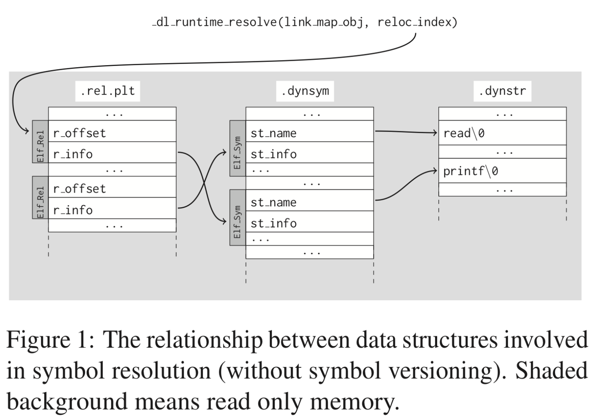

=====================
Dynamic Linkage
=====================

:Date:   2021-10-10 20:45:43

动态链接
==========

1. `动态库和位置无关代码 - arm <http://www.wowotech.net/basic_subject/pic.html>`__
2.  该博客有许多链接的好文章： https://maskray.me/blog/archives 
3. `高级语言的编译：链接及装载过程介绍 <https://tech.meituan.com/2015/01/22/linker.html>`__
4. `Dynamic Linking —— Oracle Solaris 11  <https://docs.oracle.com/cd/E23824_01/html/819-0690/chapter6-83432.html>`__
5. https://tldp.org/HOWTO/Program-Library-HOWTO/dl-libraries.html
6. https://linux.die.net/man/1/ld

优点：

1. 程序模块化，便于升级、扩展。
2. 多程序共享，节省内存，减少换页，增加缓存命中。

- 静态库：链接时重定位；
- 动态库：装载时重定位。

创建共享库
------------

动态库编译 `gcc -fpic -shared a.c -o a.so` 分为两步：

1. gcc -c -fPIC -o mylib.o mylib.c
2. gcc -shared -o mylib.so mylib.o

::

      gcc -shared -fPIC -Wl,-soname,my_soname -o library_name source_files
            1. -shared 表示输出共享类型
            2. -fPIC 地址无关代码
            3. -Wl指定传给链接器的参数，如soname

      gcc -rpath /path -o program source_files
            指定程序运行时查找动态库的路径

      

- strip ：清除符号和调试信息。
- ld：-s消除所有符号信息；-S消除调试符号信息。

动态链接器
-----------------
1. 动态链接器自举：/lib/ld-linux.so.2，glibc - > elf/rtld.c -> _dl_start() ;
2. 装载所有.so;
3. 重定位和初始化

**execve** :按照elf文件程序头表装载elf，并转交控制权给elf入口地址（有.interp则是动态链接器的e_entry;无则是elf文件的e_entry）.

execv不关心elf是否可执行，故/lib/ld-linux.so.2可执行。/lib/ld-linux.so.2本身是静态链接的，不能依赖其它共享对象。

动态链接路径
----------------
按以下顺序查找：

1. 编译时指定的路径，如ld -library-path参数；
2. 环境变量LD_LIBRARY_PATH
3. 路径缓存文件 /etc/ld.so.conf ;
4. 默认共享库目录，先/usr/lib，然后/lib 。

安装共享库：文件复制到共享库目录，然后运行ldconfig。

其它环境变量：

1. LD_PRELOAD：在动态链接器工作前加载指定的共享库或目标文件。
2. LD_DEBUG: 打印动态链接器的运行信息，可选参数有 files、bindings、symbols等。

PIC与PLT
============

地址无关代码PIC：程序中的共享指令地址不因装载地址而改变，不受其被加载到的绝对地址的影响，便于多进程共享代码。

1. 如果so加载到固定地址，那么对进程虚拟地址的管理会变得很复杂，即确定一个so的位置需要考虑其它so的位置以避免重叠，也造成了空间浪费；

2. so的text代码段是共享的，数据段data是线程私有的；
   无论内存在何处加载目标模块so，数据段和代码段被加载到相邻的位置，其距离总是固定的，
   (so是一个单独的可执行单元，不会被拆分为段，不与原程序合并)

3. 代码段是只读的，因此加载时需要RW的GOT来确定so符号地址；链接时，会将符号存入GOT和PLT。

4. 模块间的数据访问和函数调用通过全局偏移表GOT和PLT实现PIC。
   GOT 是存放在数据段的，而PLT是存放在代码段的。配合PLT的GOT的段为got.plt。
   GOT(Global Offset Table)和PLT(Procedure Linkage Table)

5. 全局变量在动态加载时一次性重定位，函数则采用PLT。

符号地址
-----------
>> symtab、strtab和got、plt、got.plt的index如何对应？ 

1. https://maskray.me/blog/2021-09-19-all-about-procedure-linkage-table
2. https://maskray.me/blog/2021-08-29-all-about-global-offset-table

三种符号地址：

1. 链接时常量：可为绝对地址或pc相对地址，静态链接（也即模块内）。
2. 链接时常量+load基址：pic，exe或so的模块内部引用。所有引用都使用got。其链接时常量即相对地址，由PC-relative addressing使用。
3. ld.so运行时决定：主程序中未定义的符号，引用动态库（fpic）。

运行时地址
-------------

so加载地址
~~~~~~~~~~~~

> /proc/pid/maps 得到so load基址 + so symtab/.dynsym 地址 .  那么so引用另一个so的符号的地址如何获取？

a.so引用另一个b.so的符号时，该符号只存在a.so的got/plt、symtab/dynsymtab，不会被主程序包含。即每个可执行单元独立。

got运行时地址
~~~~~~~~~~~~~~~~~~~

1. `_GLOBAL_OFFSET_TABLE_` 宏:  https://docs.oracle.com/cd/E19120-01/open.solaris/819-0690/chapter6-74186/index.html 

GNU ld defines the symbol relative to the Global Offset Table.

   - The aarch64, arm, mips, ppc, and riscv ports define the symbol at the start of .got.

   - The x86 port defines the symbol at the start of .got.plt.

2. get_pc_thunk：获取当前指令地址。 
   > 怎么用？
   此调用在x86上与位置无关的代码中使用。它将代码的位置加载到%ebx寄存器中，
   从而允许全局对象（与代码有固定的偏移量）作为该寄存器的偏移量来访问。

PLT
---------------
函数在第一次被用到时才进行绑定。

isn some architectures (x86-32, x86-64) 

1. .got.plt[0] is the link time address of _DYNAMIC. 
2. .got.plt[1] and .got.plt[2] are reserved by ld.so. 
    .got.plt[1] is a descriptor of the current component 
     while .got.plt[2] is the address of the PLT resolver.

- eager binding:ld -z now、LD_BIND_NOW=1。更安全。实际大部分符号不会被使用。
- lazy binding:慢，每次resolve都需要按序扫描so，并遍历所有符号以查找。

x86 plt过程
~~~~~~~~~~~~~~
PLT的基本流程(plt表)：

::

    /** csapp中的GOT是指(.got.plt + got)
      PLT0:
      push *(GOT + 4)    4. 将本so模块id压入栈.
      jump *(GOT + 8)    5. 调用_dl_runtime_resolve()，根据id+n完成符号解析和重定位，并将地址填入bar@GOT。
                        参数为2、3入栈的值。

      ...

      bar@plt:
      jmp *(bar@GOT)     1. 若符号已绑定，则跳到符号位置；若未绑定，则跳到 2.push n的位置
      push n             2. 将符号在重定位表中的下标压入栈。rel.plt
      jump PLT0          3. 跳到PLT0处

1. “.rel.dyn”实际上是对数据引用的修正，他所修正的位置位于“.got”以及数据段
2. “.rel.plt”是对函数引用的修正，他所修正的位置位于“.got.plt”

符号哈希表.hash：加快符号查找。

.got.plt表
~~~~~~~~~~~~
ELF将GOT拆分成两个表".got"和"".got.plt"。其中"".got"用来保存全局变量的引用地址。".got.plt"用来保存函数引用的地址

.got.plt表前三项具有特殊意义：

::

   ---------------------------------
   .dynamic段地址
   ---------------------------------
   本模块ID
   ---------------------------------
   _dl_runtime_resolve()地址
   ---------------------------------
   ... ...
   ---------------------------------

aarch64 plt
~~~~~~~~~~~~~
1. R_AARCH64_GLOB_DAT: 重定位类型，创建GOT表项存储特定符号的地址
2. R_AARCH64_JUMP_SLOT: 重定位类型，通过PLT找到目标符号的地址

::

   adrp x16, Page(&(.plt.got[n]))
   ldr  x17, [x16, Offset(&(.plt.got[n]))]
   add  x16, x16, Offset(&(.plt.got[n]))
   br   x17

   //x16 holds the address of the .plt.got entry and x17 holds the target address. 

fno-plt
~~~~~~~~~~~~~
1. https://gcc.gnu.org/onlinedocs/gcc/Code-Gen-Options.html

Do not use the PLT for external function calls in position-independent code. Instead, load the callee address at call sites from the GOT and branch to it. This leads to more efficient code by eliminating PLT stubs and exposing GOT loads to optimizations.

Lazy binding requires use of the PLT; with -fno-plt **all external symbols are resolved at load time.**

Alternatively, the function attribute noplt can be used to avoid calls through the PLT for specific external functions

__attribute__((noplt))

LD_BIND_NOW
~~~~~~~~~~~~~~~~

::

   LD_BIND_NOW (since glibc 2.1.1)
        If set to a nonempty string, causes the dynamic linker to
        resolve all symbols at program startup instead of
        deferring function call resolution to the point when they
        are first referenced.  This is useful when using a
        debugger.

_dl_runtime_resolve
=======================

1. CTF-WIKI有很多资料： `Symbol Reslove <https://ctf-wiki.org/executable/elf/linking/symbol-resolve/>`__
2. `dl_runtime_resolve结合源码分析及常见的几种攻击手法 <https://bbs.pediy.com/thread-253833.htm>`__
3. `详细解析ret2_dl_runtime_resolve <https://blog.csdn.net/qq_36495104/article/details/106061223>`__
4. `_dl_runtime_resolve源码分析 <https://blog.csdn.net/conansonic/article/details/54634142>`__
5. `深入了解GOT,PLT和动态链接 <https://evilpan.com/2018/04/09/about-got-plt/#return-to-dlresolve>`__

   
   .rel.plt->.dynsym/.syntab->.dynstr

dl_runtime_resolve执行过程：

1. 通过link_map_obj访问.dynamic section，分别取出.dynstr, .dynsym,.rel.plt的地址
2. .rel.plt+ reloc_index 求出当前函数重定位表项 Elf32_Rel的指针，记为rel
3. **rel->r_info的高24位作为.dynsym的下标**，求出Elf32_Sym的指针，记作sym
4. .dynstr + sym->st_name得到符号名字符串
5. 在动态链接库查找这个函数的地址，并且把找到的地址赋值给rel->r_offset,即.got.plt
6. 最后调用这个函数

_dl_runtime_resolve->_dl_fixup->_dl_lookup_symbol_x->do_lookup_x->check_match

_dl_fixup: https://code.woboq.org/userspace/glibc/elf/dl-runtime.c.html#59

gdb查看plt过程
---------------
1. `通过 GDB 调试理解 GOT/PLT <http://rickgray.me/2015/08/07/use-gdb-to-study-got-and-plt/>`__

gdb直接跳过了resolve过程，.got.plt内直接就是函数地址了(因为参考文章是32位？).....(GNU gdb (Ubuntu 8.1.1-0ubuntu1) 8.1.1)

2. gdb辅助插件：pwndbg、peda

https://github.com/pwndbg/pwndbg

https://github.com/longld/peda

::

   git clone https://github.com/longld/peda.git ~/peda
   echo "source ~/peda/peda.py" >> ~/.gdbinit

ret2dlresolve攻击
-----------------

xHook
-------
hook动态库中的函数以实现自己的功能。系统库、闭源库等无法替换的库。

https://github.com/iqiyi/xHook/blob/master/docs/overview/android_plt_hook_overview.zh-CN.md

1. /proc/self/maps或dl_iterate_phdr()获取so加载地址；
2. 计算符号在.got.plt(so)中的位置；（读内存的方式）
3. mprotect修改内存访问权限；
4. __builtin___clear_cache 清除指令缓存；
5. hook 其他进程需要 root 权限

::

   void hook()
   {
       char       line[512];
       FILE      *fp;
       uintptr_t  base_addr = 0;
       uintptr_t  addr;

       //find base address of libtest.so
       if(NULL == (fp = fopen("/proc/self/maps", "r"))) return;
       while(fgets(line, sizeof(line), fp))
       {
           if(NULL != strstr(line, "libtest.so") &&
              sscanf(line, "%"PRIxPTR"-%*lx %*4s 00000000", &base_addr) == 1)
               break;
       }
       fclose(fp);
       if(0 == base_addr) return;

       //the absolute address
       addr = base_addr + 0x3f90;
       
       //add write permission
       mprotect((void *)PAGE_START(addr), PAGE_SIZE, PROT_READ | PROT_WRITE);

       //replace the function address
       *(void **)addr = my_malloc;

       //clear instruction cache
       __builtin___clear_cache((void *)PAGE_START(addr), (void *)PAGE_END(addr));
   }

从elf文件读取符号地址
~~~~~~~~~~~~~~~~~~~~~~~~
读文件有性能损耗。

动态库热更新
===============
1. `Linux C/C++ 实现热更新 <https://howardlau.me/programming/c-cpp-hot-reload.html>`__
2. `一种基于so的C/C++服务热更新方案 <https://www.jianshu.com/p/b7c7102119fa>`__
3. `Linux 下 C++so 热更新 <https://zhuanlan.zhihu.com/p/162366167>`__
4. https://www.v2ex.com/t/272189
5. 全局符号覆盖的问题 https://www.jianshu.com/p/383f9cd4c67e

两种动态链接方式：

1. 隐式链接：编译时使用-l链接so，程序开始运行时即加载so映射到内存空间；
2. 显式链接：用 libdl.so 库的 API 接口在运行中加载和卸载动态库，主要包括 dlopen、dlclose、dlsym。

热更新方式：

1. textcode jmp。需要attach进程，有性能损失，适用范围广。
2. 修改got。
3. dlopen/dlsym运行时加载so。

so热更新需要保存并恢复状态，包括全局变量、静态变量、寄存器等。热更新一般常用于无状态的纯函数。动态链接库中应当实现的是纯函数，只依赖于输入状态计算出输出状态。

1. 全局变量等
2. 堆内存

动态库和静态库符号冲突
=========================
> ld链接原理的资料

1. `ld 脚本 <https://sourceware.org/binutils/docs/ld/index.html>`__

ld搜索路径添加：

1. 在 /etc/ld.so.conf 文件中添加库的搜索路径。(或者在/etc/ld.so.conf.d 下新建一个.conf文件
2. export LD_LIBRARY_PATH=$LD_LIBRARY_PATH:$(pwd)

-Bdynamic/-Bstatic ： 用于指定是.a还是.so，实际加不加一样：

::

   设备1：
   Linux . 3.10.0-1062.12.1.el7.x86_64 #1 SMP Tue Feb 4 23:02:59 UTC 2020 x86_64 x86_64 x86_64 GNU/Linux
   GNU ld version 2.27-41.base.el7_7.2
   设备2：
   Linux . 5.4.44-OPENFANS+20200609-v8 #1 SMP PREEMPT Tue Jun 9 22:15:08 CST 2020 aarch64 GNU/Linux
   GNU ld (GNU Binutils for Debian) 2.31.1
   设备3：
   Linux . 5.12.14-051214-generic #202106301439 SMP Wed Jun 30 14:47:50 UTC 2021 x86_64 x86_64 x86_64 GNU/Linux
   GNU ld (GNU Binutils for Ubuntu) 2.30

   gcc -o proc_Ba_Bso main.c   -L. -Wl,-Bstatic  -ladd  -Wl,-Bdynamic  -ladd_so  -Wl,-Bdynamic -g
   gcc -o proc_a_Bso main.c   -L.  -ladd  -Wl,-Bdynamic  -ladd_so  -Wl,-Bdynamic -g
   gcc -o proc_a_so main.c   -L.  -ladd  -ladd_so  -Wl,-Bdynamic -g

   gcc -o proc_Bso_Ba main.c   -L. -Wl,-Bdynamic  -ladd_so -Wl,-Bstatic  -ladd   -Wl,-Bdynamic -g
   gcc -o proc_Bso_a main.c   -L. -Wl,-Bdynamic  -ladd_so  -ladd   -Wl,-Bdynamic -g
   gcc -o proc_so_Ba main.c   -L. -ladd_so -Wl,-Bstatic  -ladd   -Wl,-Bdynamic -g
   gcc -o proc_so_a main.c   -L. -ladd_so  -ladd   -Wl,-Bdynamic -g

   //proc_Ba_so：ld失败——显式指定了static方式导致无法找到so

    以下三个,因为完全没有引用so符号，ldd查看没有add_so.so：
   ./proc_a_Bso
   a 3
   ./proc_a_so
   a 3
   ./proc_Ba_Bso
   a 3

   ./proc_Bso_Ba
   so: 3
   ./proc_so_a
   so: 3
   ./proc_so_Ba
   so: 3

dso重复符号处理
----------------

1. 导出符号的概念 `Controlling the Exported Symbols of Shared Libraries <https://www.gnu.org/software/gnulib/manual/html_node/Exported-Symbols-of-Shared-Libraries.html>`__ 
2. https://stackoverflow.com/questions/6538501/linking-two-shared-libraries-with-some-of-the-same-symbols
3. `linux下动态库的符号冲突、隐藏和强制优先使用库内符号 <https://blog.csdn.net/wwyyxx26/article/details/48289659>`__ 

4. `Linux 編譯 shared library 的方法和注意事項 <https://medium.com/fcamels-notes/linux-%E7%B7%A8%E8%AD%AF-shared-library-%E7%9A%84%E6%96%B9%E6%B3%95%E5%92%8C%E6%B3%A8%E6%84%8F%E4%BA%8B%E9%A0%85-cb35844ef331>`__
5.  `open.solaris Symbol Resolution <https://docs.oracle.com/cd/E19120-01/open.solaris/819-0690/chapter2-93321/index.html>`__

三种解决方法：

1. Pass -Bsymbolic or -Bsymbolic-functions to the linker. 
   This has a global effect: every reference to a global symbol 
   (of function type for -Bsymbolic-functions) that can be resolved to a symbol 
   in the library is resolved to that symbol. With this you lose the ability
   to interpose internal library calls to those symbols using LD_PRELOAD. 
   The symbols are still exported, so they can be referenced from outside the library.

2. Use a version script to mark symbols as local to the library, e.g.
   use something like: {local: bar;}; and pass --version-script=versionfile to the linker. 
   The symbols are not exported.

3. Mark symbols with an approppiate visibility (GCC info page for visibility),
   which will be either hidden, internal, or protected. protected visibility symbols are exported  
   as .protected, hidden symbols are not exported, 
   and internal symbols are not exported and you compromise not to 
   call them from outside the library, even indirectly through function pointers.

You can check which symbols are exported with objdump -T.

symbolic
--------------

1. -Bsymbolic https://linux.die.net/man/1/ld

-Bsymbolic、-Bsymbolic-functions：so优先使用自身的符号。

`gcc -shared -fpic -Wl,-Bsymbolic,-Bsymbolic-functions add_so.c -o libadd_so.so`

visibility
---------------
1. https://gcc.gnu.org/onlinedocs/gcc/Code-Gen-Options.html
2. https://zhuanlan.zhihu.com/p/353576520
3. The Linux Programming Interface: ch42 Advanced Features of Shared Libraries

两种方式：

1. 代码中指定 `__attribute__ ((visibility ("default"))) ` + 链接so时 `-fvisibility=hidden` / 
2. 在文件中指定符号 ，`--version-script`: https://linux.die.net/man/1/ld 或 https://ftp.gnu.org/old-gnu/Manuals/ld-2.9.1/html_node/ld_25.html
   use version scripts to filter symbol visibility in auto-export mode: 
   any symbols marked local in the version script will not be exported.

弱符号与COMMON
===================
1. `Environment variables: LD_DYNAMIC_WEAK <https://man7.org/linux/man-pages/man8/ld.so.8.html>`__ old behavior。

默认情况下ld会使用第一个找到的so中的定义。

加上环境变量LD_DYNAMIC_WEAK后，会考虑多个so之间符号的强弱。

::

    LD_DYNAMIC_WEAK (since glibc 2.1.91)

     By default, when searching shared libraries to resolve a
     symbol reference, the dynamic linker will resolve to the
     first definition it finds.

     Standard  practice is that the distinction between weak and strong
     symbols should have effect only at static link time

   Defining the LD_DYNAMIC_WEAK environment variable (with
     any value) provides the old (nonstandard) glibc behavior,
     whereby a weak symbol in one shared library may be
     overridden by a strong symbol subsequently discovered in
     another shared library

common与bss
------------
1. `GCC 下的 COMMON 块控制 <https://www.yhspy.com/2020/06/19/GCC-%E4%B8%8B%E7%9A%84-COMMON-%E5%9D%97%E6%8E%A7%E5%88%B6/>`__
2.  `Symbol Processing <https://docs.oracle.com/cd/E23824_01/html/819-0690/chapter2-90421.html>`__

COMMOM段： ``未被分配位置`` 的未初始化数据，将弱全局符号的决定权留给链接器。

gcc中弱符号: common存放未被初始化的全局变量，bss存放未被初始化的静态变量和初始化为0的全局、静态变量。

编译选项：

1. -fno-common：specifies that the compiler places uninitialized global variables in the BSS section of the object file.
   一个符号只能分配一个空间，所以重复符号放到bss段后会报错。
2. The -fcommon places uninitialized global variables in a common block. 

> commom如何决议多个weak symbols？

强弱符号：在.o中的概念。

> 按照链接器在处理 COMMON 块中符号的规则：同名的 COMMON 段符号会选取符号表中 Size（st_size 字段）较大的那一个？

总结
---------
多个库中存在相同符号：

1. -l链接的.a和.so为可选，可存在多个重复符号定义。符号解析按链接顺序取第一个找到的符号。
2. .o+.o或.so+o确定都被链接时，才需考虑重复定义。

.a+.so或.so+.so：不区分强弱

唯一符号定义：

1.  仅有.a和.so时: 按链接顺序，取第一个找到的符号。tlpi ch41.11。
    
    By default, when searching shared libraries to resolve a
     symbol reference, the dynamic linker will resolve to the
     first definition it finds.
   
   `Symbol <https://community.intel.com/t5/Intel-C-Compiler/Strong-symbol-in-shared-library-overridden-by-weak-symbol-in/m-p/923639>`__
   指出.a+.so、.so+.so 均取第一个符号，a+a取第一个弱符号。The usage of 'weak' here, is try to let the linker to work without reporting the multiple definition error.
   

2.  各自使用自己的定义： 链接成so时指定visibility属性或symbolic选项。

.a+.a : 多个弱符号——任意选择一个。（csapp）
