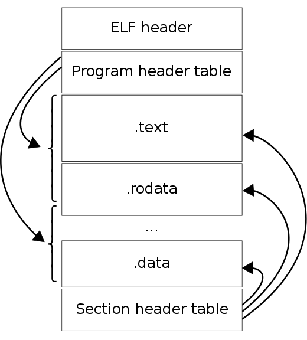
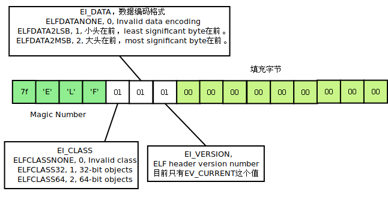
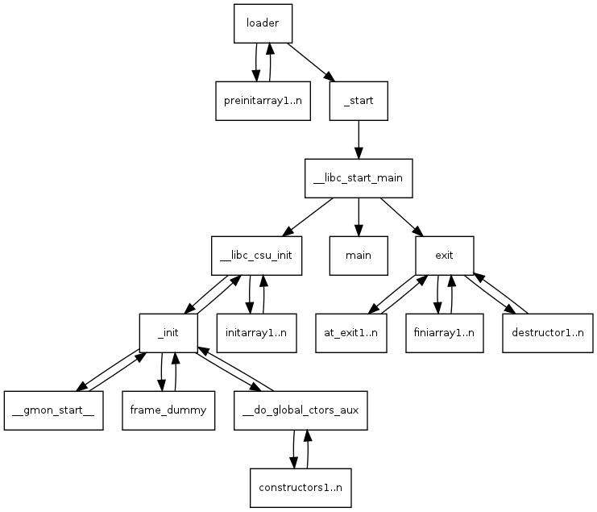
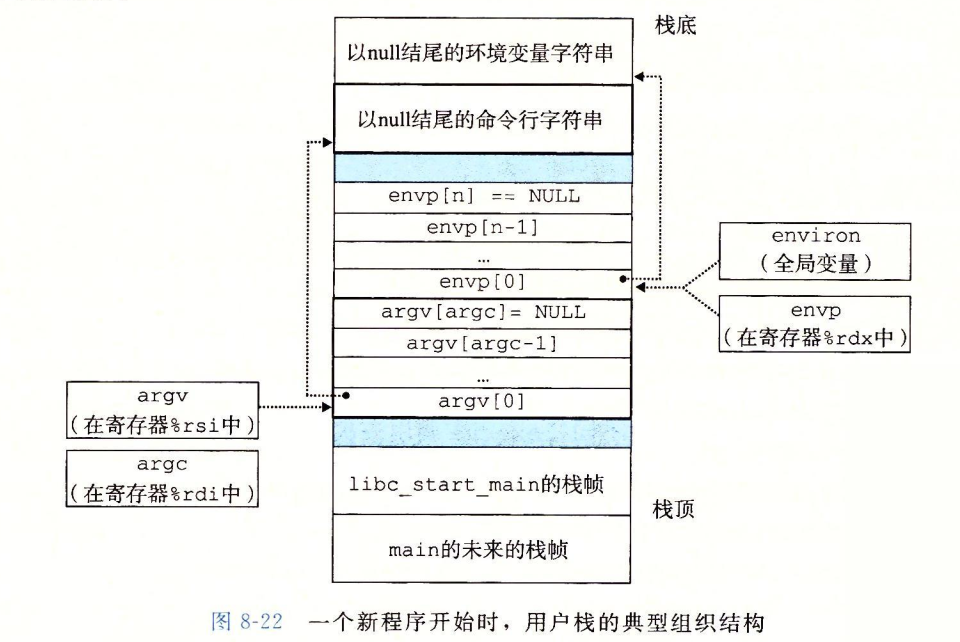

=====================
ELF、Compile & Main
=====================

:Date:   2020-07-15 22:45:43

参考文章
==============
1. :download:`TLPI <../books/The Linux Programming Interface.pdf>` 
   
   :download:`Linux-UNIX系统编程手册（上、下册）.pdf <../books/Linux-UNIX系统编程手册（上、下册）.pdf>` 

   :download:`Linux-UNIX系统编程手册_上册 <../books/Linux-UNIX系统编程手册_上册.pdf>` 
   :download:`Linux-UNIX系统编程手册_下册 <../books/Linux-UNIX系统编程手册_下册.pdf>`

2. :download:`gcc 9.2 manual <../files/gcc_9.2_manuals.pdf>`

反汇编常用命令
===============

objdump
----------
objdump -x -D -s:

::

   -x:    文件头、动态库、符号表. 等于-a -f -h -p -r -t
   -s:    二进制形式打印所有段内容
   -D:    反汇编所有段
   -d/S:  反汇编代码段
   -t:    符号表 = nm
   -j .text/.data: 指定段,需要配合-d使用
   -h:    关键段表
          

readelf
---------

1. readelf -h : elf文件头。elf文件和平台信息;Program Header Table 和 Section Header Table 的 offset/size/number。
2. readelf -S : 节区表/节头部表Section Headers。 objdump -h(只显示关键段)。
3. readelf -r .so ：查看重定位表。
4. readelf -s : 符号表（nm、objdump -t）
5. readelf -l : rogram Headers,以及segment与Section的对应关系
6. readelf -a : 所有
7. readelf -d : 查看so的.dynamic段。

8. ldd exe： 查看so依赖
9. ar:  静态库打包、解压等
10. strings: 查看可打印字符串
11. size exe: 查看text、data、bss的长度。

    ELF结构

vim xxd
-----------
objdump和readelf可查看解析后的符号表，xxd查看原始二进制符号表。

::

      vim -b main.o
      hex形式-- vim执行 %!xxd
      回写  ：%!xxd -r

ELF结构
=============
1. ☆ `[原创] ELF文件结构详解-Android安全-看雪论坛-安全社区|安全招聘|bbs.pediy.com  <https://bbs.pediy.com/thread-255670.htm>`__
2. ☆ `elf(5) - Linux manual page  <https://man7.org/linux/man-pages/man5/elf.5.html>`__
3. ☆ `.symtab: Symbol Table - CTF Wiki  <https://ctf-wiki.org/executable/elf/structure/symbol-table/#_2>`__
4. `File Format (Linker and Libraries Guide)  <https://docs.oracle.com/cd/E19683-01/816-1386/6m7qcoblj/index.html#chapter6-tbl-21>`__

- Elf文件头：readelf -h 

Section Header
----------------

::

   include/uapi/linux/elf.h

  #define EI_NIDENT 16

  typedef struct
  {
       unsigned char	e_ident[EI_NIDENT];	/* Magic number and other info */
       Elf64_Half	e_type;			/* Object file type */
       Elf64_Half	e_machine;		/* Architecture */
       Elf64_Word	e_version;		/* Object file version */
       Elf64_Addr	e_entry;		/* Entry point virtual address */
       Elf64_Off	e_phoff;		/* Program header table file offset */
       Elf64_Off	e_shoff;		/* Section header table file offset */
       Elf64_Word	e_flags;		/* Processor-specific flags */
       Elf64_Half	e_ehsize;		/* ELF header size in bytes */
       Elf64_Half	e_phentsize;		/* Program header table entry size */
       Elf64_Half	e_phnum;		/* Program header table entry count */
       Elf64_Half	e_shentsize;		/* Section header table entry size */
       Elf64_Half	e_shnum;		/* Section header table entry count */
       Elf64_Half	e_shstrndx;		/* Section header string table index */
  } Elf64_Ehdr;

  52 or 64 bytes long for 32-bit and 64-bit binaries respectively.

      开头的16B Magic number

段位置与长度
~~~~~~~~~~~~~

::

   # readelf -h SimpleSection.o
   ELF Header:
   Magic:   7f 45 4c 46 02 01 01 00 00 00 00 00 00 00 00 00
   Class:                             ELF64
   Data:                              2's complement, little endian
   Version:                           1 (current)
   OS/ABI:                            UNIX - System V
   ABI Version:                       0
   Type:                              REL (Relocatable file)
   Machine:                           Advanced Micro Devices X86-64
   Version:                           0x1
   Entry point address:               0x0
   Start of program headers:          0 (bytes into file)
   Start of section headers:          1040 (bytes into file)
   Flags:                             0x0
   Size of this header:               64 (bytes)
   Size of program headers:           0 (bytes)
   Number of program headers:         0
   Size of section headers:           64 (bytes)
   Number of section headers:         13
   Section header string table index: 12

   # readelf -S SimpleSection.o
   There are 13 section headers, starting at offset 0x410:

   Section Headers:
   [Nr] Name              Type             Address           Offset
         Size              EntSize          Flags  Link  Info  Align
   [ 0]                   NULL             0000000000000000  00000000
         0000000000000000  0000000000000000           0     0     0
   [ 1] .text             PROGBITS         0000000000000000  00000040
         0000000000000054  0000000000000000  AX       0     0     1
   [ 2] .rela.text        RELA             0000000000000000  00000300
         0000000000000078  0000000000000018   I      10     1     8
   [ 3] .data             PROGBITS         0000000000000000  00000094
         0000000000000008  0000000000000000  WA       0     0     4
   [ 4] .bss              NOBITS           0000000000000000  0000009c
         0000000000000004  0000000000000000  WA       0     0     4
   [ 5] .rodata           PROGBITS         0000000000000000  0000009c
         0000000000000004  0000000000000000   A       0     0     1
   [ 6] .comment          PROGBITS         0000000000000000  000000a0
         000000000000002e  0000000000000001  MS       0     0     1
   [ 7] .note.GNU-stack   PROGBITS         0000000000000000  000000ce
         0000000000000000  0000000000000000           0     0     1
   [ 8] .eh_frame         PROGBITS         0000000000000000  000000d0
         0000000000000058  0000000000000000   A       0     0     8
   [ 9] .rela.eh_frame    RELA             0000000000000000  00000378
         0000000000000030  0000000000000018   I      10     8     8
   [10] .symtab           SYMTAB           0000000000000000  00000128
         0000000000000180  0000000000000018          11    11     8
   [11] .strtab           STRTAB           0000000000000000  000002a8
         0000000000000053  0000000000000000           0     0     1
   [12] .shstrtab         STRTAB           0000000000000000  000003a8
         0000000000000061  0000000000000000           0     0     1

       
SimpleSection.o 大小为 1872（0x750）字节。

shstrtab结束后长度为0x410（1040），段表长度为64×13=832（0x340）,刚好为文件长度。

此处段表位于最后，与csapp的描述一致。

Program header (Phdr)
----------------------

::

   typedef struct {
        Elf64_Word      p_type;
        Elf64_Word      p_flags;
        Elf64_Off       p_offset;
        Elf64_Addr      p_vaddr;
        Elf64_Addr      p_paddr;
        Elf64_Xword     p_filesz;
        Elf64_Xword     p_memsz;
        Elf64_Xword     p_align;
   } Elf64_Phdr;

   

p_paddr：

::

   man5/elf.5.html
   On systems for which physical addressing is relevant, this
   member is reserved for the segment's physical address.
   Under BSD this member is not used and must be zero.

   Oracle Solaris 11 
   The segment's physical address for systems in which physical addressing is relevant.
   Because the system ignores physical addressing for application programs, 
   this member has unspecified contents for executable files and shared objects.

   该字段在所有系统中都没有意义?

symbol table
--------------
符号表定义在linux-src\include\uapi\linux\elf.h

::

      typedef struct elf64_sym {
           Elf64_Word st_name;		/* Symbol name, index in string tbl */  在字符串表的索引
           unsigned char	st_info;	/* Type and binding attributes */   4bits BIND : 4bits TYPE
           unsigned char	st_other;	/* No defined meaning, 0 */
           Elf64_Half st_shndx;		/* Associated section index */    符号定义所处的section。外部引用符号为0
           Elf64_Addr st_value;		/* Value of the symbol */
           Elf64_Xword st_size;		/* Associated symbol size */
      } Elf64_Sym;

st_name
~~~~~~~~~~~~~~~~~~~~~

symtab中的st_name指向字符串表的索引。

`Symbol Table Section <https://docs.oracle.com/cd/E19120-01/open.solaris/819-0690/chapter6-79797/index.html>`__

An index into the object file's symbol string table, which holds the character representations of the symbol names. 
If the value is nonzero, the value represents a string table index that gives the symbol name. 

st_value
~~~~~~~~~~~~~~~~
symtab中的st_value。

`Symbol Values <https://docs.oracle.com/cd/E19120-01/open.solaris/819-0690/chapter6-35166/index.html>`__

st_value的含义取决于object文件类型：

   1. In relocatable files, st_value holds alignment constraints for a symbol whose section index is SHN_COMMON.

   2. In relocatable files, st_value holds a section offset for a defined symbol. st_value is an offset from the beginning of the section that st_shndx identifies.

   3. In **executable and shared object files**, st_value holds a virtual address. To make these files' symbols more useful for the runtime linker, the section offset (file interpretation) gives way to a virtual address (memory interpretation) for which the section number is irrelevant.
   即指向了 **符号的虚拟地址**。

st_info
~~~~~~~~~

::

      /* This info is needed when parsing the symbol table */

      #define STB_LOCAL  0
      #define STB_GLOBAL 1
      #define STB_WEAK   2

      /* 表示符号关联(BIND)的对象的信息。
      /* 若外部引用符号为未解析则为STT_NOTYPE，其类型由找到的外部定义来确定（这里不区分函数、变量）。
      #define STT_NOTYPE  0         //The symbol's type is not defined.
      #define STT_OBJECT  1         //The symbol is associated with a data object.
      #define STT_FUNC    2         //The symbol is associated with a function or other executable code.
      #define STT_SECTION 3
      #define STT_FILE    4
      #define STT_COMMON  5
      #define STT_TLS     6

      #define ELF_ST_BIND(x)		((x) >> 4)
      #define ELF_ST_TYPE(x)		(((unsigned int) x) & 0xf)

.. figure:: ../images/elf_st_info.png
   :alt: elf_st_info

符号表反汇编实例
~~~~~~~~~~~~~~~~~~~
x86 小端，gcc version 9.3.0 

外部引用符号f未被解析TYPE则为STT_NOTYPE，其类型由找到的外部定义来确定（这里不区分函数、变量）；其BIND为STB_GLOBAL。

::

      readelf -S main.o

        [10] .symtab           SYMTAB           0000000000000000  000000e8
             0000000000000120  0000000000000018          11     9     8
        [11] .strtab           STRTAB           0000000000000000  00000208
             0000000000000025  0000000000000000           0     0     1

         

      readelf -s main.o

      Symbol table '.symtab' contains 12 entries:
         Num:    Value          Size Type    Bind   Vis      Ndx Name
           0: 0000000000000000     0 NOTYPE  LOCAL  DEFAULT  UND
           1: 0000000000000000     0 FILE    LOCAL  DEFAULT  ABS main.c
           2: 0000000000000000     0 SECTION LOCAL  DEFAULT    1
           3: 0000000000000000     0 SECTION LOCAL  DEFAULT    3
           4: 0000000000000000     0 SECTION LOCAL  DEFAULT    4
           5: 0000000000000000     0 SECTION LOCAL  DEFAULT    6
           6: 0000000000000000     0 SECTION LOCAL  DEFAULT    7
           7: 0000000000000000     0 SECTION LOCAL  DEFAULT    8
           8: 0000000000000000     0 SECTION LOCAL  DEFAULT    5
           9: 0000000000000000    35 FUNC    GLOBAL DEFAULT    1 main
          10: 0000000000000000     0 NOTYPE  GLOBAL DEFAULT  UND _GLOBAL_OFFSET_TABLE_
          11: 0000000000000000     0 NOTYPE  GLOBAL DEFAULT  UND f

      f符号表项起始地址: 0xe8 + (Elf64_Sym结构体 24Bytes * f编号11) = 0x1f0;

         000001f0: 2300 0000 1000 0000 0000 0000 0000 0000  #...............
         00000200: 0000 0000 0000 0000 006d 6169 6e2e 6300  .........main.c.
         00000210: 6d61 696e 005f 474c 4f42 414c 5f4f 4646  main._GLOBAL_OFF
          
      可得: st_name=0x23; bind=1,type=0;st_shndx=st_value=st_size=0

重定位表
---------------------------------
Relocation entries (Rel & Rela)

elf程序装载
-----------

elf文件头中的section表按照读写属性在程序头中的segment表中合并。
有两个segment：data段-RW 和 code段-RX。

段地址对齐：elf文件逻辑上被分为4k大小的块装入物理内存，而在虚拟内存中，包含两个段接壤部分的块会被映射两次。

elf可执行文件的装载：load_elf_binary()位于fs/Binfmt_elf.C

1. 检查elf有效性；
2. .interp段中寻找动态链接器路径；
3. 根据程序头表进行映射；
4. 初始化elf进程环境；
5. 将返回地址修改位elf可执行文件的入口。

静态链接
===========
链接器两大功能：

1. 符号解析：将目标文件中每个全局符号都绑定到一个唯一的定义；
2. 重定位：聚合节以确定每个全局符号的最终内存地址，并修改对这些符号的引用（rel.data/rel.text）。

符号
---------
弱符号与强符号：处理链接时多次定义的情况。

1. 强符号：函数与已初始化的全局变量；
2. 弱符号：未初始化的全局变量，或 __attribute__((weak))

强引用与弱引用：处理链接时找不到引用的外部符号的情况。

1. 强引用：符号未定义错误；
2. 弱引用：不报错，默认为0。__attribute__ ((weakref))

弱符号和弱链接对于库很有用，使得程序功能更容易裁剪和组合。用户可覆盖库的弱符号；库可覆盖用户的弱引用。

ld脚本与静态链接
---------------------
静态库：多个目标文件经过打包压缩而来。链接时是分.o链接的。

ar -t libc.a 查看包含的.O

相似段合并，两步链接：

1. 空间与地址分配：扫描输入文件，计算合并段的位置和长度；同时生成全局符号表。
2. 符号解析与重定位：将未定义符号与定义关联，调整代码中的地址等。

objdump -r .o:重定位表，所有引用外部符号的地址。

指令修正方式，x86有两种基本重定位类型。

1. 绝对寻址修正：S+A，得到符号实际地址；
2. 相对寻址修正：S+A-P，得到符号相对被修正位置的地址差。

S实际地址；A被修正位置的值；P被修正的位置。

ld链接脚本：控制输入段如何变成输出段。ld使用默认链接脚本。

指定段：在全局变量或函数前加上 `__attribute__((section("name")))`

main之前
==========
1. 英文版 `Linux x86 Program Start Up <http://dbp-consulting.com/tutorials/debugging/linuxProgramStartup.html>`__ ;
   翻译不怎么样 `Linux X86 程序启动 <https://luomuxiaoxiao.com/?p=516>`__
2. glibc源码位置: https://code.woboq.org/userspace/glibc/csu/libc-start.c.html#129
3. https://www.gnu.org/software/hurd/glibc/startup.html GNU Hurd系统的参考过程
4. https://gcc.gnu.org/onlinedocs/gccint/Initialization.html

问题
------
1. 构造函数(__libc_csu_init)做了什么？ 哪些需要构造？C是否就不需要构造函数？ : 详细走一遍gdb

程序的运行与结束
----------------
``execvp -> preinit -> _start -> __libc_start_main -> __libc_csu_init -> _init -> main -> exit -> atexit/fini/destructor``

   main_call_graph

1. execvp:   设置栈，压入argc、argv、envp的值，设置文件描述符（0、1、2），预初始化函数（.preinit）;
2. _start:  置零ebp标记最外层栈，esp对齐16B，压入__libc_start_main的参数（通过esp/esi取到的argc/argv的偏移）；位于glibc/csu/libc-start.c
3. __libc_start_main:  完成主要工作。setuid/setgid；将fini和rtld_fini传递给at_exit;调用init参数；
   并调用main（原型如下）；调用exit。

4. init -> __libc_csu_init -> _init :  调用_do_global_ctors_aux-构造函数constructor; 调用C代码里的Initializer；
5. exit :  先调用注册到atexit的函数，然后fini,最后destructor。

   stack_main_start

_start和__libc_start_main
----------------------------
glibc/csu/elf-init.c

函数原型
~~~~~~~~~

::
      
      int __libc_start_main(  int (*main) (int, char * *, char * *),
                int argc, char * * ubp_av,
                void (*init) (void),
                void (*fini) (void),
                void (*rtld_fini) (void),
                void (* stack_end));

      int main(int argc, char** argv, char** envp)

_start压入参数
~~~~~~~~~~~~~~~~

::

      080482e0 <_start>:
      80482e0:       31 ed                   xor    %ebp,%ebp     # 置零0，标记为初始栈帧
      80482e2:       5e                      pop    %esi          # 弹出argc的偏移，后面再压入。然后esp指向了argv
      80482e3:       89 e1                   mov    %esp,%ecx     # 弹出argv偏移
      80482e5:       83 e4 f0                and    $0xfffffff0,%esp  # esp对齐16B，栈向下生长
      80482e8:       50                      push   %eax          # 这里没有用，为了对齐
      80482e9:       54                      push   %esp          # stack_end，栈底
      80482ea:       52                      push   %edx          # rtld_fini，Destructor of dynamic linker from loader passed in %edx.
      80482eb:       68 00 84 04 08          push   $0x8048400    # fini，__libc_csu_fini - Destructor of this program.
      80482f0:       68 a0 83 04 08          push   $0x80483a0    # init，__libc_csu_init, Constructor of this program.
      80482f5:       51                      push   %ecx          # 压入argv的偏移
      80482f6:       56                      push   %esi          # 压入argc的偏移
      80482f7:       68 94 83 04 08          push   $0x8048394    # main函数
      80482fc:       e8 c3 ff ff ff          call   80482c4 <__libc_start_main@plt>
      8048301:       f4

不需要显式传入envp
~~~~~~~~~~~~~~~~~~~~~
在argv末尾紧接着的位置取envp， ** envp = &argv[argc + 1] 

> 为什么需要argc?根据null结束符即可判断argv数量（envp也没有显式的成员数量）

__libc_csu_init 
-------------------
x86环境上gdb跟踪（C语言），发现调用栈和参考文章的流程图不一样，缺少部分函数调用过程（C++和C一样，centos和ubuntu一样，arm和x86也类似，可能是gcc/g++版本的原因？）：

与这篇文章的反汇编相同 `who call main <http://wen00072.github.io/blog/2015/02/14/main-linux-whos-going-to-call-in-c-language/>`__

1. _init中只调用了__gmon_start,没有调用frame_dummy（有此符号）和__do_global_ctors_aux（无此符号）
2. constructor和gmon_start由init直接调用
3. 没有段.ctor

.ctor和.dtor段
~~~~~~~~~~~~~~~~~

`section自定义段 <https://sourceware.org/binutils/docs/as/Section.html>`__

https://gcc.gnu.org/onlinedocs/gccint/Initialization.html

- .ctor和.dtor段只在可自定义section名的目标文件中被支持（coff/elf都支持）

::
        
  The best way to handle static constructors works only for object file formats which provide arbitrarily-named sections.
   A section is set aside for a list of constructors, and another for a list of destructors. 
   Traditionally these are called ‘.ctors’ and ‘.dtors’. 
   Each object file that defines an initialization function also puts a word in the constructor section to point to that function. 
   The linker accumulates all these words into one contiguous ‘.ctors’ section. Termination functions are handled similarly.

- 查看源码得知，程序定义了  **USE_EH_FRAME_REGISTRY || USE_TM_CLONE_REGISTRY**  ，对应register_tm_clones和.eh_frame。
  该分支不定义__do_global_ctors_aux 。

https://github.com/gcc-mirror/gcc/blob/master/libgcc/crtstuff.c#L511

https://code.woboq.org/gcc/libgcc/crtstuff.c.html#448

::

      #ifdef OBJECT_FORMAT_ELF

      #if defined(USE_EH_FRAME_REGISTRY) \
      || defined(USE_TM_CLONE_REGISTRY)
      # 中间定义了frame_dummy

            #ifdef __LIBGCC_INIT_SECTION_ASM_OP__
                  CRT_CALL_STATIC_FUNCTION (__LIBGCC_INIT_SECTION_ASM_OP__, frame_dummy)
            #else /* defined(__LIBGCC_INIT_SECTION_ASM_OP__) */
                  static func_ptr __frame_dummy_init_array_entry[]
                  __attribute__ ((__used__, section(".init_array"), aligned(sizeof(func_ptr))))
                  = { frame_dummy };
            #endif /* !defined(__LIBGCC_INIT_SECTION_ASM_OP__) */

      #endif /* USE_EH_FRAME_REGISTRY || USE_TM_CLONE_REGISTRY */

      #else  /* OBJECT_FORMAT_ELF */ # 这个后面就是定义__do_global_ctors_aux的内容了

实际堆栈跟踪
~~~~~~~~~~~~~~~~~
**a_constructor**

::

      (gdb) bt
      #0  0x00007ffff7a62bf8 in _IO_puts (str=0x555555400718 <__FUNCTION__.2249> "a_constructor") at ioputs.c:46
      #1  0x000055555540066a in a_constructor () at constructor.c:4
      #2  0x00005555554006dd in __libc_csu_init ()
      #3  0x00007ffff7a03b88 in __libc_start_main (main=0x55555540066d <main>, argc=1, argv=0x7fffffffe388,
      #4  0x000055555540057a in _start ()

反汇编没有__do_global_ctors_aux ，只有 **__do_global_dtors_aux**:

::

      (gdb) bt
      #0  0x0000555555400610 in __do_global_dtors_aux ()
      #1  0x00007ffff7de3d13 in _dl_fini () at dl-fini.c:138
      #2  0x00007ffff7a25161 in __run_exit_handlers (status=0, listp=0x7ffff7dcd718 <__exit_funcs>,
      run_list_atexit=run_list_atexit@entry=true, run_dtors=run_dtors@entry=true) at exit.c:108
      #3  0x00007ffff7a2525a in __GI_exit (status=<optimized out>) at exit.c:139
      #4  0x00007ffff7a03bfe in __libc_start_main (main=0x55555540066d <main>, argc=1, argv=0x7fffffffe388,
      init=<optimized out>, fini=<optimized out>, rtld_fini=<optimized out>, stack_end=0x7fffffffe378)
      at ../csu/libc-start.c:344
      #5  0x000055555540057a in _start ()

::

      #include <stdio.h>
      void __attribute__ ((constructor)) constructor(void) {
            printf("%s\n", __FUNCTION__);
      }

      int main()
      {
            printf("%s\n",__FUNCTION__);
            return 0;
      }

.bss与__do_global_dtors_aux
~~~~~~~~~~~~~~~~~~~~~~~~~~~~~~~~~~~
__do_global_dtors_aux使用到的一个变量completed.*** 放在.bss。

::

  cat bss.c

  #include <stdio.h>
  int a;
  int b=0;
  int c=1;
  void main(){
      printf("%d %d %d\n", a, b, c);
  }

  bss.o中.bss size=4: a为弱符号,在.common区
  bss.exe中.bss size=12: a、b在.bss,还多了一个变量 completed.***(1B,对齐4B) 。
         0000000000601038 l     O .bss   0000000000000001              completed.7247

::

      若completed.7247 不为 0,则直接返回。
      00000000004004e0 <__do_global_dtors_aux>:
      4004e0:       80 3d 51 0b 20 00 00    cmpb   $0x0,0x200b51(%rip)        # 601038 <__TMC_END__>
      4004e7:       75 17                   jne    400500 <__do_global_dtors_aux+0x20>
      4004e9:       55                      push   %rbp
      4004ea:       48 89 e5                mov    %rsp,%rbp
      4004ed:       e8 7e ff ff ff          callq  400470 <deregister_tm_clones>
      4004f2:       c6 05 3f 0b 20 00 01    movb   $0x1,0x200b3f(%rip)        # 601038 <__TMC_END__>
      4004f9:       5d                      pop    %rbp
      4004fa:       c3                      retq
      4004fb:       0f 1f 44 00 00          nopl   0x0(%rax,%rax,1)
      400500:       c3                      retq
      400501:       0f 1f 44 00 00          nopl   0x0(%rax,%rax,1)
      400506:       66 2e 0f 1f 84 00 00    nopw   %cs:0x0(%rax,%rax,1)
      40050d:       00 00 00

**以下为參考文章的内容：**

get_pc_truck
~~~~~~~~~~~~~~~~~

让位置无关码正常工作。将 **当前地址与GOT之间的偏移值**存入基址寄存器（%ebp）。

_init
~~~~~~~~~~~~~~~~~~~~~~~~~~~~~~~~~
1. gmon_start : 生成gmon.out，来源于程序分析工具gprof。
2. frame_dummy: initialize exception handling frame。
3. _do_global_ctors_aux: 构造函数

_do_global_ctors_aux
~~~~~~~~~~~~~~~~~~~~~~~
**__do_global_ctors_aux** 遍历 .CTORS section, 
 __do_global_dtors_aux 遍历 .DTORS section包含的destructors functions.

::

      #ifdef OBJECT_FORMAT_ELF
      static void __attribute__((used))
      __do_global_ctors_aux (void)
      {
            func_ptr *p;
            for (p = __CTOR_END__ - 1; *p != (func_ptr) -1; p--)
            (*p) ();
      }

在循环里面调用了用户定义的constructor。

查看环境变量
---------------
设置环境变量LD_SHOW_AUXV=1 ，运行程序即可打印环境变量。

::

      $ LD_SHOW_AUXV=1 ./strcat
      AT_SYSINFO_EHDR: 0x7ffd0712f000
      AT_HWCAP:        f8bfbff
      AT_PAGESZ:       4096
      AT_CLKTCK:       100
      AT_PHDR:         0x56004e000040
      AT_PHENT:        56
      AT_PHNUM:        9
      AT_BASE:         0x7efd65cdc000
      AT_FLAGS:        0x0
      AT_ENTRY:        0x56004e0005f0
      AT_UID:          1000
      AT_EUID:         1000
      AT_GID:          1000
      AT_EGID:         1000
      AT_SECURE:       0
      AT_RANDOM:       0x7ffd070a3a59
      AT_HWCAP2:       0x2
      AT_EXECFN:       ./strcat
      AT_PLATFORM:     x86_64
      abcd!
      16
      
      $ cat strcat.c
      #include <stdio.h>
      #include <string.h>

      int main(){

      char str1[20] = "abcd";
      strcat(str1,"!");
      printf("%s\n",str1);

      printf("%d\n",0x1<<1+3);
      return 0;
      }

完整示例
------------
源码

::

      #include <stdio.h>

      void preinit(int argc, char **argv, char **envp) {
      printf("%s\n", __FUNCTION__);
      }

      void init(int argc, char **argv, char **envp) {
      printf("%s\n", __FUNCTION__);
      }

      void fini() {
      printf("%s\n", __FUNCTION__);
      }

      __attribute__((section(".init_array"))) typeof(init) *__init = init;
      __attribute__((section(".preinit_array"))) typeof(preinit) *__preinit = preinit;
      __attribute__((section(".fini_array"))) typeof(fini) *__fini = fini;

      void  __attribute__ ((constructor)) constructor() {
      printf("%s\n", __FUNCTION__);
      }

      void __attribute__ ((destructor)) destructor() {
      printf("%s\n", __FUNCTION__);
      }

      void my_atexit() {
      printf("%s\n", __FUNCTION__);
      }

      void my_atexit2() {
      printf("%s\n", __FUNCTION__);
      }

      int main() {
      atexit(my_atexit);
      atexit(my_atexit2);
      }

输出：

::

      $ ./hooks
      preinit
      constructor
      init
      my_atexit2
      my_atexit
      fini
      destructor

C语言汇编实例
==============

c语言返回值
-----------
1. 返回值保存在eax中，即程序默认会去eax取返回值。
2. void类型函数不能作为整型表达式使用，编译报错 `error: invalid use of void expression`。
3. 使用struct作为返回值，实际是截取了前sizeof(int)字节内容。

struct返回值
~~~~~~~~~~~~~

::

      $ gcc exit_status.c -o exit_status
      $ ./exit_status
      $ echo $?
      8
      $ cat exit_status.c
      #include <stdio.h>
      struct st{

      int a;
      int b;
      };

      struct st main(){

      struct st A={.a=8,.b=2};
      return A;
      }

内联汇编修改eax
~~~~~~~~~~~~~~~~~~
::

      $ gcc add.c -o add
      $ ./add
      7
      666

      $ cat add.c
      #include <stdio.h>

      int add(int a, int b)
      {
            return a + b;
      }

      int asm_compare_one(int a)
      {
      asm volatile("movl $666,%eax");
      }

      int main()
      {
            int a, b;
      a = 2,b=5;
      //      scanf("%d %d", &a, &b);
            printf("%d\n", add(a, b));
            printf("%d\n", asm_compare_one(a));
            return 0;
      }

printf参数寄存器
----------------------
`printf汇编实现 <https://www.zhihu.com/question/383699152>`__

1 Linux 32位平台
~~~~~~~~~~~~~~~~~~~~~~~

::

      char* str = "Hello World!\n"
      void asmprint()
      {
      asm("movl $13, %%edx \n\t"
            "movl  %0,%%ecx \n\t"
            "movl $0,%%ebx \n\t"
            "movl $4,%%eax \n\t"
            "int $0x80  \n\t"
            ::"r"(str));
      }

32位linux内核调用0x80软中断来实现系统调用,

系统调用号4表示系统调用write,用eax寄存器传递，

write有三个参数，用ebx,ecx,edx传递，

其中ebx表示标准输出，这里是控制台，

ecx表示字符串地址，用%0来指定的str字符串“Hello World!”地址,

edx表示字符串长度，这里是13

2 Linux 64位平台
~~~~~~~~~~~~~~~~~~~~~~

::

      char* str = "Hello World!\n"
      void asmprint()
      {
      asm (
            "movq $13, %%rdx \n\t"
            "movq %0, %%rsi  \n\t"
            "movq $1, %%rdi  \n\t"
            "movq $1, %%rax  \n\t"
            "syscall      \n\t"
            ::"r"(str));
      }

64位linux内核使用syscall系统调用。

eax寄存器传递系统调用，1号表示write，，

write有三个参数，用rdi,rsi,rdx传递，

rdi为0表示标准输出

rsi表示字符串地址

rdx表示字符串长度   

注：本章以上内容均为x86。
