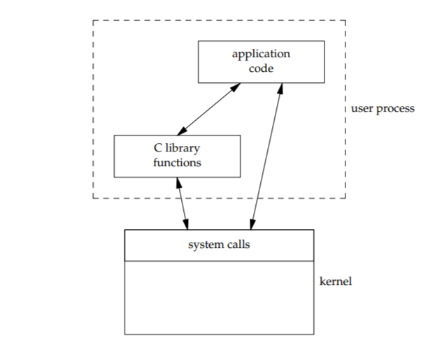

==============
Linux
==============

:Date:   2021-04-24 16:52:25

问题记录
========

1. int 0x80和syscall/sysenter的区别？int的工作原理？
2. 段选择子的作用？三级页表的工作原理？

内核开发入门
============

参考文档
--------

https://www.kernel.org/doc/html/latest/translations/zh_CN/
https://kernelnewbies.org/
https://lwn.net/
https://kernel.org/pub/linux/kernel/

参考书籍
~~~~~~~~

1. Linux内核设计与实现 第三版
2. `趣谈Linux操作系统——刘超 <https://zter.ml/>`__
3. Linux Devices Driver
4. Proffesional Linux Kernel Architecture

参考链接
~~~~~~~~
1. `6.828   实现xv6 <https://pdos.csail.mit.edu/6.S081/2020/>`__
2. `知乎-MIT 6.828   实现操作系统 <https://zhuanlan.zhihu.com/c_1273723917820215296>`__

基本概念
--------
内核态拥有受保护的内存空间和访问硬件设备的所有权限。

应用程序通过库函数或系统调用让内核代替完成各种任务。
库函数不仅是对系统调用的打包，它也实现了系统调用不具备的功能，如strcpy。

   库函数和系统调用

**处理器可能的状态：**

1. 运行于用户空间，执行用户进程；
2. 运行于内核空间，处于进程上下文，代表某个特定的进程执行；
3. 运行于内核空间，处于中断上下文，处理特定的中断（与任何进程无关）。
4. CPU空闲时，运行一个空进程，处于2的状态。

**微内核：**
将内核服务的地址空间隔离，内核只提供基础服务（IPC、内存、调度等），
其它服务组件如文件系统、驱动程序等则各自运行在独立的地址空间（用户空间），并以IPC的方式为其它应用程序提供服务。

微内核提升了稳定性、安全性、扩展性和内核实时性，但是损失了效率。

内核版本号
----------

`Linux内核版本号： <http://en.wikipedia.org/wiki/Linux_kernel#Version_numbering>`__

1. 2.x 版本奇数表示开发版、偶数表示稳定版。2.6.x系列覆盖了2003-2011年。
2. 3.0开始，版本号基于时间变化（近2个月更新一次小版本号），不代表有重大的内容更新。同时避免小版本号超过20。
3. 当前5.11为15-Feb-2021发布

-  mainline 是主线版本。
-  stable 是稳定版，由 mainline
   在时机成熟时发布，稳定版也会在相应版本号的主线上提供 bug
   修复和安全补丁
-  longterm
   是长期支持版，多为\ `6年 <https://www.kernel.org/category/releases.html>`__
-  RC：release candidates。

编译
--------------

下载源码
~~~~~~~~~
1. 下载发布版本包；
2. 下载Git。

::

   git clone git://git.kernel.org/pub/scm/linux/kernel/git/stable/linux.git
   镜像
   git clone git clone https://mirrors.tuna.tsinghua.edu.cn/git/linux-stable.git

   在windows中有兼容性问题（aux文件在win中为设备文件）。
   git config core.protectNTFS false
   git rm --cache aux.c/h

3. 切换版本
   
::
   
   git tag
   git checkout V5.0

内核编译
~~~~~~~~
Kbuild+Makefile

编译选项通常有三个：Yes/No/Module。Module代表以模块的形式独立生成。

发布版：Ubuntu、Federo等发布版包含了预编译的内核，已启用了所需的功能，而驱动程序一般都是模块。

::

   安装依赖
   sudo apt-get install git fakeroot build-essential ncurses-dev xz-utils libssl-dev bc flex libelf-dev bison

   make menuconfig

   cp /boot/config-$(uname -r) .config

   make oldconfig //验证.config

   make -j8 >> make.log

   make modules_install //安装启用的模块

   sudo make install //安装内核。然后需要更新引导！！

模块编译
~~~~~~~~

1. 源码树内部编译：
   
   1. 增加文件夹，在kconfig中添加编译选项
   2。 按照编译选项编写makefile

2. 在源码树外部编译：（OSC中的Lab，在ubuntu18中会提示insmod签名问题）

   :download:`simple.c <../files/code/simple.c>`

   需要自己写makefile。本机内核模块目录 ``/lib/modules/$(uname -r)/build``，避免在修改模块的源代码时重新编译整个内核。

::

   obj-m := hello_module.o
   ​
   KERNELBUILD := /lib/modules/$(uname -r)/build
   CURRENT_PATH := $(pwd)
   ​
   all:
       make -C $(KERNELBUILD) M=$(CURRENT_PATH) modules
   ​
   clean:
           make -C $(KERNELBUILD) M=$(CURRENT_PATH) clean

模块安装：``sudo insmod mod.ko``
dmesg : 查看内核日志缓冲区（包括printk的输出内容）。

进程
=====
进程管理
---------
进程：处于执行期的程序以及相关资源的总称。程序：存放在存储介质上的目标吗。

任务队列：task_struct双向循环列表。
进程描述符（task_struct）中保存了能完整描述一个正在执行的程序的左右数据。1.7KB(32位及机器)。
使用slab分配器分配，实现对象复用和缓存着色。
thread info结构在进程内核栈尾端分配，包含了指向task_struct的指针。
current宏：找到当前进程的进程描述符。

进程的五种状态
~~~~~~~~~~~~~~

1. TASK_RUNNING: 运行——可执行的,即正在执行或在运行队列中等待。用户空间进程的唯一状态；内核进程也有此状态。
2. TASK_INTERRUPTIBLE: 可中断的——睡眠中，等待特定条件达成，可被信号唤醒。
3. TASK_UNINTERRUPTIBLE: 不可中断——睡眠中，不会被信号唤醒。在进程等待过程必须不受干扰或等待事件很快会发生时使用。
4. __TASK_TRACED: 被其他进程跟踪，如ptrace。
5. __TASK_STOPPED: 停止执行，进程没有投入运行也不能投入运行。通常发生在接收SIGSTOP、SIGTSTP、SIGTTIN、SIGTTOU等信号时。

.. figure:: ../images/task_status.png

           任务状态

::

   linux 5.8
   /*
    * Task state bitmask. NOTE! These bits are also
    * encoded in fs/proc/array.c: get_task_state().
    *
    * We have two separate sets of flags: task->state
    * is about runnability, while task->exit_state are
    * about the task exiting. Confusing, but this way
    * modifying one set can't modify the other one by
    * mistake.
    */

   /* Used in tsk->state: */
   #define TASK_RUNNING			0x0000
   #define TASK_INTERRUPTIBLE		0x0001
   #define TASK_UNINTERRUPTIBLE		0x0002
   #define __TASK_STOPPED			0x0004
   #define __TASK_TRACED			0x0008
   /* Used in tsk->exit_state: */
   #define EXIT_DEAD			0x0010
   #define EXIT_ZOMBIE			0x0020
   #define EXIT_TRACE			(EXIT_ZOMBIE | EXIT_DEAD)
   /* Used in tsk->state again: */
   #define TASK_PARKED			0x0040
   #define TASK_DEAD			0x0080
   #define TASK_WAKEKILL			0x0100
   #define TASK_WAKING			0x0200
   #define TASK_NOLOAD			0x0400
   #define TASK_NEW			0x0800
   #define TASK_STATE_MAX			0x1000

fork -> exec -> exit + wait

fork
开销：复制父进程的页表和创建子进程的进程描述符。
资源采用写时复制，即只有在需要写入时才拷贝页，是他们拥有独立的数据副本

线程：Linux中，只是进程间共享资源的手段。共享文件系统资源、地址空间、文件描述符和信号处理程序。

内核进程：没有独立的地址空间，可以被调度和抢占。

进程的生命周期
~~~~~~~~~~~~~~

fork -> clone -> _do_fork -> copy_process

1.  dup_task_struct(): 创建内核栈、task_struct、thread_info.
2.  检查当前用户进程数目是否超出限制。
3.  清除任务描述法的部分统计信息，如运行统计。
4.  设置为 TASK_INTERRUPTIBLE。
5.  copy_flags()更新flags。
6.  alloc_pid()分配新PID。
7.  根据clone()传递的参数标识，copy_process()拷贝或共享 
    打开的文件、文件系统、信号处理函数、进程地址空间、命名空间等。
8. copy_process()返回指向子进程的指针。
9. _do_fork -> wake_up_new_task。
   设置为 TASK_RUNNING;
   activate_task 加入对应的调度队列；
   check_preempt_wakeup 设置父进程TIF_NEED_RESCHED，即在返回时抢占父进程，
   子进程先执行，避免写时复制的开销

exit() -> do_exit()

1. 设置task_struct的标识成员为PF_EXITING,表示正在退出。
2. 删除内核定时器。
3. 释放地址空间mm_struct。
4. exit_fs()、exit_files()，分别递减文件系统、文件描述符的引用计数。
5. 设置EXIT_ZOMBIE，调用schedule切换到新进程。
   
   * 这是进程执行的最后一段代码，do_exit永不返回。
   * 此时与进程相关的所有资源都被释放掉了。
   * 进程此时占有的内存只有内核栈、thread_info、task_struct。

6. 父进程可获取已终止的子进程信息wait4()，然后通知内核释放所占用的剩余资源，
   release_task() -> _exit_signal()

::

   kernel/exit.c
   void __noreturn do_exit(long code)
   {

   		preempt_count_set(PREEMPT_ENABLED);

   		set_current_state(TASK_UNINTERRUPTIBLE);
   		schedule();

   	exit_signals(tsk);  /* sets PF_EXITING */

   	exit_mm();

   	exit_sem(tsk);
   	exit_shm(tsk);
   	exit_files(tsk);
   	exit_fs(tsk);
   	if (group_dead)
   		disassociate_ctty(1);
   	exit_task_namespaces(tsk);
   	exit_task_work(tsk);
   	exit_thread(tsk);
   	exit_umh(tsk);

   	debug_check_no_locks_held();

   	if (tsk->io_context)
   		exit_io_context(tsk);

   	if (tsk->splice_pipe)
   		free_pipe_info(tsk->splice_pipe);

   	if (tsk->task_frag.page)
   		put_page(tsk->task_frag.page);

   	validate_creds_for_do_exit(tsk);

   	check_stack_usage();
   	preempt_disable();

   	exit_rcu();
   	exit_tasks_rcu_finish();

   	lockdep_free_task(tsk);
   	do_task_dead();
   }

进程调度
-----------

Linux提供抢占式多任务模式。

时间片：进程在被抢占之前能够运行的时间，预先分配的。

O(1)调度
~~~~~~~~~

1. 140个成员的array,各成员各对应一个FIFO队列；
2. 使用位图来各队列是否为空；
3. 调度时间复杂度为 O(1).

.. figure:: ../images/O(1)_schedule.jpg

           Linux2.6.23以前的O(1)调度

