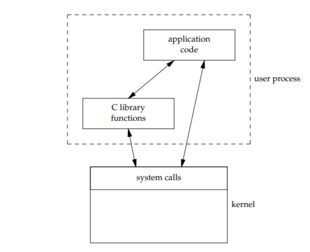
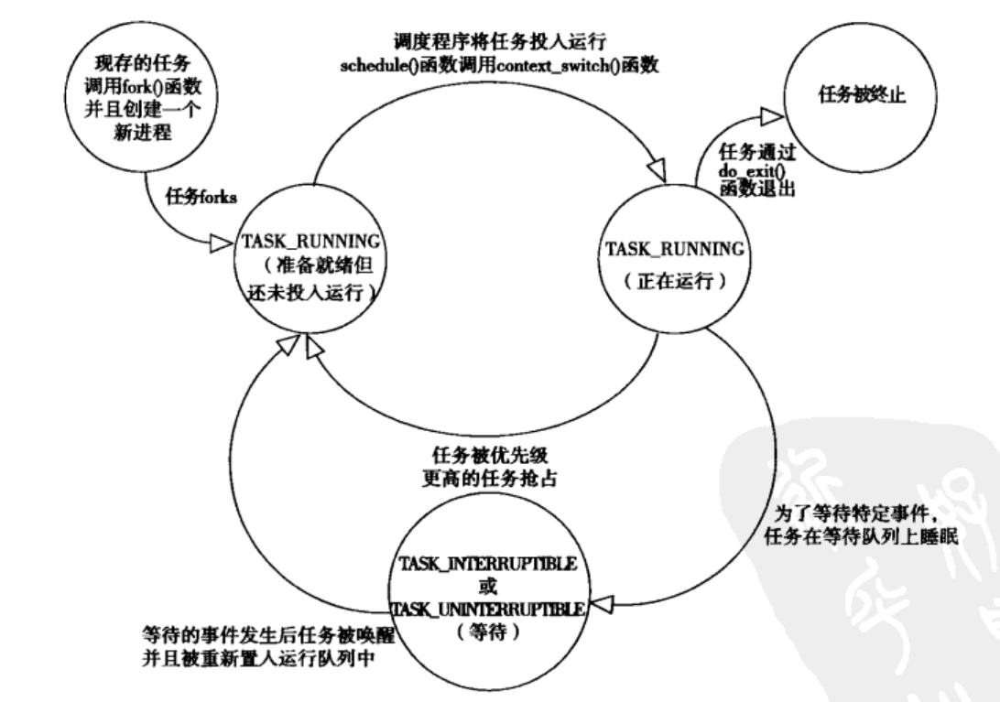
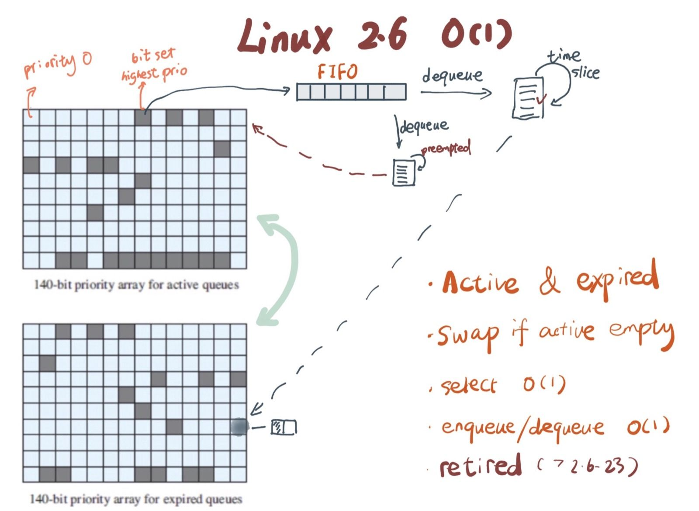
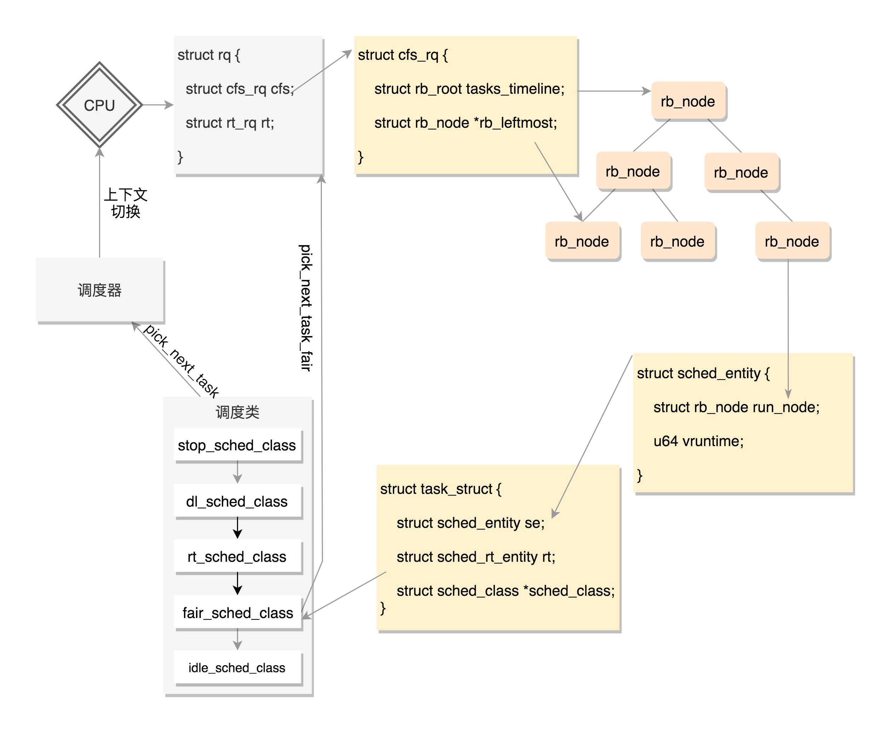
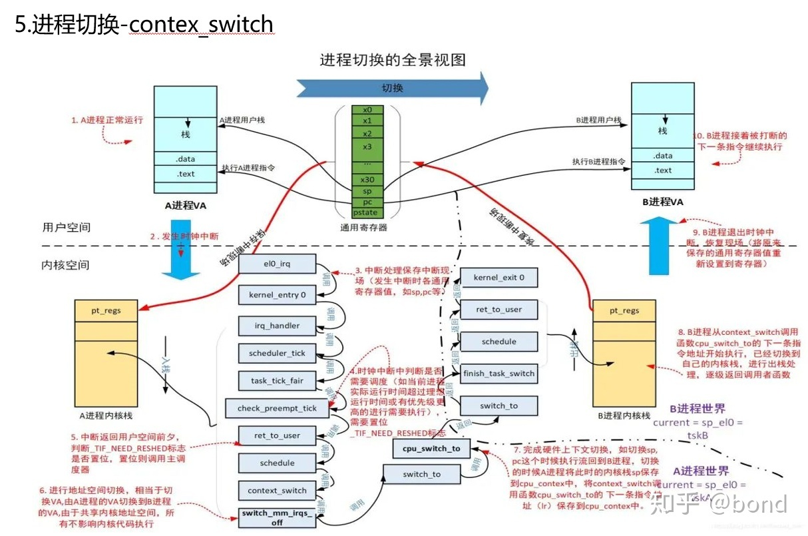

===============
Linux Kernel
===============

:Date:   2021-04-24 16:52:25

问题记录
========

   
1. 段选择子的作用？三级页表的工作原理？
2. 上下文切换的具体过程？
3. 时间子系统——RTC时钟和中断时钟在进程调度中的作用？vruntime更新使用哪个时间？ 
4. 异常、陷阱、中断、系统调用等概念辨析；中断为什么不能休眠？
5. 系统调用的细节：看参考博客文章。
6. 自旋锁、互斥量、信号量的实现原理。
   `自旋锁 <http://www.wowotech.net/kernel_synchronization/460.html>`__ ;
   `Linux 单/多处理器下的内核同步与实现---自旋锁 <https://zhuanlan.zhihu.com/p/115748853>`__

7. `高速缓存与一致性 <https://zhuanlan.zhihu.com/cpu-cache>`__

   

内核入门
============

参考文档
--------

内核相关文档
~~~~~~~~~~~~~~~~~

1. https://www.kernel.org/doc/html/latest/translations/zh_CN/
2. https://kernelnewbies.org/
3. https://lwn.net/
4. https://kernel.org/pub/linux/kernel/
5. https://wiki.linuxfoundation.org/realtime/start

在线源码
~~~~~~~~~~~~~~~~~~
linux、glibc、gcc等。

1. https://elixir.bootlin.com/linux/v5.10/C/ident/ 
2. http://sbexr.rabexc.org/latest/sources/meta/index
3. https://code.woboq.org/
4. https://www.busybox.net/

参考书籍
~~~~~~~~

1. Linux Kernel Development V2.6.34
2. Linux Devices Driver V2.6.10
3. Proffesional Linux Kernel Architecture V2.6.24 
4. Understanding The Linux Kernel  V2.6.11
5. 奔跑吧Linux内核

参考链接
~~~~~~~~

1. `6.828   实现xv6 <https://pdos.csail.mit.edu/6.S081/2020/>`__
2. `知乎-MIT 6.828  实现操作系统 <https://zhuanlan.zhihu.com/c_1273723917820215296>`__
3. `趣谈Linux操作系统——刘超 <https://zter.ml/>`__
4. 操作系统实战45讲
5. 有深度：`linux-inside <https://0xax.gitbooks.io/linux-insides/content/>`__ or 
   `linux-inside-zh <https://github.com/MintCN/linux-insides-zh>`__
6. `Linux进程管理与调度 <https://blog.csdn.net/gatieme/category_6225543.html>`__
7. http://www.wowotech.net/

基本概念
--------
内核态拥有受保护的内存空间和访问硬件设备的所有权限。

应用程序通过库函数或系统调用让内核代替完成各种任务。
库函数不仅是对系统调用的打包，它也实现了系统调用不具备的功能，如strcpy。

   库函数和系统调用

**处理器可能的状态：**

1. 运行于用户空间，执行用户进程；
2. 运行于内核空间，处于进程上下文，代表某个特定的进程执行；
3. 运行于内核空间，处于中断上下文，处理特定的中断（与任何进程无关）。
4. CPU空闲时，运行一个空进程，处于2的状态。

**微内核：**
将内核服务的地址空间隔离，内核只提供基础服务（IPC、内存、调度等），
其它服务组件如文件系统、驱动程序等则各自运行在独立的地址空间（用户空间），并以IPC的方式为其它应用程序提供服务。

微内核提升了稳定性、安全性、扩展性和内核实时性，但是损失了效率。

内核版本号
----------

`Linux内核版本号： <http://en.wikipedia.org/wiki/Linux_kernel#Version_numbering>`__

1. 2.x 版本奇数表示开发版、偶数表示稳定版。2.6.x系列覆盖了2003-2011年。
2. 3.0开始，版本号基于时间变化（近2个月更新一次小版本号），不代表有重大的内容更新。同时避免小版本号超过20。
3. 当前5.11为15-Feb-2021发布

-  mainline 是主线版本。
-  stable 是稳定版，由 mainline
   在时机成熟时发布，稳定版也会在相应版本号的主线上提供 bug
   修复和安全补丁
-  longterm
   是长期支持版，多为\ `6年 <https://www.kernel.org/category/releases.html>`__
-  RC：release candidates。

进程
=====
进程管理
---------
进程：处于执行期的程序以及相关资源的总称。程序：存放在存储介质上的目标吗。

任务队列：task_struct双向循环列表。
进程描述符（task_struct）中保存了能完整描述一个正在执行的程序的左右数据。1.7KB(32位及机器)。
使用slab分配器分配，实现对象复用和缓存着色。
thread info结构在进程内核栈尾端分配，包含了指向task_struct的指针。
current宏：找到当前进程的进程描述符。

进程的五种状态
~~~~~~~~~~~~~~

1. TASK_RUNNING: 运行——可执行的,即正在执行或在运行队列中等待。用户空间进程的唯一状态；内核进程也有此状态。
2. TASK_INTERRUPTIBLE: 可中断的——睡眠中，等待特定条件达成，可被信号唤醒。
3. TASK_UNINTERRUPTIBLE: 不可中断——睡眠中，不会被信号唤醒。在进程等待过程必须不受干扰或等待事件很快会发生时使用。
4. __TASK_TRACED: 被其他进程跟踪，如ptrace。
5. __TASK_STOPPED: 停止执行，进程没有投入运行也不能投入运行。通常发生在接收SIGSTOP、SIGTSTP、SIGTTIN、SIGTTOU等信号时。

           任务状态

::

   linux 5.8
   /*
    * Task state bitmask. NOTE! These bits are also
    * encoded in fs/proc/array.c: get_task_state().
    *
    * We have two separate sets of flags: task->state
    * is about runnability, while task->exit_state are
    * about the task exiting. Confusing, but this way
    * modifying one set can't modify the other one by
    * mistake.
    */

   /* Used in tsk->state: */
   #define TASK_RUNNING			0x0000
   #define TASK_INTERRUPTIBLE		0x0001
   #define TASK_UNINTERRUPTIBLE		0x0002
   #define __TASK_STOPPED			0x0004
   #define __TASK_TRACED			0x0008
   /* Used in tsk->exit_state: */
   #define EXIT_DEAD			0x0010
   #define EXIT_ZOMBIE			0x0020
   #define EXIT_TRACE			(EXIT_ZOMBIE | EXIT_DEAD)
   /* Used in tsk->state again: */
   #define TASK_PARKED			0x0040
   #define TASK_DEAD			0x0080
   #define TASK_WAKEKILL			0x0100
   #define TASK_WAKING			0x0200
   #define TASK_NOLOAD			0x0400
   #define TASK_NEW			0x0800
   #define TASK_STATE_MAX			0x1000

fork -> exec -> exit + wait

fork
开销：复制父进程的页表和创建子进程的进程描述符。
资源采用写时复制，即只有在需要写入时才拷贝页，是他们拥有独立的数据副本

线程：Linux中，只是进程间共享资源的手段。共享文件系统资源、地址空间、文件描述符和信号处理程序。

内核进程：没有独立的地址空间，可以被调度和抢占。

进程的生命周期
~~~~~~~~~~~~~~

fork -> clone -> _do_fork -> copy_process

1.  dup_task_struct(): 创建内核栈、task_struct、thread_info.
2.  检查当前用户进程数目是否超出限制。
3.  清除任务描述法的部分统计信息，如运行统计。
4.  设置为 TASK_INTERRUPTIBLE。
5.  copy_flags()更新flags。
6.  alloc_pid()分配新PID。
7.  根据clone()传递的参数标识，copy_process()拷贝或共享 
    打开的文件、文件系统、信号处理函数、进程地址空间、命名空间等。
8. copy_process()返回指向子进程的指针。
9. _do_fork -> wake_up_new_task。
   设置为 TASK_RUNNING;
   activate_task 加入对应的调度队列；
   check_preempt_wakeup 设置父进程TIF_NEED_RESCHED，即在返回时抢占父进程，
   子进程先执行，避免写时复制的开销

exit() -> do_exit()

1. 设置task_struct的标识成员为PF_EXITING,表示正在退出。
2. 删除内核定时器。
3. 释放地址空间mm_struct。
4. exit_fs()、exit_files()，分别递减文件系统、文件描述符的引用计数。
5. 设置EXIT_ZOMBIE，调用schedule切换到新进程。
   
   * 这是进程执行的最后一段代码，do_exit永不返回。
   * 此时与进程相关的所有资源都被释放掉了。
   * 进程此时占有的内存只有内核栈、thread_info、task_struct。

6. 父进程可获取已终止的子进程信息wait4()，然后通知内核释放所占用的剩余资源，
   release_task() -> _exit_signal()

::

   kernel/exit.c
   void __noreturn do_exit(long code)
   {

   		preempt_count_set(PREEMPT_ENABLED);

   		set_current_state(TASK_UNINTERRUPTIBLE);
   		schedule();

   	exit_signals(tsk);  /* sets PF_EXITING */

   	exit_mm();

   	exit_sem(tsk);
   	exit_shm(tsk);
   	exit_files(tsk);
   	exit_fs(tsk);
   	if (group_dead)
   		disassociate_ctty(1);
   	exit_task_namespaces(tsk);
   	exit_task_work(tsk);
   	exit_thread(tsk);
   	exit_umh(tsk);

   	debug_check_no_locks_held();

   	if (tsk->io_context)
   		exit_io_context(tsk);

   	if (tsk->splice_pipe)
   		free_pipe_info(tsk->splice_pipe);

   	if (tsk->task_frag.page)
   		put_page(tsk->task_frag.page);

   	validate_creds_for_do_exit(tsk);

   	check_stack_usage();
   	preempt_disable();

   	exit_rcu();
   	exit_tasks_rcu_finish();

   	lockdep_free_task(tsk);
   	do_task_dead();
   }

进程调度
-----------

Linux提供抢占式多任务模式（preemptive multitaking）。

调度程序：在TASK_RUNNING的进程之间分配有限的处理器时间资源。

调度策略的平衡： 优先调度IO消耗型以保证短的响应时间，或优先调度CPU消耗型以保证高吞吐量。

Linux更倾向于优先调度IO消耗型进程，以保证响应时间（交互式应用和桌面系统等）。

O(1)调度
~~~~~~~~~

1. 140个成员的array,各成员各对应一个FIFO队列；
2. 使用位图来各队列是否为空；
3. 调度时间复杂度为 O(1).

           Linux2.6.23以前的O(1)调度

六大调度策略
----------------
`sched man <https://man7.org/linux/man-pages/man7/sched.7.html>`__ 讲得很清楚。
`翻译版 <https://www.cnblogs.com/charlieroro/p/12133100.html>`__ 。

1. SCHED_FIFO: 先进先出，无时间片。
2. SCHED_RR：时间片轮转，可抢占。
3. SCHED_DEADLINE：按照任务deadline来调度选择其 deadline 距离当前时间点最近的任务。
4. SCHED_OTHER：Linux中又名SCHED_NORMAL，根据nice值调度。
5. SCHED_BATCH：假定任务是CPU-intensive，对唤醒的进程做调度惩罚，即不提倡频繁切换。
6. SCHED_IDLE: nice值小于19，即用于优先级非常低的任务。

不同类型进程优先级为

::

    __stop_sched_class -> __dl_sched_class -> __rt_sched_class -> __fair_sched_class -> __idle_sched_class

实时策略
------------

调度器为每个优先级维护一个等待list。选择最高优先级的非空list的第一个成员来执行。
调度策略只能决定同一等待list（同一优先级）的进程执行顺序。

1. normal scheduling policies： (SCHED_OTHER, SCHED_IDLE, SCHED_BATCH), sched_priority must be specified as 0.

   The nice value  (SCHED_OTHER, SCHED_BATCH) influence the CPU scheduler to favor or disfavor a process in scheduling decisions.
   the range is -20 (high priority) to +19 (low priority).

2. **real-time policies**：(SCHED_FIFO, SCHED_RR, SCHED_DEADLINE) have a sched_priority value in the range **1 (low) to 99 (high)**.

Linux的实时调度算法提供了一种软实时的工作方式，即尽力使进程在它的限定时间到来前运行，但内核不保证总能满足要求。

Linux调度程序默认试图使进程尽量在同一个处理器运行（软亲和性），同时提供了强制亲和性（通过task_struct的cpus_allowed位掩码标志）。

FIFO与RR
~~~~~~~~~~~~~
`实时调度类分析 <https://www.cnblogs.com/arnoldlu/p/9025981.html>`__ （源码分析）

`Linux进程调度总结 <https://zhuanlan.zhihu.com/p/335846858>`__ (图不错)

FIFO:严格按照优先级来执行，同一优先级先进先得到执行。

RR:调度策略，:存在一个RR_TIMESLICE时隙设置，可以通过调节时隙让各进程得到相对公平的机会。

当相同优先级的FIFO和RR进程执行时，RR相对吃亏，因为FIFO一旦抢占会执行到主动放弃。

RT Bandwith
~~~~~~~~~~~~~~~~~~~~~~
RT进程和普通进程之间有一个分配带宽的比例，默认情况是 RT:CFS=95:5。

通过/proc/sys/kernel/sched_rt_period_us和/proc/sys/kernel/sched_rt_runtime_us来设置。

CFS调度
--------

`CFS调度器（2）-源码解析 <http://www.wowotech.net/process_management/448.html>`__

1. CFS调度完全摒弃时间片的分配方法，而是给进程分配处理器的使用比例，确保了进程调度中有恒定的公平性，而切换频率则是不断变化的。
2. CFS有一个分配时间的最小粒度，默认1ms，在可运行进程数量较多时，可将切换消耗限制在一定范围。
3. 进程获得的处理器时间由自己和其它所有可运行进程的nice值的差值决定，nice相差1则相差1.25倍时间。

时间片与nice
~~~~~~~~~~~~
时间片：进程在被抢占之前能够运行的时间，预先分配的。
nice：决定处理器的使用比例。

采用固定时间片则会引发固定的切换频率，会影响公平性。

1. 若将nice映射到绝对的时间片，则进程切换无法最优化进行。如高nice值的进程切换会更频繁；同时nice值±1的效果取决于nice本身初始值。
2. 基于优先级的调度器为了优化交互任务，需要提升刚唤醒的进程的优先级，这样的优先级提升实际上是不公平的。
3. 时间片会随着定时器节拍改变，即最小时间片必须是定时器节拍的整数倍。

调度延时
~~~~~~~~~
又被称为调度周期，即该时间内所有任务均会被运行一次。

当进程数 < sched_nr_latency（８）时，值固定的为sysctl_sched_latency（６ms）

当进程数 > sched_nr_latency（８）时,为进程数乘以sched_min_granularity_ns(0.75ms)

**sysctl_sched_latency  =   cat /proc/sys/kernel/sched_latency_ns**

`[scheduler] 调度时延，调度最小抢占粒度，调度唤醒抢占粒度详解 <https://blog.csdn.net/wukongmingjing/article/details/105433479>`__

调度的实现
------------

时间记账vruntime
~~~~~~~~~~~~~~~~~
CFS使用调度器实体结构来维护每个进程运行的时间记张。（linux/sched.h -> struct_sched_entity）

vruntime存放进程的虚拟运行时间，是所有可运行进程总数的加权计算结果。单位ns，与定时器节拍不相关。
``虚拟运行时间 vruntime += 实际运行时间 delta_exec * NICE_0_LOAD/ 权重``

系统定时器周期性调用 update_curr()，以更新所有进程的vruntime(包括可运行和阻塞态的所有进程)。

针对刚创建的进程会进行一定的惩罚，将虚拟时间加上一个值。

进程选择
~~~~~~~~~~~~
选择具有最小vruntime的任务。

使用红黑树rbtree来组织可运行的进程队列，节点键值即vruntime。

1. 选择下一个任务：pick_next_entity()，运行rbtree最左节点对应的进程。
此处不需要遍历树来查找最左节点，因为最左节点已经被缓存起来的（在更新rbtree时缓存的）。

2. 在rbtree插入进程：进程被唤醒或fork()创建进程时。enqueue_entity()更新当前任务的统计数据，并插入调度实体，并更新最左节点的缓存。
3. 删除进程：进程阻塞或终止时。dequeue_entity()。

调度器
~~~~~~~~~~~
每个CPU都有自己的 struct rq 结构，其用于描述在此 CPU 上所运行的所有进程，其包括一个实时进程队列 rt_rq 和一个 CFS 运行队列 cfs_rq。

调度类sched_class定义了很多种方法，用于操作上述调度队列上的任务。每种调度策略各实现了一种调度类，并放在同一个链表中。

调度类中的方法，如pick_next_task在不同的调度类中有不同的实现，返回空时则继续操作下一个队列。
fair_sched_class 的实现是 pick_next_task_fair，rt_sched_class 的实现是 pick_next_task_rt；
pick_next_task_rt 操作的是 rt_rq，pick_next_task_fair 操作的是 cfs_rq。

调用路径pick_next_task_fair -> pick_next_entity -> __pick_first_entity。

           调度过程

休眠与唤醒
~~~~~~~~~~~~

休眠（被阻塞）通过等待队列处理，有两种状态，TASK_INTTERUPTIBLE和TASK_UNITTERUPTIBLE。
当与等待队列相关的时间发生时，队列上所有进程都会被唤醒（存在虚假唤醒）。

1. DEFINE_WAIT()创建一个等待队列的项；
2. add_wait_queue()加入队列中；
3. prepare_to_wait()设置进程状态为TASK_INTTERUPTIBLE或TASK_UNITTERUPTIBLE；
4. 若被信号唤醒，则检查条件是否为真；
5. 条件满足后设置状态为TASK_RUNNING并调用finish_wait()移出等待队列。

wake_up() -> try_to_wake_up()。通常是促使条件达成的代码来调用此函数，比如磁盘数据到来时，VFS需要调用。

1. 设置状态为TASK_RUNNIN并调用finish_wait；
2. enqueue_task()放入调度队列；
3. 若被唤醒的进程优先级比正在运行的进程优先级高，则设置need_resched标志。

抢占和上下文切换
------------------

上下文切换：即从一个可执行程序切换到另一个可执行程序。context_switch()完成地址空间切换switch_mm()和处理器状态恢复switch_to()。

need_resched
~~~~~~~~~~~~~~
表明需要重新执行一次调度，强制调度，有调度延时。

当某个进程应该被抢占时，或更高优先级的进程进入可执行状态时，需要设置此标志。

该标志包含在进程描述符内，访问进程描述符内的变量比访问全局变量快（current宏速度快且进程描述符通常在告诉缓存内）。

用户抢占与内核抢占
~~~~~~~~~~~~~~~~~~~~~
**用户抢占时机**

1. 从系统调用返回用户空间时；
2. 从中断处理程序返回用户空间时。

**内核抢占时机**

可以在任何时间抢占任务（只要没有锁），通常发生在 **preempt_enable()** 中。

preempt_enable() 会调用 preempt_count_dec_and_test()，判断 preempt_count 和 TIF_NEED_RESCHED 看是否可以被抢占。
如果可以，就调用 preempt_schedule->preempt_schedule_common->__schedule 进行调度。

.. figure:: ../images/schedule_and_preempt.png

            抢占式调度

上下文切换
~~~~~~~~~~~~~~~~~~

               context_switch

进程优先级的表示
-----------------
`关于Linux进程优先级数字混乱的彻底澄清 <https://mp.weixin.qq.com/s/44Gamu17Vkl77OGV2KkRmQ>`__

**用户态：**
最常用，sched_priority(chrt、/proc/pid/stat 字段40)，
nice(/proc/pid/stat 字段19),policy(字段41)

sched_priority : 1(low) to 99(high)

nice :-19(high) to 20(low)

**内核态：**

内核调度bitmap使用。 /proc/pid/sched。小->优先级高。

prio = 99 - sched_priority

normal = 120 + nice

**top命令：**

/proc/pid/stat 字段18.

top_prio = -1 -sched_priority

系统调用
=============
`the-definitive-guide-to-linux-system-calls  <https://blog.packagecloud.io/eng/2016/04/05/the-definitive-guide-to-linux-system-calls/>`__
`系统调用权威指南 <https://arthurchiao.art/blog/system-call-definitive-guide-zh>`__
系统学习，有源码分析

`深入理解系统调用 <https://www.cnblogs.com/liujianing0421/p/12971722.html>`__

概念
------
在Linux中，系统调用是用户空间访问内核的唯一手段。

系统调用在用户空间进程和硬件设备之间添加了一个中间层，作用：

1. 为用户空间提供硬件抽象接口；
2. 保证系统的稳定与安全。内核基于权限、用户和其它规则对访问进行裁决；
3. 为运行在虚拟系统中的进程提供公共接口（？）。

应用程序编程接口API；在用户空间实现，应用程序使用其来编程。不需要和系统调用对应。

POSIX：提供一套大体基于UNIX的操可移植作系统标准。

C库：Linux系统调用像其它大多数UNIX系统一样，作为C库的一部分提供。C库提供了POSIX的大部分API。

UNIX接口设计：提供机制（功能定义）而不是策略（如何实现）。

eax：存放系统调用号、返回值。

系统调用的实现
--------------

系统调用列表：在sys_call_table中，空sys_ni_syscall()仅返回-ENOSYS。

系统调用设计：力求简洁，参数尽可能少；向前向后兼容性；可移植性。

参数验证：系统调用必须仔细检查参数是否合法。

syscall
~~~~~~~~~~~
不是所有的系统调用在glibc中都有对应的封装。

use syscall from glibc to call exit with exit status of 42:

::

   int
   main(int argc, char *argv[])
   {
   unsigned long syscall_nr = 60;
   long exit_status = 42;

   asm ("movq %0, %%rax\n"
         "movq %1, %%rdi\n"
         "syscall"
      : /* output parameters, we aren't outputting anything, no none */
         /* (none) */
      : /* input parameters mapped to %0 and %1, repsectively */
         "m" (syscall_nr), "m" (exit_status)
      : /* registers that we are "clobbering", unneeded since we are calling exit */
         "rax", "rdi");
   }

   
**syscall wrapper function**: sysdeps/unix/sysv/linux/x86_64/syscall.S

::

   /* Usage: long syscall (syscall_number, arg1, arg2, arg3, arg4, arg5, arg6)
      We need to do some arg shifting, the syscall_number will be in
      rax.  */

         .text
   ENTRY (syscall)
         movq %rdi, %rax         /* Syscall number -> rax.  */
         movq %rsi, %rdi         /* shift arg1 - arg5.  */
         movq %rdx, %rsi
         movq %rcx, %rdx
         movq %r8, %r10
         movq %r9, %r8
         movq 8(%rsp),%r9        /* arg6 is on the stack.  */
         syscall                 /* Do the system call.  */
         cmpq $-4095, %rax       /* Check %rax for error.  */
         jae SYSCALL_ERROR_LABEL /* Jump to error handler if error.  */
   L(pseudo_end):
         ret                     /* Return to caller.  */

这段代码同时展示了两个调用约定：传递给这个函数的参数 符合 用户空间调用约定，
然后将这些参数移动到其他寄存器，使得它们在通过 syscall 进入内核之前符合 内核调用约定。

系统调用上下文
~~~~~~~~~~~~~~
内核在执行系统调用时处于进程上下文。

在进程上下文中内核可以休眠（系统调用阻塞、显示调用schedule）并且可以被抢占。

- 可休眠说明系统调用可以使用内核提供的大部分功能（而不可休眠的中断在编程时会受到极大限制）；
- 可抢占可需要保证系统调用是可重入。

注册和使用
~~~~~~~~~~
1. 加入系统调用表；
2. 编译进内核映像（不能是模块）；
3. 通过C库或使用_syscalln()访问系统调用。

_syscalln() -> K_INLINE_SYSCALL : 内联汇编

系统调用的替代：

1. 实现一个设备节点，然后使用read/write；
2. 使用文件描述符来表示。

快速系统调用
-------------------

int 0x80和syscall/sysenter的区别
~~~~~~~~~~~~~~~~~~~~~~~~~~~~~~~~~~~~~~~~
https://www.cnblogs.com/LittleHann/p/4111692.html

1. 通过INT 0x80中断方式。
   
   * 在 2.6以前的 Linux 2.4 内核中，用户态 Ring3 代码请求内核态 Ring0 代码完成某些功能是通过系统调用完成的，而系统调用的是通过软中断指令(int 0x80) 实现的。在 x86 保护模式中，处理 INT 中断指令时
   * 在发生系统调用，由 Ring3 进入 Ring0 的这个过程浪费了不少的 CPU 周期，例如，系统调用必然需要由 Ring3 进入 Ring0，权限提升之前和之后的级别是固定的。
      
   1) CPU 首先从中断描述表 IDT 取出对应的门描述符
   2) 判断门描述符的种类
   3) 检查门描述符的级别 DPL 和 INT 指令调用者的级别 CPL，当 CPL<=DPL 也就是说 INT 调用者级别高于描述符指定级别时，才能成功调用
   4) 根据描述符的内容，进行压栈、跳转、权限级别提升
   5) 内核代码执行完毕之后，调用 IRET 指令返回，IRET 指令恢复用户栈，并跳转会低级别的代码 .
    
2. 通过sysenter指令方式。
sysenter 指令用于由 Ring3 进入 Ring0，SYSEXIT 指令用于由 Ring0 返回 Ring3。由于没有特权级别检查的处理，也没有压栈的操作，所以执行速度比 INT n/IRET 快了不少。
sysenter和sysexit都是CPU原生支持的指令集

虚拟系统调用vDSO
----------------------
不进入内核即可执行系统调用，例如gettimeofday。

Linux virtual Dynamic Shared Object (vDSO)

The Linux vDSO is a set of code that is part of the kernel, b
ut is mapped into the address space of a user program to be run in userland.

**地址随机(安全)：**

Due to `address space layout randomization <https://en.wikipedia.org/wiki/Address_space_layout_randomization>`__
the vDSO will be loaded at a random address when a program is started.

_kernel_vsyscall
~~~~~~~~~~~~~~~~~~~~~~~~
内核函数 __kernel_vsyscall 封装了 sysenter 调用约定（calling convention）,
应该使用 __kernel_vsyscall而不是手动实现调用sysenter。

它在内核实现，但每个用户进程启动的时候它会映射到用户进程。

**程序如何找到调用的地址？**

__kernel_vsyscall 的地址写入了 ELF auxiliary vector （辅助功能矢量），
用户程序能（典型情况下通过 glibc）找到后者并使用它。寻找 ELF auxiliary vector 有多种方式：

1. 通过 getauxval，带 AT_SYSINFO 参数
2. 遍历环境变量，从内存解析

内核数据结构
============
提倡在开发时重用Linux内建数据结构。

链表、队列、散列表、红黑树，还有基树（Radix Tree）、位图等。

链表
----------
静态数组：编译时需知道元素数量。

链表：动态创建并插入元素，无需占用连续内存。

Linux内核的标准链表为环形双向链表，灵活性高。

使用方法
~~~~~~~~~~~
在数据结构中嵌入链表。

::

   struct list_head {
       struct list_head *next;
       struct list_head *prev;
   }

   //获取包含list_head的父类型结构体
   list_entry(ptr, type, member)

   // for 循环，利用传入的 pos 作为循环变量，从表头 head 开始，逐项向后（ next方向）移动 pos ，直至又回到 head
   //head为数据结构的第一项成员时，与list_for_each_entry等价
   list_for_each(pos, head) 

   //遍历结构体head的成员member，存放到pos,O(n)
   list_for_each_entry(pos, head, member)

增加、删除、移动、合并节点的时间复杂度均为O(1) ，这些操作对应内部链表操作函数。在已有next/prev指针的情况下可直接调用内部链表函数。

队列
--------------
也称为FIFO。

kfifo为Linux内核通用队列实现。

两个主要操作：enqueue和dequeue（kfifo_in、kfifo_out）。维护两个偏移量：入口偏移和出口偏移。

映射
-------------
也称为关联数组。键到值的关联关系即为映射。可通过散列表、二叉搜索树来实现。

Linux内核提供的映射idr：将唯一的UID映射到一个指针。支持的操作 add、remove、lookup、allocate。

::

   使用idp指向的idr分配一个UID，并关联到ptr。
   idr__get_new(struct idr *idp, void *ptr,int *id)

二叉树
-----------------
Linux实现的红黑树为rbtree，为平衡二叉搜索树。

rbtree的实现并为提供搜索和插入方法。
C语言不方便泛型编程，同时最有效的搜索和插入方法应该由用户自己实现。

中断
====================
中断控制器：将多路中断管线复用为一路并连接到处理器。
每个IRQ中断请求线关联一个中断值。值越小则优先级越高。

`Linux下的中断机制 <https://lrita.github.io/2019/03/05/linux-interrupt-and-trap>`__

中断与异常
------------

中断：由设备使用的硬件资源向处理器发送的电信号，
    打断操作系统的执行（甚至是其它中断线上的处理函数），可随时产生。

异常：又称为同步中断，当指令执行时由CPU控制单元产生的，产生时必须考虑处理器时钟同步。

每个中断和异常是由0～255之间的一个数来标识的，Intel把这个8位无符号整数叫做一个向量（vector）。
非屏蔽中断的向量和异常的向量是固定的，而可屏蔽中断的向量是可以通过对中断控制器的编程来改变。

Intel文档把中断和异常分为以下几类：

**异常：**

当CPU执行指令时探测到一个异常，会产生一个处理器探测异常（processor-detected exception），可以进一步区分，这取决于CPU控制单元产生异常时保存在内核堆栈eip寄存器的值。

1. 故障（fault），通常可以纠正，一旦纠正，程序就可以重新开始，
   保存在eip寄存器中的值是引起故障的指令地址。
2. 陷阱（trap）在陷阱指令执行后立即报告，内核把控制权烦给程序后就可以继续它的执行而不失连续性。
   保存在eip中的值是一个随后要执行的指令地址。陷阱的主要作用是为了调试程序。
3. 异常中止（abort），发生一个严重的错误，控制单元出了问题，
   不能在eip寄存器中保存引起异常的指令所在的确切位置。异常中止用于报告严重的错误，例如硬件故障或系统表中无效的值或者不一致的值。这种异常会强制中止进程。
4. 编程异常（programmed exception），在编程者发出的请求时发送，是由int或int3指令触发的。

上半部
--------
即中断处理程序。运行于中断上下文中，不可阻塞。

上半部执行具有严格时限的工作，运行时可禁止所有其它中断（大部分不会），
同时在其它处理器上禁止同一中断线，即同一中断处理程序不会被同时调用以处理嵌套的中断，即无需重入。

下半部
---------
下半部：所有用于实现将工作推后执行的内核机制。

1. 可调度/休眠 -> 工作队列
2. 性能要求高  -> 软中断
3. 大多数情况  -> tasklet

这里的软中断与系统调用使用的软件中断不同。

软中断
~~~~~~~~~~
1. 对性能要求非常高的场景（如网络、SCSI）。编译时静态注册。
2. 

tasklet
~~~~~~~~~~~~~~

1. 适用大部分下半部处理。使用软中断实现。也可动态注册。
2. 两个不同类型的tasklet可以在不同处理器上同时执行，但两个相同类型的tasklet不能同时执行 。

工作队列
~~~~~~~~~~~~~

1. 可在进程上下文运行。
2. 允许重新调度和睡眠（获取大量内存、获取信号量、阻塞式IO时）。

工作队列提供把需要推后执行的任务交给特定的通用线程的接口。
工作队列线程被唤醒时，已被调度的任务才被执行。

工作队列处理函数运行在进程上下文中，但不能访问用户空间，
因为内核线程在用户空间没有相关的内存映射。

系统调用时内核代表用户空间的进程运行，可访问用户空间，会映射用户空间的内存。

中断为什么不能休眠
--------------------
https://www.cnblogs.com/schips/p/why_isr_can_not_schedule_in_linux.html

中断只能被其他中断中止、抢占，进程不能中止、抢占中断。

中断是一种紧急事务，需要操作系统立即处理，不是不能做到睡眠，是没必要睡眠。

1. 无法被唤醒。在中断context中，唯一能打断当前中断handler的只有更高优先级的中断；
   所有的wake_up_xxx都是针对进程task_struct而言，
   Linux是以进程为调度单位的，调度器只看到进程内核栈，而看不到中断栈。

2. 导致上下文错乱。睡眠函数nanosleep(do_nanosleep,v5.13)会调用schedule导致进程切换。

内存管理
=============

页
------------
MMU：内存管理单元，管理内存并将虚拟地址转换为物理地址的硬件。

MMU以页为单位进行处理，即虚拟内存中页即最小单位。处理器最小可寻址单位为字。

struct pages表示系统中的物理页，而不是虚拟页。
其目的是描述物理内存本身，而不是其中包含的数据。
描述当前时刻相关的物理页中存放的东西，该结构对页的描述只是短暂的。

区
------------
区的使用的分布和体系结构相关。由于硬件限制，有些页位于特定的物理地址上。

* ZONE_DMA：一些硬件只能用特定的地址来执行DMA；
* ZONE_NORMAL：包含能正常映射的页；
* ZONE_HIGHEM：其中的页不能永久映射到内核地址空间。由于内存的物理寻址范围远大于虚拟寻址范围，
  如x86内核虚拟地址为1G，X64则不存在这个区。

高端内存的映射？

内存分配
-------------

1. 连续物理页：低级页分配器或kmalloc。
2. 高端内存：alloc_pages()，返回指向pages结构的指针，而不是逻辑地址的指针（高端内存可能并没有被映射到逻辑地址）。使用kmap映射。
3. 连续虚拟地址：vmalloc，相比kmalloc有一定性能损失。
4. 大量数据结构：slab高速缓存。

低级页分配
~~~~~~~~~~~~~~
alloc_pages：以页为单位分配内存，分配连续的物理页。
单页alloc_page。注意错误检查，可能分配失败，从而导致free时奔溃。

page_address：将获得的页转换成它的逻辑地址。

__get_freee_pages ：返回第一个页的逻辑地址。__get_freee_page

get_zero_page：填充0。

kmalloc
~~~~~~~~~~~~~~
kmalloc与用户空间的malloc函数类似，以字节为单位获取内核内存。分配的内存在物理上连续。

kfree：只能释放kmalloc分配的内存。

gfp_mask分配器标志
^^^^^^^^^^^^^^^^^^^^^^^
三类标志：

* 行为修饰符：表示如何分配内存，如是否允许睡眠。
* 区修饰符：表示从哪个区分配。
* 类型标志：组合行为修饰符和区修饰符。

**常用的标志**

1. GFP_KERNEL：这种分配可能引起睡眠，普通优先级。可能阻塞，只能用在可以重新安全调度的进程上下文中（不持有锁时）。

2. GFP_ATOMIC：不能睡眠的内存分配。分配成功可能性较小。用于中断处理程序、软中断、tasklet等。

vmalloc
~~~~~~~~~~~~~~
vmalloc分配虚拟地址连续的内存，物理内存则无需连续，可能睡眠。（与用户空间的malloc类似）

大多数情况下，只有硬件设备需要物理地址连续的内存。

为了将物理上不连续的页转换为虚拟地址中连续的页，需要专门建立页表项，将获得的页一一映射。

性能低，会导致比直接内存映射大得多的TLB抖动。

一般在获取大块内存时使用，如插入内核模块时。

slab
-----------------
通用数据结构缓冲层，便于数据的频繁分配和回收。

当内核请求分配一个新的结构时，内核从部分满或空的slab返回一个指向已分配但未使用的结构的指针。

slab层把不同的对象划分为高速缓存组，每个高速缓存组存放不同类型的对象（task_struct、inode）。

高速缓存被划分为slab，每个slab由一个或多个物理连续的页组成。

kmalloc建立而在slab层之上，对应一组高速缓存组。

slab状态：满、部分满和空。

kmem_getpages：为高速缓存分配足够多的内存。

kmem_cache_creat：创建高速缓存。

kmem_cache_alloc：从高速缓存分配结构。

栈上的静态分配
~~~~~~~~~~~~~~~
进程内核栈目前（>=2.6.37）为两页。历史上可为一页或两页。

用户空间栈大小为8M（ulimit -a）。

percpu数据
~~~~~~~~~~~~~~~
创建一个变量，然后每个 CPU 上都会有一个此变量的拷贝。
约定本地处理器只能访问它自己的唯一数据。

需要禁止内核抢占。

1. 减少数据锁定，不需要锁；
2. 较少缓存失效。

`静态和动态per-CPU变量 <https://blog.csdn.net/longwang155069/article/details/52033243>`__

虚拟文件系统
===============
VFS概念
------------

VFS提供了一个通用的文件系统模型，囊括了文件系统的常用功能集和行为，
使得用户可以使用open、read、write这样的系统调用而无需考虑具体的文件系统和物理介质。

文件系统是特殊的数据分层存储结构，包含文件、目录和相关控制信息。

面向记录的文件系统：丰富、结构化的表示。
面向字节流的文件系统：Unix，简单、灵活。

VFS对象及其数据结构
------------------------
super_block
~~~~~~~~~~~~~~~~~~~~~~
超级快对象存储特定文件系统的信息。对应于存放在磁盘特定扇区中文件系统超级块或文件系统控制块。

文件系统安装时，调用alloc_super()创建并初始化超级块对象，以便从磁盘读取超级块，并填充到内存的超级块对象中。

super_operations()成员函数执行文件系统和索引节点的底层操作。如索引节点的创建、释放等。

inode
~~~~~~~~~~~~~~~~~
索引节点对象包含内核操作文件或目录时需要的全部信息，一个索引文件即代表文件系统中的一个文件。

仅当文件被访问时，才在内存中创建索引节点（从磁盘中提取相关信息，磁盘可能没有索引节点）。

inode_operations()中的操作方法常常与dentry对象相关。包含文件/目录的新建、删除、链接等方法，被相应的系统调用所使用。

dentry
~~~~~~~~~~~~~~
为了方便解析路径、查找文件，引入的目录项dentry。

路径中的每一个部分（包括普通文件）都是目录项对象。

目录项对象没有对应的磁盘数据结构，VFS根据字符串形式的路径名现场创建它。

**目录项状态**:被使用、未被使用和负状态。
一个被使用或未被使用的目录项对应这一个有效的索引节点（由d_inode指向），而负状态的目录项则不对应索引节点（作为缓存）。

**目录项缓存dcache**:文件访问具有空间和时间的局部性，故缓存非常重要。

1. “被使用的”目录项缓存链表，一个索引节点具有多个硬链接时则有多个目录项对象，因此inode中的i_dentry为链表；
2. “最近被使用的”目录项双向链表，包含未被使用和负状态的目录项对象，头部插入尾部删除；
3. 散列表，将路径快速解析为相关的目录项对象。

目录项会让索引节点的使用计数为正，可确保索引节点缓存在内存中。

file
~~~~~~~~~~~
文件对象是进程已打开的文件在内存中的表示（open创建，close撤销）。

文件对象file仅在观点上表示已打开的文件，实际指向目录项对象（指向索引节点），实际只有目录项对象才表示**已打开的实际文件**。

一个文件对应的文件对象不唯一（多个进程可同时打开同一文件），但对应的索引节点和目录项是唯一的。

file和dentry都没有实际的磁盘数据。
file通过f_entry指向相关的目录项对象dentry，dentry则通过d_inode指向对应的索引节点inode，inode中会记录文件是否为脏、是否需要写回磁盘。

file的相关操作与系统调用和类似，如llseek、read、write、flush、open等。

其它数据结构
---------------
其它文件系统数据结构
~~~~~~~~~~~~~~~~~~~~~~~~~

1. file_system_type，描述各种特定文件系统类型，每种文件系统只有一个该结构；
2. vfsmount，描述一个安装文件系统的实例，即代表一个安装点。

和进程相关的数据结构
~~~~~~~~~~~~~~~~~~~~~~~
1. file_struct：由进程描述符中的files指向，包含的fd_array指向已打开的文件对象。
2. fs_struct：由进程描述符的fs指向，包含的当前工作目录和根目录路径结构体中包含目录项对象。
3. mmt_namespace：由进程描述符的mmt_namespace指向，使得每个进程都看到唯一的安装文件系统，list域为已安装的文件系统的双向链表。

使用CLONE_FILES或CLONE_FS创建的进程才会共享file_struct或fs_struct,故结构体中需要维护count计数以防止被撤销。

进程一般继承父进程的命名空间（除非使用CLONE_NEWS标志），因此在大多数系统行只有一个命名空间。

块IO层
=============

块设备：能够随机访问固定到小数据片的硬件设备。复杂性高，对其性能要求也高。

字符设备：按照字节流的方式顺序访问的设备。只需控制一个位置（当前位置），内核不必提供专门的子系统来管理字符设备。

扇区：硬扇区、设备块。块设备中的最小可寻址单元。常为512字节。

块：文件块、IO块。内核最小寻址单元。大小为扇区的2*n倍，并小于页。

缓冲区
-----------
块被调入内存后存储在缓冲区中。
一个缓冲区对应一个块，相当于磁盘块在内存中的表示。

一个页可容纳多个内存中的块。

buffer_head
~~~~~~~~~~~~~
缓冲区头包含内核操作缓冲区所需的全部信息，描述了磁盘块和物理内存缓冲区的特定映射关系。

1. 结构体大。内核倾向于操作页面。
2. 仅描述单个缓冲区。大块数据的IO操作被分解造成不必要的负担。

bio结构
----------------
bio结构代表了在现场的以链表形式组织的一个块的IO操作。

即使缓冲区分散在多个内存位置上，bio也保证内核能够执行IO操作，即聚散IO。

bio中，bio_io_vec为bio_vec结构体数组，包含了一个IO操作所需要使用到的所有片段。bio_vec结构：<page,offset,len>。

bi_vcnt为数组成员数量，bi_idx为当前索引位置。

请求队列
~~~~~~~~~~~
块设备将挂起的块IO请求保存在请求队列reques_queue中，该结构包含一个双向请求队列以及相关控制信息。

队列不为空时，对应的块设备驱动程序就会从队列头获取请求，并送到对应的块设备上去。

每个请求request可由多个bio结构体组成。

IO调度程序
-----------------------
内核在将请求提交给块设备前，先执行合并与排序的预操作，以减少磁盘寻址时间

1. Linus电梯IO调度程序：执行合并和排序，以磁盘物理位置为次序维护请求队列——排序队列。2.6已废弃。
2. 最终期限IO调度程序deadline：排序队列+读/写请求FIFO队列，请求会同时插入排序队列和FIFO队列，使用FIFO队列请求超时来防止请求饥饿。
3. 预测IO调度程序as：与deadline类似。跟踪并统计进程的块IO操作习惯，当进程可能很快发出另一个读请求时则延迟一会。内核缺省。
4. 完全公正的排队IO调度程序：每个提交IO的进程都有一个队列，以时间片轮转调度队列，选取固定请求数（默认4）。
5. 空操作的IO调度程序：只执行与相邻请求合并的操作。

内核选项elevator=foo，选择调度程序。

writes-starving-reads
~~~~~~~~~~~~~~~~~~~~~~~
即写使得读请求饥饿。

写请求通常是异步的，而读请求通常是同步的。即读请求会阻塞到直到该请求被满足，故读操作响应对系统性能非常重要。

进程地址空间
=======================
进程地址空间由进程可寻址的虚拟内存组成，进程之间以虚拟的方式共享内存。

段错误：进程访问不在有效范围内的内存区域，或以不正确的方式访问有限内存区域，那么内核就会终止该进程。

内存描述符
------------
mm_struct描述进程的地址空间。
其中mmap和mm_rb描述了该地址空间中的全部内存区域。

fork -> copy_mm 复制内存描述符，而其空间通过 allocate_mm -> mm_cachep slab缓存分配。

clone + CLONE_VM标志即线程，共享相同的地址空间。

内核线程
~~~~~~~~~~~~~~~~
内核线程：没有用户上下文，无进程地址空间，mm域为空。

当进程被调度时，该进程的mm域指向的地址空间被装在到内存，task_struct中的active_mm会被更新指向新地址空间。

内核线程并不需要访问任何用户空间的内存，而且因为在用户空间没有任何的页，所以不需要有自己的mm_struct和页表。

所有内核线程共享同一内核地址空间（使用上一个线程的地址空间）。

可减少mm_struct和页表占用空间，避免地址空间切换。

虚拟内存区域
----------------
vm_area_struct结构描述了指定地址空间内连续区间上的一段独立内存范围。内存描述符中的mmap（用于遍历）和mm_rb（用于查找）。

内核将每个内存区域作为单独的内存对象管理，该区域拥有一致的属性。
VMA则可以代表不同类型的内存区域。

每个VMA对应mm_struct中的唯一区间。线程共享地址空间自然也共享所有VMA。

查看实际使用的内存空间
~~~~~~~~~~~~~~~~~~~~~~~~~~
/proc文件系统或pmap工具。

如果一片内存范围是共享或不可写的，那么内核只需要在内存中为文件保留一份映射，如C库。

内存操作
---------------
find_vma：查找给定内存地址属于哪个内存区域，mmap需要使用。

do_mmap:

1. 创建新的线性地址空间，会与相邻的同权限空间合并。
2. 指定文件名和偏移——文件映射；不指定——匿名映射。
3. 对应mmap系统调用。

do_mummap:从特定地址空间删除指定地址区间。系统调用mummap，与mmap作用相反。

页表
------------

使用三级页表将虚地址转换为物理地址：

1. PGD：页全局目录，顶级页表。
2. PMD：中间页目录，二级页表。
3. PTE：页表，指向物理页面向记录的文件系统：丰富、结构化的表示。

一般由硬件完成页表的搜索。操作和检索页表时必须使用page_table_lock锁（进程描述符内）。

TLB：translate lookaside buffer,翻译后缓冲器。虚拟地址到物理地址映射的硬件缓存。

页高速缓存与页回写
==========================

页高速缓存：由内存中的物理页面组成，其内容对应磁盘上的物理块。

**写缓存策略**

1. 写透策略：写操作自动更新内存缓存，同时更新磁盘文件。
2. 回写策略：
   写操作直接写到缓存中，将页高速缓存中被写入的页面标记为脏，并加入到脏页链表，
   然后由一个会写进程周期性地将脏页链表中的页写回磁盘。
   

**缓存回收策略**

1. LRU：跟踪每个页面的访问踪迹，回收最老时间戳的页面。
2. 双链策略：LRU/2，或LRU/n，以伪LRU规则维护活跃链表和非活跃链表，并维持两个链表的平衡。
   解决了LRU算法中对仅一次访问的窘境。

页高速缓存buffer
----------------
缓存各种基于页的对象，包含各种类型的文件和各种类型的文件映射。

所有的页IO操作必然通过页高速缓存进行。

使用address_space（更应该叫page_cache_entity或physical_pages_of_a_file）结构体管理缓存项和页IO操作。
一个文件只能有一个adrress_sapce。

查找
~~~~~~~~
页面中包含的磁盘块不一定连续，查找特定数据是否已被缓存较为困难。

每个address_space都有唯一的基树radix_tree（一种二叉树）。

find_get_page -> radix_tree_lookup。

以前的页散列表

1. 单个全局锁保护散列表竞争严重；
2. 散列表包含页高速缓存中的所有页面，而搜索只需要和当前文件相关的页；
3. 搜索失败时需要遍历指定散列键值的整个列表；
4. 占用更多内存。

缓冲区高速缓存cached
------------------------
磁盘块通过块IO缓存被存入页高速缓存。

映射内存中的页面到磁盘块，以减少块IO操作时的磁盘访问。

缓冲区高速缓存是作为页高速缓存的一部分实现的。

free查看buffer和cached
~~~~~~~~~~~~~~~~~~~~~~~~~~~
free -m 的结果：

1. buffers: For the buffer cache, used for block device I/O.
2. cached: For the page cache, used by file systems.

flusher线程
-------------------
不同的flusher线程处理不同的设备队列，各自独立地执行脏页刷回磁盘的操作。

脏页回写时机；

1. 空闲内存低于阈值时；内核会调用flusher_threads唤醒一个或多个flusher线程。
2. 脏页驻留内存超时；flusher线程被定时器周期性唤醒。
3. 用户进程调用sync和fsync系统调用时，内核会执行回写。

laptop_mode：

该策略意图将硬盘装懂的机械行为最小化，以节省电量。
flusher会找准磁盘运转的时机，以执行所有其他的物理磁盘IO、刷新脏缓冲等。
