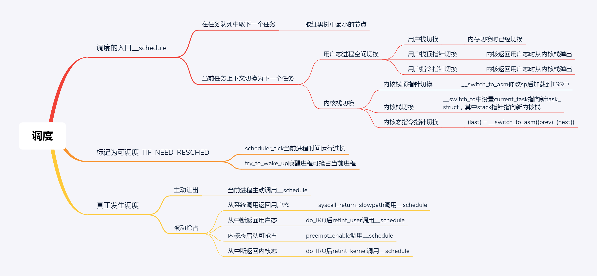

===============
Linux Kernel
===============

:Date:   2021-04-24 16:52:25

问题记录TODO
=============
以下各问题可新开主题来回答。
   
1. 虚拟内存？分页？page fault ？
2. 上下文切换的具体过程？
3. 时间子系统——RTC时钟和中断时钟在进程调度中的作用？vruntime更新使用哪个时间？ 
4. 异常、陷阱、中断、系统调用等概念辨析；中断为什么不能休眠？如何查看中断向量表？实模式？系统调用的细节？
   `request_irq和free_irq函数如何注册注销中断(详解) <https://www.cnblogs.com/lifexy/p/7506613.html>`__
5. 自旋锁、互斥量、信号量的实现原理。无锁编程。
   `自旋锁 <http://www.wowotech.net/kernel_synchronization/460.html>`__ ;
   `Linux 单/多处理器下的内核同步与实现---自旋锁 <https://zhuanlan.zhihu.com/p/115748853>`__

6. `高速缓存与一致性 <https://zhuanlan.zhihu.com/cpu-cache>`__

   

内核入门
============
本文主要来源于LKD。

参考文档
--------

内核相关文档
~~~~~~~~~~~~~~~~~

1. https://www.kernel.org/doc/html/latest/translations/zh_CN/
2. https://kernelnewbies.org/
3. https://lwn.net/
4. https://kernel.org/pub/linux/kernel/
5. https://wiki.linuxfoundation.org/realtime/start

在线源码
~~~~~~~~~~~~~~~~~~
linux、glibc、gcc等。

1. https://elixir.bootlin.com/linux/v5.10/C/ident/ 不止有Linux。
2. http://sbexr.rabexc.org/latest/sources/meta/index : 搜索很快
3. https://code.woboq.org/ : 跳转准确
4. https://www.busybox.net/

参考书籍
~~~~~~~~

1. Linux Kernel Development， V2.6.34
2. Linux Devices Driver， V2.6.10
   :download:`ldd3 <../books/ldd3.pdf>` 
3. Proffesional Linux Kernel Architecture， V2.6.24 
   :download:`深入Linux内核架构 <../books/深入Linux内核架构.pdf>` 

   :download:`PLKA <../books/Professional_Linux_Kernel_Architecture.pdf>` 

4. Understanding The Linux Kernel，  V2.6.11 
   :download:`ulk3 <../books/ulk3.pdf>` 
   :download:`深入理解linux内核中文第三版 <../books/深入理解linux内核中文第三版.pdf>` 

5. 奔跑吧Linux内核：几个重点模块讲解较仔细。

参考链接
~~~~~~~~

1. `趣谈Linux操作系统——刘超 <https://zter.ml/>`__ :完成一遍，后一半的内容比较深入，后续可作为相关知识点的参考。
2. 操作系统实战45讲
3. 有深度：`linux-inside <https://0xax.gitbooks.io/linux-insides/content/>`__ or 
   `linux-inside-zh <https://github.com/MintCN/linux-insides-zh>`__
4. `Linux进程管理与调度 <https://blog.csdn.net/gatieme/category_6225543.html>`__
5. http://www.wowotech.net/ ：很多不错的文章
6. `Linux内存管理专题 - ArnoldLu - 博客园  <https://www.cnblogs.com/arnoldlu/p/8051674.html>`__ ：Linux等多个系列文章

基本概念
--------
内核态拥有受保护的内存空间和访问硬件设备的所有权限。

应用程序通过库函数或系统调用让内核代替完成各种任务。
库函数不仅是对系统调用的打包，它也实现了系统调用不具备的功能，如strcpy。

.. figure:: ../images/SyscallAndLibc.png
   :alt: 库函数和系统调用

   库函数和系统调用

**处理器可能的状态：**

1. 运行于用户空间，执行用户进程；
2. 运行于内核空间，处于进程上下文，代表某个特定的进程执行；
3. 运行于内核空间，处于中断上下文，处理特定的中断（与任何进程无关）。
4. CPU空闲时，运行一个空进程，处于2的状态。

**微内核：**
将内核服务的地址空间隔离，内核只提供基础服务（IPC、内存、调度等），
其它服务组件如文件系统、驱动程序等则各自运行在独立的地址空间（用户空间），并以IPC的方式为其它应用程序提供服务。

微内核提升了稳定性、安全性、扩展性和内核实时性，但是损失了效率。

内核版本号
----------

`Linux内核版本号： <http://en.wikipedia.org/wiki/Linux_kernel#Version_numbering>`__

1. 2.x 版本奇数表示开发版、偶数表示稳定版。2.6.x系列覆盖了2003-2011年。
2. 3.0开始，版本号基于时间变化（近2个月更新一次小版本号），不代表有重大的内容更新。同时避免小版本号超过20。
3. 当前5.11为15-Feb-2021发布

-  mainline 是主线版本。
-  stable 是稳定版，由 mainline   在时机成熟时发布，稳定版也会在相应版本号的主线上提供 bug   修复和安全补丁
-  longterm   是长期支持版，多为\ `6年 <https://www.kernel.org/category/releases.html>`__
-  RC：release candidates。

进程
=====
进程管理
---------
* 进程：处于执行期的程序以及相关资源的总称。
* 程序：存放在存储介质上的。

管理结构：

1. 任务队列：task_struct双向循环列表。
2. 进程描述符（task_struct）中保存了能完整描述一个正在执行的程序的左右数据。1.7KB(32位机器)。
3. 使用slab分配器分配，实现对象复用和缓存着色。
4. thread info结构在进程内核栈尾端分配，包含了指向task_struct的指针。
5. current宏：一个宏，找到当前进程的进程描述符。

进程的五种状态
~~~~~~~~~~~~~~

1. TASK_RUNNING: 运行——可执行的,即正在执行或在运行队列中等待。 **用户空间进程的唯一状态**；内核进程也有此状态。
2. TASK_INTERRUPTIBLE: 可中断的——睡眠中，等待特定条件达成，可被信号唤醒。
3. TASK_UNINTERRUPTIBLE: 不可中断——睡眠中， **不会被信号唤醒**。在进程等待过程必须不受干扰或等待事件很快会发生时使用(硬件操作、io等)。
4. __TASK_TRACED: 被其他进程跟踪，如ptrace。
5. __TASK_STOPPED: 停止执行，进程没有投入运行也不能投入运行。通常发生在接收SIGSTOP、SIGTSTP、SIGTTIN、SIGTTOU等信号时。

.. figure:: ../images/task_status.png
   :scale: 50%

   任务状态

::

   linux 5.8
   /*
    * Task state bitmask. NOTE! These bits are also
    * encoded in fs/proc/array.c: get_task_state().
    *
    * We have two separate sets of flags: task->state
    * is about runnability, while task->exit_state are
    * about the task exiting. Confusing, but this way
    * modifying one set can't modify the other one by
    * mistake.
    */

   /* Used in tsk->state: */
   #define TASK_RUNNING			0x0000
   #define TASK_INTERRUPTIBLE		0x0001
   #define TASK_UNINTERRUPTIBLE		0x0002
   #define __TASK_STOPPED			0x0004
   #define __TASK_TRACED			0x0008
   /* Used in tsk->exit_state: */
   #define EXIT_DEAD			0x0010
   #define EXIT_ZOMBIE			0x0020
   #define EXIT_TRACE			(EXIT_ZOMBIE | EXIT_DEAD)
   /* Used in tsk->state again: */
   #define TASK_PARKED			0x0040
   #define TASK_DEAD			0x0080
   #define TASK_WAKEKILL			0x0100
   #define TASK_WAKING			0x0200
   #define TASK_NOLOAD			0x0400
   #define TASK_NEW			0x0800
   #define TASK_STATE_MAX			0x1000

fork
-----
1. `vfork(2) - Linux manual page  <https://man7.org/linux/man-pages/man2/vfork.2.html>`__
2. `fork 在 Linux 内核里面的实现 - scriptk1d - 博客园  <https://www.cnblogs.com/crybaby/p/12938807.html#_do_frok>`__

开销： **复制父进程的页表和创建子进程的进程描述符。**

资源采用写时复制，即只有在需要写入时才拷贝页，是他们拥有独立的数据副本

线程：Linux中，只是进程间共享资源的手段。共享文件系统资源、地址空间、文件描述符和信号处理程序。

内核进程：没有独立的地址空间，可以被调度和抢占。

fork vfork clone比较
~~~~~~~~~~~~~~~~~~~~~

1. clone比fork提供更多选项控制父子进程共享的执行上下文；
2. vfork(与fork相比)calling 挂起，且共享所有memory(包括stack)，直到child结束或执行execv；vfork共享vm，不复制页表.

       it is used to create new
       processes without copying the page tables of the parent process.
       It may be useful in performance-sensitive applications where a
       child is created which then immediately issues an execve(2).

::

    vfork = clone + (CLONE_VM | CLONE_VFORK | SIGCHLD)
    
    ntpl  pthread_create = 
    const int clone_flags = (CLONE_VM | CLONE_FS | CLONE_FILES | CLONE_SYSVSEM | CLONE_SIGHAND | CLONE_THREAD | CLONE_SETTLS | CLONE_PARENT_SETTID | CLONE_CHILD_CLEARTID | 0);
    ARCH_CLONE (&start_thread, STACK_VARIABLES_ARGS, clone_flags, pd, &pd->tid, tp, &pd->tid)；

进程的生命周期
------------------
fork -> exec -> exit + wait

fork / clone(pthread_create) -> _do_fork -> copy_process

1.  dup_task_struct(): 创建内核栈、task_struct、thread_info.
2.  检查当前用户进程数目是否超出限制。
3.  清除任务描述法的部分统计信息，如运行统计。
4.  设置为 TASK_INTERRUPTIBLE。
5.  copy_flags()更新flags。
6.  alloc_pid()分配新PID。
7.  根据clone()传递的参数标识，copy_process()拷贝或共享 
    打开的文件、文件系统、信号处理函数、进程地址空间、命名空间等。
8. copy_process()返回指向子进程的指针。
9. _do_fork -> wake_up_new_task。
   设置为 TASK_RUNNING;
   activate_task 加入对应的调度队列；
   check_preempt_wakeup 设置父进程TIF_NEED_RESCHED，即在返回时抢占父进程，
   子进程先执行，避免写时复制的开销

exit() -> do_exit()

1. 设置task_struct的标识成员为PF_EXITING,表示正在退出。
2. 删除内核定时器。
3. 释放地址空间mm_struct。
4. exit_fs()、exit_files()，分别递减文件系统、文件描述符的引用计数。
5. 设置EXIT_ZOMBIE，调用schedule切换到新进程。
   
   * 这是进程执行的最后一段代码，do_exit永不返回。
   * 此时与进程相关的所有资源都被释放掉了。
   * 进程此时占有的内存只有内核栈、thread_info、task_struct。

6. 父进程可获取已终止的子进程信息wait4()，然后通知内核释放所占用的剩余资源，
   release_task() -> _exit_signal()

::

   kernel/exit.c
   void __noreturn do_exit(long code)
   {

   		preempt_count_set(PREEMPT_ENABLED);

   		set_current_state(TASK_UNINTERRUPTIBLE);
   		schedule();

   	exit_signals(tsk);  /* sets PF_EXITING */

   	exit_mm();

   	exit_sem(tsk);
   	exit_shm(tsk);
   	exit_files(tsk);
   	exit_fs(tsk);
   	if (group_dead)
   		disassociate_ctty(1);
   	exit_task_namespaces(tsk);
   	exit_task_work(tsk);
   	exit_thread(tsk);
   	exit_umh(tsk);

   	debug_check_no_locks_held();

   	if (tsk->io_context)
   		exit_io_context(tsk);

   	if (tsk->splice_pipe)
   		free_pipe_info(tsk->splice_pipe);

   	if (tsk->task_frag.page)
   		put_page(tsk->task_frag.page);

   	validate_creds_for_do_exit(tsk);

   	check_stack_usage();
   	preempt_disable();

   	exit_rcu();
   	exit_tasks_rcu_finish();

   	lockdep_free_task(tsk);
   	do_task_dead();
   }

进程调度
-----------

Linux提供抢占式多任务模式（preemptive multitaking）。

调度程序：在TASK_RUNNING的进程之间分配有限的处理器时间资源。

调度策略的平衡： 优先调度IO消耗型以保证短的响应时间，或优先调度CPU消耗型以保证高吞吐量。

Linux更倾向于 ``优先调度IO消耗型进程``，以保证响应时间（交互式应用和桌面系统等）。

O(1)调度
~~~~~~~~~

1. 140个成员的array,各成员各对应一个FIFO队列；
2. 使用位图来各队列是否为空；
3. 调度时间复杂度为 O(1).

.. figure:: ../images/O(1)_schedule.jpg
   :scale: 50%

   Linux2.6.23以前的O(1)调度

六大调度策略
----------------
1. `sched man <https://man7.org/linux/man-pages/man7/sched.7.html>`__ 讲得很清楚。
2. `翻译版 <https://www.cnblogs.com/charlieroro/p/12133100.html>`__ 。

1. SCHED_FIFO: 先进先出，无时间片。
2. SCHED_RR：时间片轮转，可抢占。
3. SCHED_DEADLINE：按照任务deadline来调度选择其 deadline 距离当前时间点最近的任务。
4. SCHED_OTHER：Linux中又名SCHED_NORMAL，根据nice值调度。
5. SCHED_BATCH：假定任务是CPU-intensive，对唤醒的进程做调度惩罚，即不提倡频繁切换。
6. SCHED_IDLE: nice值小于19，即用于优先级非常低的任务。

不同类型进程优先级为

::

    __stop_sched_class -> __dl_sched_class -> __rt_sched_class -> __fair_sched_class -> __idle_sched_class

实时策略
------------

调度器为每个优先级维护一个等待list。选择最高优先级的非空list的第一个成员来执行。
调度策略只能决定同一等待list（同一优先级）的进程执行顺序。

1. normal scheduling policies： (SCHED_OTHER, SCHED_IDLE, SCHED_BATCH), sched_priority must be specified as 0.

   The nice value  (SCHED_OTHER, SCHED_BATCH) influence the CPU scheduler to favor or disfavor a process in scheduling decisions.
   the range is -20 (high priority) to +19 (low priority).

2. **real-time policies**：(SCHED_FIFO, SCHED_RR, SCHED_DEADLINE) have a sched_priority value in the range **1 (low) to 99 (high)**.

Linux的实时调度算法提供了一种软实时的工作方式，即尽力使进程在它的限定时间到来前运行，但内核不保证总能满足要求。

Linux调度程序默认试图使进程尽量在同一个处理器运行（软亲和性），同时提供了强制亲和性（通过task_struct的cpus_allowed位掩码标志）。

FIFO与RR
~~~~~~~~~~~~~
1. `实时调度类分析 <https://www.cnblogs.com/arnoldlu/p/9025981.html>`__ （源码分析）

2. `Linux进程调度总结 <https://zhuanlan.zhihu.com/p/335846858>`__ (图不错)
3. `Linux schedule 调度算法  <https://mp.weixin.qq.com/s/GaZbL1LVq4rFmKIWwiKOeQ>`__

FIFO:严格按照优先级来执行，同一优先级先进先得到执行。

RR:调度策略，:存在一个RR_TIMESLICE时隙设置，可以通过调节时隙让各进程得到相对公平的机会。

当相同优先级的FIFO和RR进程执行时，RR相对吃亏，因为FIFO一旦抢占会执行到不会主动放弃。

RT Bandwidth
~~~~~~~~~~~~~~~~~~~~~~
RT进程和普通进程之间有一个分配带宽的比例，默认情况是 RT:CFS=95:5。

通过/proc/sys/kernel/sched_rt_period_us和/proc/sys/kernel/sched_rt_runtime_us来设置。

CFS调度
--------

`CFS调度器（2）-源码解析 <http://www.wowotech.net/process_management/448.html>`__

1. CFS调度完全摒弃时间片的分配方法，而是给进程分配处理器的使用比例，确保了进程调度中有恒定的公平性，而切换频率则是不断变化的。
2. CFS有一个分配时间的最小粒度，默认1ms，在可运行进程数量较多时，可将切换消耗限制在一定范围。
3. 进程获得的处理器时间由自己和其它所有可运行进程的nice值的差值决定，nice相差1则相差1.25倍时间。

时间片与nice
~~~~~~~~~~~~
1. 时间片：进程在被抢占之前能够运行的时间，预先分配的。
2. nice：决定处理器的使用比例。

采用固定时间片则会引发固定的切换频率，会影响公平性。

1. 若将nice映射到绝对的时间片，则进程切换无法最优化进行。如高nice值的进程切换会更频繁；同时nice值±1的效果取决于nice本身初始值。
2. 基于优先级的调度器为了优化交互任务，需要提升刚唤醒的进程的优先级，这样的优先级提升实际上是不公平的。
3. 时间片会随着定时器节拍改变，即最小时间片必须是定时器节拍的整数倍。

调度延时
~~~~~~~~~
又被称为调度周期，即该时间内所有任务均会被运行一次。

当进程数 < sched_nr_latency(默认为为8)时，值固定的为sysctl_sched_latency(6 ms)

当进程数 > sched_nr_latency(8)时,为进程数乘以sched_min_granularity_ns(0.75ms)

**sysctl_sched_latency  =   cat /proc/sys/kernel/sched_latency_ns**

`[scheduler] 调度时延，调度最小抢占粒度，调度唤醒抢占粒度详解 <https://blog.csdn.net/wukongmingjing/article/details/105433479>`__

调度的实现
------------

时间记账vruntime
~~~~~~~~~~~~~~~~~
CFS使用调度器实体结构来维护每个进程运行的时间记张。（linux/sched.h -> struct_sched_entity）

vruntime存放进程的虚拟运行时间，是所有可运行进程总数的加权计算结果。单位ns，与定时器节拍不相关。

``虚拟运行时间 vruntime += 实际运行时间 delta_exec * NICE_0_LOAD/ 权重``

系统定时器周期性调用 update_curr()，以更新所有进程的vruntime(包括可运行和阻塞态的所有进程)。

针对刚创建的进程会进行一定的惩罚，将虚拟时间加上一个值。

进程选择
~~~~~~~~~~~~
选择具有最小vruntime的任务。

使用红黑树rbtree来组织可运行的进程队列，节点键值即vruntime。

1. 选择下一个任务：pick_next_entity()，运行rbtree最左节点对应的进程。此处不需要遍历树来查找最左节点，因为 ``最左节点已经被缓存起来`` （在更新rbtree时缓存的）。
2. 在rbtree插入进程： ``进程被唤醒或fork()创建进程时``。enqueue_entity()更新当前任务的统计数据，并插入调度实体，并更新最左节点的缓存。
3. 删除进程：进程阻塞或终止时。dequeue_entity()。

大小核与HFI
~~~~~~~~~~~~~~~~
1. `14. Hardware-Feedback Interface for scheduling on Intel Hardware — The Linux Kernel documentation  <https://docs.kernel.org/x86/intel-hfi.html#implementation-details-for-linux>`__

The Hardware Feedback Interface provides to the operating system information 
about the **performance and energy efficiency of each CPU** in the system. 
Each capability is given as a unit-less quantity in the range **[0-255]**. 
Higher values indicate higher capability. Energy efficiency and performance are reported in separate capabilities. 

调度器
~~~~~~~~~~~
每个CPU都有自己的 struct rq 结构，其用于描述在此 CPU 上所运行的所有进程，其包括一个实时进程队列 rt_rq 和一个 CFS 运行队列 cfs_rq。

调度类sched_class定义了很多种方法，用于操作上述调度队列上的任务。每种调度策略各实现了一种调度类，并放在同一个链表中。

调度类中的方法，如pick_next_task在不同的调度类中有不同的实现，返回空时则继续操作下一个队列。

1. fair_sched_class 的实现是 pick_next_task_fair，rt_sched_class 的实现是 pick_next_task_rt；
2. pick_next_task_rt 操作的是 rt_rq，pick_next_task_fair 操作的是 cfs_rq。

调用路径pick_next_task_fair -> pick_next_entity -> __pick_first_entity。

   调度过程

休眠与唤醒
~~~~~~~~~~~~

休眠（被阻塞）通过等待队列处理，有两种状态，TASK_INTTERUPTIBLE和TASK_UNITTERUPTIBLE。

当与等待队列相关的时间发生时，队列上所有进程都会被唤醒（存在虚假唤醒）。

1. DEFINE_WAIT()创建一个等待队列的项；
2. add_wait_queue()加入队列中；
3. prepare_to_wait()设置进程状态为TASK_INTTERUPTIBLE或TASK_UNITTERUPTIBLE；
4. 若被信号唤醒，则检查条件是否为真；
5. 条件满足后设置状态为TASK_RUNNING并调用finish_wait()移出等待队列。

wake_up() -> try_to_wake_up()。通常是促使条件达成的代码来调用此函数，比如磁盘数据到来时，VFS需要调用。

1. 设置状态为TASK_RUNNIN并调用finish_wait；
2. enqueue_task()放入调度队列；
3. 若被唤醒的进程优先级比正在运行的进程优先级高，则设置need_resched标志。

wake_up
~~~~~~~~
1. `进程调度API之wake_up_process_tiantao2012的博客-CSDN博客  <https://blog.csdn.net/tiantao2012/article/details/78872831>`__
2. `sched feature: TTWU_QUEUE_yiyeguzhou100的博客-CSDN博客  <https://blog.csdn.net/yiyeguzhou100/article/details/104336751>`__
3. https://elixir.bootlin.com/linux/latest/source/kernel/sched/core.c#L3778

唤醒方式：

1. 分支1：cpus_share_cache判断如果目标CPU与当前CPU **不共享LLC**（即L3 cache），则将该线程加到目标cpu的wake_list后，向目标CPU发送 **IPI中断**。
2. 分支2：(同Cluster，非IPI形式)try_to_wake_up() 调用 ttwu_queue() 将这个唤醒的任务添加到队列当中。ttwu_queue() 再调用 ttwu_do_activate() 激活这个任务。ttwu_do_activate() 调用 ttwu_do_wakeup()

内核栈
----------

当系统因为系统调用（软中断）或硬件中断，CPU切换到特权工作模式，进程陷入内核态，进程使用的栈也要从用户栈转向系统栈。

从用户态到内核态要两步骤，首先是将用户堆栈地址保存到内核堆栈中，然后将CPU堆栈指针寄存器指向内核堆栈。

当由内核态转向用户态，步骤首先是将内核堆栈中得用户堆栈地址恢复到CPU堆栈指针寄存器中。

- 用户空间的堆栈，task_struct->mm->vm_area，属于进程虚拟地址空间。

- 内核态的栈，tsak_struct->stack(其 ``底部是thread_info对象``，thread_info可以用来快速获取task_struct对象)。
  整个stack区域一般只有一个内存页(可配置)，32位机器也就是4KB。也是进程私有的。

https://zhuanlan.zhihu.com/p/296750228

- x86: 上图，采用了每cpu变量current_task来保存当前运行进程的task_struct
- arm: 使用current宏，arm32使用栈偏移量、arm64使用专门的寄存器 来找到进程描述符。

为什么需要内核栈？

1. 内核的代码和数据是为所有的进程共享的
2. 安全

抢占和上下文切换
------------------
1. `内核抢占和低延迟_独角鲸的博客-CSDN博客  <https://blog.csdn.net/su_linux/article/details/15500053>`__
2. `进程切换：自愿(voluntary)与强制(involuntary) | Linux Performance  <http://linuxperf.com/?p=209>`__

抢占
~~~~~~
自愿切换和强制切换：

1. 自愿切换发生的时候，进程不再处于运行状态，比如由于等待IO而阻塞(TASK_UNINTERRUPTIBLE)，或者因等待资源和特定事件而休眠(TASK_INTERRUPTIBLE)，又或者被debug/trace设置为TASK_STOPPED/TASK_TRACED状态；
2. 强制切换发生的时候，进程仍然处于运行状态(TASK_RUNNING)，通常是由于被优先级更高的进程抢占(preempt)，或者进程的时间片用完了。

context_switch
~~~~~~~~~~~~~~~~~~~
上下文切换：即从一个可执行程序切换到另一个可执行程序。

_schedule -> context_switch()： 完成地址空间切换switch_mm()和处理器状态恢复switch_to()。

::

   /*
    * context_switch - switch to the new MM and the new thread's register state.
    */
   static __always_inline struct rq *
   context_switch(struct rq *rq, struct task_struct *prev,
   	       struct task_struct *next, struct rq_flags *rf)
   {
   	struct mm_struct *mm, *oldmm;
   ......
   	mm = next->mm;
   	oldmm = prev->active_mm;
   ......
   	switch_mm_irqs_off(oldmm, mm, next);
   ......
   	/* Here we just switch the register state and the stack. */
   	switch_to(prev, next, prev);
   	barrier();
   	return finish_task_switch(prev);
   }

switch_to
~~~~~~~~~~~
通过三个变量 switch_to(prev = A, next=B, last=C)，

A 进程就明白了，我当时被切换走的时候，是切换成 B，这次切换回来，是从 C 回来的。

::

   #define switch_to(prev, next, last)					\
   do {									\
   	prepare_switch_to(prev, next);					\
   									\
   	((last) = __switch_to_asm((prev), (next)));			\
   } while (0)

TSS
~~~~~~~
内核态。

x86 在内存里面维护一个 TSS（Task State Segment，任务状态段）结构。这里面有所有的寄存器。

为了避免全量切换，Linux在 cpu_init 中给每一个 CPU 关联一个 TSS，然后将 TR 永远指向这个 TSS。

task_struct的最后一个成员变量thread保存了需要切换的寄存器：

真的参与进程切换的寄存器很少，主要的就是 ``栈顶寄存器``。	

CPU角度的进程切换：将某个进程的 thread_struct 里面的寄存器的值，写入到 CPU 的 TR 指向的 tss_struct

::

   /* CPU-specific state of this task: */
   struct thread_struct		thread; //这个结构的内容与体系相关!! ia64和x86都不一样

pt_regs和cpu_context
~~~~~~~~~~~~~~~~~~~~~
task_struct成员stack指向内核栈，内核栈顶部的pt_regs中保存用户态的regs。

arm：

1. pt_regs和cpu_context都是处理器架构相关的结构。

2. pt_regs是发生异常时（当然包括中断）保存的处理器现场，用于异常处理完后来恢复现场，它保存在进程内核栈中。

3. cpu_context是发生进程切换时，保存当前进程的上下文，保存在当前进程的进程描述符中。

4. pt_regs表征发生异常时处理器现场，cpu_context发生调度时当前进程的处理器现场。

参考

1. `Arm64 Linux 5.0 - 深入理解Linux内核进程上下文切换 <https://cloud.tencent.com/developer/article/1710837>`__
2. `x86 Linux 4.6 - Linux进程上下文切换过程context_switch详解 <https://blog.csdn.net/gatieme/article/details/51872659>`__
3. `fork背后隐藏的技术细节 <https://zhuanlan.zhihu.com/p/373958196>`__

need_resched
~~~~~~~~~~~~~~
表明需要重新执行一次调度，强制调度，有调度延时。

当某个进程应该被抢占时，或更高优先级的进程进入可执行状态时，需要设置此标志。

该标志包含在进程描述符内，访问进程描述符内的变量比访问全局变量快（current宏速度快且进程描述符通常在告诉缓存内）。

用户抢占与内核抢占
~~~~~~~~~~~~~~~~~~~~~
**用户抢占时机**

1. 从系统调用返回用户空间时；
2. 从中断处理程序返回用户空间时。

**内核抢占时机**

1. 可以在任何时间抢占任务（只要没有锁），通常发生在 **preempt_enable()** 中。
2. 中断返回到内核时。

preempt_enable() 会调用 preempt_count_dec_and_test()，判断 preempt_count 和 TIF_NEED_RESCHED 看是否可以被抢占。

如果可以，就调用 preempt_schedule->preempt_schedule_common->__schedule 进行调度。

            抢占式调度

_schedule上下文切换
~~~~~~~~~~~~~~~~~~~~

.. figure:: ../images/context_switch.jpg

               context_switch

进程优先级
-----------------
1. `关于Linux进程优先级数字混乱的彻底澄清 <https://mp.weixin.qq.com/s/44Gamu17Vkl77OGV2KkRmQ>`__
2. `proc(5) - Linux manual page  <https://man7.org/linux/man-pages/man5/proc.5.html>`__

**用户态：**
~~~~~~~~~~~~~~~~~~~

1. sched_priority(chrt、/proc/pid/stat 字段 **40**)，最常用。sched_priority : 1(low) to 99(high)
2. nice(/proc/pid/stat 字段 **19**)。nice :-19(high) to 20(low)
3. policy(字段 **41**)

**内核态：**
~~~~~~~~~~~~~~~~
内核调度bitmap使用。 /proc/pid/sched。小->优先级高。

prio = 99 - sched_priority

normal = 120 + nice

**top命令：**
~~~~~~~~~~~~~~~
/proc/pid/stat 字段 **18**. top_prio = -1 - sched_priority

系统调用
=============
1. `the-definitive-guide-to-linux-system-calls  <https://blog.packagecloud.io/eng/2016/04/05/the-definitive-guide-to-linux-system-calls/>`__
`系统调用权威指南 <https://arthurchiao.art/blog/system-call-definitive-guide-zh>`__
系统学习，有源码分析

2. `深入理解系统调用 <https://www.cnblogs.com/liujianing0421/p/12971722.html>`__

3. `调用门 - 硬件原理 <https://mp.weixin.qq.com/s/8BtdBNTW36BUxb5Ee-jKSw>`__
4. `Linux syscall过程 —— 栈切换等 <https://cloud.tencent.com/developer/article/1492374>`__

概念
------
在Linux中，系统调用是用户空间访问内核的唯一手段。

系统调用在用户空间进程和硬件设备之间添加了一个中间层，作用：

1. 为用户空间提供硬件抽象接口；
2. 保证系统的稳定与安全。内核基于权限、用户和其它规则对访问进行裁决；
3. 为运行在虚拟系统中的进程提供公共接口（？）。

应用程序编程接口API；在用户空间实现，应用程序使用其来编程。不需要和系统调用对应。

POSIX：提供一套大体基于UNIX的操可移植作系统标准。

C库：Linux系统调用像其它大多数UNIX系统一样，作为C库的一部分提供。C库提供了POSIX的大部分API。

UNIX接口设计：提供机制（功能定义）而不是策略（如何实现）。

eax：存放系统调用号、返回值。

系统调用的实现
--------------

系统调用列表：在sys_call_table中，空sys_ni_syscall()仅返回-ENOSYS。

系统调用设计：力求简洁，参数尽可能少；向前向后兼容性；可移植性。

参数验证：系统调用必须仔细检查参数是否合法。

syscall
~~~~~~~~~~~
不是所有的系统调用在glibc中都有对应的封装。

use syscall from glibc to call exit with exit status of 42:

::

   int
   main(int argc, char *argv[])
   {
   unsigned long syscall_nr = 60;
   long exit_status = 42;

   asm ("movq %0, %%rax\n"
         "movq %1, %%rdi\n"
         "syscall"
      : /* output parameters, we aren't outputting anything, no none */
         /* (none) */
      : /* input parameters mapped to %0 and %1, repsectively */
         "m" (syscall_nr), "m" (exit_status)
      : /* registers that we are "clobbering", unneeded since we are calling exit */
         "rax", "rdi");
   }

   
**syscall wrapper function**: sysdeps/unix/sysv/linux/x86_64/syscall.S

::

   /* Usage: long syscall (syscall_number, arg1, arg2, arg3, arg4, arg5, arg6)
      We need to do some arg shifting, the syscall_number will be in
      rax.  */

         .text
   ENTRY (syscall)
         movq %rdi, %rax         /* Syscall number -> rax.  */
         movq %rsi, %rdi         /* shift arg1 - arg5.  */
         movq %rdx, %rsi
         movq %rcx, %rdx
         movq %r8, %r10
         movq %r9, %r8
         movq 8(%rsp),%r9        /* arg6 is on the stack.  */
         syscall                 /* Do the system call.  */
         cmpq $-4095, %rax       /* Check %rax for error.  */
         jae SYSCALL_ERROR_LABEL /* Jump to error handler if error.  */
   L(pseudo_end):
         ret                     /* Return to caller.  */

这段代码同时展示了两个调用约定：传递给这个函数的参数 符合 用户空间调用约定，
然后将这些参数移动到其他寄存器，使得它们在通过 syscall 进入内核之前符合 内核调用约定。

syscall 时，跳转到 entry_SYSCALL_64 开始执行，其定义在 arch/x86/entry/entry_64.S

系统调用上下文
~~~~~~~~~~~~~~
内核在执行系统调用时处于进程上下文。

在进程上下文中内核可以休眠（系统调用阻塞、显示调用schedule）并且可以被抢占。

- 可休眠说明系统调用可以使用内核提供的大部分功能（而不可休眠的中断在编程时会受到极大限制）；
- 可抢占可需要保证系统调用是可重入。

注册和使用
~~~~~~~~~~
1. 加入系统调用表；
2. 编译进内核映像（不能是模块）；
3. 通过C库或使用_syscalln()访问系统调用。

_syscalln() -> K_INLINE_SYSCALL : 内联汇编

系统调用的替代：

1. 实现一个设备节点，然后使用read/write；
2. 使用文件描述符来表示。

x86 系统调用
-------------------

int 0x80和syscall/sysenter的区别
~~~~~~~~~~~~~~~~~~~~~~~~~~~~~~~~~~~~~~~~
https://www.cnblogs.com/LittleHann/p/4111692.html

1. 通过INT 0x80中断方式。
   
   * 在 2.6以前的 Linux 2.4 内核中，用户态 Ring3 代码请求内核态 Ring0 代码完成某些功能是通过系统调用完成的，而系统调用的是通过软中断指令(int 0x80) 实现的。在 x86 保护模式中，处理 INT 中断指令时
   * 在发生系统调用，由 Ring3 进入 Ring0 的这个过程浪费了不少的 CPU 周期，例如，系统调用必然需要由 Ring3 进入 Ring0，权限提升之前和之后的级别是固定的。
      
   1) CPU 首先从中断描述表 IDT 取出对应的门描述符
   2) 判断门描述符的种类
   3) 检查门描述符的级别 DPL 和 INT 指令调用者的级别 CPL，当 CPL<=DPL 也就是说 INT 调用者级别高于描述符指定级别时，才能成功调用
   4) 根据描述符的内容，进行压栈、跳转、权限级别提升
   5) 内核代码执行完毕之后，调用 IRET 指令返回，IRET 指令恢复用户栈，并跳转会低级别的代码 .
    
2. 通过sysenter指令方式。
sysenter 指令用于由 Ring3 进入 Ring0，SYSEXIT 指令用于由 Ring0 返回 Ring3。由于没有特权级别检查的处理，也没有压栈的操作，所以执行速度比 INT n/IRET 快了不少。
sysenter和sysexit都是CPU原生支持的指令集

arm64系统调用
--------------
1. `armv8/arm64 中断/系统调用流程 <https://cloud.tencent.com/developer/article/1413292>`__
2. `Linux Kernel 5.14 arm64异常向量表解读-中断处理解读  <https://blog.csdn.net/weixin_42135087/article/details/120232101>`__

arm异常向量表
~~~~~~~~~~~~~~~~~~
1. `ARM Cortex-A Series Programmer's Guide for ARMv8-A  <https://developer.arm.com/documentation/den0024/a/CHDEEDDC>`__

有四张表，每张表有四个异常入口，分别对应同步异常，IRQ，FIQ和出错异常。

1. 如果发生异常并不会导致exception level切换，并且使用的栈指针是SP_EL0，那么使用第一张异常向量表。
2. 如果发生异常并不会导致exception level切换，并且使用的栈指针是SP_EL1/2/3，那么使用第二张异常向量表。
3. 如果发生异常会导致exception level切换，并且比目的exception level低一级的exception level运行在AARCH64模式，那么使用第三张异常向量表。
4. 如果发生异常会导致exception level切换，并且比目的exception level低一级的exception level运行在AARCH32模式，那么使用第四张异常向量表。

linux中断向量表
~~~~~~~~~~~~~~~~~~~~
arch/arm64/kernel/entry.S：

1. **el1_sync**：当前处于内核态时，发生了指令执行异常、缺页中断（跳转地址或者取地址）。

2. **el1_irq**：当前处于内核态时，发生硬件中断。

3. **el0_sync**：当前处于用户态时，发生了指令执行异常、缺页中断（跳转地址或者取地址）、系统调用。

4. **el0_iqr**：当前处于用户态时，发生了硬件中断。

el1_sync，el1_irq，el0_sync，el0_irq在开始时会调用kernel_entry，在结束时会调用kernel_exit。

当发生中断、异常、系统调用时，硬件会自动：

1）把当前程序的pc值放入ELR_EL1中

2）把当前状态PSTATE存入SPSR_EL1中

3）根据发生在内核态还是用户态，中断还是异常，会自动跳转到el1_sync，el1_irq，el0_sync，el0_irq

4）改变PSTATE，如果是用户态发生中断、异常、系统调用，此时已经进入内核态，堆栈是sp_el1。

SVC系统调用约定
~~~~~~~~~~~~~~~~~

SVC指令在ARMv8体系中被归于异常处理类指令
ESR为SVC使用的立即数

用SVC指令触发系统调用的约定如下[2]：

1. 64位用户程序使用寄存器x8传递系统调用号，32位用户程序使用寄存器x7传递系统调用号；
2. 使用寄存器x0-x6传递系统调用所需参数，最多可传递7个参数；
3. 系统调用执行完后，用寄存器x0存放返回值。

虚拟系统调用vDSO和ASLR
----------------------
不进入内核即可执行系统调用，例如gettimeofday。

The Linux vDSO is a set of code that is part of the kernel.

The "vDSO" (virtual dynamic shared object) is a small shared  library that the kernel automatically maps into the address space   of all user-space applications.

地址随机(安全)
~~~~~~~~~~~~~~~~
1. `The Definitive Guide to Linux System Calls | Packagecloud Blog  <https://blog.packagecloud.io/the-definitive-guide-to-linux-system-calls/>`__

Due to ASLR `address space layout randomization <https://en.wikipedia.org/wiki/Address_space_layout_randomization>`__
the vDSO will be loaded at a random address when a program is started.

每次运行都会有不同的地址。程序代码、库代码、栈、全局变量和堆数据。

_kernel_vsyscall
~~~~~~~~~~~~~~~~~~~~~~~~
内核函数 __kernel_vsyscall 封装了 sysenter 调用约定（calling convention）,
应该使用 __kernel_vsyscall而不是手动实现调用sysenter。

它在内核实现，但每个用户进程启动的时候它会映射到用户进程。

**程序如何找到调用的地址？**

__kernel_vsyscall 的地址写入了 ELF auxiliary vector （辅助功能矢量），
用户程序能（典型情况下通过 glibc）找到后者并使用它。寻找 ELF auxiliary vector 有多种方式：

1. 通过 getauxval，带 AT_SYSINFO 参数
2. 遍历环境变量，从内存解析

内核数据结构
============
提倡在开发时重用Linux内建数据结构。

链表、队列、散列表、红黑树，还有基树（Radix Tree）、位图等。

链表
----------
静态数组：编译时需知道元素数量。

链表：动态创建并插入元素，无需占用连续内存。

Linux内核的标准链表为环形双向链表，灵活性高。

使用方法
~~~~~~~~~~~
在数据结构中嵌入链表。

::

   struct list_head {
       struct list_head *next;
       struct list_head *prev;
   }

   //返回包含list_head的父类型结构体（type），ptr为父结构体中的成员member。
   list_entry(ptr, type, member) 

   // for 循环，利用传入的 pos 作为循环变量，从表头 head 开始，逐项向后（ next方向）移动 pos ，直至又回到 head
   //head为数据结构的第一项成员时，与list_for_each_entry等价
   list_for_each(pos, head) 

   //遍历结构体head的成员member，存放到pos,O(n)
   list_for_each_entry(pos, head, member)

增加、删除、移动、合并节点的时间复杂度均为O(1) ，这些操作对应内部链表操作函数。在已有next/prev指针的情况下可直接调用内部链表函数。

队列
--------------
也称为FIFO。

kfifo为Linux内核通用队列实现。

两个主要操作：enqueue和dequeue（kfifo_in、kfifo_out）。维护两个偏移量：入口偏移和出口偏移。

映射
-------------
也称为关联数组。键到值的关联关系即为映射。可通过散列表、二叉搜索树来实现。

Linux内核提供的映射idr：将唯一的UID映射到一个指针。支持的操作 add、remove、lookup、allocate。

::

   使用idp指向的idr分配一个UID，并关联到ptr。
   idr__get_new(struct idr *idp, void *ptr,int *id)

二叉树
-----------------
Linux实现的红黑树为rbtree，为平衡二叉搜索树。

rbtree的实现并为提供搜索和插入方法。
C语言不方便泛型编程，同时最有效的搜索和插入方法应该由用户自己实现。

中断
====================
中断控制器：将多路中断管线复用为一路并连接到处理器。
每个IRQ中断请求线关联一个中断值。值越小则优先级越高。

`Linux下的中断机制 <https://lrita.github.io/2019/03/05/linux-interrupt-and-trap>`__

中断与异常
------------

1. 中断：异步，由设备使用的硬件资源向处理器发送的电信号，
      打断操作系统的执行（甚至是其它中断线上的处理函数），可随时产生。

2. 异常：又称为同步中断，当指令执行时由CPU控制单元产生的，产生时必须考虑处理器时钟同步。

Intel文档把中断和异常分为以下几类：

**异常：**

当CPU执行指令时探测到一个异常，会产生一个处理器探测异常（processor-detected exception），可以进一步区分，这取决于CPU控制单元产生异常时保存在内核堆栈eip寄存器的值。

1. 故障（fault），通常可以纠正，一旦纠正，程序就可以重新开始，
   保存在eip寄存器中的值是引起故障的指令地址。
2. 陷阱（trap）在陷阱指令执行后立即报告，内核把控制权烦给程序后就可以继续它的执行而不失连续性。
   保存在eip中的值是一个随后要执行的指令地址。陷阱的主要作用是为了调试程序。
3. 异常中止（abort），发生一个严重的错误，控制单元出了问题，
   不能在eip寄存器中保存引起异常的指令所在的确切位置。异常中止用于报告严重的错误，例如硬件故障或系统表中无效的值或者不一致的值。这种异常会强制中止进程。
4. 编程异常（programmed exception），在编程者发出的请求时发送，是由int或int3指令触发的。

IDT表
------

IDT表有256成员向量(NR_VECTORS)。总中断数量还需考虑IO_APIC和PCI_MSI。

非屏蔽中断的向量和异常的向量是固定的，而可屏蔽中断的向量是可以通过对中断控制器的编程来改变。

arch/x86/include/asm/irq_vectors.h：

::

   * Linux IRQ vector layout.
   *
   * There are 256 IDT entries (per CPU - each entry is 8 bytes) which can
   * be defined by Linux. They are used as a jump table by the CPU when a
   * given vector is triggered - by a CPU-external, CPU-internal or
   * software-triggered event.
   *
   * Linux sets the kernel code address each entry jumps to early during
   * bootup, and never changes them. This is the general layout of the
   * IDT entries:
   *
   *  Vectors   0 ...  31 : system traps and exceptions - hardcoded events
   *  Vectors  32 ... 127 : device interrupts
   *  Vector  128         : legacy int80 syscall interface
   *  Vectors 129 ... LOCAL_TIMER_VECTOR-1
   *  Vectors LOCAL_TIMER_VECTOR ... 255 : special interrupts
   *
   * 64-bit x86 has per CPU IDT tables, 32-bit has one shared IDT table.

0-31号：arch/x86/include/asm/trapnr.h 与 SDM Volume 3中Table 6-1 Protected-Mode Exceptions and Interrupts一一对应。

中断/异常0-31：

::

   /* Interrupts/Exceptions */

   #define X86_TRAP_DE		 0	/* Divide-by-zero */
   #define X86_TRAP_DB		 1	/* Debug */
   #define X86_TRAP_NMI		 2	/* Non-maskable Interrupt */
   #define X86_TRAP_BP		 3	/* Breakpoint */
   #define X86_TRAP_OF		 4	/* Overflow */
   #define X86_TRAP_BR		 5	/* Bound Range Exceeded */
   #define X86_TRAP_UD		 6	/* Invalid Opcode */
   #define X86_TRAP_NM		 7	/* Device Not Available */
   #define X86_TRAP_DF		 8	/* Double Fault */
   #define X86_TRAP_OLD_MF		 9	/* Coprocessor Segment Overrun */
   #define X86_TRAP_TS		10	/* Invalid TSS */
   #define X86_TRAP_NP		11	/* Segment Not Present */
   #define X86_TRAP_SS		12	/* Stack Segment Fault */
   #define X86_TRAP_GP		13	/* General Protection Fault */
   #define X86_TRAP_PF		14	/* Page Fault */
   #define X86_TRAP_SPURIOUS	15	/* Spurious Interrupt */
   #define X86_TRAP_MF		16	/* x87 Floating-Point Exception */
   #define X86_TRAP_AC		17	/* Alignment Check */
   #define X86_TRAP_MC		18	/* Machine Check */
   #define X86_TRAP_XF		19	/* SIMD Floating-Point Exception */
   #define X86_TRAP_VE		20	/* Virtualization Exception */
   #define X86_TRAP_CP		21	/* Control Protection Exception */
   #define X86_TRAP_VC		29	/* VMM Communication Exception */
   #define X86_TRAP_IRET		32	/* IRET Exception */

上半部
--------
即中断处理程序。运行于中断上下文中，不可阻塞。

上半部执行具有严格时限的工作，运行时可禁止所有其它中断（大部分不会），
同时在其它处理器上禁止同一中断线，即同一中断处理程序不会被同时调用以处理嵌套的中断，即无需重入。

下半部
---------
下半部：所有用于实现将工作推后执行的内核机制。

1. 可调度/休眠 -> 工作队列
2. 性能要求高  -> 软中断
3. 大多数情况  -> tasklet

这里的软中断与系统调用使用的软件中断不同。

软中断
~~~~~~~~~~
1. 对性能要求非常高的场景（如网络、SCSI）。编译时静态注册。
2. 

tasklet
~~~~~~~~~~~~~~

1. 适用大部分下半部处理。使用软中断实现。也可动态注册。
2. 两个不同类型的tasklet可以在不同处理器上同时执行，但两个相同类型的tasklet不能同时执行 。

工作队列
~~~~~~~~~~~~~

1. 可在进程上下文运行。
2. 允许重新调度和睡眠（获取大量内存、获取信号量、阻塞式IO时）。

工作队列提供把需要推后执行的任务交给特定的通用线程的接口。
工作队列线程被唤醒时，已被调度的任务才被执行。

工作队列处理函数运行在进程上下文中，但不能访问用户空间，
因为内核线程在用户空间没有相关的内存映射。

系统调用时内核代表用户空间的进程运行，可访问用户空间，会映射用户空间的内存。

中断为什么不能休眠
--------------------
https://www.cnblogs.com/schips/p/why_isr_can_not_schedule_in_linux.html

中断只能被其他中断中止、抢占，进程不能中止、抢占中断。

中断是一种紧急事务，需要操作系统立即处理，不是不能做到睡眠，是没必要睡眠。

1. 无法被唤醒。在中断context中，唯一能打断当前中断handler的只有更高优先级的中断；
   所有的wake_up_xxx都是针对进程task_struct而言，
   Linux是以进程为调度单位的，调度器只看到进程内核栈，而看不到中断栈。

2. 导致上下文错乱。睡眠函数nanosleep(do_nanosleep,v5.13)会调用schedule导致进程切换。

内存管理
=============

页
------------
MMU：内存管理单元，管理内存并将虚拟地址转换为物理地址的硬件。

MMU以页为单位进行处理，即虚拟内存中页即最小单位。处理器最小可寻址单位为字。

struct pages表示系统中的物理页，而不是虚拟页。
其目的是描述物理内存本身，而不是其中包含的数据。
描述当前时刻相关的物理页中存放的东西，该结构对页的描述只是短暂的。

分页与分段
~~~~~~~~~~~~~
1. `x86段寄存器和分段机制 - 知乎  <https://zhuanlan.zhihu.com/p/324210723>`__

1. x86 cpu才有分段机制，x86_64摒弃使用分段，arm没有分段。
2. Linux实际没有使用分段。

::

   段选择符:逻辑地址 --->  线性地址 ---> 物理地址
                     分段       分页

   x64或Linux中，逻辑地址=线性地址

分段作用：

1. 权限控制。 linux只使用了这个功能。
2. 划分物理内存为段，使os支持访问大于地址线对应的物理内存。linux使用分页+虚拟内存实现了该功能。

页目录要放在线性映射区，但页表却不一定。
`进程的页表和页目录存储在内核空间还是用户空间？低端内存还是高端内存_NewThinker_wei的博客-CSDN博客_页表存放在哪里  <https://blog.csdn.net/NewThinker_wei/article/details/42089707>`__

多级页表
~~~~~~~~~~~
如(PGD+PMD+PTE):

1. 可离散存储页表，利用碎片内存；
2. 页表管理粒度更小，可按需创建；
3. 增加了寻址次数。

区
------------
区的使用的分布和体系结构相关。由于硬件限制，有些页位于特定的物理地址上。

* ZONE_DMA：一些硬件只能用特定的地址来执行DMA；
* ZONE_NORMAL：包含能正常映射的页；
* ZONE_HIGHEM：其中的页不能永久映射到内核地址空间。由于内存的物理寻址范围远大于虚拟寻址范围，
  如x86内核虚拟地址为1G，X64则不存在这个区。

高端内存的映射？

内存分配
-------------

1. 连续物理页： 低级页分配器或kmalloc。
2. 高端内存： alloc_pages()，返回指向pages结构的指针，而不是逻辑地址的指针（高端内存可能并没有被映射到逻辑地址）。使用kmap映射。
3. 连续虚拟地址： vmalloc，相比kmalloc有一定性能损失。
4. 大量数据结构： ``slab高速缓存``。

低级页分配
~~~~~~~~~~~~~~
alloc_pages：以页为单位分配内存，分配连续的物理页。

单页alloc_page。注意错误检查，可能分配失败，从而导致free时奔溃。

page_address：将获得的页转换成它的逻辑地址。

__get_freee_pages ：返回第一个页的逻辑地址。__get_freee_page

get_zero_page：填充0。

kmalloc
~~~~~~~~~~~~~~
kmalloc与用户空间的malloc函数类似，以字节为单位获取内核内存。分配的内存在物理上连续。

kfree：只能释放kmalloc分配的内存。

gfp_mask分配器标志
^^^^^^^^^^^^^^^^^^^^^^^
三类标志：

* 行为修饰符：表示如何分配内存，如是否允许睡眠。
* 区修饰符：表示从哪个区分配。
* 类型标志：组合行为修饰符和区修饰符。

**常用的标志**

1. GFP_KERNEL：这种分配可能引起睡眠，普通优先级。可能阻塞，只能用在可以重新安全调度的进程上下文中（不持有锁时）。

2. GFP_ATOMIC：不能睡眠的内存分配。分配成功可能性较小。用于中断处理程序、软中断、tasklet等。

vmalloc
~~~~~~~~~~~~~~
vmalloc分配虚拟地址连续的内存，物理内存则无需连续，可能睡眠。（与用户空间的malloc类似）

大多数情况下，只有硬件设备需要物理地址连续的内存。

为了将物理上不连续的页转换为虚拟地址中连续的页，需要专门建立页表项，将获得的页一一映射。

性能低，会导致比直接内存映射大得多的TLB抖动。

一般在获取大块内存时使用，如插入内核模块时。

slab
-----------------
通用数据结构缓冲层，便于数据的频繁分配和回收。

当内核请求分配一个新的结构时，内核从部分满或空的slab返回一个指向已分配但未使用的结构的指针。

slab层把不同的对象划分为高速缓存组，每个高速缓存组存放不同类型的对象（task_struct、inode）。

高速缓存被划分为slab，每个slab由一个或多个物理连续的页组成。

kmalloc建立而在slab层之上，对应一组高速缓存组。

slab状态：满、部分满和空。

kmem_getpages：为高速缓存分配足够多的内存。

kmem_cache_creat：创建高速缓存。

kmem_cache_alloc：从高速缓存分配结构。

栈上的静态分配
~~~~~~~~~~~~~~~
进程内核栈目前（>=2.6.37）为两页。历史上可为一页或两页。

用户空间栈大小为8M（ulimit -a）。

percpu数据
~~~~~~~~~~~~~~~
创建一个变量，然后每个 CPU 上都会有一个此变量的拷贝。
约定本地处理器只能访问它自己的唯一数据。

需要禁止内核抢占。

1. 减少数据锁定，不需要锁；
2. 较少缓存失效。

`静态和动态per-CPU变量 <https://blog.csdn.net/longwang155069/article/details/52033243>`__

虚拟文件系统
===============
VFS概念
------------

VFS提供了一个通用的文件系统模型，囊括了文件系统的常用功能集和行为，
使得用户可以使用open、read、write这样的系统调用而无需考虑具体的文件系统和物理介质。

文件系统是特殊的数据分层存储结构，包含文件、目录和相关控制信息。

面向记录的文件系统：丰富、结构化的表示。
面向字节流的文件系统：Unix，简单、灵活。

VFS对象及其数据结构
------------------------
super_block
~~~~~~~~~~~~~~~~~~~~~~
超级快对象存储特定文件系统的信息。对应于存放在磁盘特定扇区中文件系统超级块或文件系统控制块。

文件系统安装时，调用alloc_super()创建并初始化超级块对象，以便从磁盘读取超级块，并填充到内存的超级块对象中。

super_operations()成员函数执行文件系统和索引节点的底层操作。如索引节点的创建、释放等。

inode
~~~~~~~~~~~~~~~~~
索引节点对象包含内核操作文件或目录时需要的全部信息，一个索引文件即代表文件系统中的一个文件。

仅当文件被访问时，才在内存中创建索引节点（从磁盘中提取相关信息，磁盘可能没有索引节点）。

inode_operations()中的操作方法常常与dentry对象相关。包含文件/目录的新建、删除、链接等方法，被相应的系统调用所使用。

dentry
~~~~~~~~~~~~~~
为了方便解析路径、查找文件，引入的目录项dentry。

路径中的每一个部分（包括普通文件）都是目录项对象。

目录项对象没有对应的磁盘数据结构，VFS根据字符串形式的路径名现场创建它。

**目录项状态**:被使用、未被使用和负状态。
一个被使用或未被使用的目录项对应这一个有效的索引节点（由d_inode指向），而负状态的目录项则不对应索引节点（作为缓存）。

**目录项缓存dcache**:文件访问具有空间和时间的局部性，故缓存非常重要。

1. “被使用的”目录项缓存链表，一个索引节点具有多个硬链接时则有多个目录项对象，因此inode中的i_dentry为链表；
2. “最近被使用的”目录项双向链表，包含未被使用和负状态的目录项对象，头部插入尾部删除；
3. 散列表，将路径快速解析为相关的目录项对象。

目录项会让索引节点的使用计数为正，可确保索引节点缓存在内存中。

file
~~~~~~~~~~~
文件对象是进程已打开的文件在内存中的表示（open创建，close撤销）。

文件对象file仅在观点上表示已打开的文件，实际指向目录项对象（指向索引节点），实际只有目录项对象才表示**已打开的实际文件**。

一个文件对应的文件对象不唯一（多个进程可同时打开同一文件），但对应的索引节点和目录项是唯一的。

file和dentry都没有实际的磁盘数据。
file通过f_entry指向相关的目录项对象dentry，dentry则通过d_inode指向对应的索引节点inode，inode中会记录文件是否为脏、是否需要写回磁盘。

file的相关操作与系统调用和类似，如llseek、read、write、flush、open等。

其它数据结构
---------------
其它文件系统数据结构
~~~~~~~~~~~~~~~~~~~~~~~~~

1. file_system_type，描述各种特定文件系统类型，每种文件系统只有一个该结构；
2. vfsmount，描述一个安装文件系统的实例，即代表一个安装点。

和进程相关的数据结构
~~~~~~~~~~~~~~~~~~~~~~~
1. file_struct：由进程描述符中的files指向，包含的fd_array指向已打开的文件对象。
2. fs_struct：由进程描述符的fs指向，包含的当前工作目录和根目录路径结构体中包含目录项对象。
3. mmt_namespace：由进程描述符的mmt_namespace指向，使得每个进程都看到唯一的安装文件系统，list域为已安装的文件系统的双向链表。

使用CLONE_FILES或CLONE_FS创建的进程才会共享file_struct或fs_struct,故结构体中需要维护count计数以防止被撤销。

进程一般继承父进程的命名空间（除非使用CLONE_NEWS标志），因此在大多数系统行只有一个命名空间。

块IO层
=============

块设备：能够随机访问固定到小数据片的硬件设备。复杂性高，对其性能要求也高。

字符设备：按照字节流的方式顺序访问的设备。只需控制一个位置（当前位置），内核不必提供专门的子系统来管理字符设备。

扇区：硬扇区、设备块。块设备中的最小可寻址单元。常为512字节。

块：文件块、IO块。内核最小寻址单元。大小为扇区的2*n倍，并小于页。

缓冲区
-----------
块被调入内存后存储在缓冲区中。
一个缓冲区对应一个块，相当于磁盘块在内存中的表示。

一个页可容纳多个内存中的块。

buffer_head
~~~~~~~~~~~~~
缓冲区头包含内核操作缓冲区所需的全部信息，描述了磁盘块和物理内存缓冲区的特定映射关系。

1. 结构体大。内核倾向于操作页面。
2. 仅描述单个缓冲区。大块数据的IO操作被分解造成不必要的负担。

bio结构
----------------
bio结构代表了在现场的以链表形式组织的一个块的IO操作。

即使缓冲区分散在多个内存位置上，bio也保证内核能够执行IO操作，即聚散IO。

bio中，bio_io_vec为bio_vec结构体数组，包含了一个IO操作所需要使用到的所有片段。bio_vec结构：<page,offset,len>。

bi_vcnt为数组成员数量，bi_idx为当前索引位置。

请求队列
~~~~~~~~~~~
块设备将挂起的块IO请求保存在请求队列reques_queue中，该结构包含一个双向请求队列以及相关控制信息。

队列不为空时，对应的块设备驱动程序就会从队列头获取请求，并送到对应的块设备上去。

每个请求request可由多个bio结构体组成。

IO调度程序
-----------------------
内核在将请求提交给块设备前，先执行合并与排序的预操作，以减少磁盘寻址时间

1. Linus电梯IO调度程序：执行合并和排序，以磁盘物理位置为次序维护请求队列——排序队列。2.6已废弃。
2. 最终期限IO调度程序deadline：排序队列+读/写请求FIFO队列，请求会同时插入排序队列和FIFO队列，使用FIFO队列请求超时来防止请求饥饿。
3. 预测IO调度程序as：与deadline类似。跟踪并统计进程的块IO操作习惯，当进程可能很快发出另一个读请求时则延迟一会。内核缺省。
4. 完全公正的排队IO调度程序：每个提交IO的进程都有一个队列，以时间片轮转调度队列，选取固定请求数（默认4）。
5. 空操作的IO调度程序：只执行与相邻请求合并的操作。

内核选项elevator=foo，选择调度程序。

writes-starving-reads
~~~~~~~~~~~~~~~~~~~~~~~
即写使得读请求饥饿。

写请求通常是异步的，而读请求通常是同步的。即读请求会阻塞到直到该请求被满足，故读操作响应对系统性能非常重要。

进程地址空间
=======================
进程地址空间由进程可寻址的虚拟内存组成，进程之间以虚拟的方式共享内存。

段错误：进程访问不在有效范围内的内存区域，或以不正确的方式访问有限内存区域，那么内核就会终止该进程。

内存描述符
------------
mm_struct描述进程的地址空间。
其中mmap和mm_rb描述了该地址空间中的全部内存区域。

fork -> copy_mm 复制内存描述符，而其空间通过 allocate_mm -> mm_cachep slab缓存分配。

clone + CLONE_VM标志即线程，共享相同的地址空间。

内核线程
~~~~~~~~~~~~~~~~
内核线程：没有用户上下文，无进程地址空间，mm域为空。

当进程被调度时，该进程的mm域指向的地址空间被装在到内存，task_struct中的active_mm会被更新指向新地址空间。

内核线程并不需要访问任何用户空间的内存，而且因为在用户空间没有任何的页，所以不需要有自己的mm_struct和页表。

所有内核线程共享同一内核地址空间（使用上一个线程的地址空间）。

可减少mm_struct和页表占用空间，避免地址空间切换。

虚拟内存区域
----------------
vm_area_struct结构描述了指定地址空间内连续区间上的一段独立内存范围。内存描述符中的mmap（用于遍历）和mm_rb（用于查找）。

内核将每个内存区域作为单独的内存对象管理，该区域拥有一致的属性。
VMA则可以代表不同类型的内存区域。

每个VMA对应mm_struct中的唯一区间。线程共享地址空间自然也共享所有VMA。

查看实际使用的内存空间
~~~~~~~~~~~~~~~~~~~~~~~~~~
/proc文件系统或pmap工具。

如果一片内存范围是共享或不可写的，那么内核只需要在内存中为文件保留一份映射，如C库。

内存操作mmap
---------------
find_vma：查找给定内存地址属于哪个内存区域，mmap需要使用。

do_mmap:

1. 创建新的线性地址空间，会与相邻的同权限空间合并。
2. 指定文件名和偏移——文件映射；不指定——匿名映射。
3. 对应mmap系统调用。

do_mummap:从特定地址空间删除指定地址区间。系统调用mummap，与mmap作用相反。

mmap内存映射的过程
~~~~~~~~~~~~~~~~~~
1. `认真分析mmap：是什么 为什么 怎么用 - 胡潇 - 博客园  <https://www.cnblogs.com/huxiao-tee/p/4660352.html>`__

实现 零拷贝（OSC）。

mmap, munmap 

1. 用户空间：分配虚拟地址空间。map or unmap ``files or devices`` into memory
2. 内核空间：实现用户进程中的地址与内核中物理页面的映射

三个阶段：

1. 进程启动时在虚拟地址空间分配映射区域；
2. 内核将pcb中的未映射文件的物理地址和进程虚拟地址一一映射；
3. 访问导致缺页，将文件内容复制到物理内存。

MESI
~~~~~~~~~~
1. `高速缓存一致性协议MESI与内存屏障 - 小熊餐馆 - 博客园  <https://www.cnblogs.com/xiaoxiongcanguan/p/13184801.html#_label1_0>`__
2. `arm64 cache机制分析  <https://mp.weixin.qq.com/s/NlWvs_fjWSSvW2S1FcpgkQ>`__

跟踪cache行的状态，ARM采用MESI协议.

MESI协议依赖 **总线侦听** 机制，在某个核心发生本地写事件时，
为了保证全局只能有一份缓存数据，要求其它核对应的缓存行统统设置为 **Invalid** 无效状态。

为了确保总线写事务的强一致性，发生本地写的高速缓存需要等到远端的所有核心都处理完对应的失效缓存行，
返回Ack确认消息后才能继续执行下面的内存寻址指令(阻塞)。

MESI协议的名字来源于cache line的四个状态：

1. Modified（M）：cache line数据有效，cache line数据被修改，与内存中的数据不一致，修改的数据只存在本cache中；
2. Exclusive（E）：cache line数据有效，cache line数据和内存中一致，数据只存在本cache中；
3. Shared（S）：cache line数据有效，cache line数据和内存中一致，数据存在于多个cache中；
4. Invalid（I）：cache line数据无效；

页表
------------

使用三级页表将虚地址转换为物理地址：

1. PGD：页全局目录，顶级页表。
2. PMD：中间页目录，二级页表。
3. PTE：页表，指向物理页面向记录的文件系统：丰富、结构化的表示。

一般由硬件完成页表的搜索。操作和检索页表时必须使用page_table_lock锁（进程描述符内）。

TLB：translate lookaside buffer,翻译后缓冲器。虚拟地址到物理地址映射的硬件缓存。

页高速缓存与页回写
==========================

页高速缓存：由内存中的物理页面组成，其内容对应磁盘上的物理块。

**写缓存策略**

1. 写透策略：写操作自动更新内存缓存，同时更新磁盘文件。
2. 回写策略：
   写操作直接写到缓存中，将页高速缓存中被写入的页面标记为脏，并加入到脏页链表，
   然后由一个会写进程周期性地将脏页链表中的页写回磁盘。
   

**缓存回收策略**

1. LRU：跟踪每个页面的访问踪迹，回收最老时间戳的页面。
2. 双链策略：LRU/2，或LRU/n，以伪LRU规则维护活跃链表和非活跃链表，并维持两个链表的平衡。
   解决了LRU算法中对仅一次访问的窘境。

页高速缓存buffer
----------------
缓存各种基于页的对象，包含各种类型的文件和各种类型的文件映射。

所有的页IO操作必然通过页高速缓存进行。

使用address_space（更应该叫page_cache_entity或physical_pages_of_a_file）结构体管理缓存项和页IO操作。
一个文件只能有一个adrress_sapce。

查找
~~~~~~~~
页面中包含的磁盘块不一定连续，查找特定数据是否已被缓存较为困难。

每个address_space都有唯一的基树radix_tree（一种二叉树）。

find_get_page -> radix_tree_lookup。

以前的页散列表

1. 单个全局锁保护散列表竞争严重；
2. 散列表包含页高速缓存中的所有页面，而搜索只需要和当前文件相关的页；
3. 搜索失败时需要遍历指定散列键值的整个列表；
4. 占用更多内存。

缓冲区高速缓存cached
------------------------
磁盘块通过块IO缓存被存入页高速缓存。

映射内存中的页面到磁盘块，以减少块IO操作时的磁盘访问。

缓冲区高速缓存是作为页高速缓存的一部分实现的。

free查看buffer和cached
~~~~~~~~~~~~~~~~~~~~~~~~~~~
free -m 的结果：

1. buffers: For the buffer cache, used for block device I/O.
2. cached: For the page cache, used by file systems.

flusher线程
-------------------
不同的flusher线程处理不同的设备队列，各自独立地执行脏页刷回磁盘的操作。

脏页回写时机；

1. 空闲内存低于阈值时；内核会调用flusher_threads唤醒一个或多个flusher线程。
2. 脏页驻留内存超时；flusher线程被定时器周期性唤醒。
3. 用户进程调用sync和fsync系统调用时，内核会执行回写。

laptop_mode：

该策略意图将硬盘装懂的机械行为最小化，以节省电量。
flusher会找准磁盘运转的时机，以执行所有其他的物理磁盘IO、刷新脏缓冲等。

定时器
---------
https://elixir.bootlin.com/linux/v2.6.32/source/kernel/timer.c

1. Insert：
定时器的插入，首先都要根据定时器的超时时间与每级时间轮所能表示的时长进行比较，来觉得插入到那个轮子中，再根据当前轮子已走的索引，计算出待插入定时器在该轮子中应插入的spoke。

2. Schedule：
多级时间轮定时器触发机制为周期性tick出发，每个tick到来，最低级的tv1的spoke index都会+1，如果该spoke中有timer，那么就处理该timer list中的所有超时timer。

2. Cascade：
Cascade可以翻译成降级处理。每个tick到来，都只会去检测最低级的tv1的时间轮，因为多级时间轮的设计决定了最低级的时间轮永远保存这最近要超时的定时器。
多级时间轮最重要的一个处理流程就是cascade，当每一级(除了最高级)时间轮走到超出该级时间轮的范围时，就会触发上一级时间轮所在spoke+1的cascade过程，如果上一级时间轮也走出来时间轮的范围，也同样会触发cascade过程，这是一个递归过程。

时间子系统 
============
1. 这个系列非常好！ `Linux时间子系统之（二）：软件架构 <http://www.wowotech.net/timer_subsystem/time-subsyste-architecture.html>`__
2. `Linux 时钟管理 <https://blog.csdn.net/johnson4303/article/details/7664182>`__
3. `Linux 时间系统分析 <https://www.binss.me/blog/linux-time-system-analysis/>`__
4. `An overview on hardware clock and system timer circuits <https://access.redhat.com/solutions/18627>`__

1. clocksource: 查看当前时间。x86基本都是tsc。
2. clockevents: 定时器，在特定时间点触发事件。hpet、pic、apci_pm都有，这几个精度差别在一个数量级内。

查看clocksource和clockevents:

::

   cat /sys/devices/system/clocksource/clocksource0/current_clocksource
   cat /sys/devices/system/clockevents/broadcast/current_device

clocksource和clockevents
------------------------------
::

                 低精度定时器(timer)
                             相互替代
   框架层        tick_device  <-----> 高精度定时器(hrtimer)         timekeeper

   抽象层        时钟事件设备(clock_event_device)                   时钟源(clocksource)

   硬件层        硬件定时器(pit、apic、hpet、acpi_pm)               时钟源(RTC、hpet、TSC)

信号
==========
1. `Linux信号（signal) 机制分析 <https://www.cnblogs.com/hoys/archive/2012/08/19/2646377.html>`__

原理
------

1. 实时信号：可靠信号，支持多个相同信号排队，不会丢失。信号值位于SIGRTMIN和SIGRTMAX之间
2. 非实时信号：不可靠信号，

发送信号
~~~~~~~~~~
1. 内核设置进程PCB的未决信号集对应的位并将信号信息加入未决信号信息链。（实时信号可重复注册）
2. 若进程睡眠且处于可被中断的优先级上，则唤醒。
3. 处理时机： ``从内核态返回用户态时``。
4. 处理信号有三种类型：进程接收到信号后退出；进程忽略该信号；进程收到信号后执行用户设定用系统调用signal的函数

signal原型
------------

::

   signal()的原型
   void ( * signal(int sig,void ( * func)(int)))(int);   #  func和signal函数声明一致，但是不是同一个函数！！

   需要拆分为两部分来理解：
   typedef void( * ptr_to_func)(int);
   ptr_to_func signal(int，ptr_to_func); # signal 

   或
   typedef void ( * sighandler_t)(int);   # sighandler_t代表一种函数类型的原型
   sighandler_t signal(int signum, sighandler_t handler); # signal的入参signum实际上作为sighandler_t 的入参int被使用！！ 

示例代码：

::

   #include <stdio.h>
   
   enum { RED, GREEN, BLUE };
   
   void OutputSignal(int sig)
   {
         printf("The signal you /'ve input is: ");
         switch(sig)
         {
               case RED:
                     puts("RED!");
                     break;
            case GREEN:
                     puts("GREEN!");
                     break;
            case BLUE:
                     puts("BLUE!");
                     break;
         }
   }
   
   void ( *signal( int sig, void (*func)(int) ) ) (int)
   {
            puts("Hello, world!");
   
            func(sig);
   
            return func;
   }
   
   int main(void)
   {
            (*signal(GREEN, &OutputSignal))(RED);
   
            return 0;
   }

sigaction
------------
man sigaction

sigaction()是较新的函数（由两个系统调用实现：sys_signal以及sys_rt_sigaction）

有三个参数，支持信号传递信息，使用sigqueue(pid, SIGQUIT, val) 发送带参数的信号。

::

   原型：
   int sigaction(int signum, const struct sigaction *act,
                     struct sigaction *oldact);
   
   结构体，
   struct sigaction {
      void     (*sa_handler)(int);
      void     (*sa_sigaction)(int, siginfo_t *, void *);
      sigset_t   sa_mask;
      int        sa_flags;         //SA_SIGINFO：使用sa_sigaction;否则使用sa_handler
      void     (*sa_restorer)(void);
  };

带参数的sa_sigaction
~~~~~~~~~~~~~~~~~~~~~~~~
1. man sigaction
2. `42-带参数的信号_--Allen--的博客-CSDN博客  <https://blog.csdn.net/q1007729991/article/details/53893743>`__

ucontext指向信号上下文信息保存到的用户栈位置(由内核保存)。

::

     void   handler(int sig, siginfo_t *info, void *ucontext)

    sig    The number of the signal that caused invocation of the handler.

    info   A pointer to a siginfo_t, which is a structure containing further information about the  signal,
           as described below.

    ucontext
           This  is  a pointer to a ucontext_t structure, cast to void *.  The structure pointed to by this
           field contains signal context information that was saved on the user-space stack by the  kernel;
           for  details, see sigreturn(2).  Further information about the ucontext_t structure can be found
           in getcontext(3).  Commonly, the handler function doesn't make any use of the third argument.

getcontext
~~~~~~~~~~~
1. `Unix/Linux编程：getcontext、setcontext  <https://blog.csdn.net/zhizhengguan/article/details/118702857>`__

SUSv3 规定了这些函数，但将它们标记为已废止。SUSv4 则将其删去。

context使得linux程序可以在用户态执行上下文切换，从而避免了进程或者线程切换导致的切换用户空间、切换堆栈，因此，效率相对更高。

内核如何产生信号
----------------
1. `为什么发送segment fault信号的进程总是PID0 ？ - One Man's Yammer  <http://laoar.github.io/blogs/435/>`__

在内核中，force_sig_fault_to_task获取了current (task_strcut,包括堆栈等信息), 然后产生信号(send_signal,带第三个参数，给sigaction处理).

::

   linux\arch\x86\mm\fault.c
   mm_fault_error -> bad_area_nosemaphore -> force_sig_fault 
   -> force_sig_fault_to_task -> send_signal最终发出信号

         
   int force_sig_fault_to_task(int sig, int code, void __user *addr
   	___ARCH_SI_TRAPNO(int trapno)
   	___ARCH_SI_IA64(int imm, unsigned int flags, unsigned long isr)
   	, struct task_struct *t)
   {
   	struct kernel_siginfo info;

   	clear_siginfo(&info);
   	info.si_signo = sig;
   	info.si_errno = 0;
   	info.si_code  = code;
   	info.si_addr  = addr;
   #ifdef __ARCH_SI_TRAPNO
   	info.si_trapno = trapno;
   #endif
   #ifdef __ia64__
   	info.si_imm = imm;
   	info.si_flags = flags;
   	info.si_isr = isr;
   #endif
   	return force_sig_info_to_task(&info, t);
   }

   int force_sig_fault(int sig, int code, void __user *addr
   	___ARCH_SI_TRAPNO(int trapno)
   	___ARCH_SI_IA64(int imm, unsigned int flags, unsigned long isr))
   {
   	return force_sig_fault_to_task(sig, code, addr
   				       ___ARCH_SI_TRAPNO(trapno)
   				       ___ARCH_SI_IA64(imm, flags, isr), current);
   }

   static int
   force_sig_info_to_task(struct kernel_siginfo *info, struct task_struct *t)
   {
   ....
   	int sig = info->si_signo;

   	spin_lock_irqsave(&t->sighand->siglock, flags);
   	action = &t->sighand->action[sig-1];
   	ignored = action->sa.sa_handler == SIG_IGN;
   	blocked = sigismember(&t->blocked, sig);
   ....
   	if (action->sa.sa_handler == SIG_DFL && !t->ptrace)
   		t->signal->flags &= ~SIGNAL_UNKILLABLE;
   	ret = send_signal(sig, info, t, PIDTYPE_PID);
   	spin_unlock_irqrestore(&t->sighand->siglock, flags);

   	return ret;
   }

