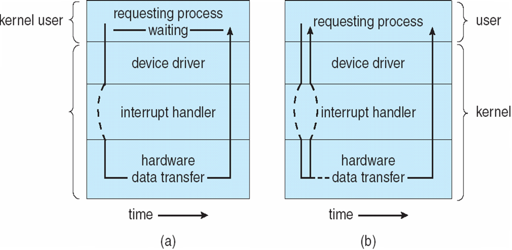

===
OSC
===

.. raw:: html

   <!-- more -->

-  `如何学习操作系统 <#如何学习操作系统>`__

   -  `其它参考文章 <#其它参考文章>`__

-  `导论 <#导论>`__

   -  `中断 <#中断>`__
   -  `多处理器系统 <#多处理器系统>`__
   -  `进程 <#进程>`__
   -  `内存 <#内存>`__
   -  `IO子系统 <#io子系统>`__

-  `操作系统结构 <#操作系统结构>`__

   -  `操作系统服务 <#操作系统服务>`__
   -  `操作系统的设计与实现 <#操作系统的设计与实现>`__
   -  `实验 <#实验>`__

-  `进程 <#进程-1>`__

   -  `进程的概念 <#进程的概念>`__
   -  `进程调度 <#进程调度>`__
   -  `进程运行 <#进程运行>`__
   -  `进程间通信 <#进程间通信>`__

      -  `共享内存系统 <#共享内存系统>`__
      -  `消息传递系统 <#消息传递系统>`__

   -  `进程间通信的几种方式 <#进程间通信的几种方式>`__
   -  `进程间通信实例 <#进程间通信实例>`__
   -  `客户机/服务器通信 <#客户机服务器通信>`__

-  `多线程编程 <#多线程编程>`__

   -  `线程概念 <#线程概念>`__
   -  `多线程模型 <#多线程模型>`__
   -  `隐式多线程 <#隐式多线程>`__
   -  `协程 <#协程>`__

-  `进程调度 <#进程调度-1>`__

   -  `调度算法 <#调度算法>`__
   -  `线程调度 <#线程调度>`__
   -  `实时CPU调度 <#实时cpu调度>`__
   -  `完全公平调度CFS <#完全公平调度cfs>`__
   -  `调度算法评估 <#调度算法评估>`__

-  `同步 <#同步>`__

   -  `Perterson解决方案 <#perterson解决方案>`__
   -  `互斥锁 <#互斥锁>`__

      -  `自旋锁spin lock <#自旋锁spin-lock>`__
      -  `自旋锁和互斥锁比较 <#自旋锁和互斥锁比较>`__

   -  `信号量 <#信号量>`__

      -  `信号量的实现 <#信号量的实现>`__
      -  `死锁与饥饿 <#死锁与饥饿>`__

   -  `Linux同步 <#linux同步>`__
   -  `Projects <#projects>`__

-  `死锁 <#死锁>`__

   -  `死锁特征 <#死锁特征>`__
   -  `死锁预防 <#死锁预防>`__
   -  `死锁避免 <#死锁避免>`__
   -  `死锁恢复 <#死锁恢复>`__
   -  `Project <#project>`__

-  `内存管理策略 <#内存管理策略>`__

   -  `连续内存分配 <#连续内存分配>`__
   -  `分段 <#分段>`__
   -  `分页 <#分页>`__
   -  `页表结构 <#页表结构>`__

-  `虚拟内存管理 <#虚拟内存管理>`__

   -  `请求调页 <#请求调页>`__
   -  `写时复制 <#写时复制>`__
   -  `页面置换 <#页面置换>`__

      -  `页面置换算法 <#页面置换算法>`__
      -  `帧分配算法 <#帧分配算法>`__

-  `文件系统 <#文件系统>`__
-  `文件系统的实现 <#文件系统的实现>`__

   -  `文件系统结构 <#文件系统结构>`__
   -  `文件系统的实现 <#文件系统的实现-1>`__
   -  `虚拟文件系统 <#虚拟文件系统>`__
   -  `分配方法 <#分配方法>`__
   -  `空闲空间管理 <#空闲空间管理>`__
   -  `其它概念 <#其它概念>`__

-  `大容量存储结构 <#大容量存储结构>`__

   -  `物理结构 <#物理结构>`__
   -  `磁盘连接 <#磁盘连接>`__
   -  `磁盘调度 <#磁盘调度>`__
   -  `磁盘管理 <#磁盘管理>`__
   -  `Swap和RAID <#swap和raid>`__

-  `I/O系统 <#io系统>`__

   -  `设备控制器 <#设备控制器>`__
   -  `设备IO中断 <#设备io中断>`__
   -  `直接内存访问DMA <#直接内存访问dma>`__
   -  `零拷贝技术 <#零拷贝技术>`__
   -  `应用程序I/O接口 <#应用程序io接口>`__
   -  `内核I/O子系统 <#内核io子系统>`__
   -  `性能 <#性能>`__

-  `系统保护 <#系统保护>`__

   -  `保护机制 <#保护机制>`__
   -  `访问矩阵 <#访问矩阵>`__

-  `系统安全 <#系统安全>`__

   -  `程序威胁 <#程序威胁>`__
   -  `系统和网络的威胁 <#系统和网络的威胁>`__
   -  `加密 <#加密>`__

如何学习操作系统
================

-  操作系统概念：系统性的概念与论证更强。从内存管理起，后面几章的翻译非常垃圾。
-  现代操作系统：对于重要算法的介绍更为突出。（内容逻辑性不强,与OSC均为理论，且内容深度差不多。后续先学习实验性课程xv6）

`有没有好的操作系统的书 <https://www.zhihu.com/question/31863104>`__

1. 推荐\ `Operating Systems: Three Easy
   Pieces <https://pages.cs.wisc.edu/~remzi/OSTEP/>`__\ ：众多US高校的教材。\ `PDF <../bookss/OPERATING%20SYSTEMS%20Three%20Pieces.pdf>`__

2. 实践第一：\ `6.828
   实现xv6 <https://pdos.csail.mit.edu/6.S081/2020/>`__

   `知乎-MIT 6.828
   实现操作系统 <https://zhuanlan.zhihu.com/c_1273723917820215296>`__

其它参考文章
------------

`操作系统讲解 <https://mp.weixin.qq.com/s/gOY8M7JyjcnW8OtQdZ0W8A>`__

`CPU缓存-WikiPedia <https://www.wikiwand.com/zh-cn/CPU%E7%BC%93%E5%AD%98>`__
`Linux I/O 原理和 Zero-copy
技术 <https://zhuanlan.zhihu.com/p/308054212>`__

导论
====

   以内存为中心的视角来学习操作系统。关注计算机其它组成部分与内存的交互。

**操作系统**\ 是管理计算机硬件的程序。关注易用性和资源利用率。
包括一个或多个cpu和若干设备控制器，cpu与设备控制器可以并发执行，\ **通过总线竞争访问内存**\ ，因此需要内存控制器确保有序访问共享内存。

   工作原理

中断
----

现代操作系统是\ **中断驱动**\ 的，事件总是由中断或陷阱引起的。

**中断向量：**\ 保存各种设备的终端处理程序的地址，中断向量表位于低地址内存。系统只有少量预定义的中断。

-  硬件通过系统总线发送信号到CPU，以触发中断；
-  软件通过系统调用（也称为监督程序调用）以触发中断。

多处理器系统
------------

1.增加吞吐量；2.规模经济；2.增加可靠性：适度退化和容错。

1. **对称多处理系统（SMP）**\ ：每个处理器都参与完成操作系统的所有任务。所有处理器对等，无主从关系。

2. **非对称处理**\ （asysmmetric
   multiprocessing）:主处理器调度从处理器，并安排工作。

-  **多道程序设计**\ 通过安排作业（编码和数据）使得CPU总有一个执行作业，从而提高CPU利用率。
-  **分时系统**\ 作业切换频率很高，用户可以在程序运行时与其交互。
   嵌入式系统一般都是\ **实时系统**\ （任务必须在时间约束内完成）。

**虚拟内存**\ 允许用户可执行比物理内存大的程序。

**双重模式：**\ 用户模式和内核模式（监视模式、系统模式、特权模式）。特权指令只能在内核模式运行，以便防止操作系统和用户程序受到错误用户程序的影响。

1. 内核态：处于内核态的 CPU
   可以访问任意的数据，包括外围设备，比如网卡、硬盘等，处于内核态的 CPU
   可以从一个程序切换到另外一个程序，并且占用 CPU
   不会发生抢占情况，一般处于特权级 0 的状态我们称之为内核态。

2. 用户态：处于用户态的 CPU
   只能受限的访问内存，并且不允许访问外围设备，可抢占。
   **定时器：**\ 在指定周期后中断计算机。当定时器中断时，控制自动转到操作系统。而操作系统可以将中断作为致命错误来处理，可以防止用户程序运行过长。

--------------

进程
----

程序是个被动实体，如同存储在磁盘上的文件内容，而进程是个主动实体。每个线程有一个程序计数器，指定了下一个所要执行的指令。
进程是操作系统的基本工作单元。

**进程管理**\ 的内容：

-  在CPU上\ **调度**\ 进程和线程；

-  **创建和删除**\ 用户进程和系统进程；

-  **挂起和重启**\ 进程；

-  提供进程\ **同步**\ 机制；

-  提供进程\ **通信**\ 机制。

内存
----

**内存**\ 一般是CPU所能直接寻址和访问的、唯一的、大容量存储器。通常是易失性存储。如果一个程序要执行，那么它就要映射到绝对地址，并且加载到内存。

固态硬盘：DRAM+磁盘+备份电源。
**引导程序**\ 一般位于固件，如ROM或EEOROM（Electrically Erasable
Programable Read-Only Memory)。

CPU只能从内存中加载指令，因此执行程序必须位于内存中。大多数程序都保存在磁盘上，需要运行时才加载到可读内存，一般为\ **动态随机访问内存（DRAM）**\ 。
操作系统对存储设备的物理性质进行了抽象，并定义了逻辑存储单元，即\ **文件**\ 。操作系统映射文件到物理媒介，并通过存储设备来访问文件。

**高速缓存**\ 是计算机系统的一项重要原理。信息通常保存在一个存储系统中（如内存），使用时，它会被临时复制到更快的存储系统，即高速缓存；当需要特定信息时，首先检查它是否处于高速缓存，如果是，可以直接使用高速缓存的信息，如果否，就使用位于源地的信息，同时将其复制到高速缓存以便下次再用。慎重选择高速缓存的大小和置换策略可以极大地提高性能。

IO子系统
--------

操作系统的大部分代码用于I/O管理。

设备控制器：在所控制的外围设备和本地缓冲存储之间进行数据传递，\ **设备驱动程序**\ 为操作系统的其他部分提供统一的设备访问接口。设备驱动程序写设备控制器的适当寄存器来进行IO。I/O子系统为操作系统本身隐藏了I/O设备的特性。

组件：

-  缓冲、高速缓存和假脱机的内存管理组件；

-  设备驱动器的通用接口；

-  特定硬件设备的的驱动程序。

内核常用数据结构：链表、队列、堆栈、树、哈希、位图。

操作系统结构
============

操作系统服务
------------

|操作系统服务| 用户界面：图形用户界面、命令行和批处理；
程序执行；I/O操作；文件系统操作；通信；错误检测；资源分配；记账；保护和安全。

用户与操作系统的界面：命令解释程序；图形用户界面；系统调用。

系统调用提供操作系统服务接口。

**系统调用的类型**\ ：进程控制、文件管理、设备管理、信息维护、通信和保护。

操作系统的设计与实现
--------------------

-  设计目标：用户目标和系统目标。
-  重要原则：策略和机制的分离。机制决定如何做，策略决定做什么。
-  采用高级语言实现操作系统的优势：代码编写更快、更为紧凑、更容易理解和调试，更容易移植。

**操作系统的结构**\ ： -
简单结构：系统调用接口之下和物理硬件之上的所有部分为内核。性能优势：系统调用和内核通信的开销非常小。
- 分层结构：每层只能调用更底层的功能和服务。简化了构造和调试。 -
微内核：对内核进行模块化，删除不必要的部件，将这些部件当做系统级与用户级的程序来实现。其主要功能是为客户端程序和运行在用户空间中的各种服务提供通信。其优点是便于扩展操作系统。
-
模块：可加载的内核模块。内核提供核心服务，而其他服务可在内核运行时动态实现。主模块只有核心功能，并知道如何加载模块和如何让模块进行通信。Linux也可使用可加载内核模块，主要用于设备驱动和文件系统。

.. figure:: ../images/MicroKernelStructure.jpg
   :alt: MicroKernelStructure

   MicroKernelStructure

故障发生时，操作系统会将日志写入日志文件，并捕获进程内存（即核心转储，coredump）。

实验
----

. 内核模块 module_init()/module_exit():模块加载/移除到内核时的动作。
insmod/rmmod：加载、卸载模块。 dmeg:查看内核日志缓冲区。 Makefile:

::

   obj-m += simple.o
   all:
       make -C /lib/modules/$(shell uname -r)/build M=$(PWD) modules
   clean:
       make -C /lib/modules/$(shell uname -r)/build M=$(PWD) clean

模块源文件：

::

   #include <linux/init.h>
   #include <linux/module.h>
   #include <linux/kernel.h>

   /* This function is called when the module is loaded. */
   int simple_init(void)
   {
          printk(KERN_INFO "Loading Module\n");

          return 0;
   }

   /* This function is called when the module is removed. */
   void simple_exit(void) {
       printk(KERN_INFO "Removing Module\n");
   }

   /* Macros for registering module entry and exit points. */
   module_init( simple_init );
   module_exit( simple_exit );

   MODULE_LICENSE("GPL");
   MODULE_DESCRIPTION("Simple Module");
   MODULE_AUTHOR("SGG");

.. _进程-1:

进程
====

进程的概念
----------

**进程的内存结构** |进程的内存结构|

-  文本：程序代码。

-  堆栈：临时数据，如如函数参数、返回地址和局部变量，地址从大向小增长。

-  数据段：包括全局变量。

-  堆：进程运行时动态分配的内存。

**进程状态** **新的、就绪、运行、等待、终止**\ 。 |ProcessStatus|

**进程控制块（PCB）**\ ：也称为任务控制块。包含许多与特定进程相关的信息：

-  程序计数器：表示进程将要执行的下一个指令的地址。

-  CPU寄存器：包括累加寄存器、索引寄存器、堆栈寄存器、通用寄存器和其他条件码寄存器。

-  CPU调度信息：包括进程优先级、调度队列的指针和其他调度参数。

-  内存管理信息：包括基地址和界限地址寄存器的值、页表或段表。

-  记账信息：包括CPU时间、实际使用时间、时间期限、记账数据、作业或进程数量。

-  I/O状态信息：包括分配给进程的I/O设备列表和打开文件列表。

``<linux/sched.h>中task_struct来描述进程。``

   ProcessControlBlock.png

   进程调度队列

进程调度
--------

**多道程序设计**\ ：无论何时都有进程运行，从而最大化CPU利用率。
**分时系统**\ ：在进程之间快速切换CPU，以便用户在程序运行时能与其\ **交互**\ 。

**队列：**

1. 作业队列：包括系统内的所有进程。

2. 就绪队列：驻留在内存中的、就绪的、等待运行的进程。链表，其头结点有两个指针，用于指向列表的第一个和最后一PCB块；每个PCB还包含一个指向就绪队列的下一个PCB的指针。

3. 设备队列：等待特定的I/O设备的进程列表。

**调度程序：**

1. 长期调度程序（作业调度程序）：从缓冲池中选择进程，加到内存以便执行。

2. 短期调度程序（CPU调度程序）：从准备执行的进程中选择进程，并分配CPU。

3. 中期调度程序：将进程从内存中移出swap，从而降低多道程序度（即内存中的进程数量）。之后程序可被重新调入内存，并从中断处继续执行。

   进程调度队列图

进程可分为：I/O密集型进程和CPU密集型进程，分别对应短期调度和长期调度。

**上下文切换**\ ： 将 CPU
资源从一个进程分配给另一个进程的机制，一般为几毫秒。切换CPU到另外一个进程需要保存当前进程的状态和读入另外一个进程的状态。

进程运行
--------

每个新进程可以创建其他进程，从而形成\ **进程树**\ （pstree）。

新进程的执行：

-  父进程与子进程并发执行；

-  父进程等待，直到某个或全部子进程执行完。 新进程的地址空：

-  子进程是父进程的复制品（它具有与父进程相同的程序和数据）；、

-  子进程加载另外一个新的程序。

**Linux**

UNIX通过系统调用fork()创建的新进程的地址空间复制原来进程的地址空间。这种机制允许父进程与子进程轻松通信。
两个进程都继续执行系统调用fork()之后的命令,在系统调用fork()之后，有个进程调用exec()，以用新程序来取代进程的内存空间。

.. figure:: ../images/fork.jpg
   :alt: fork命令

   fork命令

**Windows**

Windows进程创建采用Windows
API函数\ **CreateProcess（）**\ ，类似于fork（），CreateProcess（）在进程创建时要求讲一个特定的程序加载到子进程的地址空间。

-  进程终止：通过系统调用exit()请求操作系统删除自身，进程终止。进程返回状态值到父进程（通过系统调用exit()实现），所有进程资源，如物理和虚拟内存、打开文件和I/O缓存区等，会由操作系统释放。
-  级联终止：不允许子进程在父进程已终止的情况下存在。
-  僵尸进程：进程已终止，但其父进程未调用exit（），故仍存在进程表中。
-  孤儿进程：其父进程没有调用wait（）就终止，以致子进程称为孤儿进程，UNIX下会被init收养。

进程间通信
----------

协作进程：信息共享、计算加速、模块化、方便。
进程间通信（IPC）的两种分类：

共享内存系统
~~~~~~~~~~~~

建立共享内存区域，并将其附加到自己的地址空间。
无界缓冲区：不限制缓冲区的大小。消费者可能不得不等待新的项，但生产者总能产生新项。
有界缓冲区：固定大小的缓冲区。缓冲区空则消费者必须等待；缓冲区满则生产者必须等待。
实现：生产者-消费者模型。采用一个循环数组和两个逻辑指针：in和out。in=out时缓冲区空。

消息传递系统
~~~~~~~~~~~~

对于交换较少数量的数据很有用，因为无需避免冲突；对于分布式系统，消息传递也易于实现。
逻辑实现链路和操作send()/receive()的几个方法：

-  直接或间接的通信

-  同步或异步的通信

-  自动或显式的缓冲

**直接通信**\ ：需要通信的每个进程必须明确指定通信的接受者或发送者。包括寻址的对称性和非对称性。
**间接通信**\ ：通过邮箱或端口来发送或接收消息。邮箱可以抽象成一个对象，进程可以向其中存放消息，也可删除消息。
消息传递可以是阻塞或非阻塞，也称为同步或异步。

-  阻塞发送：发送进程阻塞，直到消息有接受进程或邮箱所接收。

-  非阻塞发送：发送进程发送消息，并且恢复操作。

-  阻塞接收：接受进程阻塞，直到有消息可用。

-  非阻塞接收： 接受进程收到一个有效消息或空消息。

通信进程交换的消息缓冲总是驻留在临时队列中。队列实现有三种方法：

-  零容量：发送者阻塞；

-  有限容量：链路满则阻塞；

-  无限容量：发送者从不阻塞。

进程间通信的几种方式
--------------------

`参考blog另一篇文章 <http://webxp.ml/Summary2020/#%E8%BF%9B%E7%A8%8B%E9%97%B4%E9%80%9A%E4%BF%A1%E6%96%B9%E5%BC%8F>`__

1. 管道
   写入的数据在\ **内核缓存**\ 中。单向，先进先出。数据是无格式的流。
   匿名管道：是存在内存中的特殊文件。存在父子关系的进程间通信。
   命名管道（FIFO）：文件系统中一个类型为p的\ **设备文件**\ 。无亲缘关系的进程间。

2. 消息队列
   是保存在\ **内核的消息链表**\ 。有格式，用户可自定义消息体的数据类型。
   每次数据读取和写入均需经过用户态与内核态之间的拷贝。

3. 共享内存
   将进程的虚拟地址空间映射到同一\ **物理内存**\ 。无数据拷贝的开销。
   多线程竞争同个资源造成数据错乱的问题。

4. 信号量
   是一个\ **计数器**\ ，表示资源的个数。通过两个原子操作：P操作（-）和V操作（+）。
   互斥访问，保护共享资源。确保任何时刻只有一个进程访问共享资源。可用于线程间。
   1-互斥信号量；0-同步信号量。

5. 信号
   是进程间通信中唯一的异步通信机制。信号可以在应用进程和内核之间直接交互。
   硬件来源（如Ctrl+C）;软件来源（kill 命令）。

6. 网络通信
   网络IPC，不同计算机的进程相互通信。可以采用许多不同的网络协议进行通信，如TCP/IP协议栈。
   API：socket() 创建。bind() 关联套接字地址结构。close()
   释放分配的资源。listen、accept等。

   SocketPrograming

进程间通信实例
--------------

**POSIX共享内存**

POSIX共享内存的实现为内存映射文件。
shm_open()创建共享内存对象；ftruncate()配置对象大小；nmap()创建内存映射文件；调用函数sprintf()和向指针ptr写入格式化字符串；shm_unlink()移除共享内存段。

**Mach**

Mach的大多数通信都是通过消息实现的。系统调用也是通过消息实现的。
在创建一个任务时，也创建了两个特殊邮箱：内核邮箱和通知邮箱。内核使用内核邮箱与任务通信，将事件发生的通知发送到通知邮箱。
消息传递只需三个系统调用调用msg_send()向邮箱发送消息；调用msg_reveive()接收消息；远程过程调用（RPC）通过调用msg_rpc()执行，它发送消息并等待一个确切的来自发送者的返回消息。系统调用port_allocate()创建新邮箱，并为消息队列分配空间。

有向集合：某个任务声明的一组邮箱，他们可以组合起来作为单个邮箱用于任务目标。
消息系统的主要问题：双重消息复制导致性能更差。

**Windows**

Windows消息传递工具称为高级本地程序调用（ALPC）工具；它用于同一机器的两进程之间通信。类似于标准的远程程序调用（RPC）。
Windows采用端口对象，以便建立和维护两进程间的连接。
有两种类型的端口：连接端口和通信端口。 |高级本地程序调用ALPC|

客户机/服务器通信
-----------------

**套接字**
套接字为通信的端点。通过网络通信的每对进程需要使用一对套接字，即每个进程各有一个。每个套接字由一个IP地址和一个端口号组成。包括TCP/UDP。

**远程程序调用**\ RPC
RPC交换的数据消息具有明确结构。消息传到RPC服务，RPC服务监听远程系统的端口号；消息包含用于指定：执行函数的一个标识符以及传递给函数的一些参数。然后函数按要求来执行，而所有结果会通过另一个消息，传递回到请求者。
**RPC语义**\ 允许客户调用位于远程主机的过程，就如调用本地过程一样。通过客户端提供的存根，RPC系统隐藏通信细节。存根定位服务器端口，并封装参数；存根通过消息传递，向服务器发送一个消息。服务器的类似存根收到消息，并调用服务器过程。

**管道** 管道允许两个进程进行通信。
普通管道（匿名管道）：只能由创建进程所访问。父进程创建一个管道，并使用它来与其子进程进行通信。
命名管道：通信可以是双向的，并且父子关系不是必须的。

多线程编程
==========

线程概念
--------

CPU使用的一个基本单元。包括线程ID、程序计数器、寄存器组和堆栈。它与同一进程的其他线程共享代码段、数据段、和其他操作系统资源。
|单线程与多线程比较|

多线程编程优点：

-  响应性：部分阻塞或执行冗长操作是，仍可以继续执行；

-  资源共享：默认共享它们所属进程的内存和资源（进程通过共享内存和消息传递共享资源）。

-  经济：创建和切换线程开销小，而创建进程内存和分配资源非常昂贵。

-  可伸缩性：并行运行。

1. 并行性：并行系统可以同时执行多个任务。多核系统。

2. 并发性：并发系统支持多个任务，允许所有任务都取得进展。单核系统。

.. figure:: ../images/parallelism.png
   :alt: 并行性与并发性

   并行性与并发性

**多核编程**\ ： 挑战：识别任务、平衡、数据分割、数据依赖、测试与调试、
- 数据并行：将数据分布于多个计算核上，并在每个核上执行相同的操作。 -
任务并行：将任务（线程）分配到多个核，每个线程都执行一个独特的操作。

多线程模型
----------

两种不同的方法来提供线程支持：用户线程和内核线程。
**一对一模型**\ 映射每个用户线程到一个内核线程。
**多对多模型**\ 多路复用多个用户线程到同样数量或更少数量的内核线程。

**线程库** 线程库为程序员提供创建和管理线程的API。 - POSIX
Pthread可以提供用户级或内核级的库。 -
Windows线程库适用于Windows操作系统内核级线程库。 -
Java线程API允许线程在Java程序中直接创建和管理，通常采用宿主系统的线程库来实现。

隐式多线程
----------

将多线程的创建和管理交给编译器和运行时库来完成。

1. 线程池：在进程开始时创建一定数量的线程，并加到池中以等待工作。

2. 使用现有的线程比创建线程快；

3. 可限制可用线程的数量；

4. 将任务创建与执行分离，可采用不同策略运行任务。

5. OpenMP:一组编译指令和API，用于编写C、C++、Fortran等语言的程序，支持共享内存下的并行编程。OpenMP识别并行区域。

6. 大中央调度（GCD）：适用于Mac
   OS和IOS操作系统。每块为一个独立单元，将块放置在调度对了上，GCD电镀块以便执行。

协程
----

在线程的基础之上通过分时复用的方式运行多个子任务。
与异步IO结合用于IO密集型任务。

**其它内容**

1. 系统调用fork（）和exec（）；

2. 信号处理：信号用于通知某个特定事件已经发生（UNIX中传递信号的标准函数为kill）；

3. 线程撤销：在线程完成之前终止线程；异步撤销（可能不会释放系统资源）和延迟撤销；

4. 线程本地存储（TLS）：每个线程独有的数据；

5. 调度器激活：用户线程与内核线程之间的一种通信方案。内核提供一组虚拟处理器（LWP）给应用程序，应用程序可以调度用户线程到任何一个可用LWP。此外，内核应将有关特定事件通知应用程序。

**Windows线程**
其线程一般包括：线程ID、寄存器组、用户堆栈、私有存储区域、
线程的主要数据结构包括：

-  ETHREAD：执行线程块

-  KTHREAD：内核线程块

-  TEB：线程环境块 |Windows线程数据结构| \**\*

.. _进程调度-1:

进程调度
========

CPU调度的任务是从就绪队列中选择一个等待进程，并为其分配CPU。
CPU-I/O执行周期：进程执行包括周期进行CPU执行和I/O等待。

I/O密集型程序：大量短的CPU执行。 CPU密集型程序：少量长的CPU执行。

抢占调度：能够在进程在就绪状态时进行调度；非抢占调度：进程一直使用，直到终止或切换到等待状态。
**调度程序**\ 是一个模块，用来将CPU控制交给有短期调度程序选择的进程。功能包括：切换上下文；切换到用户模式；跳转到用户程序的合适位置以便重新启动。

**调度算法的评价准则**\ ：CPU使用率、吞吐量、周转时间、等待时间、响应时间。

调度算法
--------

`linux的调度算法 <https://man7.org/linux/man-pages/man7/sched.7.html>`__

1. 先到先服务FCFS：先请求CPU的进程首先分配到CPU。可以通过FIFO队列实现。非抢占。

2. 最短作业优先SJF：最短下次CPU执行。常用于长期调度。是最优的，平均等待时间最小。抢占或非抢占。

3. 优先级调度：主要问题是无穷阻塞或饥饿。阻塞：就绪但是等待CPU。解决方案：老化，即逐渐增加在系统中等待时间很长的进程的优先级。

4. 轮转调度RR：专门为分时系统设计。类似于FCFS但是增加了抢占以切换进程。CPU调度程序循环整个就绪队列，为每个进程分配不超过一个时间片的CPU。

5. 多级队列调度：将就绪队列分为多个单独队列，每个队列有自己的调度算法，队列之间采用固定优先级抢占调度。

6. 多级反馈队列调度：允许进程在队列之间迁移。将I/O密集型和交互进程放在更高优先级队列，等待过长的进程会被迁移到更高优先级队列。最通用的、最复杂的。

线程调度
--------

内核级线程由内核调度，用户级线程由线程库管理（用户级线程需要映射到对应的内核级线程才能在cpu运行）。
- 用户级线程调度PSC：进程竞争范围，竞争cpu发生在同一进程的线程之间。 -
内核级线程调度CSC：系统竞争范围，发生在系统所有线程之间。

**多处理器调度** 对称多处理与非对称多处理。
处理器亲和性：由于缓存的无效后重新填充的代价高，大多数SMP系统试图避免将进程从一个处理器移到另一处理器。
负载均衡：试图将负载平均分配到SMP系统的所有处理器。

**多核处理器** 处理器的多线程有多种方法：粗粒度和细粒度的线程。
粗粒度的线程，线程一直在处理器上执行，直到一个长延迟事件发生（如内存停顿）。
细粒度的多线程在更细粒度的级别上（通常为指令周期的边界上）切换线程。细粒度系统的架构设计有线程切换的逻辑，其切换成本小。

实时CPU调度
-----------

软实时系统：不保证会调度关键实时进程；而只保证这类进程会优先于非关键进程。
硬实时系统：一个任务应在它的截止期限之前完成；在截止期限之后完成，与没有完成是一样的。

1. 最小化延时调度 时间延迟：从事件发生到事件得到服务大的这段时间。
   中断延迟：从CPU收到中断到中断处理程序开始的时间。要求中断禁用的时间非常短。
   调度延迟：调度程序从停止一个进程到启动另一个进程所需的时间量。提供抢占式内核以降低调度延迟。
   |调度延迟|

2. **单调速率调度**
   采用抢占的、静态优先的策略，调度周期性任务。优先级与其周期成反比。可以认为是最优的，如果一组进程不能由此算法调度，它不能由任何其他分配静态优先级的算法来调度。不能保证满足截止期限。

3. **最早截止期限优先调度**\ EDF
   根据截止期限动态分配优先级。截止期限最早，优先级最高。理论上最佳，他可以调度进程，使得每个进程都可以满足截止期限的要求并且将CPU的利用率会是100%。EDF调度不要求周期性进程，要求进程在变成可运行时，应宣布它的截止期限。

4. **比例分享调度**\ ：将处理器时间划分为股份，并为每一个进程分配一定数量的份额。采取准入控制策略。

完全公平调度CFS
---------------

linux内核实现两个调度类：实时调度类（sched_fifo、sched_rr等）和默认调度类（CFS）。
CFS：基于vruntime(与nice
value相关)，优先运行vruntime小的线程，实现运行时间公平。

调度算法评估
------------

-  确定性模型：采用特定的预先确定的负荷，计算在给定负荷下每个算法的性能。
-  排队模型：已知到达率和服务率，可以计算使用率、平均队列长度、平均等待时间等。
-  仿真：仿真程序由一个代表时钟的变量；随着这个变量值的增加，模拟程序修改系统状态以便反应设备、进程和调度程序的活动。随着仿真的运行，表明算法性能的统计数据被收集并打印。
-  评估调度算法的唯一可靠技术是在实际系统上实现算法，并在实际环境中监视性能。

同步
====

竞争条件：多个进程并发访问和操作同一数据，并且执行结果与特定访问顺序有关。
每个进程有一段代码，称为\ **临界区**\ ，进程在执行该区时可能修改公共变量、更新一个表、写一个文件等。
临界区：禁止一个或多个进程在同一时刻对共享资源（包括共享内存、共享文件等）进行读写。

临界区问题的解决方案应满足：\ **互斥、进步、有限等待。**

Perterson解决方案
-----------------

适用于两个进程交错执行临界区和剩余区。共享变量turn表示哪个变量可进入；flag[i/j]表示哪个进程想进入。

::

   do { 
       flag[i] = true; 
       turn = j; 
       while (flag[j] && turn == j); 
           critical section 
       flag[i] = false; 
           remainder section 
   } while (true); 

**硬件同步**\ ：可使用特殊硬件指令，禁止中断（单处理器）、原子指令。

互斥锁
------

进程进入临界区的时候得到锁，退出临界区的时候释放锁。

::

   while (!available) 
       ; /* busy wait */ 
   available = false;; 
   } 
   release() { 
   available = true; 
   } 

   do { 
   acquire lock
       critical section
   release lock 
       remainder section 
   } while (true); 

自旋锁spin lock
~~~~~~~~~~~~~~~

进程不停地旋转，以等待锁变得可用。当进程在等待锁时，无上下文切换。

1. spin
   lock是一种死等的锁机制。当前的执行thread会不断的重新尝试直到获取锁进入临界区。

2. 只允许一个thread进入。semaphore可以允许多个thread进入，spin
   lock一次只能有一个thread获取锁并进入临界区，其他的thread都是在不断的尝试。

3. 执行时间短。由于spin
   lock死等这种特性，因此它使用在那些代码不是非常复杂的临界区。

4. 可以在中断上下文执行。由于不睡眠，因此spin
   lock可以在中断上下文中适用。

`Linux内核同步机制之（四）：spin lock <http://www.wowotech.net/kernel_synchronization/spinlock.html>`__

自旋锁和互斥锁比较
~~~~~~~~~~~~~~~~~~

1. 互斥锁加锁失败后，线程会释放 CPU ，给其他线程；

2. 自旋锁加锁失败后，线程会忙等待，直到它拿到锁；

`互斥锁、自旋锁、读写锁、悲观锁、乐观锁的应用场景 <https://www.cnblogs.com/xiaolincoding/p/13675202.html>`__

信号量
------

功能类似于互斥锁。能提供更为高级的方法，以便进程能够同步活动。信号量S是一个整型变量，只能通过两个标准原子操作：wait()和signal()。

::

   wait (S) { 
       while (S <= 0)
       ; // busy wait
       S--;
   }

   signal (S) { 
       S++;
   }

信号量的实现
~~~~~~~~~~~~

当wait()发现信号量值不为正时，阻塞自己-将进程放入到与信号量相关的等待队列。signal()从等待进程链表上取走一个进程，并加以唤醒。可以克服忙等待。

::

   typedef struct{ 
       int value; 
       struct process *list; 
   } semaphore; 

   wait(semaphore *S) { 
       S->value--; 
       if (S->value < 0) {
           add this process to S->list; 
           block(); 
       } 
   }

   signal(semaphore *S) { 
       S->value++; 
       if (S->value <= 0) {
           remove a process P from S->list; 
           wakeup(P); 
       } 
   } 

死锁与饥饿
~~~~~~~~~~

两个或多个进程无限等待一个事件，而该事件只能由这些等待进程之一来产生。

**优先级反转问题:**
由于多进程共享资源，具有高优先级的进程被低优先级进程阻塞，反而使具有中优先级的进程（不需要共享资源）抢先执行。
**优先级继承协议**\ ：所有正在访问资源的进程获得需要访问它的更高优先级进程的优先级，直到用完相关资源。

1. **读者-作者问题**\ ：作者在写入数据库时需要共享数据库的独占访问权。

2. **哲学家就餐问题**\ ：大量并发控制问题。在多个进程之间分配资源，保证不出现死锁和饥饿。

**管程**\ ：确保每次只有一个进程在管程内处于活动状态。管程类型属于抽象数据类型ADT，提供一组由程序员定义的、在管程内互斥的操作。可防止时序出错。只有在管程内定义的函数才能访问其局部变量。C语言没有管程。

Linux同步
---------

linux内核是完全可抢占的，提供了互斥锁、自旋锁、禁用/启用内核抢占
等来保护临界区。

Projects
--------

主要涉及多线程编程。

1. 睡觉的助教

-  pthread_mutex_t：pthread_mutex_lock、pthread_mutex_unlock
-  semaphore:sem_post、sem_wait

thread_join()：主线程等待子线程的终止。子线程(joinable)调用了pthread_join()方法后面的代码，只有等到子线程结束了才能执行。

1. 哲学家就餐

-  pthread_cond_t:pthread_cond_wait(参数中的mutex是用于保护条件语句中的数据)、pthead_cond_signal

2. 生产者消费者为题

死锁
====

死锁特征
--------

死锁：进程所申请的资源（CPU时间、文件、IO设备等）被其它进程所占有，进程永远不能完成。
**必要条件：互斥、占有并等待、非抢占、循环等待。**

资源分配图：每个资源类型刚好只有一个实例，那么有环意味着已经出现死锁。每个资源类型由多个实例时，环是死锁存在的充分非必要条件。

`死锁：资源分配图和银行家算法 <https://www.cnblogs.com/lca1826/p/6627584.html>`__

死锁预防
--------

缺点：设备使用率低和系统吞吐量低。
预防死锁：确保至少有一个必要条件不成立。

-  互斥：共享资源必然存在互斥。

-  占有且等待：1）进程执行前申请并获得所有资源；2）允许进程仅在没有资源时才可申请资源。

-  非抢占：如果一个进程持有资源A并申请另一个不能立即分配的资源B，那么它现在分配的资源A都可被抢占(隐式释放资源)。通常用于状态可以保存和恢复的资源。

-  循环等待：对所有资源类型进行完全排序ABC，每个进程只能按递增顺序ABC申请资源。

死锁避免
--------

操作系统事先得到有关进程申请资源及每个进程将来申请和释放的资源。

-  安全序列：系统按照一定顺序为每个进程分配资源，能够避免死锁，那么系统的状态就是安全的。
-  资源分配图算法：对于每种资源类型只有一个实例。只有在进程P的所有边都为需求边时，才允许将需求边P→R增加到图中。对应的死锁检测算法为等待图。
-  银行家算法：每种资源由多个实例。

死锁恢复
--------

1. 进程终止：终止所有、一次终止一个。

2. 资源抢占：选择牺牲进程、回滚、饥饿问题。

Project
-------

      Todo :Java实现银行家算法 # 内存管理策略

内存是由一个很大的字节数组来注册，每个字节都有各自的地址。
CPU可以直接访问的通用存储只有内存和处理器内置的寄存器。
CPU内置寄存器的内容可以在一个CPU时钟周期内解释并执行一条或多条指令，内存的访问需要多个CPU时钟周期。

内存管理策略需要考虑的因素：硬件支持、性能、碎片、重定位、交换、共享、保护。

**逻辑地址**\ ：CPU生成的地址。逻辑地址+基地址寄存器的值=物理地址。
**物理地址**\ ：内存单元看到的地址（即加载到内存地址寄存器）的地址。
MMU：内存映射单元，从虚拟地址到物理地址的运行时映射。

**交换**\ ：进程可以暂时从内存交换到备份存储，当再次执行时再调回内存。交换有可能让所有进程的总物理地址空间超过真实系统的物理地址空间，从而增加了系统的多道程序度。

连续内存分配
------------

每一个进程位于一个连续的内存区域，与包含下一个进程的内存相连。

**内存保护：** 限定进程访问的地址范围。
重定位寄存器（基地址寄存器）含有最小的物理地址值；界限寄存器含有逻辑地址的范围值。
|重定位和界限寄存器|

**动态存储分配**\ ：首次适应； 最优适应； 最差适应。 -
外部碎片：总的可用内存之和可以满足请求但并不连续，其存储被分成了大量的小孔。解决方法：1）紧缩，移动内存内容；
2）允许进程的逻辑空间是不连续的。 -
内部碎片：进程所分配的内存比所需的要大。

分段
----

**段号+段偏移=逻辑地址**\ 。
将进程地址空间分成若干个大小不等的段，每段可以定义一组相对完整的逻辑信息。（ELF）

段表实际上是基址寄存器值和界限寄存器值的对的数组。

分页
----

分页是为了实现\ **非连续分配**\ 。不会产生外部碎片：每个空闲帧都可以分配给需要它的进程。

将物理内存分为固定大小的块，称为帧或页帧,而将逻辑内存也分为同样大小的块，称为页或页面。

分页本身是一种动态地重定位。每个逻辑地址由分页硬件绑定为某个物理地址。

**转换表缓冲区TLB**\ ：Translation Look-aside
Buffer,专用的、小的、查找快速的高速硬件缓冲，硬件功能。TLB是关联的高速内存。只包含少数的页表条目（键-值）。现代cpu可能有多级tlb,指令和数据tlb分开。

.. figure:: ../images/tlb.jpg
   :alt: 带TLB的分页硬件

   带TLB的分页硬件

-  内存保护：帧的保护位来定义权限。
-  共享页：共享可重入代码或纯代码。
-  可重入代码，即不能自我修改的代码，在执行期间不会改变。

页表结构
--------

1. 分层分页：向前映射表。两层分页法。分层会增加寻址内存访问次数。

2. | 哈希页表：大于32位的地址空间。每个条目为一个链表，链表=虚拟页码+映射的帧码+next
     指针。
   | 虚拟地址的虚拟页码哈希到哈希表，然后根据虚拟页码值在链表中查找项，得出帧码，帧码+偏移得到物理地址。

3. 倒置页表：对于每个真正的内存页或帧，倒置页表才会有一个条目。<pid,页码>在页表中找到匹配的条目i，<i,偏移>即可生成物理地址。

..

   x86-64架构：采用四级分页，支持48位虚拟地址。U
   采用的是\ ``内存分段 +  内存分页``\ 的管理方式，其中分页的意思是在由段式内存管理所映射而成的的地址上再加上一层地址映射。

   Cpu读取数据的过程

   段页式内存管理

虚拟内存管理
============

虚拟内存能能够将较大的逻辑地址空间映射到较小的物理内存。允许运行极大的进程，提高多道程度，提高CPU利用率。

虚拟内存允许多进程共享系统库和内存。

稀疏地址空间：方便堆、栈生长，动态链接库等。

请求调页
--------

除了页面置换和帧分配的主要问题之外，请求调页的正确设计还需要考虑：预先读取、页面大小、TLB范围、倒置页表、程序结构、I/O联锁和页面锁定等其他问题。

1. 处理缺页中断；

2. 读入页面；

3. 重新启动进程。

虚拟内存的实现通常采用按需分页，即请求调页，即仅在需要时才加载页面。

请求调页的关键要求是在缺页错误后重新启动指令的能力。

写时复制
--------

通过允许父进程与子进程最初共享相同的页面来工作。共享页面在要被写入时才创建副本（在预先准备的空闲的页面池中）。
fork()采用写时复制，vfork()不是，即vfork子进程执行时会使用父进程的地址空间。

页面置换
--------

没有空闲帧时，查找当前不在使用的一个帧，并释放它。
采用脏位/修改位来标识页，只需要调出已被修改的页，可减少IO。

**页面置换**\ 是请求调页的基础。它完成了逻辑内存和物理内存之间的分离。

页面置换算法
~~~~~~~~~~~~

这里的分类不完全。

1. FIFO页面置换：置换最老的页面。

2. 最优页面置换：置换最长时间不会使用的页面，需要引用串的未来知识。

3. LRU页面置换：最近最少使用算法。置换最长时间没有使用的页面。

   -  计数器：页面关联一个使用时间域，每次内存引用递增时钟。
   -  堆栈：页面被引用时则放到栈顶，故替换栈底的页面，可使用具有首尾指针的双向链表。
      只是用TLB无法实现这两种LRU。

4. 近似LRU页面置换/老化算法：采用引用位，通过检查引用位判断是否被使用。

   -  额外引用位算法：8位字节
   -  第二次机会算法：引用位为1位，时钟算法，采用循环队列实现。
   -  增强型第二次机会算法：引用位与修改位的有序对。

5. 基于计数的页面置换：最不经常使用LFU和最经常使用MFU。

6. 页面缓冲算法：保留一个空闲帧缓冲池。出现缺页错误时，选择一个牺牲帧；在写出牺牲帧之前，所需页面就读到来自缓冲池的空闲帧。可用于改进其它页面置换算法，降低因错误选择牺牲帧而引起的开销。

7. WSClock算法：\ `基于时钟和工作集算法 <https://www.cnblogs.com/cxuanBlog/p/13372092.html>`__\ 。

帧分配算法
~~~~~~~~~~

**帧分配**\ ：平均分配和比例分配。分配可以是固定的，此时采用局部页面置换算法；也可以是动态地，此时采用全局置换。
全局置换：从所有帧中选取置换帧，系统吞吐量更高。局部置换：从当前进程被分配的帧中选取。

**工作集模型**\ 假定进程执行的局部性。工作集是当前局部所有页面的集合。
如果一个进程没有足够的内存用于工作集，则会发生抖动（频繁调页）。为进程提供足够的内存以避免抖动，可能需要进程交换和调度。

**内存映射文件功能**\ 允许文件I/O作为常规内存访问。win32
API通过文件的内存映射来实现共享内存。

--------------

文件系统
========

操作系统将逻辑文件概念映射到物理设备。 文件系统：文件集合和目录结构。

-  顺序访问：文件信息按顺序加以处理。
-  直接访问：基于文件的磁盘模型，磁盘允许对任何文件块的随机访问。

多用户系统\ **单级目录**\ 导致命名问题，\ **两级目录**\ 通过为每个用户创建单独的目录以包括文件来解决这个问题。
**树形目录**\ 是两级目录的自然扩展，允许用户创建子目录。
**无环图**\ 目录允许共享子目录和文件，但是搜索和删除更为复杂。
**一般图结构**\ 允许在共享文件和目录时完全的灵活性，有时需要采用垃圾收集以恢复未使用的磁盘空间。

共享文件和目录的实现：

-  链接，实际上是另一文件或子目录的指针

-  复制，在两个共享目录中复制有关他们的所有信息；修改文件时需要保持一致性。

文件系统的实现
==============

文件系统结构
------------

   分层设计的文件系统

1. I/O控制层：包括设备驱动程序和中断处理程序，以在主内存和磁盘系统之间传输消息。

2. 基本文件系统：只需向适当的设备驱动程序发送通用指令，以读取和写入磁盘的物理块。

3. 文件组织模块：知道文件及其逻辑块以及物理块。

4. 逻辑文件系统：管理元数据信息。元数据包括文件系统的所有结果，而不包括实际数据。逻辑文件系统管理目录结构，以便根据给定文件名称为文件组织模块提供所需信息。

.. _文件系统的实现-1:

文件系统的实现
--------------

磁盘中的结构：

-  引导控制块：包括从该卷引导操作系统的所需信息。引导块或分区引导扇区。

-  卷控制块：包括卷或分区的详细信息，如分区的块的数量、块的大小、空闲块的数量和指针、空闲的FCB数量和FCB指针等。超级块或主控文件表。

-  目录结构:用于组织文件。

-  FCB：包括该文件的许多详细信息、有一个唯一标识号，以便于目录条目相关联。

文件系统包括的信息：

-  安装表：包含每个安装卷的有关信息。

-  目录结构的缓存：含有最近访问目录的信息。

-  整个系统的打开文件表：包括每个打开文件的FCB的副本。

-  每个进程的打开文件表：包括一个指向整个系统的打开文件表中的适当条目的指针，以及其他信息。

-  当对磁盘读出或写入时，缓冲区保存文件系统的块。

根分区，包括操作系统内核和其他系统文件，在启动时安装。

虚拟文件系统
------------

文件系统的实现由三个主要层组成。 |虚拟文件系统示意图|

1. 第一层为文件系统接口，基于open()、read()、write()和close()调用即文件描述符。

2. 第二层为虚拟文件系统层VFS。1) 文件系统的通用操作和实现分开。2)
   提供一种机制，以唯一表示网络上的文件。

3. 第三层实现文件系统类型或远程文件系统协议的层。

**目录实现** -
线性列表：采用文件名称和数据块指针的线性列表。查找文件需要线性搜索。 -
哈希表：根据文件名称获得一个值，并返回线性列表内的一个元素指针。

分配方法
--------

**连续分配**\ ：
每个文件在磁盘上占有一组连续的块。支持顺序访问和直接访问。
用于访问连续分配文件的所需寻道时间最小，在确实需要寻道时所需寻道时间也最小。
文件动态地增长和缩小时系统开销很大；文件创建时要求用户提供文件的大小；存储空间浪费较大
**链接分配**\ ：
每个文件是磁盘块的链表，磁盘块可能会散布在磁盘的任何地方。只能顺序访问。目录包括文件第一块和最后一块的指针。解决了连续分配的外部碎片和大小声明问题。
将多个块组成簇可减少指针所需的空间。指针丢失或损坏的可靠性，可采用双向链表。
文件分配表FAT是一个变种。 **索引分配**\ ：
将所有指针放到一起，即索引块。支持直接访问。UNIX的innode。
每个文件都有自己的索引块，这是一个磁盘块地址的指针。目录则包含索引块的地址。
索引表空间和文件索引时间开销大。

   Unix的innode

空闲空间管理
------------

空闲空间列表记录了所有空闲磁盘空间，当创建文件时，搜索空闲空间列表以得到所需空间数量并分配。
使用方法包括位向量和链表。优化方法包括组合、计数和FAT。
**位图或位向量：**\ 每块用一个位表示，0或1。
**链表:**\ 将所有空闲磁盘块用链表链接起来，将指向第一个空闲块的指针保存在磁盘的特殊位置上，并缓存在内存中。遍历列表时效率低。
**组**\ ：在第一个空闲块中存储n个空闲块的地址，最后一块包含另外n个空闲块的地址。
**计数：**\ 记录第一块的地址和紧跟第一块的连续空闲块的数量n。

其它概念
--------

磁盘空间的\ **使用效率**\ 取决于磁盘分配和目录算法。
**缓冲区缓存：**\ 按面向物理文件系统的块来缓存，假设其中的块将很快再次使用。
**页面缓存：**\ 采用虚拟内存技术，将文件按页面来缓存。与采用物理磁盘块来缓存相比更为高效。Solaris、Linux、Windows，采用页面缓存来缓存进程页面和文件数据，这称为统一虚拟内存。

目录管理程序常采用哈希表，快速且高效。

基于日志的面向事务的文件系统：所有元数据修改按顺序写到日志，系统调用返回用户程序，这些日志条目对真实文件系统条目进行重放。日志文件是个环形缓冲区。

NFS将一组互连的工作站视作一组具有独立文件系统的独立机器，允许透明（根据显示请求）共享这些文件系统。基于客户机-服务器关系。客户机的系统调用转换成网络协议，再转换成服务器的文件系统操作。

**文件系统中，日志结构和缓存等技术改善性能，而日志结构和RAID提高可靠性。**

--------------

大容量存储结构
==============

CPU不可直接读取次级存储装置。

物理结构
--------

**磁盘或硬盘：**\ 磁头附着在磁臂上，磁臂将所有磁头作为一个整体而移动。盘片表面逻辑地划分为圆形磁道，再细分为扇区。同一磁臂位置的磁道集合形成了柱面。
|磁盘的物理结构|

**定位时间（随机访问时间）**\ ：包括寻道时间（移动磁臂到所需柱面的所需时间）和旋转延迟（旋转磁臂到所需扇区的所需时间）。

I/O总线：包括硬盘接口技术（ATA）、串行ATA（SATA）、外部串行ATA（eSATA）、通用串口总线（USB）、光纤通道（FC）。

数据传输总线由称控制器来控制，包括主机控制器和磁盘控制器。

**固态硬盘SSD**
无磁头，更可靠；无寻道时间或延迟；电源消耗少。可直联系统总线（例如PCI）。
由于没有磁头，后续的磁盘算法很大程度上不适用。

现代磁盘驱动器的结构是一个大的一维的逻辑磁盘块的数组。一维逻辑数组依次映射到磁盘扇区。

磁盘连接
--------

-  主机连接存储：通过本地I/O端口来访问存储。IDE、ATA、SATA、FC、FC仲裁环路（FC-AL)。

-  网络连接存储NAS：通过远程过程调用RPC，如UNIX的NFS或Windows的CIFS，访问网络连接存储。RPC通过TCP/UDP来进行。消耗数据网络带宽，增加网络通信延迟。

-  存储区域网络SAN：采用存储协议连接服务器和存储单元。灵活性：多个主机和多个存储阵列可以连接到同一个SAN，存储可以动态分配到主机。

磁盘调度
--------

磁盘调度算法可以改善有效带宽、响应时间均值、响应时间偏差等。

-  FCFS：First Come First Service。

-  SSTF:最短寻道时间优先（选择最靠近当前磁头位置的请求），一种最短作业优先（SJF）调度。

-  SCAN调度：电梯算法，磁头连续来回扫描磁盘。磁臂从磁盘的一端开始向另一端移动并处理每个柱面请求，当到达磁盘的另一端时反转磁头移动方向。

-  C-SCAN：循环扫描，是SCAN的一个变种。当磁头到达另一端时，立即返回磁盘的开头。将柱面视作环链。

-  LOOK调度：磁臂只需移动到一个方向的最远请求为止（视为SCAN算法的优化）。包括LOOK和C-LOOK调度。

SSTF和LOOK是默认算法的合理选择。 -
固态硬盘无磁头，算法性能差异小，常使用FCFS策略。

磁盘管理
--------

**格式化**\ ： -
**低级格式化或物理格式化：**\ 划分扇区，为每个扇区使用特殊的数据结构，填充磁盘，每个扇区的数据结构由头部、数据区域和尾部组成。头部和尾部包含了一些磁盘控制器的实用新型，如扇区号和纠错代码。
-
**高级格式化或逻辑格式化：**\ 重写主引导区的分区表、将初始文件系统数据结构存储到磁盘上。
**引导块**
自举程序bootstrap：位于只读存储器ROM。初始化系统的所有部分，从CPU寄存器到设备控制器和内存，接着启动操作系统。

以Windows为例：引导首先运行驻留在系统ROM内存中的代码，从MBR中读取引导代码，找到引导分区，读取分区的第一个扇区（引导扇区）并继续加载各种子系统和系统服务。
|Windows的磁盘引导|

   Linux 启动

**坏块处理**\ ：扇区备用、扇区转寄、扇区滑动。

Swap和RAID
----------

**交换空间管理**
交换空间的位置有两个：普通文件系统或专用的原始磁盘分区。
系统通常绕过文件系统，使用原始磁盘来进行调页I/O访问。

**RAID结构** 磁盘冗余阵列RAID技术： - 通过冗余提高可靠性。 -
通过并行提高性能。

位级分条：将每个字节分散在多个磁盘上。
块及分条：文件的块分散在多个磁盘上。

   RAID的级别

`基本RAID级别介绍 <https://zh.wikipedia.org/wiki/RAID>`__

--------------

I/O系统
=======

I/O设备的基本要素：总线、设备控制器和设备本身。

**总线：**\ 是一组线路和通过线路传输信息的严格定义的一个协议。消息是通过施加线路的具有一定时序的电压模式来传递的。

   PC总线结构

SCSI：小型计算机系统接口。

时钟：常可编程时钟由\ ``晶体振荡器->计数器->寄存器``\ 组成。维护时间，防止进程占用cpu过长。

设备控制器
----------

操作端口、总线或设备的一组电子器件。
I/O端口通常由四个寄存器组成，即状态寄存器、控制寄存器、数据输入寄存器和数据输出寄存器。

1. 数据输入寄存器被主机读出以获得数据。

2. 数据输出寄存器被主机写入以发送数据。

3. 状态寄存器包含一些主机可以读取的位，例如当前命令是否完成、数据输入寄存器中是否由数据可以读取、是否出现设备故障等。

4. 控制寄存器可由主机写入，以便启动命令或更改设备模式。

   DeviceController

设备控制器主要分为两种：字符设备和块设备

设备控制器的主要功能有下面这些 - 接收和识别命令：设备控制器可以接受来自
CPU 的指令，并进行识别。设备控制器内部也会有寄存器，用来存放指令和参数 -
进行数据交换：CPU、控制器和设备之间会进行数据的交换，CPU
通过总线把指令发送给控制器，或从控制器中并行地读出数据；控制器将数据写入指定设备。
-
地址识别：每个硬件设备都有自己的地址，设备控制器能够识别这些不同的地址，来达到控制硬件的目的，此外，为使
CPU 能向寄存器中写入或者读取数据，这些寄存器都应具有唯一的地址。 -
差错检测：设备控制器还具有对设备传递过来的数据进行检测的功能。

-  **轮询**\ ：采用2个位协调控制器与主机之间的生产者与消费者关系。主机通过命令寄存器的命令就绪位来表示意愿。主机置就绪位，忙等待直到忙位被清楚。可能产生低效问题。
-  **中断**\ ：让设备通知CPU的硬件机制。

设备IO中断
----------

设备控制器通过中断请求线发送信号而引起中断，CPU捕获中断并且分派到中断处理程序，中断处理程序通过处理设备来清除中断。中断处理程序确定中断原因，执行必要处理，执行状态恢复，并执行返回终端指令以便CPU回到中断前的执行状态。

.. figure:: ../images/interrupt.jpg
   :alt: 基本中断处理机制

   基本中断处理机制

   InterrupHandler

..

   参考\ `ARM System Developer’s Guide Designing and Optimizing System
   Software <../books/ARM_System_Developers_Guide-Designing_and_Optimizing_System_Software.pdf>`__

-  非屏蔽中断：保留用于诸如不可恢复的内存错误等事件。
-  可屏蔽中断：在执行不得中断的关键指令序列之前，可由CPU关闭。
-  中断向量：包含专门的中断处理程序的内存地址。目的是，单个中断处理不在需要搜索所有可能中断源。设备多余中断向量数量时可采用中断链技术。

中断机制可以用于内存调页，系统调用，管理内核的控制流等。

直接内存访问DMA
---------------

**程序控制I/O（PIO）：**\ 通过通用处理器来观察状态位并按字节来发送数据到控制器寄存器。

**直接内存访问（DMA）：**\ 避免PIO增加CPU负担,按块传输。主机将DMA命令块写到内存，CPU将命令块的地址写到DMA控制器，DMA控制器直接操作内存总线，将地址放到总线，在没有CPU的帮助的情况下执行传输。

提高了CPU和设备的并行度。

DMA控制器和设备控制器之间的握手通过一对称为DMA请求和DMA确认的线路来进行。DMA占用内存总线时，cpu无法访问内存。

.. figure:: ../images/dma.png
   :alt: DMA传输的步骤

   DMA传输的步骤

零拷贝技术
----------

计算机执行操作时，CPU不需要先将数据从某处内存复制到另一个特定区域。常用于通过网络传输文件时节省
CPU 周期和内存带宽。 由于PageCache的原因，小文件采用Zero
Copy技术，而大文件会用异步IO。

1. 减少甚至完全避免操作系统内核和用户应用程序\ **地址空间**\ 这两者之间进行数据拷贝操作，从而减少用户态
   – 内核态上下文切换带来的系统开销。

2. 减少甚至完全避免操作系统内核和用户程序\ **缓冲区**\ 之间进行数据拷贝操作。

3. 帮助用户进程绕开操作系统内核空间直接访问\ **硬件**\ 存储接口操作数据。

4. 利用 DMA 而非 CPU 来完成硬件接口和内核缓冲区之间的数据拷贝，从而解放
   CPU。

原始的读写方法：4次用户态跟内核态的切换。2次DMA数据拷贝，2次CPU数据拷贝。
实现方法：

1. mmap+write:把内核缓冲区里的数据映射到用户空间。减少一次cpu数据拷贝。

2. sendfile:把内核缓冲区里的数据拷贝到 socket 缓冲区。sendfile = read +
   write。减少一次cpu数据拷贝和2次用户态跟内核态切换。

3. SG-DMA 技术:直接将内核缓存中的数据拷贝到网卡的缓冲区。

|原始的读写方法| |mmap| |sendfile| |SG_DMA|

应用程序I/O接口
---------------

设备驱动程序层：为内核I/O子系统隐藏设备控制器之间的差异；就如同I/O系统调用封装设备的行为。

内核I/O结构 |内核I/O结构|

I/O设备的特点 |I/O设备的特点|

**块与字符设备** -
块设备接口：磁盘驱动器等块设备。read()、write()、seek()。 -
字符流接口：如键盘。应用程序无法预计这些输入。get()/put()。 -
网络设备：套接字接口。select()。

**非阻塞与异步I/O** 阻塞系统调用：程序被挂起，直到调用完成。
异步系统调用可替代非阻塞系统调用。

   两种I/O方法

**向量I/O**\ ：允许系统调用执行涉及多个位置的多个I/O操作。

内核I/O子系统
-------------

-  I/O调度：IO请求队列与设备状态表。

-  缓冲：一块内存区域，用于保存在两个设备之间或在设备和应用程序之间传输的数据。

   -  处理数据流的生产者与消费者之间\ **速度的不匹配**\ ；双缓冲解耦数据的生产者和消费者，放松两者之间的时序要求。
   -  协调传输\ **大小不一**\ 数据的设备；可用于消息的分段和重组；
   -  支持应用程序I/O的复制语义。

-  缓存：保存数据副本的高速内存区域。

   -  缓冲可以保存数据项的唯一版本
   -  缓存只保存了一个数据项的更快存储副本。

-  假脱机：假脱机是保存设备输出的缓冲区，假脱机系统将保存在缓冲区的假脱机文件依次复制到输出设备。

-  错误处理：I/O系统调用返回1bit的调用状态信息以表示成功或失败。UNIX系统使用errno错误代码。

-  I/O保护：定义所有I/O指令为特权指令，防止用户执行非法I/O；保护任何内存映射和I/O端口内存位置以便阻止用户访问。

   I/O请求的生命周期

**流**\ ：可读写的字节序列。全双工，异步。ioctl()、write()/putmsg()。

性能
----

物理设备和应用程序之间存在多个软件层，I/O系统调用消耗的CPU周期较多：穿过内核保护边界的上下文切换、I/O设备的信号和中断处理、内核缓冲和应用程序空间之间的数据复制所需的CPU和内存系统的负载。

.. figure:: ../images/intercomputer.jpg
   :alt: 计算计之间的通信

   计算计之间的通信

系统保护
========

保护机制
--------

通过限制程序、进程或用户程序访问计算机系统的资源。防止用户有意地、恶意地违反访问限制；确保系统的活动程序组件按照规定策略来使用系统资源。

**保护原则**\ ：最低特权原则，规定程序、用户甚至系统只拥有刚好能执行任务的权限。

**对象：**\ 硬件（如内存、CPU时间、I/O设备），软件（如文件、程序、信号量）。

**保护域**
域是访问权限的集合。进程在域中执行，可以采用域内的任何访问权限来访问或操作对象。

访问矩阵
--------

访问矩阵，行表示域，列表示对象。 |访问矩阵|

-  switch切换：切换进程从一个域到另一个域。

-  copy复制：复制访问矩阵的一个域的访问权限到另外一个。

-  owner所有者：增加新权限和取消某些权限。

-  control控制：修改行内的条目。
   复制与所有者权限允许进程修改列内的条目。

**访问矩阵的实现**
访问矩阵是稀疏的。采用对象关联的访问列表或域关联的能力列表。
通过将域和访问矩阵本身视为对象，访问矩阵模型可以包括动态保护。

实际系统比通用模型具有更多限制，并倾向于仅为文件提供保护。UNIX是一个代表。

系统安全
========

保护是一个内部问题，而安全是针对计算机外部。
安全机制确保系统用户的身份认证，保护系统的物理资源和存储信息（包括数据和代码）的完整性。
安全系统防止未授权的访问、数据的恶意破坏或更改以及不一致的意外引入等。

安全问题：

1. 违反机密：未经授权的数据读取；

2. 违反诚信：未经授权的数据修改；

3. 违反可用：未经授权的数据破坏；

4. 盗窃服务：未经授权的资源使用；

5. 拒绝服务：阻止系统的合法使用，Dos。

伪装、重播攻击、消息篡改、中间人攻击、会话劫持。

四个层次的安全措施：物理、人员、操作系统、网络。

程序威胁
--------

-  特洛伊木马：服务端和客户端组成，向指定目的发送用户信息。变体包括模拟登录程序、间谍软件。

-  后门：程序或系统设计人员留下的只有他自己才能使用的软件漏洞。

-  逻辑炸弹：当满足预先定义的一组参数时，就会创建安全漏洞。

-  堆栈和缓冲区溢出：允许成功的攻击者改变系统访问的级别。

-  病毒：嵌在合法程序中的代码片段。可自我复制，旨在感染其他程序。

   -  文件病毒：追加自身到文件。
   -  引导病毒：感染系统的引导扇区，它执行在系统引导时，在操作系统之前。
   -  宏病毒、源代码病毒、多态病毒、加密病毒、隐性病毒、隧道病毒、复合病毒、装甲病毒等

系统和网络的威胁
----------------

-  蠕虫：包括抓钩（引导、向量）和主程序。大量复制和传播，耗尽系统资源。

-  端口扫描：检测漏洞的方法。

-  拒绝服务：破坏系统或设施的合法使用。其通常是基于网络的。占用非常多的设施资源或破坏网络设施，使系统无法提供正常服务。第二类攻击设计破坏网络设施。拒绝服务攻击不可能完全防止。DDos——分布式拒绝服务攻击。

加密
----

加密限制数据接收者的域，认证限制数据发送者的域。

-  对称加密：共享秘钥。数据加密标准DES、高级加密标准AES、流加密（RC4）。
-  非对称加密：提供公钥和私钥。仅用于加密少量数据，用于认证、保密和秘钥的分发。
-  认证结合哈希：证明数据没有被更改。

认证算法：

-  消息认证码：采用对称加密

-  数字签名算法：采用非对称加密

网络层安全标准IPSec，定义了IP包格式。IPSec使用对称加密。SSL在传输层提供安全。

**用户认证**
用于识别系统的合法用户。标准的用户名和密码保护，一次性密码、双重因素认证、多重因素认证。

预防或检测安全事故：入侵检测系统、防病毒软件、系统事件的审计和记录、系统软件更改的监控、系统调用监控和防火墙。

   Windows结构图

.. |进程的内存结构| image:: ../images/processinmemory.png

.. |单线程与多线程比较| image:: ../images/ResourcesOfThread&Process.png
.. |Windows线程数据结构| image:: ../images/threaddata.jpg

.. |Windows的磁盘引导| image:: ../images/boot.jpg

.. |内核I/O结构| image:: ../images/KernalIO.jpg

.. |访问矩阵| image:: ../images/matrix.jpg
