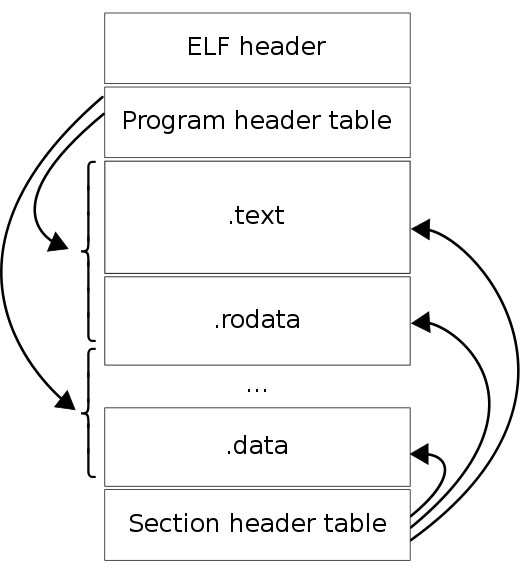

===============
makefile
===============

:Date:   2020-07-15 22:45:43

参考链接
===========

1. `跟我一起写Makefile <https://wiki.ubuntu.org.cn/%E8%B7%9F%E6%88%91%E4%B8%80%E8%B5%B7%E5%86%99Makefile>`__
2. `gnu make manual <https://www.gnu.org/software/make/manual/make.html>`__
3. `make tutor <https://www.cs.colby.edu/maxwell/courses/tutorials/maketutor/>`__
4. `Cmake入门实践 <https://www.hahack.com/codes/cmake/>`__

GCC编译过程
===========

`gcc onlinedocs <https://gcc.gnu.org/onlinedocs/gcc/>`__

-  ``-I``\ ：头文件目录。
-  ``-B``\ ：可执行文件目录。
-  ``-L``\ ：specifies where to find the executables, libraries, include
   files, and data files of the compiler itself。

预处理汇编编译链接
------------------

1. 预处理：gcc -E :cpp
2. 编译：gcc -S ：cc1
3. 汇编：gcc -c/as :cc
4. 链接：ld。包括静态/动态库的生成，然后再gcc链接。

   1. 生成静态库的方法： ar cr libxxx.a file1.o file2.o
      使用的时候 gcc test.c -L/path -lxxx -o test
   2. 动态库： gcc -fPIC -shared file1.c -o libxxx.so

centos更换gcc
--------------
::

      1、安装centos-release-scl

      sudo yum install centos-release-scl
      2、安装devtoolset，注意，如果想安装7.*版本的，就改成devtoolset-7-gcc*，以此类推

      sudo yum install devtoolset-8-gcc*
      3、激活对应的devtoolset，所以你可以一次安装多个版本的devtoolset，需要的时候用下面这条命令切换到对应的版本

      scl enable devtoolset-8 bash

      所以要想切换到某个版本，只需要执行

      source /opt/rh/devtoolset-8/enable

      4、直接替换旧的gcc

      mv /usr/bin/gcc /usr/bin/gcc-4.8.5

      ln -s /opt/rh/devtoolset-8/root/bin/gcc /usr/bin/gcc

      mv /usr/bin/g++ /usr/bin/g++-4.8.5

      ln -s /opt/rh/devtoolset-8/root/bin/g++ /usr/bin/g++

      gcc --version

      g++ --version

Makefile简介
============

make的工作流程
--------------

GNU的make工作时的执行步骤如下：（其它的make也是类似）

1. 读入所有的Makefile(顺序：GNUmakefile->makefile->Makefile)。
2. 读入被include的其它makefile，重建makefile。
3. 初始化文件中的变量，展开部分变量和函数。
4. 推导隐晦规则，并分析所有规则。
5. 为所有的目标文件创建依赖关系链。
6. 根据依赖关系和时间戳，决定哪些目标要重新生成。
7. 执行生成命令。

1-5步为第一个阶段，6-7为第二个阶段。

如果变量出现在依赖关系的规则中，变量才会在其内部展开。

经典示例
--------

::

   IDIR =../include
   CC=gcc
   CFLAGS=-I$(IDIR)

   ODIR=obj
   LDIR =../lib

   LIBS=-lm

   _DEPS = hellomake.h
   DEPS = $(patsubst %,$(IDIR)/%,$(_DEPS))

   _OBJ = hellomake.o hellofunc.o 
   OBJ = $(patsubst %,$(ODIR)/%,$(_OBJ))

   $(ODIR)/%.o: %.c $(DEPS)
       $(CC) -c -o $@ $< $(CFLAGS)

   hellomake: $(OBJ)
       $(CC) -o $@ $^ $(CFLAGS) $(LIBS)

   .PHONY: clean

   clean:
       rm -f $(ODIR)/*.o *~ core $(INCDIR)/*~

常用命令
--------

-  ``-f``:指定执行的makefile文件。
-  ``-C``:指定执行文件所在目录
-  ``-rm``:忽略执行过程中的错误
-  ``@``:关闭回显
-  ``-n``\ 、\ ``--just-print``\ 、\ ``--dry-run``\ 、\ ``--recon``:只打印，不执行。
-  ``-t``\ 、\ ``--touch``:把目标文件的时间更新。
-  ``-q``\ 、\ ``--question``:找目标,目标不存在则打印错误信息。
-  ``-s/--silent``:全面禁止命令的显示。
-  ``;``\ 分号:用分号分隔两个命令,前一个命令的令。两行命令可认为是在两个不同的shell中执行。

伪目标
------

::

   .PHONY:clean
   clean:
       rm *.o temp

-  .PHONY:指定伪目标,避免和同名文件冲突
-  clean:此处不生成目标文件,即伪目标。

变量
====

变量定义(variable)
------------------
在运行时类似宏一样地展开

- ``:=``\ 避免变量展开循环(相互引用和递归定义)，只能使用前面已定义的变量,不能使用后面的变量。
- ``+=``\ 追加变量 
- ``?=``\ 如果未被定义则执行定义,否则忽略

自动化变量
----------

-  ``$@``\ 目标名。
-  ``$%``\ 仅当目标是函数库文件中,表示规则中的目标文件名。一个目标是“foo.a(bar.o)”,那么,":math:`@”是是"foo.a"，`\ %是bar.o。
-  ``$<``\ 第一个依赖名,
-  ``$^``\ 别所有依赖名,去重。
-  ``S+``\ 所有依赖名。
-  ``$*``\ 依赖的茎,去除后缀地部分:
-  ``$？``\ 比目标新的依赖名)
-  这七个自动化变量搭配上“D”或“F”字样可以取
-  ``export``\ 将变量传递到下一层的makefile。单独
-  有变量
-  ``unexport``\ 不传递。
-  ``override``\ 文件中的变量覆盖make命令行中的变
-  ``define...endef``\ 定义多行变晕

特殊变量
--------

环境变量:
``CFLAGS``:指定头文件(.h文件)的路径，如：\ ``CFLAGS=-Iusr/include-I/path/include``\ 。

``LDFLAGS``:优化参数，也可以指定库文件的位置。

``LIBS``:要链接的库文件,如\ ``LIBS=-lpthread -liconv``\ 。

``MAKECMDGOALS``:最终生成目标列表,

``<target>:<variable-assignment>``:目标变量,为某个目标设置局部变量，作用于目标以及其所引发的规则中。

``<pattern>:<variable-assignment>``:模式变量，参考目标变量的功能。

``VPATH=src../headers``:指定依赖关系目录(冒号)，当前目录找不到时则去VPATH找。
不到时则去VPATH查找。

函数与表达式
============

函数
----

-  ``$(subst <from>,<to>,<text>)``:字串替换函数:
-  ``$(patsubst <pattern>,<replacement>,<text>)``:模式替换。
-  ``$(addsuffix <suffix>,<names...>)``:增加后缀。add)
-  ``$(dir <names..>)``:取目录名
-  ``$(notdir <names...>)``:取文件名。
-  ``$(wildcard <pattern>)``:使用匹配pattern的文件列表(在变量定义和函数引用中,普通的通配符会失效）。
-  ``$(strip <string>)``:去除字符串中开头和结尾的
-  ``$(call <expression> <parm1>,<parm2>,<parm3>,...)``:向表达式传递参数。
-  其它函数：
-  ``findstring/filter/filter/filter-out/sort/word/wordlist/words/firstword/basename/origin``

条件表达式
----------

::

   <conditional-directive>
       <text-if-true>
   else
       <text-if-false>
   Endif

条件表达式地四个关键字

::

   ifeq(<arg1>,<arg2>)
   ifneq(<arg1>,<arg2>)
   ifdef<variable-name>
   ifndef<variable-name>

隐晦规则
--------

``-r``\ 或\ ``--no-builtin-rules``\ ：取消所有的预置的隐含规则。

自动推导文件以及文件依赖关系后面的命令。如果make文件找到一个whatever.o,那么whatever.c,就会是依赖文件，且\ ``cc-c whatever.c``\ 也会被推导出来。

许多预定义的变量也属于隐晦规则的范围：

1. 程序名如CC；
2. 程序参数如CFLAGS

函数库文件
----------

函数库文件是对Object文件(程序编译的中间文件)，一般由命令\ ``ar``\ 完成。

Cmake
======

1. `CMake 入门实战 <https://www.hahack.com/codes/cmake/>`__
2. https://cmake.org/cmake/help/latest/guide/tutorial/index.html https://github.com/DaveGamble/cJSON

语法
-----------

ELF与链接
==============

ELF结构
--------------
- 文件头：readelf -h 
- 节区表section：readelf -S 、 objdump -h(只显示关键段)。

1. objdump -s -d -x:打印所有段内容（-s），并显示反汇编（-d）。显示文件头内容（-x）。

2. size SimpleSection: 查看text、data、bss的长度。

3. readelf -r .so ：查看重定位表。
4. readelf -s : 符号表（nm、objdump -t）
5. readelf -l : 程序头中的段表segment
6. readelf -a : 所有
7. readelf -d :查看so的.dynamic段。

    ELF结构

指定段：在全局变量或函数前加上 `__attribute__((section("name")))`

段位置与长度
-------------

::

   # readelf -h SimpleSection.o
   ELF Header:
   Magic:   7f 45 4c 46 02 01 01 00 00 00 00 00 00 00 00 00
   Class:                             ELF64
   Data:                              2's complement, little endian
   Version:                           1 (current)
   OS/ABI:                            UNIX - System V
   ABI Version:                       0
   Type:                              REL (Relocatable file)
   Machine:                           Advanced Micro Devices X86-64
   Version:                           0x1
   Entry point address:               0x0
   Start of program headers:          0 (bytes into file)
   Start of section headers:          1040 (bytes into file)
   Flags:                             0x0
   Size of this header:               64 (bytes)
   Size of program headers:           0 (bytes)
   Number of program headers:         0
   Size of section headers:           64 (bytes)
   Number of section headers:         13
   Section header string table index: 12

   # readelf -S SimpleSection.o
   There are 13 section headers, starting at offset 0x410:

   Section Headers:
   [Nr] Name              Type             Address           Offset
         Size              EntSize          Flags  Link  Info  Align
   [ 0]                   NULL             0000000000000000  00000000
         0000000000000000  0000000000000000           0     0     0
   [ 1] .text             PROGBITS         0000000000000000  00000040
         0000000000000054  0000000000000000  AX       0     0     1
   [ 2] .rela.text        RELA             0000000000000000  00000300
         0000000000000078  0000000000000018   I      10     1     8
   [ 3] .data             PROGBITS         0000000000000000  00000094
         0000000000000008  0000000000000000  WA       0     0     4
   [ 4] .bss              NOBITS           0000000000000000  0000009c
         0000000000000004  0000000000000000  WA       0     0     4
   [ 5] .rodata           PROGBITS         0000000000000000  0000009c
         0000000000000004  0000000000000000   A       0     0     1
   [ 6] .comment          PROGBITS         0000000000000000  000000a0
         000000000000002e  0000000000000001  MS       0     0     1
   [ 7] .note.GNU-stack   PROGBITS         0000000000000000  000000ce
         0000000000000000  0000000000000000           0     0     1
   [ 8] .eh_frame         PROGBITS         0000000000000000  000000d0
         0000000000000058  0000000000000000   A       0     0     8
   [ 9] .rela.eh_frame    RELA             0000000000000000  00000378
         0000000000000030  0000000000000018   I      10     8     8
   [10] .symtab           SYMTAB           0000000000000000  00000128
         0000000000000180  0000000000000018          11    11     8
   [11] .strtab           STRTAB           0000000000000000  000002a8
         0000000000000053  0000000000000000           0     0     1
   [12] .shstrtab         STRTAB           0000000000000000  000003a8
         0000000000000061  0000000000000000           0     0     1

       
SimpleSection.o 大小为 1872（0x750）字节。

shstrtab结束后长度为0x410（1040），段表长度为64×13=832（0x340）,刚好为文件长度。

此处段表位于最后，与csapp的描述一致。

符号
---------
弱符号与强符号：处理链接时多次定义的情况。

1. 强符号：函数与已初始化的全局变量；
2. 弱符号：未初始化的全局变量，或 __attribute__((weak))

强引用与弱引用：处理链接时找不到引用的外部符号的情况。

1. 强引用：符号未定义错误；
2. 弱引用：不报错，默认为0。__attribute__ ((weakref))

弱符号和弱链接对于库很有用，使得程序功能更容易裁剪和组合。用户可覆盖库的弱符号；库可覆盖用户的弱引用。

静态链接与ld脚本
---------------------
静态库：多个目标文件经过打包压缩而来。链接时是分.o链接的。
ar -t libc.a 查看包含的.O

相似段合并，两步链接：

1. 空间与地址分配：扫描输入文件，计算合并段的位置和长度；同时生成全局符号表。
2. 符号解析与重定位：调整代码中的地址等。

objdump -r .o:重定位表，所有引用外部符号的地址。

指令修正方式，x86有两种基本重定位类型。

1. 绝对寻址修正：S+A，得到符号实际地址；
2. 相对寻址修正：S+A-P，得到符号相对被修正位置的地址差。

S实际地址；A被修正位置的值；P被修正的位置。

ld链接脚本：控制输入段如何变成输出段。ld使用默认链接脚本。

elf装载
-----------

elf文件头中的section表按照读写属性在程序头中的segment表中合并。
有两个segment：data段-RW 和 code段-RX。

段地址对齐：elf文件逻辑上被分为4k大小的块装入物理内存，而在虚拟内存中，包含两个段接壤部分的块会被映射两次。

elf可执行文件的装载：load_elf_binary()位于fs/Binfmt_elf.C

1. 检查elf有效性；
2. .interp段中寻找动态链接器路径；
3. 根据程序头表进行映射；
4. 初始化elf进程环境；
5. 将返回地址修改位elf可执行文件的入口。

动态链接
--------------
gcc -shared a.c -o a.so

1. 程序模块化，便于升级、扩展。
2. 多程序共享，节省内存，减少换页，增加缓存命中。

静态库：链接时重定位；
动态库：装载时重定位。

地址无关代码PIC：程序中的共享指令地址不因装载地址而改变，便于多进程共享。
模块间的数据访问和函数调用通过全局偏移表GOT实现PIC。

延迟绑定PLT：函数在第一次被用到时才进行绑定。

PLT的基本结构代码：

::

      PLT0:
      push *(GOT + 4)    4. 将本so模块id压入栈
      jump *(GOT + 8)    5. 调用_dl_runtime_resolve()完成符号解析和重定位，并将地址填入bar@GOT。
                        参数为2、3入栈的值。

      ...

      bar@plt:
      jmp *(bat@GOT)     1. 若符号已绑定，则跳到符号位置；若未绑定，则跳到 2.push n的位置
      push n             2. 将符号在重定位表中的下标压入栈
      jump PLT0          3. 跳到PLT开始处

若以PIC模式编译，则外部函数bar会出现在 .rel.plt——地址无关的共享代码段 ；若非PLT，则在.rel.dyn —— 包含绝对地址的引用，即需要装载时基址重置。

符号哈希表.hash：加快符号查找。

动态链接器
~~~~~~~~~~~~~~
1. 动态链接器自举：/lib/ld-linux.so.2，glibc - > elf/rtld.c -> _dl_start()
2. 装载所有so：
3. 重定位和初始化

execve:按照elf文件程序头表装载elf，并转交控制权给elf入口地址（有.interp则是动态链接器的e_entry;无则是elf文件的e_entry）.
不关心elf是否可执行，故/lib/ld-linux.so.2可执行。

/lib/ld-linux.so.2本身是静态链接的，不能依赖其它共享对象。

动态链接路径
~~~~~~~~~~~~~~~~~
按以下顺序查找：

1. 环境变量LD_LIBRARY_PATH，或ld -library-path参数指定的路径；
2. 路径缓存文件 /etc/ld.so.conf ;
3. 默认共享库目录，先/usr/lib，然后/lib 。

安装共享库：文件复制到共享库目录，然后运行ldconfig。

其它环境变量：

1. LD_PRELOAD：在动态链接器工作前加载指定的共享库或目标文件。
2. LD_DEBUG:打印动态链接器的运行信息，可选参数有 files、bindings等。

创建共享库：

::

      gcc -shared -fPIC -Wl,-soname,my_soname -o library_name source_files
            1. -shared 表示输出共享类型
            2. -fPIC 地址无关代码
            3. -Wl指定传给链接器的参数，如soname

      gcc -rpath /path -o program source_files
            指定程序运行时查找动态库的路径

      

- strip ：清除符号和调试信息。
- ld：-s消除所有符号信息；-S消除调试符号信息。

