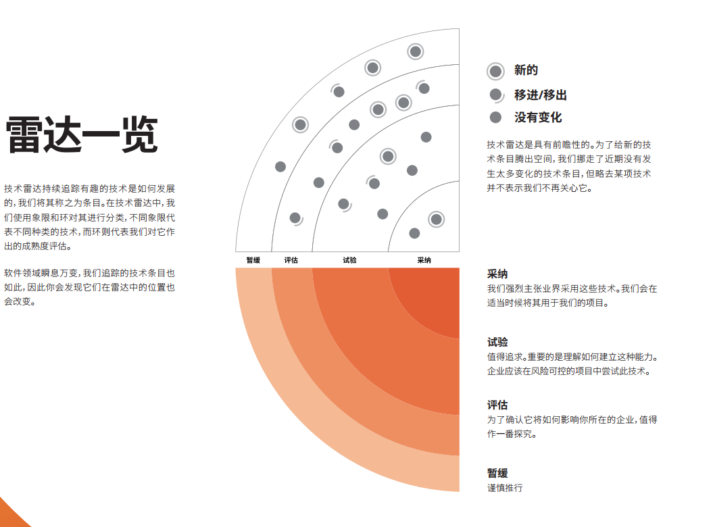

========
Route
========

:Date:   2020-08-21 21:18:08

.. raw:: html

   <!-- more -->

-  `行业趋势 <#行业趋势>`__
-  `C语言 <#c语言>`__

   -  `嵌入式 <#嵌入式>`__

-  `计算机科学 <#计算机科学>`__
-  `网络 <#网络>`__
-  `算法 <#算法>`__
-  `Linux内核 <#linux内核>`__

   -  `思维 <#思维>`__
   -  `软件工程 <#软件工程>`__

-  `编程语言 <#编程语言>`__

   -  `Java <#java>`__
   -  `数据库 <#数据库>`__

-  `资源集合 <#资源集合>`__

行业趋势
========

`技术雷达 <https://www.thoughtworks.com/radar>`__:现在（20210215）还看不懂。
|TechRadar| >technology-radar-vol-23 待阅读

`infoq国际版 <https://www.infoq.com/>`__

`infoq国内版 <https://www.infoq.cn/>`__

`分享 GitHub 上有趣、入门级的开源项目 <https://hellogithub.com/>`__
`GitHub中文排行榜 <https://github.com/kon9chunkit/GitHub-Chinese-Top-Charts>`__

`科技爱好者周刊 <http://www.ruanyifeng.com/blog/archives.html>`__

C语言
=====

`Why Aren’t There C Conferences <https://nullprogram.com/blog/2018/11/21/>`__

1. C Programming Language (2nd
   Edition,1988)。\ `Solution1 <https://clc-wiki.net/wiki/K&R2_solutions>`__\ ，\ `Solution2 <https://github.com/ccpalettes/the-c-programming-language-second-edition-solutions>`__\ ，\ `Solution3 <https://github.com/gleesik/the-c-programming-language-2nd-edition-solutions>`__
2. C Primer Plus 5th(2005，比6th薄)
3. Pointers on C———人民邮电出版社《c和指针》，Kenneth A.Reek著，徐波译。
4. C Traps and Pitfalls
5. Expert C Programming
6. `C Programming
   FAQs <http://c-faq.com/>`__———《你必须知道的495个C语言问题》
7. The Standard C Library

思维
-----

1. Computer Systems: A Programmer’s perspective
2. 《C语言的科学和艺术》（《The Art and Science of C》）
3. 《C程序设计的抽象思维》(《Programming Abstractions in C》)

嵌入式
------

.. figure:: ./images/emmbed.jpg
   :alt: 嵌入式学习

   嵌入式学习

`嵌入式学习的几种线路 <http://www.embeddedlinux.org.cn/emb-linux/entry-level/201701/02-6070.html>`__

`gnu software <https://www.gnu.org/software/>`__\ ：包括linux、emacs、gcc、gdb、make、libc等。

`gnu glibc <http://ftp.gnu.org/gnu/glibc>`__:Linux中，包括C标准库的实现，也包括所有系统函数.

`bsd libc <https://svnweb.freebsd.org/base/head/lib/libc>`__:便于阅读。

https://en.cppreference.com/w/c/header

http://gitbook.net/c_standard_library/

`BusyBox <http://www.busybox.net/>`__\ ：一个集成300+Unix工具/命令的软件包，运行于POSIX环境（包括Linux、Android、freebsd）。嵌入式系统常用。

::

   进阶主要在一些技法和陷阱方面。C Traps and Pitfalls、Pointers on C、Expert C Programming。
   还有一本国内没有上市：C Programming FAQs，不过在网上可以找到内容：http://c-faq.com/。
   关键还是要多读多写代码。可以看看The Standard C Library，学习C标准库是怎么实现的。
   还有本非常好的书是Linux Programming by Example: The Fundamentals，基于真实的GNU或UNIX代码讲解。

   技术：C Traps and Pitfalls、Pointers on C、Expert C Programming、C Interfaces and Implementations:Techniques for Creating Reusable Software，这五本书，够够的了！

   辅助进阶：21st Century C（中文名：C程序设计新思维）、Advanced C and C++ Compiling、C Programming FAQs：Frequently Asked Questions。
   算法：Mastering Algorithms with C。

   机制：The Art of UNIX Programming、Advanced Programming in the UNIX Environment,Third Edition、UNIX Network Programming,Volume 2:Interprocess Communications,2nd Edition、Unix Network Programming,Volume 1:The Sockets Networking API,3rd Edition，这四本书，够够的了！

   对于基础入门，说点，K&R 的书所描述的内容（标准）太陈旧了。不建议学习。很早看过 C Primer Plus 5th，虽然描述的标准是C99，但写的很赞，推荐初学者。第六版太厚了，会吓跑初学者的。
   另外，有些基础了，建议读读lisp的书，比如Common LISP: A Gentle Introduction to Symbolic Computation，很可惜这书没有中文版。

计算机科学
==========

`自学计算机科学 <https://github.com/keithnull/TeachYourselfCS-CN>`__\ ：列出了9门科目并分析了一些学习方法，其中\ ``CSAPP和DDIA``\ 回报率最高。

+---------+-------------------+--------------------------------+-------+
| 科目    | 为何要学？        | 最佳书籍                       | 最佳  |
|         |                   |                                | 视频  |
+=========+===================+================================+=======+
| 编程    | 不要做一个“永远没 | `《计算机程序                  | Brian |
|         | 彻底搞懂”诸如递归 | 的构造和解释》 <https://book.d | Har   |
|         | 等概念的程序员。  | ouban.com/subject/1148282/>`__ | vey’s |
|         |                   |                                | Ber   |
|         |                   |                                | keley |
|         |                   |                                | CS    |
|         |                   |                                | 61A   |
+---------+-------------------+--------------------------------+-------+
| 计      | 如果你对于计算机  | `《深入理解                    | Ber   |
| 算机系  | 如何工作没有具体  | 计算机系统》 <https://book.do  | keley |
| 统结构  | 的概念，那么你所  | uban.com/subject/26912767/>`__ | CS    |
|         | 做出的所有高级抽  |                                | 61C   |
|         | 象都是空中楼阁。  |                                |       |
+---------+-------------------+--------------------------------+-------+
| 算      | 如果你            | `《                            | S     |
| 法与数  | 不懂得如何使用栈  | 算法设计手册》 <https://book.d | teven |
| 据结构  | 、队列、树、图等  | ouban.com/subject/4048566/>`__ | Ski   |
|         | 常见数据结构，遇  |                                | ena’s |
|         | 到有难度的问题时  |                                | lec   |
|         | ，你将束手无策。  |                                | tures |
+---------+-------------------+--------------------------------+-------+
| 数      | 计算机科学基本上  | `《计算机科                    | Tom   |
| 学知识  | 是应用数学的一个  | 学中的数学》 <https://book.do  | Leigh |
|         | “跑偏的”分支，因  | uban.com/subject/33396340/>`__ | ton’s |
|         | 此学习数学将会给  |                                | MIT   |
|         | 你带来竞争优势。  |                                | 6     |
|         |                   |                                | .042J |
+---------+-------------------+--------------------------------+-------+
| 操      | 你所              | `《操                          | Ber   |
| 作系统  | 写的代码，基本上  | 作系统导论》 <https://book.do  | keley |
|         | 都由操作系统来运  | uban.com/subject/33463930/>`__ | CS    |
|         | 行，因此你应当了  |                                | 162   |
|         | 解其运作的原理。  |                                |       |
+---------+-------------------+--------------------------------+-------+
| 计算    | 互                | `《计算机网络：自              | Sta   |
| 机网络  | 联网已然势不可挡  | 顶向下方法》 <https://book.do  | nford |
|         | ：理解工作原理才  | uban.com/subject/30280001/>`__ | CS    |
|         | 能解锁全部潜力。  |                                | 144   |
+---------+-------------------+--------------------------------+-------+
| 数据库  | 对于              | `《Readings in Database        | Joe   |
|         | 多数重要程序，数  | Systems》 <ht                  | Hel   |
|         | 据是其核心，然而  | tps://book.douban.com/subject/ | lerst |
|         | 很少人理解数据库  | 2256069/>`__\ *（暂无中译本）* | ein’s |
|         | 系统的工作原理。  |                                | Ber   |
|         |                   |                                | keley |
|         |                   |                                | CS    |
|         |                   |                                | 186   |
+---------+-------------------+--------------------------------+-------+
| 编程    | 若                | `《Crafting                    | Alex  |
| 语言与  | 你懂得编程语言和  | Interpreters》 <https:/        | Ai    |
| 编译器  | 编译器如何工作，  | /craftinginterpreters.com/>`__ | ken’s |
|         | 你就能写出更好的  |                                | c     |
|         | 代码，更轻松地学  |                                | ourse |
|         | 习新的编程语言。  |                                | on    |
|         |                   |                                | Lag   |
|         |                   |                                | unita |
+---------+-------------------+--------------------------------+-------+
| 分布    | 如今，\ *多数*    | `《数据密集型应                | MIT   |
| 式系统  | 系                | 用系统设计》 <https://book.do  | 6.824 |
|         | 统都是分布式的。  | uban.com/subject/30329536/>`__ |       |
+---------+-------------------+--------------------------------+-------+

网络
====

1. Unix环境高级编程
2. TCP/IP详解
3. Unix网络编程

算法
====

1. Mastering Algorithms with C

Linux内核
=========

`Linux Kernel <https://www.kernel.org/>`__

什么样的人可能需要学习Linux内核开发:

1. 从事相关的Linux Kernel开发工作；
2. 有无尽的好奇心，闲的蛋疼，就想刨根问底；
3. 想为开源社区做贡献。

`推荐学习顺序是 LKD->ULK->LDD->ULNI->ULVMM <https://www.cnblogs.com/pugang/p/9728983.html>`__

1. LKD3: Linux内核设计与开发第三版
2. ULK3: 深入理解LINUX内核，
   相比于LKD的内容不够深入、覆盖面不广，ULK要深入全面得多。前面这两本，一本提纲挈领，一本全面深入。
3. LDD3: Linux驱动开发第三版
4. ULNI：深入理解LINUX网络技术内幕
5. ULVMM：深入理解Linux虚拟内存管理
6. LSP：Linux 系统编程

-  深入理解Linux内核架构：当作一个内核框架图谱说明书来阅读。
-  LINUX KERNEL技术手册：参考手册，很薄，值得一看。
-  Linux内核完全注释:Linux 0.11,2w行代码。
-  linux内核源代码情景分析

可结合专栏-趣谈Linux操作系统 学习。

动手实践： 30天自制操作系统

软件工程
=========

1. 代码整洁之道
2. 代码大全2
3. 重构_改善既有代码的设计2,\ `link1 <https://github.com/gdut-yy/Refactoring2-zh>`__
4. 敏捷软件开发 原则模式与实践
5. 设计模式
6. Effective c++
7. 计算机软件的构造与解释

编程语言
========

1. 持续保持一年学习一门语言；不同风格的语言学习：go,erlang,python。
2. 语言只是用于实现需求的可选工具；
3. 关注语言的峰会

Java
----

1. Java编程思想
2. Effective Java

数据库
------

1. DDIA
2. 高性能Mysql
3. Mysql实战45讲

资源集合
========

   学习路径参考：《程序员练级攻略》——左耳听风。知识面全，从入门到深入。

`极客时间专栏 <https://zter.ml/>`__

1. `学习C语言的教材 <http://www.ruanyifeng.com/blog/2011/09/c_programming_language_textbooks.html>`__
2. https://github.com/fuhmmin/it-ebooks-cn
3. https://github.com/guanpengchn/awesome-books
4. https://kinegratii.github.io/library/

网盘合集：

1. `手机版书籍合计 <https://itpanda.cc/>`__
2. 天翼网盘：https://cloud.189.cn/t/jmA7rmRVFr22 (访问码：ksx8)
3. onedrive: https://1drv.ms/u/s!Ao7o_dk8V3yEoGxyAZQsxZaNG0l3?e=iddq04
4. https://shimo.im/sheets/Hh6Ct8XJgtpyP389/MODOC
5. onedrive极客时间专栏

lessons&labs
=============

* MIT 6.828 :Operating Systems + xv6
* CS164 : Programming Languages and Compilers.
* CS142 : Web Applications
* CS140e : OS+Rust+Raspi 3b
